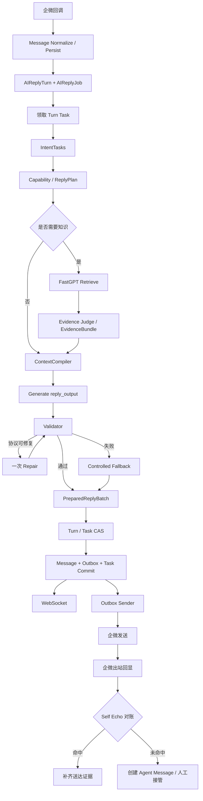
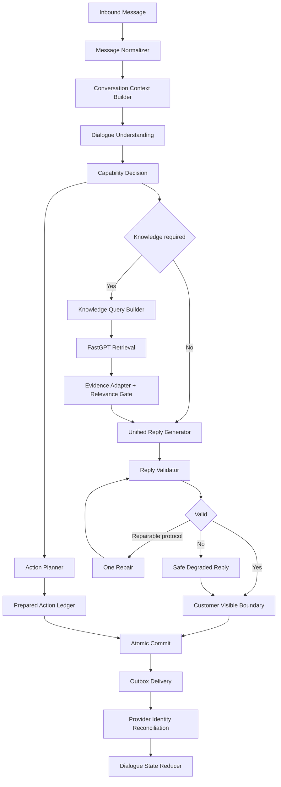

# 企业微信 AI 客服回复链路现状评审与重构建议

> 文档状态：设计评审 + 当前分支实施记录
>
> 评审日期：2026-08-19
>
> 代码基线：`codex/reply-runtime-structural-repair@e41ca5ca254dd07dcd8c58cf3573e7e4c8b01a76`
>
> 运行基线：测试2服务器 `/opt/agentdesk/releases/20260819-replyfix-e41ca5c`
>
> 输入依据：当前真实代码、`docs/design/reply-runtime-engine.md`、生产问题回放，以及《企业微信 AI 客服回复链路整体重构方案》

## 0. 当前实施状态

`codex/reply-runtime-structural-repair` 已按本评审的 P0 方向完成以下结构性修改：

- 生产 Contract Set 固定为 `stable_v2`，启动编译真实 Intent/Reply Schema，并对 Responses Normalize
  前后执行 strict lint；V1/V3/legacy 环境组合不能切换在线流量。
- Generate 结果区分 `generated/repaired/safe_degraded/generation_failed/skipped`，删除知识正文复制、
  大型业务模板和通用技术失败客户话术。
- Customer Visible Boundary 逐条清洗 `ReplyParts` 后重建 `ReplyText`；Evidence Gate 需要正向相关证明。
- 企微出站分为 `ai_self_echo/human_employee_outbound/unknown_outbound`，unknown 只进入二次对账。
- Intent repair 不携带第一次模型原文，连续协议失败进入技术终态；删除 Intent 后的关键词业务重分类。
- 文字/语音/媒体 Task 持久化 `task_source_bindings.v1`、AnalysisRevision、rune span、来源集合指纹和
  canonical question hash；长语音多个问题可绑定同一 ASR revision 而不串题。
- 新增唯一 `ConversationRuntimeModeService`，Trigger、Job、Turn Commit、Outbox、Resume 和 Takeover
  统一消费 `AIReplyAllowed`，不再分别解释 Conversation/Route/Assignee 状态。

本文 P1/P2 中 Dialogue Understanding、Query Builder、Evidence Pack Claim 化和自然表达策略仍是后续
演进方向，不得误写成已经全部完成。

## 1. 结论先行

当前项目并不是“没有完整链路”，而是链路已经具备较完整的 Turn、Task、Evidence、Action、Outbox、Trace 和恢复能力，但多个模块的职责边界发生了重叠，导致正确性依赖许多局部补丁共同成立。

最核心的问题不是模型不够聪明，也不是某几个知识问法没有加入关键词，而是以下结构性矛盾：

1. 模型生成失败后，Fallback 仍在替模型回答业务问题，并会摘取知识正文或拼接流程模板。
2. Fallback 在 Runtime 内记录为 `fallback`，随后又被改写成 `completed`，技术降级和正常生成无法区分。
3. Knowledge Query 同时承担语义理解、口语清洗、业务主题补充、异常场景区分和样例修复，职责过重。
4. Evidence Gate 仍有“高分即可保留”和“无法证明错配就保留”的倾向，没有真正做到正向证明相关。
5. EvidenceBundle V1 仍主要传递长文本，没有稳定的事实类型、用途、范围和禁止用途，Generator 容易照抄正文。
6. 客户可见边界主要清洗合并后的 `ReplyText`，结构化 `ReplyParts` 仍可能保留内部控制词或未经清洗的正文。
7. 企微出站回显在精确身份对账失败后会直接创建 Agent Message，进而触发人工接管。
8. 当前 Job、Runtime、RunLog、Task 对“正常生成、协议修复、安全降级、技术失败、业务转人工”的状态表达不一致。
9. 当前权威设计文档内部也存在矛盾：一部分章节要求技术失败不得自动派人工，另一部分仍写模型、知识、Commit 失败进入人工池。
10. V2、V3、V4 结构在同一运行链中并存，虽然很多只是内部投影，但命名和兼容分支让排障成本显著增加。

因此，下一步不应继续按“入住、咖啡、草稿纸、优惠”等单个问题增加条件，而应按职责边界修复：

```text
理解问题
-> 决定是否需要知识或动作
-> 构建稳定检索表达
-> 证明证据相关
-> 由模型组织自然语言
-> 本地边界只判断能否发送
-> 业务动作独立提交
-> Outbox 投递
-> 企微身份对账
```

## 2. 本次评审边界

本文件评审当前回复链路，并记录本轮已经完成的 P0 结构修复；P1/P2 仍只作为后续演进建议。

评审范围包括：

- 客户消息入站与媒体理解
- Turn、Task、Job 与连续消息
- Intent / Dialogue Understanding
- FastGPT 查询与 Evidence Gate
- ReplyPlan 与 Generate
- Validator、Repair 与 Fallback
- Commit、Outbox 与 WebSocket
- 企微 Self Echo 与人工接管
- Runtime、Job、Task、RunLog 状态
- JSON Schema 与启动门禁
- 性能、可观测性、测试和发布

本轮不建议：

- 新增前端页面
- 重写派单算法
- 更换 NewAPI、FastGPT 或模型供应商
- 删除 Turn、Task、ActionLedger、DialogueState 等现有能力
- 新增一套平行的 `replyruntime/` 目录
- 为具体客户原话新增白名单

## 3. 当前真实运行链路



当前架构的主干是合理的，问题主要出现在 `H -> I`、`K -> N`、`L -> O` 和 `U -> X` 四个边界。

## 4. 应保留的现有能力

以下能力方向正确，不应在下一轮重构中删除或另造平行实现。

### 4.1 持久 Turn 与 Version

`AIReplyTurn` 和 `AIReplyJob.TurnID + TurnVersion` 已经解决：

- 连续消息迟到
- 旧 Worker 失去发送资格
- Commit 前版本 CAS
- Outbox 发送前再次检查
- 进程退出后恢复

应继续以 Turn Version 作为执行所有权，不回到固定等待几秒或仅依赖内存取消。

### 4.2 逐题 Task Ledger

`AIReplyTurnTask` 已经能够表达一轮中的多个问题、资源动作和人工动作。它是解决“长语音只回答一部分”“下一句才补答上一句”的正确基础。

下一步应提高 Task 的理解质量、Evidence 绑定和终态语义，而不是删除 Task Ledger。

### 4.3 ActionLedger 与 Outbox

资源动作在 Commit 前形成持久计划，再通过 Outbox 发送，方向正确。定位、小程序、图片、电话不应退回到模型文字承诺。

### 4.4 严格 JSON 与一次 Repair

Intent 和 Reply 使用严格 JSON Schema、只允许一次协议修复，可以控制模型输出漂移。问题不在“严格”，而在 Schema、Prompt、解析器和兼容分支必须始终一致。

### 4.5 DialogueState 与媒体派生事实

`ConversationDialogueState`、`MessageAnalysis`、ASR/OCR/图片理解独立持久化的方向正确。媒体理解不应绑定某一个短命 Job Context。

### 4.6 知识逐题并行检索

每个知识 Task 独立检索、并发上限为 4、单项失败不清空其他成功项，是正确设计。

## 5. 当前不合理点总表

| 编号 | 结构问题 | 直接症状 | 风险等级 |
|---|---|---|---|
| R1 | Fallback 越权回答业务内容 | 知识正文整段发出、入住模板替代模型 | P0 |
| R2 | Fallback 状态被改写成 completed | RunLog 看似成功，实际模型失败 | P0 |
| R3 | Evidence Gate 未完全 fail-closed | 优惠命中水单、吃玩问题自由发挥 | P0 |
| R4 | Self Echo 未命中即人工 | AI 发图后会话突然转人工 | P0 |
| R5 | Customer Visible Boundary 未覆盖 ReplyParts | 内部控制词可能从分片提交 | P0 |
| R6 | Schema 启动门禁只做语法编译 | 上游 strict Schema 可能启动后才报 400 | P0 |
| R7 | Query Builder 夹杂大量业务补丁 | 新问题难泛化，查询行为不可预测 | P1 |
| R8 | EvidenceBundle 仍以长文本为中心 | 模型照搬知识、无法区分事实和控制指令 | P1 |
| R9 | Intent 后存在多层确定性重写 | 同一句文字、语音可能走不同任务 | P1 |
| R10 | 状态语义分散 | 不回复、重复恢复、误派人工难排查 | P1 |
| R11 | V2/V3/V4 兼容路径交错 | 线上行为难以从名称判断 | P1 |
| R12 | 文档规则互相冲突 | 不同开发者按不同章节实现相反行为 | P1 |
| R13 | Duplicate Guard 仍可能触发二次 Generate | 增加延迟和模型调用 | P2 |
| R14 | 媒体理解与当前题目绑定不足 | 长语音漏题、图片未进入本轮上下文 | P2 |
| R15 | Trace 只记录阶段，缺少最终语义结果 | 无法区分 no-hit、irrelevant、degraded | P2 |

## 6. P0 问题详细分析

### 6.1 R1：Fallback 仍然在替模型回答

当前位置：

- `internal/ai/runtime/executor/reply_output_v2.go`
- `applyControlledRuntimeReplyFallback`
- `buildControlledRuntimeFallbackParts`
- `controlledRuntimeTaskFallbackText`
- `controlledRuntimeProcessFallbackText`

当前行为包括：

- 从 FastGPT Evidence 中选取正文片段
- 对入住流程拼接固定模板
- 对 interaction 固定输出“收到。”
- 对知识无结果输出固定“资料没有写明”

这会产生三个问题：

1. Fallback 变成第二套回答引擎，与 Generator 职责重复。
2. 只要 Generate 失败，客户看到的表达质量突然退化为知识正文或固定模板。
3. Fallback 无法理解当前上下文，却被允许决定要回答哪些事实。

建议：

- Fallback 只负责“安全降级”，不负责恢复完整业务回答。
- 只允许使用服务器已知的结构化权威事实，例如当前门店名称、地址、明确配置的入住资源可用性。
- FastGPT 长文本不得直接成为 Fallback 客户正文。
- 事实不确定时只发送一句自然、轻量、无技术术语的澄清。
- 多个 Task 得到相同安全澄清时合并为一条，不重复发送三次。

推荐结果：

```json
{
  "generationOutcome": "safe_degraded",
  "customerMessageSent": true,
  "reasonCode": "reply_protocol_repair_exhausted",
  "replySource": "authoritative_store_fact_or_safe_clarification"
}
```

### 6.2 R2：技术降级被伪装为正常完成

当前位置：

- `internal/ai/runtime/executor/reply_output_v2.go`
- `completeRuntimeGeneration`
- `internal/ai/runtime/reply_trigger_service.go`
- `internal/services/ai_reply_hook.go`
- `internal/services/ai_reply_job_service.go`

当前链路：

```text
Generate/Repair 失败
-> summary.Status = fallback
-> completeRuntimeGeneration 又改为 completed
-> Commit 成功
-> AIReplyExecutionResult = completed
-> Job = completed
```

结果是：

- 运营看到成功，但模型实际失败。
- 无法统计真实 Generate 成功率。
- 无法判断客户看到的是正常答案还是降级话术。
- 后续开发容易把 fallback 当作正常训练样本。

建议状态拆分：

```text
generationOutcome:
  generated
  repaired
  safe_degraded
  generation_failed

commitOutcome:
  not_started
  committed
  commit_failed

deliveryOutcome:
  pending
  sending
  sent
  failed
  cancelled
```

Job 可以新增内部终态 `safe_degraded`，或至少使用独立 `result_code=safe_degraded`，但不得继续记录为普通 `runtime_completed`。

### 6.3 R3：Evidence Gate 不是完全正向证明

当前位置：

- `internal/ai/runtime/executor/knowledge_evidence_judge.go`
- `knowledgeEvidenceIsWeaklyRelated`
- `knowledgeEvidenceMismatchesTask`
- `detectKnowledgeTopicClasses`

当前 Gate 已能过滤部分内部“转接”正文和明显跨主题内容，但仍有两个偏差：

1. 检索分数高于某阈值时，即使没有主题或文本重叠，也可能继续保留。
2. `knowledgeEvidenceMismatchesTask` 的注释和行为仍偏向“只拒绝能确定错的”，不是“只保留能证明对的”。

建议每条 Evidence 必须经过以下判断：

```text
scope_match
AND evidence_use_allowed
AND no_explicit_topic_conflict
AND positive_relevance_proof
```

其中 `positive_relevance_proof` 至少满足一项：

- 结构化 Topic 明确匹配
- 查询与标题/正文存在有意义文本重叠
- 高可信检索分数且不存在任何冲突主题
- Objective 明确匹配，例如位置问题命中位置事实、流程问题命中步骤事实

以下内容必须直接拒绝：

- 不属于当前 Tenant + Store + KnowledgeBase 范围
- `internal_control`
- `action_instruction`
- 只有调度指令，没有客户可用事实
- 明确属于另一个设施、政策或业务对象
- 客户问正常流程却命中异常处理 FAQ

### 6.4 R4：企微 Self Echo 失败后直接切人工

当前位置：

- `internal/services/wxwork_protocol_service.go`
- `handleChatMessage`
- `handleEmployeeOutgoingEcho`
- `reconcileAIOutboxEcho`
- `wxWorkProtocolEchoMatches`
- `sentMessageID`
- `createMessageRef`

当前主要风险：

```text
确定是员工账号发出的出站消息
-> 尝试匹配 AI Message
-> 匹配失败
-> 直接 CreateExternalAgentMessageWithoutOutboxInSession
-> 触发 human_agent_replied
```

但 AI 也是通过同一个企微员工号发送，所以“员工账号发送”并不等于“真人员工发送”。

建议身份优先级：

1. Provider Message ID / callback ID
2. Provider Seq
3. 已存在的 WxWork MessageRef
4. OutboxID + MessageID
5. media `file_id`
6. media `md5 + size`
7. 同 Conversation、MessageType、发送时间的 Outbox 候选
8. 最后才允许正文作为辅助条件

建议分类：

```text
ai_self_echo
human_employee_outbound
unknown_outbound
```

处理原则：

- `ai_self_echo`：只补齐送达证据，不创建 Agent Message。
- `human_employee_outbound`：创建 Agent Message，并触发人工接管。
- `unknown_outbound`：持久记录、告警、等待再次对账，不立即触发人工。

只有“Provider 明确为员工发送，且当前时间窗内不存在任何平台 AI Outbox 候选”时，才能确定为真人员工消息。

### 6.5 R5：客户可见边界没有同时约束 ReplyParts

当前位置：

- `internal/ai/runtime/executor/generated_reply_validator.go`
- `enforceGeneratedReplyActionLedger`
- `internal/ai/runtime/reply_commit_service.go`
- `normalizedCommitReplyParts`

当前清洗主要修改 `summary.ReplyText`。但 V2 提交优先使用 `ReplyParts`，如果只改合并文本而不改每个 Part，可能出现：

- Trace 中看起来已清洗
- Commit 仍使用原始 Part
- 内部控制词、未授权动作承诺或旧正文进入客户消息

建议建立唯一 `CustomerVisibleBoundary`：

```text
ReplyParts
-> 每个 Part 清洗
-> 删除空 Part
-> 重新计算 ReplyText
-> 验证 ReplyText 与 Parts 完全一致
-> Commit
```

必须拦截：

- `human_agent_replied`
- `cancelled_stale_turn`
- `covered_by_*`
- `taskKey/evidenceRef/actionRef`
- `action:xxx/tool:xxx/debug:xxx`
- 仅包含“转接”“HANDOFF”等内部动作词的正文
- 未实际提交动作却声称“已发送、已安排、已转人工”

Validator 只能拒绝或标记可修复，不能自行编写新的业务答案。

### 6.6 R6：Schema 启动门禁不完整

当前位置：

- `internal/ai/runtime/contracts/embed.go`
- `internal/bootstrap/init.go`
- `internal/pkg/modelconfig/responses_schema.go`

当前启动时会执行 `ValidateEmbeddedSchemas`，但主要验证 JSON Schema 能否被本地库编译。它还没有完整验证 Responses strict output 的要求，例如：

- 每个 Object 的 `additionalProperties=false`
- Object 的 `required` 与 `properties` 完全一致
- Array 必须声明 `items`
- `const/enum` 的隐式类型经 Normalize 后仍保持约束一致
- 真实 `intent_tasks.v2`、`reply_output.v2` 能通过生产 Adapter 的最终规范化

建议：

```text
Bootstrap
-> Load embedded schema
-> Local JSON Schema compile
-> Strict Responses compatibility lint
-> NormalizeResponsesJSONSchema
-> 再次 lint
-> 失败则拒绝启动
```

生产门禁至少覆盖：

- `intent_tasks.v2`
- `reply_output.v2`
- 若实验 V3 可开启，则同时覆盖 `intent_tasks.v3`、`reply_output.v3`

## 7. P1 问题详细分析

### 7.1 R7：Knowledge Query Builder 职责过重

当前位置：

- `internal/ai/runtime/executor/task_knowledge.go`
- `runtimeTaskKnowledgeQuery`
- `normalizeRuntimeTaskKnowledgeQuery`
- `runtimeKnowledgeTopicLabelForPlan`
- `normalizeRuntimeSpecificSupplyQuery`
- `redistributeMultiTopicClauses`

当前 Query Builder 同时处理：

- 运输包装清理
- 语音文件名清理
- 口语请求词清理
- 多题拆分
- 具体用品抽取
- 入住正常/异常区分
- 业务主题标签补充
- 周边吃玩分类

这些规则有些合理，但集中在一个文件和一个阶段后，任何新问题都容易继续添加文字条件。

建议拆成三个确定性职责：

```text
TaskTextNormalizer
  只清理运输包装和无业务意义格式

QuestionUnitBuilder
  使用 Intent/SubIntent/RequestMode/Text 形成独立问题单元

KnowledgeQueryBuilder
  为一个问题单元生成 1~3 个稳定检索表达
```

推荐内部结构：

```json
{
  "taskKey": "...",
  "topic": "guest_supplies",
  "objective": "availability",
  "entities": ["纸", "笔"],
  "queries": [
    "酒店是否提供纸和笔",
    "客用品 纸 笔",
    "前台可提供的文具"
  ]
}
```

注意：

- 不应把“草稿纸”写成永久业务特例。
- “纸和笔”应来自实体归一或知识标签，而不是某个客户样例白名单。
- 1~3 个表达可以在单次检索请求中组合，或按预算并行；不得无上限增加 FastGPT 调用。

### 7.2 R8：EvidenceBundle 仍以长正文为中心

当前 `EvidenceItemV1` 主要字段是：

```json
{
  "sourceType": "fastgpt",
  "title": "...",
  "content": "最长 4000 字",
  "score": 0.9,
  "answerability": "supporting"
}
```

这不足以告诉 Generator：

- 这是事实、政策、流程还是动作说明
- 哪一句能回答当前 Task
- 哪些文字只供内部控制
- 是否属于当前门店
- 是否允许直接引用

建议升级为事实片段而不是整篇正文：

```json
{
  "ref": "K1",
  "sourceType": "fastgpt",
  "sourceClass": "procedure",
  "scope": {
    "tenantId": 1,
    "storeId": 7,
    "knowledgeBaseId": 12
  },
  "taskKeys": ["task_x"],
  "claim": "完成入住登记后到店刷脸开门",
  "topic": "checkin",
  "objective": "procedure",
  "score": 0.91,
  "allowedUses": ["answer_customer"],
  "forbiddenUses": ["trigger_handoff", "change_route"]
}
```

Knowledge Adapter 负责：

- 清理 FAQ 标签
- 切分事实
- 去重
- 分类
- 范围绑定
- 相关性判断
- 用途声明

Generator 不应看到未经处理的整个知识文档。

### 7.3 R9：Intent 后的多层重写使语义不稳定

当前系统既有模型 Intent，又有：

- 兼容解析
- Legacy normalization
- Store identity normalization
- 多题重新分配
- Atomic task split
- Capability derivation
- Ledger recovery normalization

这些层中有些是必要的确定性保护，但缺少一个明确原则：

> 哪些字段是模型建议，哪些字段是服务器权威，哪些字段只能规范化不能改变语义。

建议明确：

| 字段 | 来源 | 是否允许服务器改写 |
|---|---|---|
| dialogueAct | 模型 | 仅非法值降级为 unknown |
| task text span | 客户消息 | 不得改写正文，只能引用范围 |
| intent/subIntent | 模型 + 已发布 Catalog | 只允许映射到合法代码，不按关键词换业务类别 |
| requestMode | 模型 | 只允许默认值修复 |
| needsKnowledge | CapabilityDeriver | 服务器权威 |
| needsResource | CapabilityDeriver | 服务器权威 |
| needsHuman | Action/Policy | 服务器权威 |
| taskKey | 服务器 | 模型不得生成 |

文字和语音转写必须进入同一 Understanding 输入；语音不得因为运输包装或 ASR 元数据走不同的二次分类规则。

### 7.4 R10：状态语义分散

当前同时存在：

- Conversation.Status
- Conversation.RouteStatus
- ConversationDialogueState.ConversationMode
- AIReplyTurn.Status
- AIReplyTurnTask.Status
- AIReplyJob.Status
- Runtime Summary.Status
- Trace Pipeline stage status
- Outbox.SendStatus

这些状态本身都有价值，但缺少“谁决定是否允许 AI 回复”的唯一投影。

当前分支已保留原表并增加唯一运行判断函数：

```go
type ConversationRuntimeMode string

const (
    ConversationRuntimeModeAIActive      = "ai_active"
    ConversationRuntimeModeAIDegraded    = "ai_degraded"
    ConversationRuntimeModeHumanPending  = "human_pending"
    ConversationRuntimeModeHumanActive   = "human_active"
    ConversationRuntimeModeResumePending = "resume_pending"
    ConversationRuntimeModeClosed        = "closed"
)
```

Reply Trigger、Job Start、Commit Gate、Outbox Gate、Resume 和 Human Takeover 已统一消费该投影；
各模块只保留 Tenant/Store/Binding/Session/Turn 等自身不可变范围校验。

### 7.5 R11：V2/V3/V4 命名和兼容路径增加理解成本

当前存在：

- IntentTasks V2 / V3
- ReplyPlan V2 / V3 / V4
- ReplyOutput V2 / V3
- EvidenceBundle V1 / V2
- RuntimeContextSnapshot V1 / V2

当前生产主要仍是 V2 输出，但部分内部阶段已投影到 V4 或兼容解析 V3。这不一定错误，但命名无法直接表示“生产权威”与“实验结构”。

建议：

- 明确一个 `RuntimeContractSet`，启动时只选择一组完整契约。
- 不允许 Intent 使用一版、Compile 使用另一版、Reply 再兼容第三版。
- 兼容只发生在数据读取边界，不进入同一次在线模型调用。
- 旧 Schema 保留解析测试，但不继续扩展业务语义。

## 8. P2 问题详细分析

### 8.1 R13：Duplicate Guard 触发二次 Generate

`retryDifferentQuestionDuplicateAnswer` 会在 Commit 判定重复答案后重新运行 Generate。

风险：

- 不同问题完全可能得到相同答案。
- 第二次 Generate 增加延迟和费用。
- 如果 Task/Evidence 不变，第二次模型可能仍输出相同答案。

建议 Duplicate Guard 只判断：

- 同一个 SemanticTaskKey 是否已经由同一或更早 Message 覆盖
- 同一个 Task 是否已经有 committed/delivered 证据
- 同一个资源是否已经由原 Outbox 投递

禁止使用“答案文本相同”推断客户问题重复。

### 8.2 R14：媒体理解事实与当前题目绑定不足

现有媒体理解独立持久化是正确的，但仍需保证：

- ASR 结果包含 source message ID 和 revision
- 长语音拆题的每个 Task 都能回指原语音片段
- 后续文字追问只引用必要媒体事实
- 图片描述不能成为门店事实、地址、政策或人工决定
- 媒体理解未完成时返回 `deferred`，不能静默完成
- 媒体理解失败只影响对应媒体 Task，不清空同轮文字 Task

当前分支已用 `message_analysis.v2 + task_source_bindings.v1` 持久来源 revision 与 span，不复制客户正文。
等价结构为：

```json
{
  "sourceMessageId": 123,
  "sourceRevision": 2,
  "observations": [
    {
      "type": "customer_spoken_input",
      "text": "办理入住，停车场在哪里",
      "confidence": 0.93,
      "allowedUses": ["intent", "knowledge_query"],
      "forbiddenUses": ["store_fact", "human_takeover"]
    }
  ]
}
```

### 8.3 R15：Trace 缺少最终语义结果

当前 Trace 已有阶段耗时和错误，但应继续补充：

```json
{
  "understandingOutcome": "tasks_created",
  "knowledgeOutcome": "partial_hit",
  "generationOutcome": "safe_degraded",
  "validationOutcome": "passed_boundary",
  "commitOutcome": "committed",
  "deliveryOutcome": "sent",
  "echoOutcome": "ai_self_echo"
}
```

这样才能回答：

- 为什么没查知识
- 为什么查了但没采用
- 为什么模型失败却仍给客户发了话
- 为什么进入人工
- 为什么消息已提交但企微没送达

## 9. 当前文档自身的矛盾

`docs/design/reply-runtime-engine.md` 目前同时存在两类相反规则。

规则 A：

```text
技术失败不自动派人工
知识基础设施失败进入技术终态
不发送固定失败话术
```

规则 B：

```text
模型槽与 Job 重试耗尽、FastGPT 失败、空输出、Commit 失败进入人工池
回归测试要求耗尽后创建人工任务
```

这会直接造成不同开发者实现相反逻辑。

建议权威规则统一为：

```text
业务原因或安全原因
-> 可以人工接管

纯技术失败
-> 技术终态 + 告警 + 可选安全降级回复
-> 不自动派人工

客户明确要求人工
-> 业务人工接管
```

如果产品确实希望某类技术失败进入人工，也必须在配置中明确为业务 SLA 策略，而不能藏在 Runtime 通用错误恢复里。

## 10. 推荐目标架构



### 10.1 模块唯一职责

| 模块 | 唯一职责 | 禁止事项 |
|---|---|---|
| Message Normalizer | 统一文字、语音、图片的可用输入 | 不决定业务 Intent |
| Context Builder | 选择当前题目必要上下文 | 不混入旧 AI 事实 |
| Dialogue Understanding | 识别对话行为和问题单元 | 不执行动作 |
| Capability Decision | 决定知识、资源、工具、人工能力 | 不组织客户语言 |
| Query Builder | 生成稳定检索表达 | 不改变会话状态 |
| Evidence Adapter | 清理、分类、范围和相关性 | 不直接发送正文 |
| Generator | 根据计划和证据自然表达 | 不决定真实动作是否执行 |
| Validator | 判断能否发送 | 不重写业务答案 |
| Repair | 修协议和任务覆盖 | 不改变事实范围 |
| Safe Degraded | 保证不发垃圾 | 不替模型完整回答 |
| Action Ledger | 记录准备和提交动作 | 不从回复文字反推动作 |
| Commit | 原子提交事实 | 不调用模型 |
| Echo Reconciler | 判断 AI/真人/未知出站来源 | 不按内容相同直接切人工 |

## 11. 推荐 JSON 契约

### 11.1 Dialogue Understanding

保留严格结构，但模型只输出语义建议：

```json
{
  "schemaVersion": "dialogue_understanding.v1",
  "dialogueAct": "new_topic",
  "tasks": [
    {
      "sequence": 1,
      "intent": "hotel_info",
      "subIntent": "checkin_process",
      "text": "怎么办理入住",
      "requestMode": "answer",
      "topic": "checkin",
      "objective": "procedure",
      "entities": [],
      "confidence": 0.96
    }
  ]
}
```

模型不得输出：

- taskKey
- needsKnowledge
- needsHuman
- resourceAction
- 已执行结果

### 11.2 Capability Decision

由服务器生成：

```json
{
  "taskKey": "...",
  "route": "knowledge_answer",
  "knowledgePolicy": "required",
  "resourcePolicy": "optional",
  "toolPolicy": "forbidden",
  "humanPolicy": "forbidden",
  "reasonCode": "published_intent_capability"
}
```

### 11.3 Evidence Pack

```json
{
  "schemaVersion": "evidence_pack.v1",
  "taskKey": "...",
  "coverage": "sufficient",
  "items": [
    {
      "ref": "K1",
      "sourceType": "fastgpt",
      "sourceClass": "procedure",
      "claim": "完成登记后可刷脸开门",
      "topic": "checkin",
      "objective": "procedure",
      "score": 0.91,
      "scopeMatch": true,
      "topicMatch": true,
      "objectiveMatch": true,
      "allowedUses": ["answer_customer"],
      "blockedReasons": []
    }
  ]
}
```

### 11.4 Reply Output

保持简单：

```json
{
  "schemaVersion": "reply_output.v2",
  "parts": [
    {
      "taskKeys": ["task_x"],
      "content": "可以的，先在入住小程序里完成登记，登记成功后到店直接刷脸开门。"
    }
  ]
}
```

EvidenceRef、ActionRef、GroupKey 均由服务器按 TaskPlan 绑定，模型不需要回显内部证据主键。

### 11.5 Runtime Outcome

```json
{
  "generationOutcome": "generated",
  "validationOutcome": "passed",
  "commitOutcome": "committed",
  "deliveryOutcome": "pending",
  "customerMessageSent": true,
  "committedMessageIds": [1001],
  "reasonCode": "runtime_generated"
}
```

## 12. 分阶段实施建议

### 12.1 P0：先恢复正确性

#### P0-1 Safe Degraded

修改：

- 删除 FastGPT 第一条正文作为 fallback 的能力
- 仅允许受信 Store Fact 和安全澄清
- 状态改为 `safe_degraded`
- Commit 后 Job 保留该结果码

#### P0-2 Customer Visible Boundary

修改：

- 同时清洗 `ReplyParts` 和 `ReplyText`
- 内部控制词、调试字段、未提交动作承诺禁止发送
- 清洗后为空则进入 Safe Degraded，而不是静默完成

#### P0-3 Evidence Fail-Closed

修改：

- 加 Store scope 校验
- 加正向相关性证明
- 内部控制和动作指令永不成为正文 Evidence
- Gate 后同步过滤文字、资源和 AnswerGroup

#### P0-4 Self Echo

修改：

- 发送响应同时保存 Provider ID 和 Seq
- 先按 MessageRef/Outbox 对账
- `unknown_outbound` 不切人工
- 只有确定真人来源才触发 `human_agent_replied`

#### P0-5 Schema Startup Gate

修改：

- 启动时检查生产真实 Schema
- 检查 Responses strict 兼容
- 非法 Schema 阻止服务启动

### 12.2 P1：提升理解与知识准确度

- 拆分 TaskTextNormalizer、QuestionUnitBuilder、KnowledgeQueryBuilder
- Query 使用 Intent、SubIntent、RequestMode、Topic、Objective、Entity 和当前题目
- EvidenceBundle 改为事实片段和用途控制
- 统一文字与语音 Understanding 输入
- 明确模型字段与服务器权威字段
- 删除按答案文本判重的二次 Generate

### 12.3 P2：提升自然度和上下文能力

- Generator 只接收当前未完成 Task 和清洁 Evidence Pack
- 社交消息不携带历史酒店知识
- Follow-up 只从 DialogueState 解析唯一对象
- 回复长度按 Task 数量和客户语气自适应
- no-hit 只追问一个关键点
- 禁止每轮固定“您好、收到、很抱歉”

### 12.4 P3：性能和运营

- Fast Path 不查知识
- Context、Store Fact、Tag 可并行加载
- Knowledge Task 并发上限 4
- 正常单批只有一次 Intent 和一次 Generate
- 仅协议错误允许一次 Repair
- 建立各阶段 p50/p95/p99
- 建立 no-hit、irrelevant、safe_degraded、unknown_outbound 指标

## 13. 建议文件级改动范围

| 目标 | 主要文件 |
|---|---|
| Safe Degraded | `internal/ai/runtime/executor/reply_output_v2.go` |
| Runtime/Job 状态 | `internal/ai/runtime/executor/types.go`、`internal/services/ai_reply_hook.go`、`internal/services/ai_reply_job_service.go`、`internal/pkg/enums/ai_reply_job.go` |
| Query Builder | `internal/ai/runtime/executor/task_knowledge.go`，建议拆出 `knowledge_query_builder.go` |
| Evidence Gate | `internal/ai/runtime/executor/knowledge_evidence_judge.go`，建议拆出 classification/scope 文件 |
| Evidence Pack | `internal/ai/runtime/contracts/`、`internal/ai/runtime/contextcompiler/evidence.go` |
| Customer Visible Boundary | `internal/ai/runtime/executor/generated_reply_validator.go`、`internal/ai/runtime/reply_commit_service.go` |
| Self Echo | `internal/services/wxwork_protocol_service.go`、`internal/pkg/dto/request/wxwork_protocol_request.go`、MessageRef/Outbox repository |
| Schema Gate | `internal/ai/runtime/contracts/embed.go`、`internal/pkg/modelconfig/responses_schema.go`、`internal/bootstrap/init.go` |
| 状态投影 | `internal/services/conversation_dialogue_state_service.go`、Reply Eligibility、Commit Gate、Outbox Gate |
| Trace | Runtime collector、RunLog builder、Job result mapping |

不建议新增数据库表。若 Job 采用 `safe_degraded` 新终态，现有 `varchar` 字段可直接兼容；需要同步更新枚举、终态扫描、筛选和测试。

## 14. 必要测试矩阵

只做与改动直接相关的有效测试。

### 14.1 Fallback

- Generate 网络失败：不复制 FastGPT 正文
- Reply JSON 两次失败：状态为 `safe_degraded`
- 有权威地址：允许发送短地址回复
- 只有普通知识正文：只发送安全澄清
- 同批三题都失败：不重复发送三条相同澄清

### 14.2 Evidence

- 优惠问题命中水单：拒绝
- 地址问题命中洗衣房图片：文字和图片一起拒绝
- 正常入住命中手机故障 FAQ：拒绝
- 正常入住命中登记和刷脸步骤：保留
- 当前 Store 以外知识：拒绝
- 仅“转接”正文且无 ActionBinding：拒绝
- 低分但主题、文本明确匹配：允许
- 高分但明确跨主题：拒绝

### 14.3 Self Echo

- Provider ID 命中：AI Echo
- Seq 命中：AI Echo
- file_id 命中：AI Echo
- md5 + size 命中：AI Echo
- 相同正文且有匹配 Outbox：AI Echo
- 附近有 AI Outbox 但身份不确定：Unknown Outbound，不切人工
- 明确员工消息且无任何 AI Outbox 候选：Human Agent

### 14.4 Customer Visible Boundary

- `ReplyParts` 中出现 `human_agent_replied`：拒绝
- `ReplyParts` 中出现 `action:handoff`：拒绝
- 未提交小程序却声称“已经发你”：拒绝或删除该句
- 清洗后 Parts 与 ReplyText 保持一致

### 14.5 Schema

- 真实 Intent Schema 启动校验通过
- 真实 Reply Schema 启动校验通过
- Object 缺 `additionalProperties=false`：启动失败
- properties 与 required 不一致：启动失败
- Array 缺 items：启动失败

## 15. 性能预算

重构不应通过增加更多模型来换正确性。

```text
Normalize                    < 20ms
Context Build                < 100ms
Intent / Understanding       200~800ms
Knowledge Retrieval          100~800ms，逐题并行
Evidence Gate                < 50ms 本地目标
Generate                     500~2000ms
Validator + Boundary         < 50ms
Commit                       < 100ms 本地目标
Outbox Delivery              取决于企微
```

正常链路调用预算：

```text
单轮：1 次 Intent
每个知识 Task：1 个逻辑检索计划
单轮：1 次 Generate
只有协议错误：最多 1 次 Repair
```

禁止增加：

- 第二个模型评分
- 第二个模型事实核验
- Validator 模型
- Fallback 模型
- Job 层重复模型调用

## 16. 发布建议

### 16.1 灰度顺序

1. 合肥南七 / 指定 Binding
2. 只观察，不立即全量
3. 验证 30 分钟真实消息
4. 再扩大到同一 Tenant 其他 Binding
5. 最后全量

### 16.2 必看指标

- `generation_outcome=generated/repaired/safe_degraded/failed`
- Knowledge no-hit 数
- Evidence irrelevant 丢弃数
- 跨 Store 拒绝数
- Customer Visible Boundary 拒绝数
- AI Self Echo 命中数
- Unknown Outbound 数
- Human Agent 确认数
- Task 遗漏数
- Turn stale/cancelled 数
- Outbox pending/sending/failed/sent/cancelled 数
- 首响和完整回复 p95

### 16.3 回滚边界

- 不删除新字段或表
- 关闭新 Gate 时仍保留旧持久数据
- 回滚镜像不得重新启用“技术失败自动转人工”
- Outbox 已提交消息只继续投递，不重跑模型
- Unknown Outbound 记录不能在回滚时批量改成人工消息

## 17. 明确禁止的修复方式

以后出现以下方案应默认拒绝：

- `if text == "草稿纸"`
- 为“666”新增闲聊白名单
- 为“优惠”排除“水单”关键词
- 为“入住”继续扩大固定模板
- 提高一个全局向量阈值解决所有错答
- 模型失败就取知识库第一条
- 答案相同就重新调用模型
- AI Echo 内容不相同就认定真人
- 所有技术失败都自动派人工
- Validator 直接重写答案
- Prompt、Schema、Parser 各自维护不同字段
- 为 V2、V3、V4 各维护一套在线业务逻辑

## 18. 最终验收标准

### 18.1 正确

- 地址问题不会发送洗衣房图片
- 外卖地址只使用当前 Store 权威地址
- 吃玩推荐没有知识时不会编造
- 入住流程能覆盖登记和开门，不混入未问的异常或路线
- 知识正文中的“转接”不会改变会话路由

### 18.2 完整

- 长语音多个独立问题都有 Task
- 每个 Task 有明确终态
- 单项失败不吞掉其他成功项
- 剩余 Task 自动续批，不等待客户再发一句

### 18.3 自然

- 最终措辞由 Generator 组织
- 不直接倾倒知识全文
- 不固定回复“收到”
- 不向客户暴露技术错误或内部状态

### 18.4 稳定

- Schema 不兼容时服务拒绝启动
- Generate 失败不伪装成正常生成
- AI Self Echo 不误切人工
- Unknown Outbound 不立即改变会话模式
- Commit 成功后只重试 Outbox

### 18.5 可解释

任何一条失败消息都能回答：

1. 创建了哪些 Task
2. 哪些 Task 需要知识
3. 每个 Query 是什么类别
4. 哪些 Evidence 被保留或拒绝，原因是什么
5. Generate 是正常、修复还是降级
6. Validator/Boundary 为什么放行或拒绝
7. Message 和 Outbox 是否提交
8. 企微回显被认定为 AI、真人还是未知
9. 会话为什么保持 AI、进入人工或等待恢复

## 19. 推荐实施结论

当前系统不需要再次推倒重建。最佳方案是保留 Turn、Task、DialogueState、ActionLedger、Outbox 和严格 JSON 主干，优先修复以下五个边界：

```text
Safe Degraded
Evidence Fail-Closed
Customer Visible Boundary
Provider Identity Reconciliation
Schema Startup Gate
```

完成 P0 后，先恢复“不会乱答、不会误转人工、不会假成功”；再进入 P1，把 Query Builder 和 Evidence Pack 从样例修复改成通用语义结构。这样既能回到原来 V2 较自然的表达效果，又保留现在持久轮次、逐题处理和并发安全带来的稳定性。

## 20. 本轮交付与并行分支说明

### 20.1 实际交付边界

- 固定生产 `stable_v2`，启动时校验真实 Intent/Reply Schema 与运行指纹。
- Intent、Generate、Knowledge、Commit 等技术失败不自动转人工，不生成固定技术失败客户话术。
- Task 绑定权威文字、ASR 或媒体分析 revision，并保存来源 span、集合指纹和问题 hash。
- Evidence 必须证明与当前 Task 正向相关；客户可见文本在 Commit 前统一经过 Boundary。
- Trigger、Job、Turn Commit、Outbox、Resume、Takeover 统一消费 Conversation Runtime Mode。
- 企微出站回显区分 AI、真人和未知来源；未知来源先对账，不直接切换人工模式。

本轮未修改公开 HTTP DTO、WebSocket payload、前端页面或 DML migration；新增内容仅为内部契约、
运行态投影和测试。SQLite/MySQL 继续依赖既有 AutoMigrate 结构。

### 20.2 并行分支核对

- 已在 2026-08-19 执行 `git fetch origin --prune`。
- `origin/main` 的接管开关、AI 恢复和移动端显示提交在当前分支存在 patch-equivalent 实现，未重复合并。
- `origin/codex/customer-audit` 自共同基线后没有修改本轮文件。
- `origin/codex/ai-billing` 触及的模型归因、Credential revision、TagContext 和 FastGPT 接入语义，当前分支
  已通过统一 `ModelCallResolverService`、Usage Scope、Trace TagContext 和现行企微入站实现承接。
- 后续合并应以本分支 Runtime 文件为准，外围客服/计费分支只补充向后兼容字段，不得恢复关键词业务
  重分类、技术失败自动转人工或多套在线 Contract。

### 20.3 有效验证

```bash
go test -tags dev ./internal/ai/runtime/... -count=1
go test -tags dev ./internal/services \
  -run 'AIReplyJob|AIReplyTurn|ChannelMessageOutbox|ConversationRuntimeMode|WxWorkProtocol.*(Echo|Outbound)|SelfEcho|UnknownOutbound' \
  -count=1
go test -tags dev ./internal/pkg/modelconfig ./internal/bootstrap \
  -run 'ResponsesJSONSchema|RuntimeContract|FeatureModes|V3GroupFlag|SendsDeepSeekStrictJSONSchema' \
  -count=1
git diff --check
```

回滚只需恢复上一应用镜像；新增内部文件和 nullable/AutoMigrate 结构不要求删除。回滚版本不得重新打开
V1/V3 在线开关、技术失败客户话术或技术失败自动派单。
