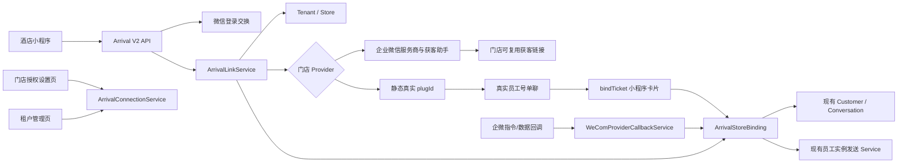

# 到店联动链接引擎 V2（三 Provider）

> 状态：AgentDesk 当前权威设计与实现说明
> 日期：2026-07-30
> 分支：`codex/customer-acquisition-link-engine`
> 外部契约：`arrival_scan_input.v1` / `arrival_scan_result.v2`

## 1. 输入基线

本实现只以用户 2026-07-27 提供的最新 `(1)` 方案为输入：

| 输入 | SHA-256 |
| --- | --- |
| `arrival-qr-v2-design-package (1).zip` | `4c193ecbcd953de1cdd5f491c5e18b21bfe10a7fc475c4f9e8429aba6076f69c` |
| `agentdesk-arrival-link-engine-development-prompt (1).md` | `205d2a53bb2fbcd04f1beba5c95772a91cf1851cd9ee40d15a8a42f9f3f37162` |
| `wxwork-conversation-binding-verification (1).md` | `11486e27374be3b7daf9476594552da74562f07fdac58978a23006ffe8430b82` |
| `agentdesk-customer-acquisition-link-engine-upgrade-prompt.md` | `5ab6e7b8092676b9f099f55a79711d7c41c7f071e471b2fbed2d11dcc6ad7e96` |
| `agentdesk-static-plugid-bind-ticket-upgrade-prompt.md` | `e9ce63f3ca819ee707379a1abe60467959d1a3ac5027c0b3454f24827e223ac5` |

最新升级方案在原 `customer_acquisition`、`contact_way` 基础上增加
`static_plugin_ticket`。新模式使用门店真实 `plugId` 完成主动加好友，再通过真实员工号
单聊发送一次性绑定卡片；旧两种模式继续保留兼容和显式回滚，三者之间不自动降级。
企业微信员工号协议仍只以
`https://wework.apifox.cn/llms.txt` 及其链接的具体接口页为依据。

## 2. 产品目标与边界

到店联动解决两件事：

1. 客户首次扫描门店小程序码时，按门店 Provider 返回真实获客二维码、旧联系我二维码，
   或企业微信官方联系我组件所需的真实 `plugId`。
2. 静态模式下，客户添加真实员工后由员工号真实单聊发送 `bindTicket` 小程序卡片，客户
   点击后把小程序身份、门店、员工实例和该真实会话精确绑定。
3. 客户和该门店员工号会话完成确定性绑定后，再次扫码只向保存的真实企微单聊发送到店
   卡片。

本次不修改小程序源码，不改 AI 回复引擎，不新增 Customer、Conversation、Store、
WxWorkProtocolInstance 或登录身份体系，不查询订单、房号或手机号，不猜测客户身份。

明确禁止：

- 静默加好友或把“已经是好友”描述成“已经绑定员工号会话”；
- 用昵称、头像、手机号、时间邻近、最近联系人或添加顺序做身份映射；
- 将 CorpID、成员 UserID、external_userid、openid、unionid、guid、协议 user_id/vid、
  `S:conversation_id`、access token 或任何密钥返回前端、放进 URL 或普通日志；
- 在 Arrival 代码中自行拼装员工号协议请求；
- 在配置缺失、二维码失败、实例离线或发送失败时返回假成功。

## 3. 现有能力审计

| 能力 | 处理 | 当前落点 |
| --- | --- | --- |
| Tenant / Store 数据隔离 | 复用 | 现有 Tenant 上下文、Store 与完整性审计 |
| 门店唯一系统员工账号 | 复用 | `StoreStaffBinding` |
| 企微员工实例 | 复用 | `WxWorkProtocolInstance` |
| 客户、会话和消息投递 | 复用 | 现有 Customer、Conversation、Message、Outbox 和员工号发送 service |
| 企微联系人同步 | 复用但不扩展协议 | 现有 `/contact/sync_contact` 与 `/contact/batch_get_userinfo` 能力 |
| 小程序身份 | 新增 | `MiniProgramIdentity`，真实标识加密存储、指纹查找 |
| 服务商主体授权 | 新增 | Suite ticket、永久授权、企业 token 与授权回调 |
| 门店到店连接 | 新增 | Store、Corp、客户联系成员、员工实例的唯一连接 |
| 获客助手链接 | 新增 | 官方额度、单成员链接创建/详情、加密复用和客户分页对账 |
| 到店二维码 | 扩展 | 真实获客链接追加逐次扫码状态、标准/艺术码反向验码与公开代理 |
| 旧联系我二维码 | 保留兼容 | `contact_way` 只能由显式配置启用，不因错误自动降级 |
| 静态联系我组件 | 新增 | `static_plugin_ticket` 返回门店真实 `plugId`，不调用服务商创建链接 API |
| 会话绑定票据 | 新增 | `ArrivalBindingTicket` 与 `card_ticket` 证明复用真实 Message/Outbox |
| 扫码幂等与短会话 | 新增 | `ArrivalScanEvent`、`ArrivalSession` |
| 到店客户绑定 | 新增关系，不复制客户域 | `ArrivalStoreBinding` 只引用现有 Customer/Conversation |
| 管理页面 | 新增必要入口 | `/dashboard/arrival-connections` 与 `/wecom/provider/settings` |
| 审计 | 扩展 | Arrival 专用不可变审计记录与现有 Tenant 完整性审计 |

## 4. 总体链路



企业微信官方客户联系身份和员工号协议身份是两个不同命名空间：

```text
CorpID + 成员 UserID + external_userid
!=
员工实例 guid + 协议 user_id/vid + S:conversation_id
```

### 4.1 门店成员与员工实例的人工确认映射

门店连接配置时，管理员分别从官方 `follow_user` 列表选择客户联系成员，并从当前
Tenant、Store 的可用 `WxWorkProtocolInstance` 中选择员工实例。点击“完成门店连接”表示
操作人确认二者属于同一位员工；系统不得用成员 UserID、`EmployeeUserID`、guid、
`conversation_id` 或姓名进行自动相等判断或自动匹配。

`StoreArrivalConnection` 是这次显式映射的唯一事实记录，两侧标识独立保存：

- 官方成员 UserID 只写入 `contact_member_ciphertext`、`contact_member_nonce` 和
  `contact_member_fingerprint`；
- 员工号侧只写入 `wx_work_protocol_instance_id`；
- 不修改或回填 `WxWorkProtocolInstance.EmployeeUserID`；
- 审计只记录 `mappingMode=operator_confirmed_cross_namespace` 和非敏感状态，不记录任一
  原始成员 ID、guid、`conversation_id`、永久授权码或 token。

完成前仍须校验 active 主体授权、一次性选择令牌及 attempt、成员仍在实时
`follow_user` 列表、实例 Tenant/Store/状态和连接记录。连接更新、邀请停用、attempt
停用及审计必须处于同一事务。该人工配置只确定“本门店由哪个官方成员和哪个员工实例
共同承接”，不证明客户 `external_userid ↔ protocol user_id/vid`，因此不解除 5.2 的
Stage B 确定性桥门禁。

## 5. 两阶段绑定

### 5.1 Stage A：官方关系确认

`customer_acquisition` 模式下，一个“授权主体 + 门店 + 已确认客户联系成员”只创建并复用一个官方获客
链接。每次未绑定扫码仍生成独立 `ArrivalScanEvent`，并从服务端 HMAC 生成固定长度、
仅含 ASCII 字母数字且不携带顺序 ID 的 `customer_channel`。同一扫码重试复用原状态，
不同扫码得到不同状态。

客户主动扫码添加成员后，优先由官方 `add_external_contact` 数据回调确认关系；五分钟
维护任务同时通过获客客户分页接口进行补偿对账。两条路径均使用
`customer_channel/state + link + authorization + store + member` 精确命中本次扫码，
并复用同一关系确认事务。未命中完整映射的数据不会猜测归属。

Stage A 成功只表示：

```text
小程序身份 + Store + scanEventId
→ 官方 CorpID + 成员 UserID + external_userid
```

此时固定返回：

```text
bindingStatus = legacy_unmapped
deliveryStatus = not_bound
```

### 5.2 Stage B：协议会话映射

只有经过真实端到端验收的 `external_userid ↔ protocol user_id/vid` 桥，才能继续定位：

```text
目标 WxWorkProtocolInstance
→ 已交叉验证的 protocol user_id/vid
→ 真实 S:<user_id>
→ 现有 Customer + Conversation
```

写入或返回 `bound` 前必须同时满足：

1. 门店连接仍为 `active`；
2. 主体授权仍为 `active`；
3. Tenant、Store、授权、成员和员工实例全部一致；
4. 官方关系为 `official_relation_confirmed`；
5. 映射桥提供确定性且可审计的证据；
6. Customer、Conversation 和协议会话完整；
7. 解密后的协议会话是非空真实 `S:` 单聊 ID；
8. 会话指纹与密文一致。

当前公开协议没有提供可调用且有完整响应说明的
`external_userid ↔ protocol user_id/vid` 接口，因此
`ArrivalProtocolBindingBridge` 默认不可用。不得为了跑通演示开启猜测映射。

### 5.3 静态模式：真实会话卡片绑定

`static_plugin_ticket` 不进入 Stage A/Stage B 的服务商身份转换。管理员在现有到店连接页
为门店显式选择：

```text
真实 plugId + 当前 Tenant/Store 的可用 WxWorkProtocolInstance
```

同一员工实例只能对应一个用于新好友自动卡片的 active 静态门店。保存配置时在同一事务中
锁定 Store、员工实例和活动连接后检查唯一性；多进程由数据库行锁串行，SQLite 由写事务与
进程配置锁共同保护。事件侧如果仍发现多个候选，禁止按昵称、头像、时间或顺序猜测，不发
卡并写入不含身份明文的审计。

首次未绑定扫码只创建本地 `plugin_button` 联系记录并返回真实 `plugId`，不调用 Suite、
`add_contact_way` 或获客链接 API。真实新好友会话出现后：

1. 按真实 `Conversation + Customer + WxWorkProtocolInstance + Store` 创建或复用 pending
   `ArrivalBindingTicket`；
2. 数据库只保存 HMAC 摘要和内部引用，不保存票据原文；
3. Message/Outbox 只保存内部 ticket ID，员工号实际发送前才在内存副本中物化
   `pages/arrival/index?bindTicket=<opaque>`；
4. 客户点击卡片后重新 `wx.login` 并调用 `/api/miniprogram/arrival/bind`；
5. 事务内锁定票据和原 `ArrivalStoreBinding`，要求同一身份在该门店有近期真实扫码；
6. 成功写入 `BindingProofType=card_ticket`，不伪造官方关系、授权主体或
   `external_userid`。

票据由至少 32 字节随机源派生，使用无填充 Base64URL 和 HMAC，支持 pending、consumed、
expired、revoked。已消费票据只有原小程序身份重复打开时幂等成功；其他身份、其他会话或
其他门店固定冲突。系统消息只有显式 `outbound_channel_type` 标记时才进入 Outbox 补漏；
上游错误即使回显 `page_path`，持久化 `last_error` 前也会删除票据。

## 6. 多门店基数

绑定唯一键为：

```text
miniProgramIdentityId + storeId
```

同一小程序身份可以分别绑定多个门店；每条绑定固定自己的 Provider 证明、员工实例、
Customer、Conversation 和真实 `S:conversation_id`。服务商模式还固定 Corp 与成员。
任何读取、校验、投递都同时校验 Tenant、Store 和实例，A 店扫码不能命中 B 店会话。

## 7. 冻结 HTTP 契约

### 7.1 小程序

| Method | Path | 行为 |
| --- | --- | --- |
| `POST` | `/api/miniprogram/arrival/bootstrap` | 校验 schema、真实登录交换、扫码幂等、查绑定；首次未绑定才创建联系码，已绑定且首次处理才投递 |
| `POST` | `/api/miniprogram/arrival/bind` | 用 `wx.login code + bindTicket` 消费静态会话票据并建立 `card_ticket` 绑定 |
| `GET` | `/api/miniprogram/arrival/status` | 使用短期 Bearer token 读取同一份 V2 结果 |
| `GET` | `/api/miniprogram/arrival/contact-way/:resourceToken` | 只返回验签成功且 active 的真实 PNG 资源 |

请求固定为：

```json
{
  "schemaVersion": "arrival_scan_input.v1",
  "loginCode": "wx.login code",
  "scene": "不透明门店 scene",
  "scanEventId": "本次真实扫码唯一 ID"
}
```

响应数据固定为 `arrival_scan_result.v2`，并包在项目统一 `JsonResult` 中。固定枚举：

```text
identityStatus: matched | created
bindingStatus: bound | unbound | legacy_unmapped
deliveryStatus: sent | rate_limited | not_bound | instance_offline | failed
contactWay.mode: qr_code | plugin_button | none
```

`status` 是严格只读接口：不调用微信登录、不创建扫码事件、不创建二维码、不尝试映射、
不发送卡片。

绑定请求与成功数据固定为：

```json
{
  "schemaVersion": "arrival_bind_input.v1",
  "loginCode": "fresh wx.login code",
  "bindTicket": "opaque Base64URL ticket"
}
```

```json
{
  "schemaVersion": "arrival_bind_result.v1",
  "bindingStatus": "bound",
  "store": {
    "name": "真实门店",
    "brandName": "真实品牌",
    "address": "真实地址",
    "phone": "真实电话"
  }
}
```

固定错误码为 `1000` 格式/版本、`2062` 登录 code、`2066` 无效票据、`2067` 过期、
`2068` 撤销、`2069` 身份/会话冲突、`2070` 缺少近期扫码、`2071` 门店/实例/会话暂不可用。
响应永不返回票据、openid/unionid、客户标识、guid、`conversation_id` 或任何 secret。

### 7.2 门店服务商接入

| Method | Path | 行为 |
| --- | --- | --- |
| `GET` | `/api/wecom/provider/invitation` | 验证一次性邀请 |
| `POST` | `/api/wecom/provider/authorization/begin` | 获取预授权并返回官方授权 URL |
| `GET` | `/api/wecom/provider/authorization/callback` | 消费一次性 state 和 auth_code |
| `GET` | `/api/wecom/provider/options` | 返回当前授权下可选成员和本门店实例 |
| `POST` | `/api/wecom/provider/connection/complete` | 绑定成员与员工实例并验证连接 |

授权完成后 `WeComAuthorizationAttempt` 立即失效，state 不能重复使用。

### 7.3 企业微信回调

```text
/api/third/wecom/provider/command-callback
/api/third/wecom/provider/data-callback
```

GET 用于 URL 验证；事件回调必须验签、解密、校验 suite/corp、限制时间窗口、幂等并防
重放。原始 auth code、ticket、外部联系人标识和明文回调不写普通日志。

### 7.4 管理后台

```text
/api/dashboard/arrival-connection/list
/api/dashboard/arrival-connection/authorization/options
/api/dashboard/arrival-connection/provider/update
/api/dashboard/arrival-connection/protocol-instance/options
/api/dashboard/arrival-connection/invitation/create
/api/dashboard/arrival-connection/verify
/api/dashboard/arrival-connection/disable
/api/dashboard/arrival-connection/audit/list
/api/dashboard/conversation/send_arrival_binding_card
```

所有接口先做显式权限检查，再强制 Tenant 上下文和数据范围。最后一个动作供存量好友使用：
管理员只能从已有真实会话发送独立票据卡片，门店归属不唯一时拒绝发送。

## 8. 数据模型

Arrival DDL 统一进入现有 `AutoMigrate`，不新增平行 migration 系统。DML migration
`70` 只负责让已有数据库幂等获得四个 Arrival 权限及内置角色默认关系：

- `MiniProgramIdentity`：Tenant 内小程序身份，openid/unionid 加密，HMAC 指纹查找；
- `WeComSuiteCredential`：suite ticket 与 suite token 加密缓存；
- `WeComTenantAuthorization`：Tenant 内 Corp 授权、永久码、企业 token 与授权范围；
- `StoreArrivalConnection`：一店一连接；按模式保存授权主体/成员，或静态真实 `plugId`，
  并统一引用员工实例；
- `StoreArrivalInvitation`：限定 Tenant/Store 的一次性邀请；
- `WeComAuthorizationAttempt`：一次性授权 state 和预授权证据；
- `ArrivalScanEvent`：扫码幂等、请求指纹、绑定和投递状态；
- `ArrivalSession`：短期 status 会话，只保存 token hash；
- `ArrivalContactWay`：官方 config、加密原始 URL、二维码材料、payload hash、创建尝试、
  安全诊断、受控重试和清理状态；通过 `provider_mode` 明确区分 Provider，通过
  `acquisition_link_id` 引用获客链接，获客 `link_id` 不写入旧 `config_id`；
- `ArrivalAcquisitionLink`：一个授权主体、门店和成员一个可复用链接；只保存官方
  `link_id`、加密 URL、成员指纹、链接状态、额度快照、最近验证/对账时间和脱敏故障；
- `ArrivalStoreBinding`：小程序身份与 Store 的唯一绑定，引用现有客户和会话；通过
  `provider_callback` 或 `card_ticket` 区分证明来源；
- `ArrivalBindingTicket`：真实员工号会话的一次性绑定证明，只保存 ticket HMAC、状态、
  TTL、消费身份和 Message/Outbox 内部引用；
- `WeComProviderCallbackEvent`：回调幂等、防重放和处理状态；
- `ArrivalAuditLog`：邀请、授权、绑定、二维码、禁用、清理和投递的安全审计。

所有 Tenant 业务表都纳入完整性审计；全局 Suite credential 不伪造 TenantID。

## 9. 幂等、并发与恢复

- `scanEventId` 只保存 HMAC hash；相同 ID 仅允许原
  `schemaVersion + scene + loginCode` 指纹重试，其他请求拒绝；
- 同一事件的联系码使用唯一 `ScanEventID`，并发只创建一个可发布结果；
- 静态 Provider 保存时事务内锁定 Store 和员工实例，禁止一个实例映射多个 active 静态
  门店；
- 自动首联卡的资格只来自“本次真实创建了该联系人会话”；联系人增量同步发现已有映射时，
  无论旧票据是 pending、expired、consumed 还是 revoked，都不得自动创建或重发绑定卡；
- 同一真实会话只复用一个未过期 pending 票据；该规则只解决已经获准的首次发送或显式人工
  发送动作内幂等，不能把票据过期解释成自动重发许可。Provider 切换、连接停用和维护任务
  分别撤销或过期票据；
- 绑定事务锁定票据和 `ArrivalStoreBinding`，同身份同门店只能绑定一个真实会话；
- 绑定卡片 Message 提交后即使进程在创建 Outbox 前中断，带显式渠道标记的 system 消息
  也会被现有补漏任务恢复，普通系统消息不进入外部投递；
- 投递先通过数据库条件更新抢占，避免多进程重复发送；
- 抢占后进程异常会落为 `failed/delivery_interrupted`，不会长期显示处理中；
- 已发送事件按 Tenant、Store、身份和频控窗口判断，不跨门店限流；
- 已绑定客户真实再次扫码继续创建独立 `ArrivalScanEvent`，使用 `arrival_scan_<eventID>`
  投递原会话；它与联系人同步的 `arrival_bind_ticket_<ticketID>` 首联链路严格分离；
- `/status` 只返回原扫码投递结果，不补发；
- 5 分钟维护任务先原子认领到期的临时二维码失败，再清理过期二维码、重试待映射绑定，
  并对 active 获客链接执行受控客户分页对账；
- 授权撤销立即将连接失效、绑定降级、二维码过期，公开代理马上不可读；
- 能合法调用官方删除时删除 config；授权已撤销而无法取 token 时清除本地二维码材料，
  保留“仅本地清理”审计，不伪装成官方删除成功。

### 9.1 Provider 失败诊断与受控恢复

企业微信调用不能用 HTTP 200 代替业务成功。Provider 对每次调用同时检查 HTTP 状态、
JSON 结构和 `errcode`，将错误收敛为安全结构：

```text
stage + httpStatus + errcode + sanitizedErrmsg + retryable
```

`ArrivalContactWay` 和 `ArrivalAcquisitionLink` 保存 `failure_stage`、`provider_http_status`、
`provider_error_code`、`provider_error_message`、`failure_retryable`、
`provision_attempt_count`、`last_provision_request_id`、
`last_provision_attempt_at` 和 `next_provision_retry_at`。这些字段只用于服务端排障，
不进入 `arrival_scan_result.v2`。

错误信息在写库和结构化日志前统一删除官方 hint 编号、来源 IP、诊断 URL、凭据字段、身份
字段、长不透明值和控制字符；日志只关联内部 request、Store、authorization 和 contact way
记录 ID，不记录成员 UserID、CorpID、SuiteID、openid、external_userid、guid、
`conversation_id` 或任何 token/密钥。

重试规则固定为：

- `40014`、`42001` 只清除当前授权主体中与本次请求匹配的旧 token 密文，刷新后立即重试
  一次；不得清除另一个主体或并发请求刚写入的新 token；
- 网络失败、HTTP 429/5xx、系统繁忙和频控错误可进入有限重试；
- 权限不足、授权撤销、永久授权码无效、成员无效/未激活、参数错误和不可信二维码为永久
  失败，不自动循环；
- 旧 Provider 的官方 `48002` 固定落为 `contact_way_permission_denied`；获客助手额度
  预检或链接创建返回 `48002` 时固定落为 `acquisition_permission_denied`；
- 获客额度为零固定落为 `acquisition_quota_exhausted`，不得返回假二维码；
- 一个联系码最多三次创建尝试；失败通过数据库条件更新原子 claim，单进程扫码锁不是唯一
  并发保护；
- 一个获客链接最多三次创建尝试；数据库唯一索引和条件 claim 保证并发扫码不会重复创建
  官方链接；
- 历史 `contact_way_api_failed` 且尚未记录尝试次数的行只允许维护任务接管一次，以取得真实
  官方错误；
- 官方 `config_id` 和加密二维码引用一旦写入，后续只重试下载、校验和发布二维码，不再次
  调用 `add_contact_way`；
- 卡在 `provisioning` 超过十分钟的记录可被受控接管；过期记录不再创建新官方配置。

corp access token 每个 authorization 独立缓存和加锁。刷新时重新读取该授权主体的数据库
状态，禁止把服务商 Corp、授权企业 Corp、小程序 AppID 或其他 Tenant 的 token 混用。

## 10. 服务商二维码安全

`customer_acquisition` 的二维码链是企业微信获客助手：

1. 从授权企业取得短期 corp access token；
2. 先查询真实获客额度，再使用唯一真实成员 UserID 创建或复用单成员链接；
3. 校验官方链接详情的 `link_id`、HTTPS URL 和唯一成员范围；
4. 对链接 URL 加密存储，并为本次扫码追加不透明 `customer_channel`；
5. 用成熟 Go QR 库按高纠错等级生成标准码，再尝试生成艺术码；
6. 在浅色背景上反向解码，只有 payload 与输入链接逐字一致才发布艺术码；
7. 艺术码验证失败自动回退为已验证的标准二维码；
8. 公开 URL 只含带签名的不透明资源 token，`.png` 只是路由兼容后缀；
9. 授权、连接或二维码状态失效后，即使旧 URL 未过期也拒绝读取。

当前旧 `contact_way` 实现及其数据不删除；只有
`AGENT_DESK_ARRIVAL_CONTACT_PROVIDER=contact_way` 时才进入该链路。系统禁止因获客
权限、额度或链接失败而偷偷切换 Provider。

## 11. 权限与页面

新增权限均在现有权限管理中可见：

```text
arrivalConnection.view
arrivalConnection.manage
arrivalConnection.invite
arrivalAudit.view
```

默认角色：

- 平台管理员和公司主管：查看、邀请、验证、禁用、审计；
- 客服组长：查看连接与审计；
- 普通客服和门店员工：不默认开放管理入口；
- 门店企微管理员通过一次性邀请进入
  `/wecom/provider/settings`，不需要平台或 Tenant 管理后台账号。

`/dashboard/arrival-connections` 复用现有 Store 和员工实例，只承载连接、邀请、状态、
验证、禁用和审计，不复制门店、账号或企微设备池配置。

## 12. 配置与部署

三种模式共同配置：

```text
AGENT_DESK_ARRIVAL_ENABLED=true
AGENT_DESK_ARRIVAL_PUBLIC_BASE_URL=https://weibao.omnireva.com
AGENT_DESK_MINIPROGRAM_APP_ID=wx37bef9195b47f085
AGENT_DESK_MINIPROGRAM_APP_SECRET=<secret>
AGENT_DESK_ARRIVAL_SESSION_SECRET=<independent strong secret>
AGENT_DESK_ARRIVAL_IDENTITY_HMAC_KEY=<independent strong secret>
AGENT_DESK_ARRIVAL_DATA_MASTER_KEY=<32-byte base64 key>
AGENT_DESK_ARRIVAL_DATA_MASTER_KEY_ID=<non-secret key id>
AGENT_DESK_ARRIVAL_BIND_TICKET_TTL_MINUTES=30
AGENT_DESK_ARRIVAL_BIND_PENDING_SCAN_WINDOW_MINUTES=30
AGENT_DESK_ARRIVAL_CONTACT_PROVIDER=<explicit provider>
```

静态模式：

```text
AGENT_DESK_ARRIVAL_CONTACT_PROVIDER=static_plugin_ticket
```

此模式不要求 SuiteID、SuiteSecret、回调 Token、EncodingAESKey、永久授权码、企业 token、
客户联系回调、`add_contact_way` 或获客链接权限。每个启用门店仍必须在管理页真实配置
`scene + plugId + WxWorkProtocolInstance`，员工实例必须有可发送的小程序卡片模板。

服务商模式还必须配置：

```text
AGENT_DESK_WECOM_SUITE_ID=<suite id>
AGENT_DESK_WECOM_SUITE_SECRET=<secret>
AGENT_DESK_WECOM_PROVIDER_CALLBACK_TOKEN=<strong callback token>
AGENT_DESK_WECOM_PROVIDER_ENCODING_AES_KEY=<43-character key>
AGENT_DESK_WECOM_AUTH_TYPE=1
AGENT_DESK_ARRIVAL_CONTACT_PROVIDER=customer_acquisition
```

也可显式选择 `contact_way` 兼容模式。`AGENT_DESK_WECOM_AUTH_TYPE=1` 只适用于安装测试，
应用正式发布后必须改为 `0`。生产预检会按 Provider 校验，拒绝 HTTP、IP、localhost、
无效密钥、非法 Provider 或该模式实际需要的缺失配置，但不会要求静态模式伪造 Suite
凭据。

只有服务商模式需要配置企业微信服务商后台：

```text
安装完成回调域名：weibao.omnireva.com
数据回调 URL：https://weibao.omnireva.com/api/third/wecom/provider/data-callback
指令回调 URL：https://weibao.omnireva.com/api/third/wecom/provider/command-callback
应用设置 URL：https://weibao.omnireva.com/wecom/provider/settings
```

小程序平台还必须把正式域名加入 request/download 合法域名。所有秘密只经目标环境秘密
管理设施注入，不能写入 Git、页面、接口参数或聊天记录。

## 13. 验证门禁

代码门禁：

```bash
gofmt
go test ./... -count=1 -timeout 30m
go vet ./...
cd web && pnpm typecheck
cd web && pnpm lint
cd web && pnpm build
```

自动化必须覆盖：

- scene/schema/login 失败且无旁路调用；
- 首次未绑定、幂等重试和同 ID 不同请求拒绝；
- `.png` 公开二维码验签与 payload 一致；
- 已绑定二次扫码、频控、实例离线、发送失败和异常中断；
- status 不登录、不建事件、不建码、不映射、不重发；
- 回调签名、解密、幂等、防重放、token 刷新；
- HTTP 200 业务错误、错误阶段/码/脱敏信息持久化、授权主体 token 隔离及失效 token
  单次刷新；
- 获客额度成功、`48002`、额度耗尽、单成员请求体和客户列表分页；
- 同授权/门店/成员链接复用、跨门店隔离、并发不重复创建；
- 同一扫码状态稳定、不同扫码状态不同，状态只含字母数字且不暴露顺序 ID；
- 获客 URL 加密、标准/艺术二维码逐字解码验证和艺术码失败回退；
- 客户列表精确归因、未完成协议映射保持 `legacy_unmapped`；
- 权限不足、授权撤销、成员缺失/不属于主体/未激活均为真实失败，不返回假二维码；
- 历史失败恢复、同事件失败重试、并发原子 claim、二维码下载重试不重复创建官方 config；
- 日志、数据库公开字段和小程序响应的敏感值扫描；
- 授权完成一次性消费，授权撤销立即使连接、绑定和二维码失效；
- Stage A 成功且 Stage B 不可用时固定 `legacy_unmapped + not_bound`；
- Tenant/Store/实例/Customer/Conversation/`S:` 会话全链一致性；
- 同一身份多门店不串店；
- 静态模式无 Suite 配置仍启动，旧模式无 Suite 明确失败；
- 静态首次扫码只返回真实 `plugin_button + plugId`，不调用服务商 API；
- 票据只保存摘要、固定错误码、幂等消费、跨身份/会话冲突和近期扫码门禁；
- 绑定卡片系统消息 Outbox 补漏、临时物化与失败信息票据脱敏；
- 一个员工实例多 active 静态门店时拒绝配置和自动发送；
- 新好友自动卡片与存量会话人工发卡；
- SQLite 与 MySQL 等价。

MySQL 实机验证可以延期，但不能删除 `TEST_MYSQL_DSN` 验证入口，也不能把 SQLite 通过
描述为双数据库已验收。

## 14. 当前完成度与外部依赖

代码已完成：

- AgentDesk V2 API、数据模型、Tenant 完整性审计和权限；
- 小程序登录交换、扫码幂等、短期会话和严格只读 status；
- 服务商授权门户、指令/数据回调、token 缓存；
- 获客助手额度、单成员链接创建/详情、加密复用、客户分页对账与失败诊断；
- 逐次扫码 `customer_channel`、标准/艺术码验证、安全公开代理和清理；
- 旧 `contact_way` 的显式兼容与回滚，不做错误自动降级；
- `static_plugin_ticket`、门店真实 `plugId + 员工实例` 配置和无 Suite 运行；
- `ArrivalBindingTicket`、`card_ticket` 绑定事务、固定错误码和二次扫码定向投递；
- 新好友自动绑定卡片、存量会话人工发卡、Outbox 崩溃补漏和票据脱敏；
- 联系码官方错误诊断、按授权主体 token 刷新、有限重试和历史通用失败恢复；
- 门店连接管理、邀请、验证、禁用、审计页面；
- 复用现有员工号投递与 Outbox 的到店卡片路径；
- Stage A 回调和默认关闭的 Stage B 桥；
- 主要 service、回调、二维码和导航自动化测试。

服务商 `customer_acquisition` 线上完整验收仍需：

1. 当前测试企业重新授权第三方应用，使新获客助手权限进入授权范围；
2. 真实额度预检通过并创建/复用门店获客链接；
3. 使用真实小程序首次扫码并确认二维码可识别；
4. 客户主动添加成员并确认 AgentDesk 精确写入门店关系；
5. 获得协议提供方正式、可文档化的
   `external_userid ↔ protocol user_id/vid` 桥并完成端到端验收；
6. 在 Stage B 验收前保持桥关闭，只上线首次获客二维码和
   `legacy_unmapped` 状态，不宣称再次扫码发卡闭环完成；
7. 再次扫码确认不显示二维码且真实员工号会话收到到店卡片；
8. 补做 MySQL 实机验证。

静态 `static_plugin_ticket` 仍需独立完成真实门店验收：

1. 为一个试点门店录入企业微信后台真实 `plugId` 并选择唯一员工实例；
2. 用从未添加过该员工的真实微信首次扫码，确认官方联系我组件可用；
3. 主动添加后确认 AgentDesk 获得真实 Customer、Conversation 和 `S:` 单聊；
4. 确认员工号发送的小程序绑定卡片可打开，bind 返回 `bound`；
5. 再次扫描同一门店码，确认只向原真实会话发送到店卡片；
6. 验证 `-3006`、存量好友和歧义门店都不被伪装成 bound；
7. 在 Suite 全空环境验证静态链仍可工作，并补做 MySQL 实机测试。

以上真机步骤尚未执行，因此当前只能声明代码和自动化已完成，不能声明生产闭环已验收。

## 15. 合并与回滚

本功能直接扩展统一 Tenant 分支，不建立 Arrival 平行分支。共享改动包括：

- `internal/models/models.go` 和 `AutoMigrate`；
- Gin API、dashboard、third 路由；
- Tenant 完整性审计；
- 权限种子、导航和双语资源；
- 消息发送、员工号 service 和 Outbox 的到店投递适配；
- Compose、部署 YAML 和配置预检。

它不改变 AI Runtime、模型配置、NewAPI、FastGPT、Billing、行业意图和客户标签语义。
合并时需优先解决上述共享文件的同文件冲突，保留两侧新增项，不能用任一来源文件整块覆盖。

回滚分两层：

1. 运行回滚：设置 `AGENT_DESK_ARRIVAL_ENABLED=false`，停止公开小程序与服务商链；
2. 代码回滚：回退 Arrival 独立提交；新表保留但不进入运行链，确认无生产数据后再另行审批
   数据清理。不得把删除 Arrival 表混入普通代码回滚。

本次 `ArrivalAcquisitionLink`、`ArrivalBindingTicket` 表与 Provider/绑定证明字段由
`AutoMigrate` 向后兼容增加，没有 DML migration。运行回滚必须显式选择已经验收且配置
完整的 `customer_acquisition` 或 `contact_way` 并强制重建容器；三种 Provider 不会因
错误自动切换。代码回滚时保留新增表列，不执行回退 DDL。部署后若官方仍返回永久错误，
应修正应用权限、授权、真实 `plugId` 或员工实例配置，不得通过清空错误、写入假 link/
plugId 或伪造二维码绕过。
