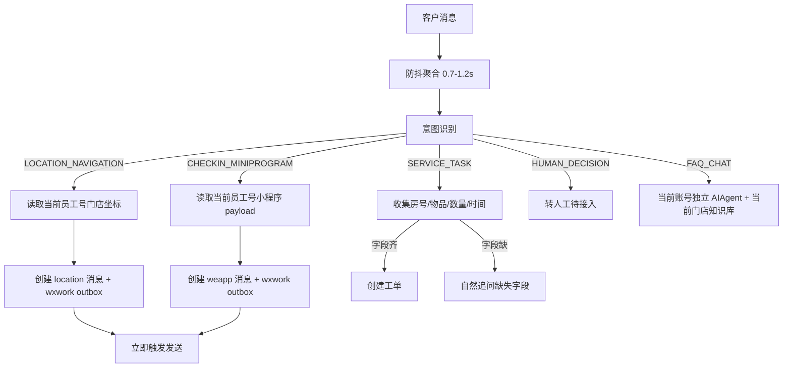

# 客服、客户、知识、工单、排班一体化实施文档

> 本文是 2026-06-29 起企微员工号主链路的统一实施准绳。所有事项一起纳入同一套设计，不再拆成阶段。实现时必须保持现有企微员工号协议规则：企业微信员工号相关能力唯一依据 `https://wework.apifox.cn/llms.txt` 及其具体接口页，禁止混用 CLI、企微客服号/KF、个人微信或旧 `weixins` 字段。

## 1. 总目标

系统收敛为：企微员工号协议 SAAS + AgentDesk 会话工作台 + 门店独立智能客服 + 门店/客服组权限范围 + 工单真实动作 + 客户跨门店档案 + 知识进化审核 + 排班和分配体系。

任何客户可见回复必须满足以下规则：

- 不用固定关键词模板冒充 AI 思考。
- 不用文本冒充真实动作，例如定位、小程序、工单、转人工。
- 动作型回复必须先真实执行工具或创建 outbox，成功后才能说已经发出/登记/安排。
- 需要人类判断、授权、退款、赔付、安全、严重投诉的内容一律转人工，不让 AI 下结论。
- 同一客户联系不同员工号/门店时，会话、上下文、知识库、默认定位、小程序和工单必须按 `guid + externalUserId/chatroom + storeId` 隔离。

## 2. 意图识别与真实动作

### 2.1 意图分类

所有企微员工号入站文本、语音转写文本、图片理解摘要、文件文本摘要进入 AI 前，先做轻量意图判定。至少包括：

| 意图 | 说明 | 动作 |
| --- | --- | --- |
| `FAQ_CHAT` | 普通咨询、酒店规则、早餐、停车、入住时间 | 读取当前员工号绑定 Agent 和门店知识库，自然回答 |
| `CHECKIN_MINIPROGRAM` | 办入住、自助入住、订单查询、小程序入口 | 发送当前员工号绑定的小程序卡片，再自然补一句 |
| `LOCATION_NAVIGATION` | 酒店在哪、怎么去、发定位、导航、地址 | 发送当前员工号绑定门店定位卡片，不发普通文本冒充 |
| `SERVICE_TASK` | 送水、拖鞋、纸巾、维修、打扫、叫醒、行李 | 缺字段先追问；字段齐后创建工单；失败转人工 |
| `HUMAN_DECISION` | 退款、赔付、严重投诉、安全、隐私、价格争议、订单异常 | 直接转人工/待接入，不让 AI 编处理结论 |
| `MEDIA_UNDERSTANDING` | 客户围绕图片/语音/文件追问 | 使用 `mediaText/mediaSummary`，失败则说明看不清并追问 |
| `LIGHT_CHAT` | 好的、可以、确认、哈哈、谢谢、表情互动 | 短自然回复或作为待确认动作的确认词处理 |

### 2.2 固定回复替换规则

禁止再写这类固定模板：

- “要我把定位发您吗？”作为所有位置问题回复。
- “自助入住在小程序里办理就行。”但没有真正发送小程序。
- “我已经安排/通知/登记了。”但没有工单或人工路由成功。

正确链路：



### 2.3 速度规则

- 文本、小程序、定位、转人工提示走快通道，不等待视觉/文件理解。
- 图片/语音/文件最多短等 2-3 秒；超时不编造，后续理解完成后只在客户最新问题仍相关时再触发。
- outbox 创建后必须立即 `DispatchPendingOutbox`，cron 只做 1 秒兜底。
- 消息处理日志记录 `callbackReceivedAt -> messageCreatedAt -> intentDoneAt -> aiDoneAt -> outboxCreatedAt -> sentAt`。

## 3. 客服账号、菜单和数据范围

### 3.1 角色菜单

客服账号不能看到全后台。菜单由后端权限和前端导航共同收敛：

| 角色 | 可见菜单 |
| --- | --- |
| 门店客服 | 总览、会话、工单、客户管理、快捷回复、通知、个人设置 |
| 客服组长 | 门店客服菜单 + 客服档案、客服组排班、会话监控、知识候选审核 |
| 总部客服 | 会话、工单、客户管理、知识候选、报表、排班 |
| 管理员 | 全部菜单 |

前端只渲染当前用户允许的 menu keys；后端接口仍必须做权限校验。

### 3.2 门店/员工号服务范围

客服能否看会话、接管、发送消息，要同时满足：

1. 有接口权限，例如 `conversation.send`。
2. 当前用户或其客服组绑定了该会话的 `storeId` 或 `wxWorkProtocolInstanceId`。
3. 会话没有被其他客服锁定，除非走接管/转接流程。

建议新增/使用关系：

- `agent_store_scope`：客服可服务门店。
- `agent_wxwork_instance_scope`：客服可服务员工号。
- `agent_team_store_scope`：客服组可服务门店。
- `agent_team_wxwork_instance_scope`：客服组可服务员工号。

多个客服可绑定同一个门店员工号；一个客服组可绑定多个门店员工号。转人工后进入当前门店/员工号对应客服组的待接入队列，再由自动分配策略选择客服。

## 4. 客户管理重设计

客户不是单个微信号，也不是单个会话。数据分四层：

| 层级 | 表/概念 | 说明 |
| --- | --- | --- |
| 全局自然人 | `CustomerProfile`/现有 `Customer` 扩展 | 姓名、手机号、会员、偏好、黑名单等稳定事实 |
| 身份标识 | `CustomerIdentity` | 微信 username、小程序 openid、手机号、企微 external id |
| 门店关系 | `StoreCustomerRelation` | 某客户在某门店的入住、咨询、投诉、偏好、标签 |
| 会话身份 | `ConversationIdentity` | `guid + externalUserId/chatroom`，绑定长期会话和记忆 |

会话和 AI 上下文必须按员工号/门店隔离；全局客户档案只共享稳定事实，不共享旧门店已解决故障。客户页需要提供：全局视图、门店视图、会话视图。

## 5. 工单系统

工单按酒店服务请求设计，而不是泛泛任务。

| 类型 | 必填字段 | AI 行为 |
| --- | --- | --- |
| 送物 | 房号、物品、数量 | 缺字段追问；齐后创建工单 |
| 维修 | 房号、问题、紧急程度 | 严重漏水/安全风险转人工并创建高优先级工单 |
| 保洁 | 房号、需求、时间 | 创建工单或排队 |
| 入住协助 | 订单/手机号/姓名、问题 | 小程序优先，异常转人工 |
| 发票 | 抬头、税号、金额、订单 | 可收集信息，最终人工确认 |
| 投诉 | 内容、房号、严重程度 | 转人工，AI 不承诺赔付 |
| 安全 | 事件、位置、紧急程度 | 立即转人工/高优先工单 |
| 退款赔付 | 订单、原因 | 一律人工决策 |

工单创建成功前，AI 不得说“已安排”。创建失败时必须转人工并展示失败原因给后台。

## 6. 知识进化

知识进化不是把所有人工回复都入库，而是 AI 先判断“是否适合沉淀成 FAQ”。

进入候选的条件：

- AI 原本答不上或答错。
- 人工给出了可复用的语言答案。
- 不是行动型工单，不是退款赔付决策，不包含隐私。
- 能归属到当前门店知识库或通用模板库。

后台必须支持：

- 多选批量通过。
- 多选批量驳回。
- 多选合并相似问题。
- 批量导出 Markdown/JSONL。
- 批量通过前再次由 AI 检查重复、隐私、是否动作型。

## 7. 排班和自动分配

排班需要支持一天多个客服组、多个时间段。页面提供日视图、周视图、规则视图。

分配逻辑：

1. 根据会话 `storeId/wxWorkInstanceId` 找可服务客服组。
2. 根据当前时间找排班内在线/可接入成员。
3. 按策略分配：轮询、最少会话、优先门店客服、总部兜底。
4. 无人可接时进入待接入队列，弹窗提醒组长/总部。

必须检测冲突：同一客服同时多组排班、某门店无覆盖、夜间无兜底、组内无人。

## 8. 云端知识库检索计数

所有检索都写统一 `KnowledgeRetrieveLog`，包括本地向量、FAQ、云端知识库、混合检索。

字段至少包括：

- `knowledgeBaseId`
- `sourceType`: `local_vector/cloud_knowledge/faq/hybrid`
- `query`
- `hitCount`
- `latencyMs`
- `conversationId`
- `messageId`
- `aiAgentId`
- `wxWorkInstanceId`
- `success/errorMessage`

今日检索次数从统一日志聚合，不能漏掉云端检索。

## 9. 验收标准

- 客户问位置时收到真实定位卡片，不是普通文本。
- 客户问入住时收到可打开的小程序卡片，并有自然短回复。
- 送水/维修等服务任务缺房号会追问，字段齐后创建工单。
- 退款/赔付/严重投诉/安全风险自动转人工。
- 客服测试号只显示客服该看的菜单。
- 客服有门店/员工号范围后才能发送、接管、转接；无范围时明确提示。
- 多客服可服务同一门店员工号，客服组可服务多个门店员工号，转人工自动分配。
- 普通文本回复速度有链路打点，outbox 立即发送。
- 客户管理能区分同一自然人在不同门店的关系和会话。
- 知识候选支持批量通过/驳回/导出/合并。
- 排班支持一天多个客服组和时间段。
- 云端知识库检索计入今日检索次数。


## 9. 2026-06-29 本轮实现补充

本轮不再拆“第一阶段/第二阶段”，以下能力按同一套主链路实现和验收。

### 9.1 客服菜单和服务范围

- 客服账号前端导航按角色收敛，普通客服只显示会话、工单、客户、快捷回复等接待相关入口，不再看到完整后台。
- 客服档案和客服组均支持绑定 `storeScopeIds` 与 `wxWorkInstanceScopeIds`。
- 会话人工回复、待接入接管、自动分配均检查会话路由上的 `storeId / wxWorkInstanceId`，客服只能服务自己或客服组覆盖范围内的门店员工号。
- 多个客服可以绑定同一个员工号；一个客服组也可以绑定多个门店/员工号，转人工后仍走自动分配和待接入队列。

### 9.2 客户跨门店模型

- 新增 `StoreCustomerRelation`，记录同一自然客户在不同门店下的独立关系：`customerId + storeId + wxWorkInstanceId + lastConversationId + visitCount + stableNotes`。
- 客户通过企微员工号发消息时，系统基于当前会话路由更新门店关系，不把不同门店的咨询、偏好、问题混成一个扁平记忆。
- 客户管理列表返回 `storeRelations` 摘要，前端展示最近门店关系，后续详情页按“全局档案 / 门店关系 / 会话历史”扩展。

### 9.3 服务任务与工单真实动作

- 对送水、拖鞋、纸巾、打扫、维修、叫醒、行李等服务型意图，AI 不再直接承诺“已安排”。
- 若缺房间号，系统设置 `pendingAction=service_task` 并追问房号；语音或文本回复“确认/好的/101”会优先进入 pending action 上下文。
- 字段齐全后，系统通过现有 `TicketService.CreateTicket` 创建来源为 `ai_service` 的真实工单，成功后才回复“登记好了”。
- 工单创建失败时，系统回复登记失败并进入人工待处理，避免客户可见承诺和后台动作不一致。

### 9.4 知识进化批量审核和质检

- 待归档问答支持批量选择、批量通过、批量驳回。
- 列表工具栏必须提供“全选当前页 / 取消当前页”，勾选状态与单行复选框共享同一组选中 ID；批量质检、批量通过、批量驳回均以当前选中 ID 为准。
- 分页场景不做默认“全库全选”，避免误把未审阅的问题批量通过。后续如需全库批处理，必须单独做二次确认和筛选摘要。
- 新增质检接口 `POST /api/dashboard/knowledge-candidate/quality_check`，批量返回建议通过/复核/驳回。
- 质检规则：只允许人工语言回答出来、适合 FAQ 的内容沉淀知识；送物/维修/退款/赔付/投诉/安全/隐私等行动或决策类内容必须复核，不直接进知识库。
- 高频候选会标注优先审核，但高频不等于自动通过。

### 9.5 云端知识库检索计数

- `KnowledgeRetrieveLog` 增加并返回 `sourceType`，取值包括 `local_vector / cloud_knowledge / hybrid / faq`。
- 检索日志列表支持按 `sourceType` 筛选，今日云端检索次数应统计 `cloud_knowledge` 与 `hybrid` 类型日志。
- 回答链路会根据命中来源推断云端检索，避免云端知识库调用没有计入今日检索次数。
- AI 运行时的门店知识库检索必须和调试检索一样写入统一 `KnowledgeRetrieveLog`，不能只把检索结果塞进 Prompt。即使没有命中，也要记录 `answerStatus=no_answer`，这样首页“今日知识检索次数”和失败率能真实反映生产会话。
- 首页“今日知识检索次数”只从 `t_knowledge_retrieve_log.created_at >= 今日零点` 聚合，不允许前端假加数字。若客户问题确实走了知识库但数字不涨，应优先检查运行时检索日志是否落库。

### 9.5.1 客服在线状态识别

- 客服在线状态以后台实时连接为准：客服打开后台会话/通知 WebSocket 后，系统刷新 `AgentProfile.lastOnlineAt`。
- 首页和客服组负载按最近 15 分钟 `lastOnlineAt` 判断在线，避免浏览器刷新、网络抖动导致瞬间离线。
- WebSocket 断开时不立即置离线；超过在线窗口后自然显示离线。
- `serviceStatus` 只表示空闲/忙碌，不等于在线；在线识别必须同时看 `lastOnlineAt`。

### 9.6 固定话术清理原则

- 位置意图直接发送当前员工号绑定的定位卡片；不再默认文本问“要不要发定位”。
- 入住/订单/发票等小程序意图直接发送当前员工号绑定的小程序卡片，再补一句短自然说明。
- AI 回复需要继续遵守账号专属智能客服配置，不把全局 Agent 与账号 personaPrompt 叠加使用。

### 9.7 连续消息、工单暂停和双通道转人工

- 客户短时间连续发送多条文本/语音转写/图片追问时，系统不能只把最后一条当作问题。防抖窗口内仍只允许最后一次触发真正回复，避免重复回复；但最后一次运行时必须合并最近连续客户消息，让 AI 一起理解上下文。
- 前期暂停 AI 自动创建真实工单：工单模型、人工建单页面、TicketService 保留，但运行时不启用 `create_ticket_with_confirmation` 自动建单工具。
- 服务类诉求（送水、拖鞋、打扫、叫醒等）前期由 AI 做文字引导、说明自取/联系现场方式，知识库没有明确流程或需要员工判断时转人工；AI 不能说“已安排/已通知/已派单”。
- 转人工有两条通道，但不能双发：总部网页端接管和门店企微员工群提醒按时间段择一路由。
- 路由规则：当前时间命中客服组排班且当前员工号已开启并绑定门店群时，进入门店群提醒；非值班、未绑定群或关闭门店群提醒时，若开启总部兜底则进入总部网页端待接管；若总部兜底也关闭，则只给客户一条非服务时间提示。
- 每个企微员工号实例可配置 `storeRoomConversationId / storeRoomNotifyEnabled / storeRoomAtList`。门店群 conversation_id 必须按 wework 文档使用 `R:` 前缀；群提醒通过 `/msg/send_text`，需要 @ 时通过 `/msg/send_room_at` 和 `at_list`。
- 门店群提醒是系统侧外发任务，不写成客户会话里的可见客服消息；失败进入 `ChannelMessageOutbox` 失败/重试链路，便于日志定位。
- 客服组长导航必须能看到分类标签、快捷回复、客服档案、客服组排班、会话监控和知识候选审核；普通客服仍只显示接待所需入口。

### 9.8 老好友再次扫码/再次到店欢迎

- 好友申请欢迎语只适用于首次加好友或自动通过好友申请。客户已经是好友后再次扫码，企微通常会直接回到已有会话，不会再产生好友申请事件，因此不能依赖“加好友欢迎语”二次触发。
- 按 `wework.apifox.cn` 当前已确认文档，回调只明确列出登录二维码变化 `11002`、登录 `11003`、退出 `11004`、新消息 `11010`、其他设备登录 `11011`、音视频电话 `2166`；其中 `11002` 是员工号登录二维码状态变化，不是客户再次扫描员工名片二维码事件。
- `获取二维码名片`、`通过二维码获取联系人`、`同步申请好友列表`、`同意联系人申请` 都是主动接口或新好友申请链路，不等于“老好友再次扫码”的服务端推送。因此如果老好友只是扫码且不发消息，当前协议没有可用事件让系统自动判别并主动发欢迎语/小程序/定位。
- 可实现闭环是“会话重开欢迎/到店欢迎”：同一 `guid + externalUserId` 长时间无消息后再次发第一条消息时，开启新的 session window，并可按冷却周期发送一条自然欢迎 + 小程序/定位入口。若未来协议新增明确的扫码来源回调，再接入该回调。
- 二次欢迎必须幂等：同一客户同一员工号在一个冷却周期内只发一次，避免客户每发一句都收到欢迎语。
- 二次欢迎仍按门店维度隔离，同一客户在 A 店和 B 店分别有独立欢迎状态、小程序和定位。

## 10. 2026-06-29 补完项落地规则

### 10.1 客户管理完整化

客户管理不再把客户看成单一扁平对象。列表和详情必须同时展示：

- 全局客户档案：自然客户姓名、头像、手机号、邮箱、备注。
- 门店关系：同一客户在不同 `storeId / wxWorkInstanceId` 下的独立关系、最近会话、到访次数、稳定备注。
- 会话入口：门店关系中的 `lastConversationId` 可直接跳到会话页。

AI 记忆和客服查看都必须按门店关系隔离。全局档案只保存跨门店稳定身份，不保存某个门店的故障、投诉、服务动作细节。

### 10.2 工单分类与真实派发基础

工单增加分类字段：

| category | 含义 | 来源示例 |
| --- | --- | --- |
| `delivery` | 物品配送 | 送水、拖鞋、牙刷、纸巾、毛巾 |
| `cleaning` | 保洁服务 | 打扫、清理、保洁 |
| `maintenance` | 维修处理 | 漏水、马桶、空调、电视、门锁 |
| `wake_up` | 叫醒服务 | 叫醒 |
| `luggage` | 行李协助 | 行李、寄存 |
| `human_decision` | 人工决策 | 退款、赔付、重大投诉、安全 |
| `general` | 普通工单 | 其他 |

AI 自动服务任务必须写入 `category / priority / roomNo`。紧急维修、安全风险类应标记 `high/urgent`，不能和普通送物混排。

### 10.3 排班一天多个客服组/多个时段

排班系统采用“多条 schedule 表示一天多个时段”的模型。批量生成接口支持：

```json
{
  "teamIds": [1, 2],
  "startDate": "2026-06-29",
  "endDate": "2026-07-05",
  "weekdays": [1,2,3,4,5],
  "timeRanges": [
    {"startTime": "09:00", "endTime": "12:00"},
    {"startTime": "14:00", "endTime": "18:00"}
  ]
}
```

保留旧 `startTime/endTime` 兼容；新 UI 可以在批量排班弹窗里加多个时间段，但后端已具备一次生成多个班段的能力。自动分配仍按当前时间命中的客服组集合进行候选选择。

### 10.4 知识进化会话分析

新增会话分析接口：`POST /api/dashboard/knowledge-candidate/analyze_conversation`。

规则：

- 读取会话最近文本/语音转写消息。
- 找最近一条人工客服语言回答，再向前找客户问题。
- 如果内容属于送物、维修、打扫、退款、赔付、投诉、安全、隐私等行动/决策类，不自动入知识库。
- 如果是可复用语言问答，则 upsert 到待归档问答，继续走质检、批量审核、周导出。
- 该接口当前为可运行启发式分析，后续可替换为模型分析，但接口和审核流不变。

### 10.5 旧 CLI/KF 收口

企业微信 CLI 和企业微信客服号保留历史数据兼容代码，但不再默认进入新产品主链路。定时 outbox 调度只跑 `WxWorkProtocolService.DispatchPendingOutbox`，不再默认调度旧 `WxWorkKFOutboundService.DispatchPendingOutbox`。日志中不应再出现旧 KF outbox 主循环作为正常业务噪音。

### 10.8 企微员工号新增与配置入口重构

2026-06-29 起，企微员工号配置按“企业资源 / 员工号实例 / 员工号智能客服”三层拆开，避免账号编辑变成大杂烩。

- 企业级资源：小程序与企业绑定，不放在单个员工号账号编辑里。小程序真实发送仍使用已验证可打开且有封面的 `/msg/send_weapp` payload，但配置入口应放在企业/全局资源设置中。
- 员工号实例：只维护员工号协议身份、门店运营资料、门店定位、服务时间、门店群通知、AI 开关、自动通过好友申请等运行开关。
- 员工号智能客服：模型、系统提示词、欢迎语、知识库、技能、工具、转人工策略放在账号行操作“智能客服配置”里。保存智能客服时，系统把所选第一个知识库同步到 `WxWorkProtocolInstance.knowledgeBaseId`，运行时仍只使用当前员工号自己的知识库。
- 账号编辑页不再展示 `defaultMiniProgramPayload / welcomeMessage / personaPrompt / contextMaxMessages / contextMaxTokens / knowledgeBaseId` 等碎片字段，避免多个入口互相覆盖。

新增账号有两种方式，但二者都必须先自动绑定协议平台里已经初始化好的空闲实例：

1. 总部现场扫码：总部点击“自动绑定空闲实例”。系统调用企微员工号渠道里的 `devicePoolUrl`，从协议平台实例列表选择一个未被 AgentDesk 绑定的真实 `guid`，创建本地 `WxWorkProtocolInstance`，并立即调用 `/login/get_login_qrcode` 获取二维码。若协议平台没有空闲实例或未配置设备池接口，则不创建任何占位账号。
2. 远程门店自助开户：总部点击“生成并复制链接”。系统同样先绑定真实空闲 `guid`，再生成 `remoteSetupToken` 和公开页面 `/wxwork-remote-setup?token=...`。门店打开链接后可获取真实登录二维码、扫码登录、填写门店名称/地址/坐标/服务时间/门店群通知配置。

注意：`guid` 是 `wework.apifox.cn` 统一请求格式中 `data.guid`，来源是协议平台“实例列表里的设备 ID”，不是 AgentDesk 本地 UUID。AgentDesk 只能保存绑定关系、过滤本地已绑定设备、调用 `/login/get_login_qrcode` 等 Apifox 业务接口；禁止再生成 `pending_...` 或假 GUID。

远程页面权限边界：

- 远程页面不进入 dashboard，不展示总部侧边栏，也不能查看其他账号。
- 远程页面只能通过 token 修改当前实例的门店运营资料、坐标、服务时间、门店群通知和自动通过好友申请开关。
- 远程页面不能修改模型、提示词、知识库、小程序 payload、企业级配置和客服组权限。
- token 默认 14 天过期；过期后需要总部重新生成。

门店群 conversation_id 获取规则：

- 按当前已确认 `wework.apifox.cn` 文档，没有“列出全部群并一键选择群 ID”的明确接口，因此不能做假按钮。
- 可用闭环是：把该员工号拉进门店群，让群里任意人发一条消息；企微消息回调里会带 `R:` 前缀的群 `conversation_id`，总部或后续辅助工具可从回调/会话原文复制填入。
- 若未来协议新增“群列表/选择群/获取群 conversation_id”接口，再把远程页的输入框升级为真实选择器。
