# HPMS 前端实际可见字段清单

**核对日期：** 2026-09-12
**系统：** 安心宿+ SaaS / HPMS
**门店：** 丽驻智慧公寓（政务区省立医院南区店）
**核对方式：** 只读浏览 PMS 前端页面并截图；未执行保存、提交、改价、排房、换房、退房或其他写操作。

> 本文只记录 PMS 前端实际显示过的字段和操作入口。没有在页面出现的字段，不视为已提供，也不能据此向客户承诺。

## 截图证据

本次浏览已逐页截取以下截图，截图内容与本文字段一一对应：

1. 工作台：当前营业日、夜审状态、经营指标和房型/渠道占比。
2. 预订订单列表：预订订单筛选项、订单状态和列表列。
3. 预订订单详情：订单基础信息、价格、预订人和接待订单明细。
4. 接待订单列表：接待单筛选项和在住订单列表列。
5. 接待订单详情：房间、入住人、价格、账务、操作入口。
6. 实时房态：房号卡片、住客、渠道、抵离和清扫/房态标记。
7. 远期房态：日期、房型、可售/待排和逐日数量。
8. 白名单：入住人、证件和认证相关字段。
9. 实名认证：认证查询字段、认证结果和认证审计字段。
10. 入住监控：房号、入住时间、入住人和核验状态。

截图文件位于：
`docs/design/pms-screenshots/`

### 工作台

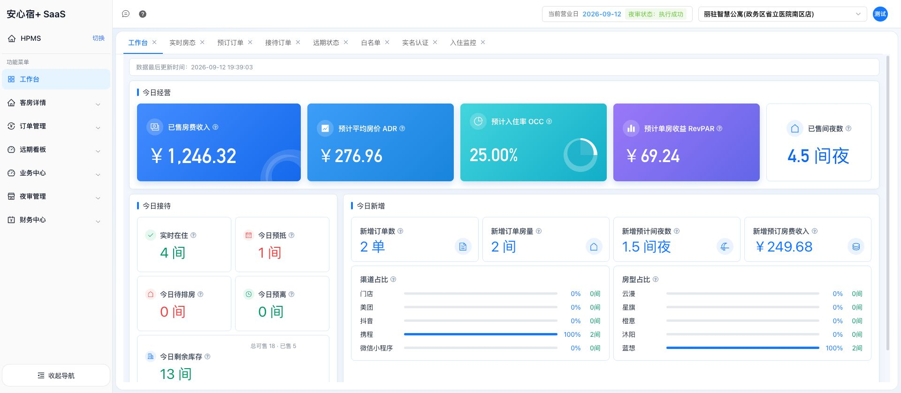

### 实时房态

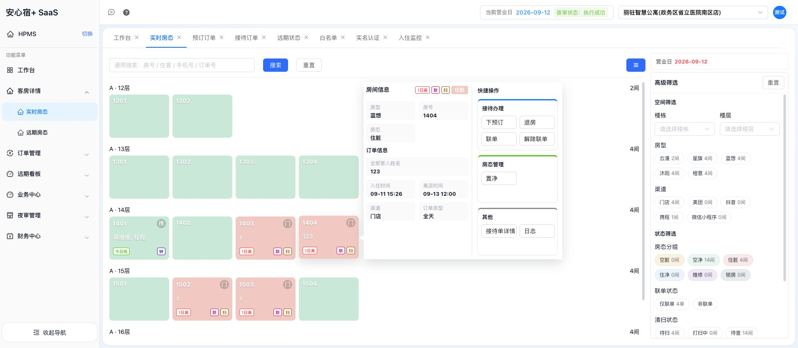

### 远期房态

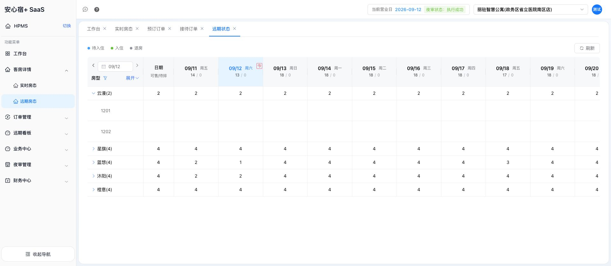

### 预订订单

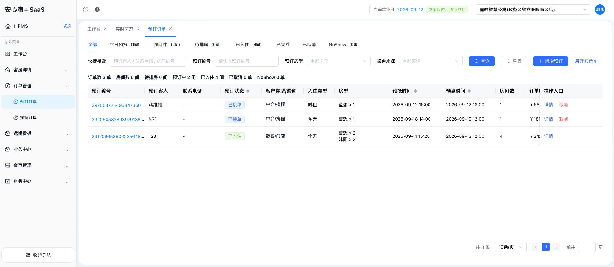

### 预订订单详情

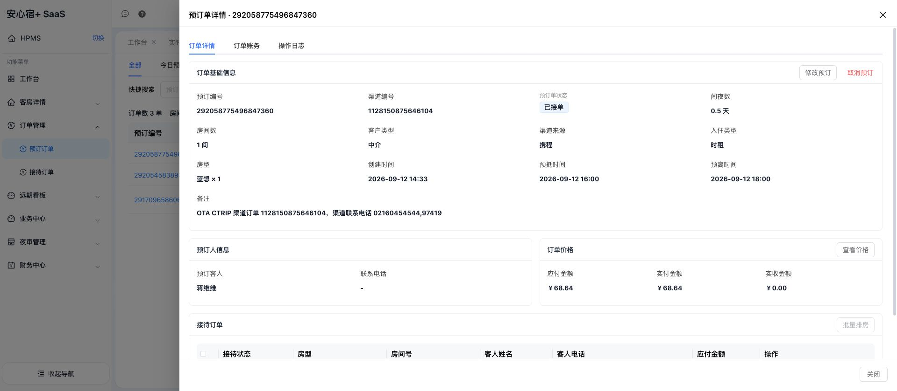

### 接待订单

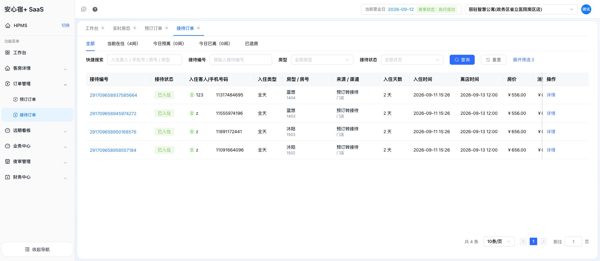

### 接待订单详情

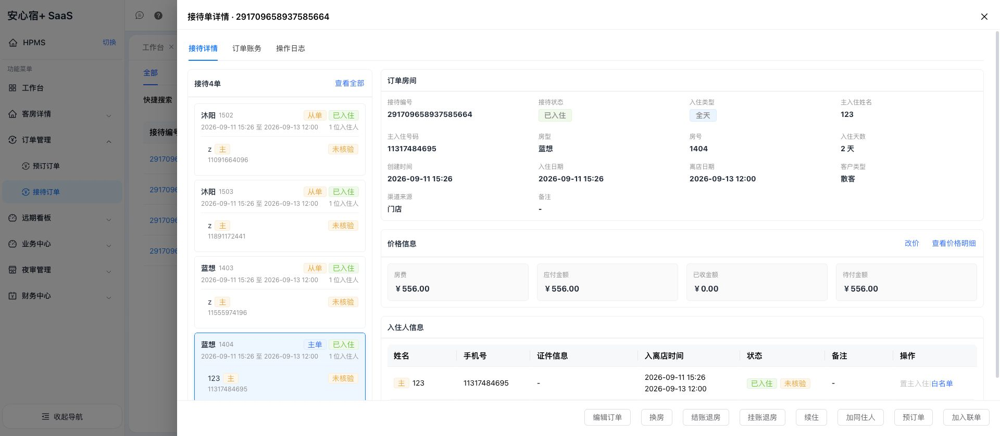

### 订单账务

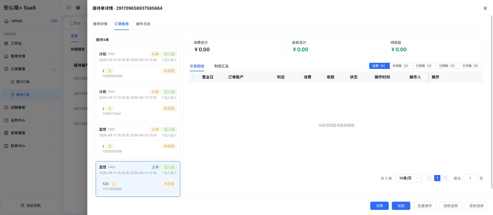

### 操作日志

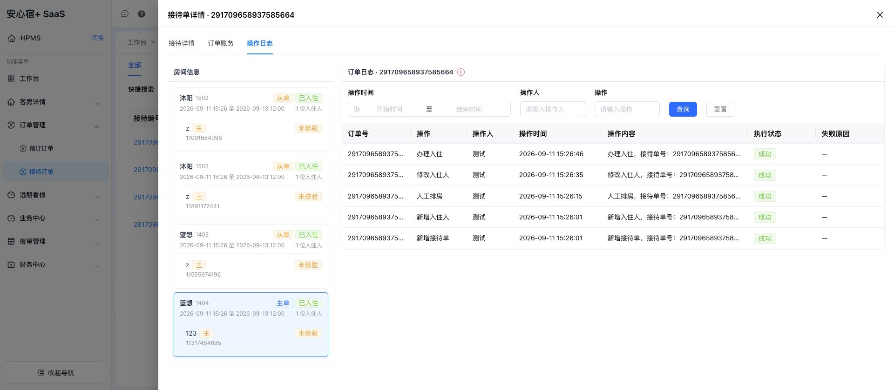

### 白名单

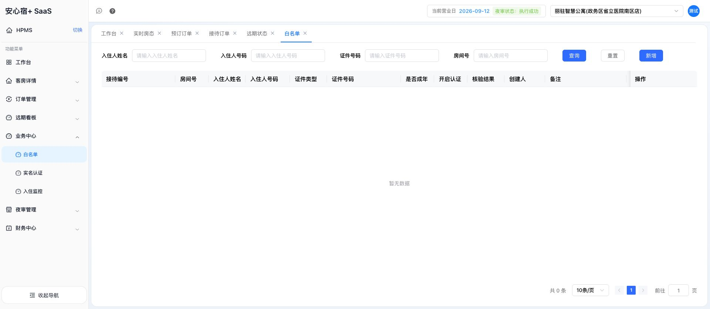

### 实名认证

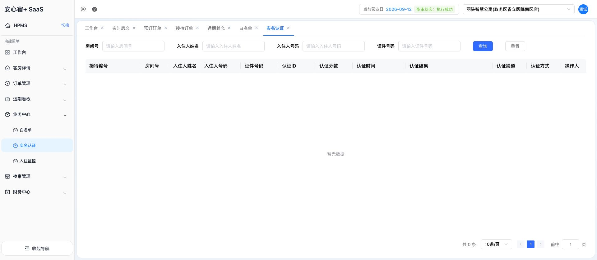

### 入住监控

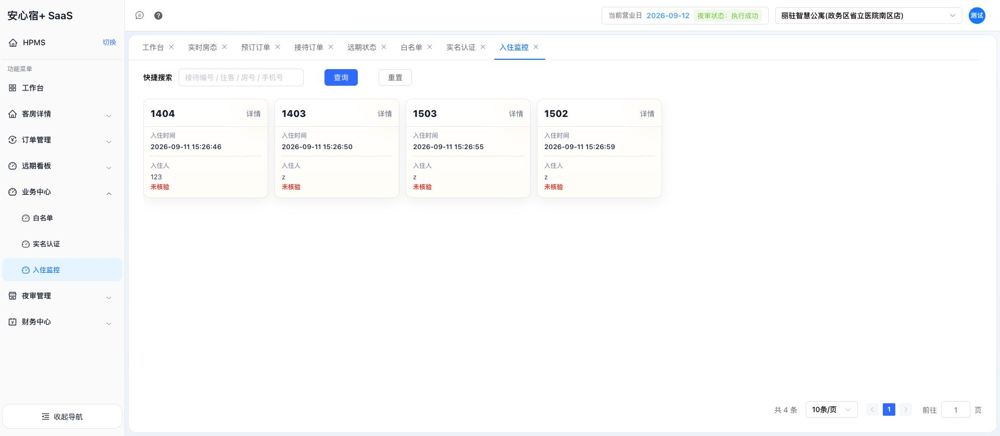

## 页面字段

### 1. 工作台

**页面：** `#/pms_workbench`

**页面顶部：**

- 当前营业日
- 夜审状态
- 数据最后更新时间

**今日经营：**

- 已售房费收入
- 预计平均房价 ADR
- 预计入住率 OCC
- 预计单房收益 RevPAR
- 已售间夜数

**今日接待：**

- 实时在住
- 今日预抵
- 今日待排房
- 今日预离
- 今日剩余库存
- 总可售
- 已售

**今日新增：**

- 新增订单数
- 新增订单房量
- 新增预计间夜数
- 新增预订房费收入

**统计维度：**

- 渠道占比：门店、美团、抖音、携程、微信小程序
- 房型占比：云漫、星旗、橙意、沐阳、蓝想

**可支持的事实：**

- 当前营业日和夜审是否成功
- 当前经营统计和数据更新时间
- 当前整体库存、在住、预抵、预离
- 按渠道和房型查看数量/占比

### 2. 实时房态

**页面：** `#/room_real_status`

**查询字段和筛选项：**

- 通用搜索：房号 / 住客 / 手机号 / 订单号
- 营业日
- 楼栋
- 楼层
- 房型
- 渠道：门店、美团、抖音、携程、微信小程序
- 房态分组：空脏、空净、住脏、住净、维修、锁房
- 联单状态：仅联单、非联单
- 清扫状态：待扫、打扫中、待查、催扫
- 抵离筛选：今日抵、今日离、3日内抵、3日内离、超时

**房间卡片实际显示：**

- 房号
- 渠道
- 住客
- 预计抵店
- 预计离店
- 钟点房标记
- 联单标记
- 待清扫标记
- 房型
- 房态
- 全部客人姓名
- 订单类型

**房间详情卡片实际显示：**

- 房型
- 房号
- 房态
- 全部客人姓名
- 入住时间
- 离店时间
- 渠道
- 订单类型
- 快捷操作入口：下预订、退房、联单、解除联单
- 房态管理入口：置净
- 其他入口：接待单详情、日志

**可支持的事实：**

- 某房当前是否空净、空脏、住净、住脏、维修或锁房
- 某房当前住客、渠道、入住/离店时间
- 某房是否待扫、联单、钟点房、今日抵/离
- 按房号、住客、手机号或订单号定位房间

### 3. 远期房态

**页面：** `#/room_future_status`

**页面字段：**

- 日期选择
- 前一天
- 后一天
- 刷新
- 房型筛选
- 房态图例：待入住、入住、退房
- 日期列
- 可售/待排
- 房型及房型房量：云漫、星旗、蓝想、沐阳、橙意
- 房型下的具体房号
- 每个日期对应的可售数量

**当前页面可见示例：**

- 日期范围从 09/11 至 09/20
- 每个日期显示“可售 / 待排”
- 房型行显示房型总量和每日数量
- 展开房型后显示房号，例如 1201、1202

**可支持的事实：**

- 指定日期的房型可售数量
- 指定日期的待排数量
- 房型总量和逐日可售数据
- 展开后查看房型下的房号

### 4. 预订订单列表

**页面：** `#/booking_order`

**状态页签：**

- 全部
- 今日预抵
- 预订中
- 待排房
- 已入住
- 已完成
- 已取消
- NoShow

**查询字段：**

- 快捷搜索：预订客人 / 联系电话 / 房间编号
- 预订编号
- 预订房型
- 渠道来源

**列表列：**

- 预订编号
- 预订客人
- 联系电话
- 预订状态
- 客户类型/渠道
- 入住类型
- 房型
- 预抵时间
- 预离时间
- 房间数
- 订单应付金额
- 间夜数
- 创建时间
- 操作入口

**页面可见操作：**

- 查询
- 重置
- 新增预订
- 详情
- 取消

### 5. 预订订单详情

**入口：** 预订订单列表的“详情”

**订单基础信息：**

- 预订编号
- 渠道编号
- 预订单状态
- 间夜数
- 房间数
- 客户类型
- 渠道来源
- 入住类型
- 房型
- 创建时间
- 预抵时间
- 预离时间
- 备注

**预订人信息：**

- 预订客人
- 联系电话

**订单价格：**

- 应付金额
- 实付金额
- 实收金额
- 查看价格入口

**接待订单明细列：**

- 接待状态
- 房型
- 房间号
- 客人姓名
- 客人电话
- 应付金额
- 操作

**接待明细可见操作：**

- 排房
- 删除排房
- 加同住人
- 办理入住
- 改价
- 取消

**订单页面可见操作：**

- 修改预订
- 取消预订
- 批量排房
- 关闭

### 6. 接待订单列表

**页面：** `#/home_order`

**状态页签：**

- 全部
- 当前在住
- 今日预离
- 今日已离
- 已退房

**查询字段：**

- 快捷搜索：入住客人 / 手机号 / 房号 / 房型
- 接待编号
- 房型
- 接待状态

**列表列：**

- 接待编号
- 接待状态
- 入住客人/手机号码
- 入住类型
- 房型 / 房号
- 来源 / 渠道
- 入住天数
- 入住时间
- 离店时间
- 房价
- 消费
- 收款
- 总价
- 创建时间
- 操作

**页面可见操作：**

- 查询
- 重置
- 展开筛选
- 详情

### 7. 接待订单详情

**订单房间字段：**

- 接待编号
- 接待状态
- 入住类型
- 主入住姓名
- 主入住号码
- 房型
- 房号
- 入住天数
- 创建时间
- 入住日期
- 离店日期
- 客户类型
- 渠道来源
- 备注

**价格信息：**

- 房费
- 应付金额
- 已收金额
- 待付金额
- 查看价格明细

**入住人信息列：**

- 姓名
- 手机号
- 证件信息
- 入离店时间
- 状态
- 备注
- 操作

**页面可见操作：**

- 编辑订单
- 换房
- 结账退房
- 挂账退房
- 续住
- 加同住人
- 预订单
- 加入联单
- 白名单

### 8. 接待订单账务

**页签：** `订单账务`

**汇总字段：**

- 消费合计
- 收款合计
- 待收款

**账务筛选：**

- 全部
- 未结账
- 已结账
- 已转账
- 已冲账

**交易明细列：**

- 营业日
- 订单账户
- 科目
- 消费
- 收款
- 状态
- 操作时间
- 操作人
- 来源业务
- 业务动作
- 备注
- 操作

**页面可见操作：**

- 消费
- 收款
- 批量操作
- 结账退房
- 挂账退房

### 9. 接待订单操作日志

**页面字段：**

- 操作时间范围
- 操作人
- 操作

**日志列：**

- 订单号
- 操作
- 操作人
- 操作时间
- 操作内容
- 执行状态
- 失败原因

**页面已显示的操作类型示例：**

- 办理入住
- 修改入住人
- 人工排房
- 新增入住人
- 新增接待单

**可支持的事实：**

- 某订单发生过什么操作
- 操作人和操作时间
- 操作内容
- 执行成功/失败及失败原因

### 10. 白名单

**页面：** `#/whitelist`

**查询字段：**

- 入住人姓名
- 入住人号码
- 证件号码
- 房间号

**列表列：**

- 接待编号
- 房间号
- 入住人姓名
- 入住人号码
- 证件类型
- 证件号码
- 是否成年
- 开启认证
- 核验结果
- 创建人
- 备注
- 创建时间
- 操作

**页面可见操作：**

- 查询
- 重置
- 新增

### 11. 实名认证

**页面：** `#/realNameAuthentication`

**查询字段：**

- 房间号
- 入住人姓名
- 入住人号码
- 证件号码

**列表列：**

- 接待编号
- 房间号
- 入住人姓名
- 入住人号码
- 证件号码
- 认证 ID
- 认证分数
- 认证时间
- 认证结果
- 认证渠道
- 认证方式
- 操作人

### 12. 入住监控

**页面：** `#/ccheckInMonitoring`

**查询字段：**

- 快捷搜索：接待编号 / 姓客 / 房号 / 手机号

**卡片字段：**

- 房号
- 入住时间
- 入住人
- 核验状态
- 详情入口

## 能直接落地的客服查询能力

仅根据以上真实可见字段，当前可以设计为只读查询：

1. 按预订编号查看预订单状态、房型、预抵/预离、房间数、间夜数和应付金额。
2. 按接待编号查看在住订单、房型、房号、入住/离店时间、房价、消费、收款和总价。
3. 按房号、住客、手机号或订单号查询实时房态。
4. 查询房态分组、清扫状态、联单状态和抵离标记。
5. 查询指定日期、指定房型的远期可售/待排数量。
6. 查询入住人实名核验结果及认证时间、渠道、方式。
7. 查询接待订单操作日志及执行状态。

## 前端未显示、因此不能当作已具备的能力

以下字段或能力在本次已浏览页面中没有作为明确的可用数据字段出现，不能仅凭当前页面承诺：

- 会员 ID 查询入口和会员等级、积分、权益
- 独立的统一订单搜索接口
- 房间“临街、靠电梯、高楼层、朝向、面积”等属性
- 房型完整价格日历和升房差价
- 统一的订单写操作结果查询接口
- 幂等键、版本号、并发锁或占房锁
- 对外开放的改房型、换房、延迟退房、改价接口定义
- 优惠券、赔付、积分、营销活动和商品接口

页面虽然显示“改价、排房、换房、续住、退房”等按钮，但本次没有执行这些操作；这些按钮只能证明前端存在入口，不能证明已经具备可安全调用的外部接口。接入客服前仍需由 PMS 开发方提供正式接口字段、权限、错误码、幂等和并发控制说明。

## 结论

本清单已经把“当前前端实际可见内容”和“前端没有显示的能力”分开。后续 PMS Adapter 只应按本清单中已确认的页面字段做映射；任何新增字段必须先在 PMS 前端或正式接口中得到可核验依据，再进入客服回复链路。
