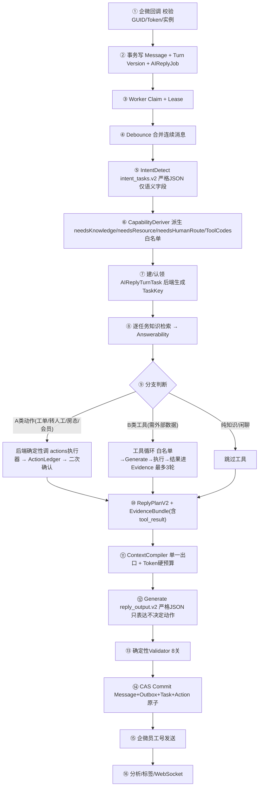

# 企业微信 AI 回复链路 V2 全量迁移与工具调用体系设计

> 状态：方案评审稿（待确认后分阶段实施）
>
> 日期：2026-08-14
>
> 分支：`codex/deepseek-responses-schema`
>
> 目标：把回复引擎从「V1(legacy/ADK) + V2 灰度并存」收敛为「唯一 V2 主链」，并把工具/技能调用体系完整纳入 V2，最终删除 V1/ADK 全部代码。

---

## 0. 一句话结论

V2 引擎代码已经 100% 造好，但一直停在「只有 Binding 1 走 V2、其余走 V1」的灰度态，且 V1/ADK 仍是默认主力。
本次要做的是：

1. 把工具/技能调用能力**以正确的方式**纳入 V2（这是删掉 V1/ADK 的唯一前置条件）；
2. 把 V2 翻成**默认且唯一**的主链；
3. 稳定后删除 V1/ADK 全部代码（含 `instruction/assembler.go` 那个 45 行旧常量）。

---

## 1. 背景与目标

### 1.1 为什么要全量 V2

V1（legacy/ADK）的问题（均有代码证据）：

- 意图输出 `primaryIntent + needsKnowledge + needsResource + needsHumanRoute + resourceAction` 多处重复，模型可自相矛盾；
- 转人工/发定位/查房态/建工单等动作**由模型口头决定**，模型没有能力边界意识，导致「乱承诺、假执行」；
- 上下文是十几条零散 System Message 叠加，无 Token 硬预算，易超限；
- 多题漏答/重复答无确定性校验；
- 动作结果从 Trace 反向推断，不可靠。

V2 已解决上述全部问题：严格 JSON、能力后端派生、确定性 Validator、Token 硬预算、任务覆盖校验、权威 ActionLedger。

### 1.2 本次目标

| 目标 | 说明 |
| --- | --- |
| 工具/技能纳入 V2 | 用「白名单调度 + 确定性执行」替代 V1 的「模型自主 loop」 |
| V2 成为唯一主链 | 翻转 feature flag 默认值，V1 仅显式关闭才用 |
| 删除 V1/ADK | 含 ADK agent、runner、skill middleware、旧 assembler |
| 可回滚 | 每阶段独立可回滚，不破坏客户消息 |

---

## 2. 现状盘点（事实，非推断）

### 2.1 V2 代码已 100% 完成

| 组件 | 位置 | 状态 |
| --- | --- | --- |
| 严格 JSON | `internal/pkg/strictjson` | ✅ |
| 11 个 JSON Schema | `internal/ai/runtime/contracts/*.schema.json` | ✅ |
| ContextCompiler | `internal/ai/runtime/contextcompiler` | ✅（budget/estimator/history/evidence/runtime_state/trace）|
| 确定性 Validator | `executor/{schema,task_coverage,evidence_reference,action_reference,safety,commit_invariant}_validator.go` | ✅ |
| CapabilityDeriver | `executor/capability_deriver.go` | ✅ |
| ActionLedger | `models/ai_reply_turn_action.go` + service | ✅ |
| DialogueState / MessageAnalysis | `services/conversation_dialogue_state_*` / `message_analysis_*` | ✅ |

### 2.2 V2 上线范围（未铺满）

线上 `runtime-production.env`：

```text
AI_RUNTIME_CONTEXT_COMPILER=v2
AI_RUNTIME_INTENT_CONTRACT=v2
AI_RUNTIME_REPLY_CONTRACT=v2
AI_RUNTIME_VALIDATOR=v2
AI_RUNTIME_ACTION_LEDGER=authoritative
AI_RUNTIME_V2_BINDING_IDS=1        # 只有 Binding 1（合肥南七）走 V2
```

`resolveRuntimeFeatureModes` 默认 fallback 是 `legacy`，其余门店全走 V1。

### 2.3 V1/ADK 现状（仍被依赖）

- `executor/service.go:114`：`UseRuntimeV2DirectGenerate = UseRuntimeV2Generate && !NeedsTool`
- 只要 `NeedsTool=true`，或非 V2 门店，就走 ADK。
- ADK 路径：`agent_factory.BuildCustomerServiceAgent` → `instruction.Service.Build`（含 45 行常量）→ `runner.Run`。
- 本次已删除「天气」这个唯一在意图层触发 `NeedsTool` 的入口（`intent_model_detector.go` 的 weather 分支），因此 `NeedsTool` 已恒为 false。

### 2.4 模型侧工具能力已就绪（关键）

`factory/chat_model_factory.go` 返回 `model.ToolCallingChatModel`；
`factory/responses_chat_model.go` 已完整实现 Responses API 的 `function_call` / `function_call_output` 往返：

- `WithTools(tools)` 注入工具白名单；
- `Generate` 返回 `message.ToolCalls`；
- `responsesInputFromMessages` 处理 `schema.Tool` 消息，回传工具结果；
- `extractResponsesToolCalls` 解析模型 function_call。

结论：**模型协议层无需重写**，缺的只是 V2 直生成路径的「循环驱动 + 工具执行器注入」。

---

## 3. 核心架构决策

### 3.1 工具三类分法（这是地基）

| 类型 | 例子 | 调度方式 | 谁决定「调不调」 |
| --- | --- | --- | --- |
| **A. 确定性业务动作** | 工单（建单/草稿/分诊）、转人工、房态、会员 | 后端按意图/知识命中直接调执行器，可能二次确认 | **后端**（模型无权）|
| **B. 数据工具** | MCP 动态工具、搜索、天气、技能内部工具 | 两阶段工具循环，后端预选白名单 | 后端定白名单，模型只填参数 |
| **C. 技能** | 技能文档 + 授权工具 | 后端确定性选中 → 注入 instruction + 工具白名单 | **后端** |

### 3.2 白名单调度原则（V2 与 V1 的本质区别）

- V1：模型在 ADK loop 里**自由决定**「要不要调工具、调哪个」→ 乱调工具、假执行的根源。
- V2：**后端决定「这轮能用哪些工具」，模型只能在白名单内填参数**。
- A 类动作永远不进模型 loop——模型无权决定「我要不要查房态/建工单」。

### 3.3 两阶段生成（不依赖模型共存特性）

- **阶段一（取数）**：带工具白名单、不带 `strict json_schema`，最多 3 轮 tool-call 循环，把工具结果落成 `Evidence(sourceType=tool_result)`。
- **阶段二（表达）**：带 `strict json_schema`、不带 tools，模型只把 Evidence 自然表达成 `reply_output.v2`。

这样无论 DeepSeek Responses 的 `function_call` 与 `strict json_schema` 能否共存，架构都成立（详见第 6 节阶段 0 验证）。

---

## 4. 完整 V2 回消息链路（最终形态）



**关键差异 vs V1**：工具循环（⑨K）与最终回复生成（⑫）是**两个独立阶段**——工具阶段「取数据」，回复阶段「表达数据」。回复阶段模型只面对证据，永不面对「要不要调工具」。

---

## 5. 分文件改动清单

### 5.1 新增

| 文件 | 职责 |
| --- | --- |
| `internal/ai/runtime/executor/tool_loop.go` | B 类工具循环驱动（Generate→执行→回传，最多 3 轮）|
| `internal/ai/runtime/executor/tool_executor.go` | 统一工具执行器接口：eino tool / MCP / 内置工具 → 后端可调 |
| `internal/ai/runtime/executor/deterministic_action_runner.go` | A 类动作后端确定性调度 |

### 5.2 修改

| 文件 | 改动 |
| --- | --- |
| `reply_output_v2.go` | `executeRuntimeV2DirectGeneration` 从「单次 Generate」改为「工具循环 + 最终生成」|
| `capability_deriver.go` | 派生通用 ToolCodes 白名单（现在只有天气写死，改成从 config.ToolCodes 通用派生）|
| `actions_executors.go` | 工单 graph 执行器从 ADK tool 迁到 actions executor |
| `contextcompiler/compiler.go` | 支持 `tool_result` 证据注入（schema 已预留）|

### 5.3 删除（最后阶段）

| 文件 | 说明 |
| --- | --- |
| `factory/agent_factory.go` | ADK agent 装配 |
| `factory/runner_factory.go` + `executor/run_options.go` | ADK runner |
| `factory/skill_middleware_*` | ADK skill middleware |
| `factory/agent_handler_service.go` | ADK handler |
| `executor/event_consumer.go` 的 ADK 事件循环 | 改为直接消费 Generate 结果 |
| `instruction/assembler.go` | 含 45 行旧常量 |
| `generated_reply_validator.go` 删句函数 | 已被 V2 validator 替代 |
| `multi_reply_output.go` 旧协议 | 已被 reply_output.v2 替代 |
| `recent_answer_context.go` | 已被 DialogueState 替代 |
| `intent_model_detector_legacy.go` | 已无调用 |

> 删除前必须全仓引用搜索，不按相似文件名批量删除（AGENTS.md + V2 文档 4411 行要求）。

---

## 6. 阶段 0 验证设计（strict json_schema vs function_call）

### 6.1 验证目标

确认 DeepSeek Responses API 下，`text.format.type=json_schema + strict=true` 与 `tools`（function_call）能否**同时**出现在同一次请求。

### 6.2 判据与架构选择

| 结果 | 架构选择 |
| --- | --- |
| 不能共存 | **两阶段**（工具阶段不带 schema、最终阶段带 schema）——本文档默认基线 |
| 能共存 | 可做单阶段优化（省一次最终生成调用），但仍是可选优化，不影响正确性 |

### 6.3 安全执行方法

线上模型 key 是 AES-256-GCM 加密存于 `StoreModelCredential.EncryptedKey`，解密需 master key + AAD 上下文。
为避免 key 进入 shell 历史/日志，验证必须用一个**内存态 Go 工具**在服务器上执行：

1. 复用 `internal/pkg/securex` + `store_model_credential_service` 的解密逻辑；
2. key 只在进程内存中，不打印、不落盘、不进命令历史；
3. 工具只输出测试结论（HTTP 状态、是否返回 function_call、是否返回合法 JSON）。

### 6.4 验证脚本（伪代码）

```text
请求1（共存）：tools=[{name:"get_weather",...}] + text.format=json_schema(strict)
请求2（对照）：仅 tools
请求3（对照）：仅 text.format=json_schema(strict)
输出：三个请求各自 HTTP 状态、是否 function_call、JSON 是否合法
```

### 6.5 阶段 0 实测结果（2026-08-14，test-2 Binding 1，deepseek-v4-flash）

在服务器上用内存态工具 `cmd/phase0verify` 解密 active credential（key 不落盘、不打印），
直接调 `http://36.138.68.47:6081/v1/responses` 实测：

| 请求 | HTTP | hasFunctionCall | toolName | 结论 |
| --- | --- | --- | --- | --- |
| 共存(tools+json_schema) | 200 | true | get_weather | **可共存**，schema 不阻止工具调用 |
| 仅 tools | 200 | true | get_weather | 正常工具调用 |
| 仅 json_schema | 200 | false | — | 正常结构化输出 |

**结论：DeepSeek Responses 下 strict json_schema 与 function_call 可以共存。**

但架构仍选**两阶段生成**（见 3.3），理由：

1. 实测调工具轮返回的 content 是英文 reasoning 预览（`"The user asks about weather... I need to call the get_weather tool"`）。
   单阶段下这段过程性文字会和最终 JSON 混在同一 content 里，必须额外清洗，还要在同一次 schema 下区分
   「function_call 还是最终 JSON」，复杂度高。
2. 两阶段职责隔离：取数阶段模型可自由吐 reasoning，最终阶段只面对 Evidence 输出 JSON，
   过程性文字天然不会混进客户话术。
3. 两阶段实现更简单：最终阶段直接复用现有 V2 直生成代码，工具循环是独立新模块，互不侵入。
4. 成本增量可忽略：多一次 Generate 只在工具场景发生，酒店客服绝大多数是知识/闲聊不触发工具。

「可共存」实测结论的用途：证明工具循环在 Responses API 下完全可行，但不必强行合并为单阶段。

---

## 7. 分阶段实施计划

| 阶段 | 内容 | 回滚 | 验证 |
| --- | --- | --- | --- |
| **0** | 真实模型验证 strict schema vs function_call（✅ 已完成，结论：可共存）| 无 | 内存态工具结论 |
| **1** | 删天气（✅ 已完成）；**翻转 feature flag 默认值 → V2 成为唯一主链** | 改回 legacy | 全量回归 + 真实消息 |
| **2** | 写 B 类两阶段工具循环：`tool_loop` + `tool_executor`（取数循环 + 最终表达）✅ 已完成 | 保留 V1 工具 | 外部 MCP 单测 |
| **3** | A 类动作迁移：工单 graph → actions executor | **暂缓（工单暂不启用）** | 工单单测 |
| **4** | 技能确定性注入 | 后续做（技能未启用）| 技能单测 |
| **5** | 删 ADK + 45 行常量 | **暂缓（方案 A 保守收尾，见 7.2）** | 全量回归 + 真实消息 |

> **顺序调整说明**：按用户决策「先翻默认值再补工具」，阶段 1 先让 V2 成为默认主链（移除白名单限制）。
> 核心场景（知识问答、转人工、发定位/小程序/电话）在 V2 已走确定性路径，翻默认值后不受影响。

### 7.1 阶段 1「翻默认值」的精确实现

涉及 `internal/ai/runtime/executor/runtime_feature_flags.go` 一处改动 + 运维一处：

1. **代码**：`resolveRuntimeFeatureModes` 中 `runtimeModeEnv` 的 fallback 从 legacy/v1/shadow 改为
   v2/authoritative：

   ```go
   ContextCompiler: runtimeModeEnv("AI_RUNTIME_CONTEXT_COMPILER", runtimeContextCompilerV2, ...)
   IntentContract:  runtimeModeEnv("AI_RUNTIME_INTENT_CONTRACT", runtimeIntentContractV2, ...)
   ReplyContract:   runtimeModeEnv("AI_RUNTIME_REPLY_CONTRACT", runtimeReplyContractV2, ...)
   Validator:       runtimeModeEnv("AI_RUNTIME_VALIDATOR", runtimeValidatorV2, ...)
   ActionLedger:    runtimeModeEnv("AI_RUNTIME_ACTION_LEDGER", runtimeActionLedgerAuthoritative, ...)
   ```

2. **运维**：清除 `runtime-production.env` 中的 `AI_RUNTIME_V2_BINDING_IDS=1`（白名单限制），
   使 `runtimeV2ScopeEnabled` 对所有门店返回 true。

   - 回滚 = 重新设置 `AI_RUNTIME_V2_BINDING_IDS=1`（限回 Binding 1）+ 代码 fallback 改回 legacy。
   - 保留 `runtimeV2ScopeEnabled` 白名单机制本身，作为灰度的最后手段，不删除。

**注意**：删天气后 `NeedsTool` 恒为 false（`intent_model_detector.go` 天气分支已删），
因此翻默认值后所有门店都走 `UseRuntimeV2DirectGenerate`，ADK 被实际绕过（代码仍保留到阶段 5）。

### 7.2 收尾状态（2026-08-14，方案 A 保守收尾）

**V2 正常回复主链已 100% 收尾完成**，代码全部提交并部署到 test-2：

| 能力 | 状态 |
| --- | --- |
| 知识问答、转人工、发定位/小程序/电话 | ✅ V2 确定性路径 |
| 领域硬约束（房态/会员断言一票否决）| ✅ `64d383c` |
| 转人工取消闭环（止死循环）| ✅ `64d383c` |
| ai-billing 约束词并入意图 | ✅ `64d383c` |
| 天气彻底下线（意图/动作/工具三层）| ✅ `2e850f3` |
| 两阶段工具循环 | ✅ `78ab937` |
| V2 默认主链 | ✅ `07c26a4` |

**ADK 保留决策（方案 A）**：ADK 代码（13 个文件 + `ExecuteResume` + `finishRuntimeGeneration` 事件循环）
**暂不删除**，作为最后一块「无害遗留代码」保留。理由：

1. `ExecuteResume`（中断恢复）仍走 ADK `runner.Resume`，没有 V2 分支，是 ADK 的最后一个现役入口；
2. 但 ADK `StatefulInterrupt` 的产生源已全部消失——工单确认（工单不启用）+ 转人工确认（已确定性化到
   `ConversationHandoffConfirmationService`，走 route pending action，不产生 ADK interrupt）；
3. 数据库可能残留历史 pending interrupt 脏数据，删 ADK 前必须先排查清理。

**后续删 ADK 的前置条件**（满足后再单独做，不混入本轮）：
- 排查并清理 `t_conversation_interrupt` 历史 pending 数据；
- 把 `ExecuteResume` 的中断恢复迁移到非 ADK 路径（或确认可废弃）；
- 全量回归 + 真实消息验证。

---

## 8. V1 vs V2 优缺点对比

| 维度 | V1（legacy/ADK） | V2（本方案） |
| --- | --- | --- |
| 谁决定调工具 | 模型自由 loop | 后端白名单，模型只填参数 |
| 乱调工具/假执行 | 会 | 不会（A 类不进 loop）|
| 工具结果可审计 | 弱 | 进 Evidence(tool_result) |
| 模型调用次数 | 不定（loop 无上限）| 有界（工具 ≤3 轮 + 最终 1 次）|
| 漏答/重复答 | 无校验 | 每个 taskKey 恰好覆盖一次 |
| 上下文预算 | 无硬上限 | 单一出口 + 硬预算 + fingerprint |
| 复杂度 | 低但失控 | 高但可控 |
| 回滚 | — | 每阶段独立可回滚 |

**结论**：V2 长期明显更好（可验证、可追溯、不靠模型自觉），代价是复杂度高，必须分阶段灰度 + 每阶段可回滚。

---

## 9. 测试与验证方案

1. **单测**：每阶段跑 `go test ./internal/ai/runtime/... ./internal/ai/application/runtime ./internal/services ./internal/migration`。
2. **协议回放**：`cmd/reply-runtime-eval` + 脱敏真实样本，对比 V1/V2 在「换房/加床/查房态/送水/多任务/工具调用」上的差异。
3. **外部 MCP 集成测试**：接一个真实外部 MCP server，验证工具循环能正确取数并落 Evidence。
4. **真实微信消息**：合肥南七（Binding 1）验证「换房/查房源/加床」不再口头承诺、改走确定性路径。
5. **灰度对比**：同一批问题在 V1 门店 vs V2 门店对照，量化失败率/误转人工率下降。

---

## 10. 风险与回滚

| 风险 | 缓解 | 回滚 |
| --- | --- | --- |
| 工具循环超时/超轮 | 硬上限 3 轮 + 超时 | 切回 V1 |
| A 类动作执行器异常 | 状态机 + ActionLedger 可追溯 | 切回旧 graph |
| 全量后某门店行为异常 | 分门店灰度 | 改 `V2_BINDING_IDS` 缩小范围 |
| 删 ADK 后隐藏依赖 | 删前全仓引用搜索 | 保留 2 周期 release |

---

## 11. 里程碑与验收标准

| 里程碑 | 验收 |
| --- | --- |
| M1 工具循环 | 外部 MCP 工具能取数并落 Evidence，最多 3 轮 |
| M2 动作迁移 | 工单/转人工走确定性执行，无模型自主触发 |
| M3 全量 V2 | 所有门店走 V2，V1 仅显式关闭才用 |
| M4 删 V1 | ADK + 45 行常量删除，全量回归绿，真实消息无回归 |
