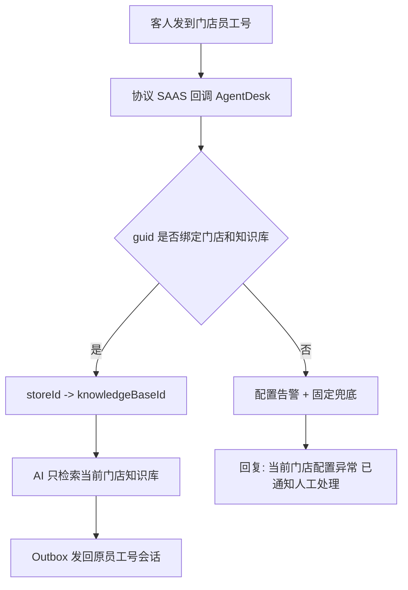
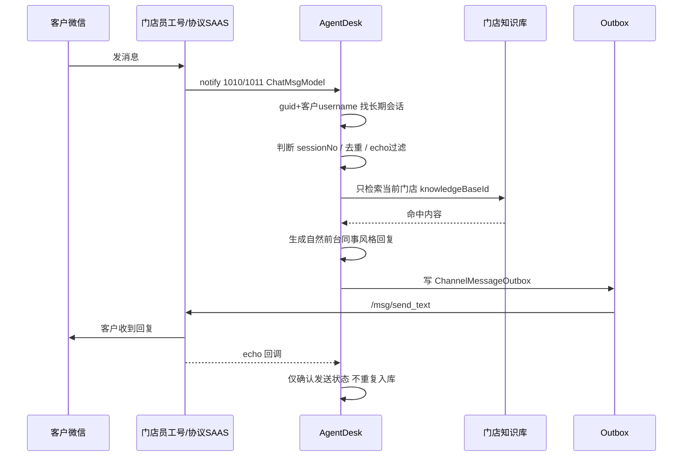
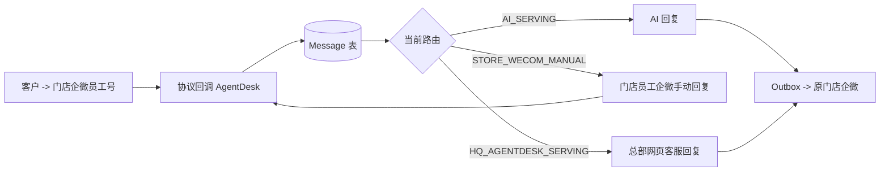

# 企微员工号 + 总部网页客服 + 门店知识库技术架构设计

版本：2026-06-27  
适用系统：AgentDesk 二开版本  
当前入口：企业微信员工号/企微协议 SAAS 接入，后台统一显示为“企微员工号”

## 0. 协议强制前提

企业微信员工号相关开发唯一协议依据是 `https://wework.apifox.cn/llms.txt` 及其链接的具体接口页面。开发任何员工号能力前必须先查看对应页面的字段、类型、必填项和示例，禁止凭记忆或其他协议文档猜字段。

本链路不得与企业微信 CLI、企业微信客服号 / 微信客服 API、个人微信协议、旧 `weixins.apifox.cn` 字段混用。若文档未说明某个能力或字段，系统不能做成“看起来能用”的假功能，必须在 UI 和错误日志里明确说明缺少协议字段或接口。

## 1. 设计目标

本方案的目标是把一百多家门店的企业微信员工号接入 AgentDesk，由 AgentDesk 统一完成消息接收、会话长期绑定、门店知识库检索、AI 回复、门店人工接待、总部网页端兜底接管、消息同步、人工超时恢复、关闭后重开、媒体消息展示和知识进化归档。

当前架构已经废弃七鱼主链路：总部客服统一使用 AgentDesk 网页工作台，不再把客户会话转入七鱼。代码中历史七鱼模型和适配器可暂时保留用于兼容旧数据，但不进入新业务主流程；新开发、新测试、新部署都以“企微员工号 + AgentDesk 网页工作台”为准。

系统里没有总部知识库，也不把公共知识库作为主答链路。每个门店员工号必须绑定唯一门店，每个门店绑定自己的知识库。AI 每次回答只调用当前门店绑定的知识库。

## 2. 核心边界

| 对象 | 职责 | 不做什么 |
| --- | --- | --- |
| 门店企业微信员工号 | 接收客人微信/企微消息，门店员工可在原企微客户端人工回复 | 不接七鱼，不保存总部客服凭证 |
| 企微协议 SAAS | 按 wework.apifox.cn 协议把员工号消息回调给 AgentDesk，按接口代发文本/图片/文件 | 不做业务路由，不判断门店知识库 |
| AgentDesk | 所有消息统一落库、去重、路由、AI、outbox、网页端工作台、同步审计 | 不绕开本地消息表，不把消息分散到外部客服系统 |
| 门店知识库 | 当前门店 FAQ/政策/设施/服务答案 | 不混用总部知识库 |
| 总部网页客服 | 直接在 AgentDesk 三栏工作台查看全部员工号、会话、待人工请求，并可接管回复 | 不需要登录门店企业微信客户端 |

## 3. 门店知识库绑定模型

每个 `WxWorkProtocolInstance` 代表一个企业微信员工号实例，必须绑定：

- `guid`：协议 SAAS 实例 ID。
- `employeeUserId`：当前登录员工号 username，用于判断自己发出的 echo。
- `storeId`：唯一门店。
- `knowledgeBaseId`：该门店唯一知识库。
- `aiAgentId`：可选绑定 AI Agent。
- `aiReplyEnabled`：AI 托管总开关。
- `manualTimeoutMinutes`：人工接待超时分钟，默认 10。
- `fallbackToHQ`：门店未处理时总部网页端可兜底。

正常链路为：



极端情况下实例未绑定门店或知识库，系统不允许 AI 编答案，只写健康告警并回复固定兜底话术。

## 4. 会话长期绑定与轮次

### 4.1 长期身份

单聊长期会话 key：`guid + customerUsername`。  
群聊长期会话 key：`guid + chatroom`，群内发送人记录到消息扩展字段 `chatroom_sender`。

同一客户给不同门店员工号发消息，即使 username 相同，也会因为 `guid` 不同而成为独立长期会话和独立记忆。

### 4.2 会话轮次 Session Window

长期会话不等于一次问题上下文。系统新增 `sessionNo`：

- 新客户第一次来：`sessionNo=1`。
- 会话关闭后客户再次发消息：复用长期会话，但 `sessionNo+1`。
- 人工完成、超时恢复 AI、长时间无消息后再次发言，也可切新轮次。
- AI 默认只读取当前轮次最近消息。
- 跨轮次只允许带稳定事实摘要，例如门店、房号、偏好；不把已解决故障当成当前问题。

例如：客户之前说“马桶堵了”，后来电话已经处理；本次又问“早餐几点”。新轮次里 AI 只回答早餐，不主动提马桶。

## 5. 微信协议 SAAS 接入

协议依据固定为 `https://wework.apifox.cn/llms.txt`，不再依赖企业微信 CLI、微信客服号、旧 `weixins` 字段。

### 5.1 回调解析

- `notify_type=1010/11010`：单条新消息事件。
- `notify_type=1011/11011`：批量新消息事件，拆成多条 `ChatMsgModel`。
- `ChatMsgModel` 字段：`msg_id/from_username/to_username/chatroom_sender/create_time/desc/msg_type/chatroom/source/content`。
- 其他 notify type 仅做实例状态或审计日志，不触发 AI。

### 5.2 方向判断与去重

- 当前实例自己的账号存到 `employeeUserId`。
- 发送人不是当前实例账号：客户消息，写 `Message(customer)`。
- 发送人是当前实例账号：平台 echo，默认只确认 outbox，不创建可见 agent 消息，不触发 AI。
- 幂等 key：`wx_protocol:{guid}:{msg_id}`。
- 空内容、系统消息、撤回消息、未知消息只写审计，不触发 AI。

### 5.3 出站发送

- 文本：`/msg/send_text`，body 为 `{guid,conversation_id,content}`。`conversation_id` 必须按文档带前缀：单聊联系人 `S:<联系人ID>`，群聊 `R:<群ID>`。
- 图片：先通过协议文档里的云存储上传接口拿到图片发送参数，再调用 `/msg/send_image`，body 为 `{guid,conversation_id,file_id,size,image_width,image_height,aes_key,md5,is_hd}`。
- 文件：先通过协议文档里的云存储上传接口拿到文件发送参数，再调用 `/msg/send_file`，body 为 `{guid,conversation_id,file_id,size,file_name,aes_key,md5}`。
- 网页端上传到 AgentDesk 本地资产库只代表“后台可展示”，不等于微信协议可发送；没有 `wxMedia.file_id/aes_key` 时必须明确失败，错误写入 outbox，不允许伪装成文本或误标 sent。
- HTTP 200 但业务错误码不为 0 必须标记 failed，不能误判 sent。
- AI/人工消息入 outbox 后立即触发一次发送，后台定时扫描只做兜底。

## 6. 多媒体消息

| 类型 | 入站处理 | 是否触发 AI | 出站处理 |
| --- | --- | --- | --- |
| 文本 | 写 Message(text) | 是 | `/msg/send_text` |
| 图片 | 注册 asset，聊天区展示图片 | 否 | 需要按 wework 云存储上传得到 `file_id/aes_key/size/md5` 后 `/msg/send_image` |
| 语音 | 下载/保存音频资产，展示播放器；转写成功后可作为文本问题 | 转写成功才可触发 | 本期不做语音出站 |
| 文件 | 保存资产，展示文件卡片 | 否 | 需要按 wework 云存储上传得到 `file_id/aes_key/size/md5/file_name` 后 `/msg/send_file` |
| 视频 | 保存资产，展示播放器或文件卡片 | 否 | 按文件能力发送 |

当前实现先完成媒体入站审计、资产注册和网页展示；语音转文字需要结合协议下载返回和 ASR 配置继续扩展。没有转写时不让 AI 猜测图片/语音内容。
如果客户几乎同时发送图片和文本，系统只用文本触发 AI，并在上下文里知道“收到过图片/文件”，但不能把图片内容当成已识别事实；需要 OCR/人工查看后才能基于图片内容回复。

## 7. AI 回复链路



AI 提示词要求：短句、自然、不说“根据知识库”、不自称 AI；维修、漏水、投诉、安全场景先安抚并表达会帮忙反馈或转人工。

## 8. 转人工与人工生命周期

### 8.1 门店人工优先

客户发送“转人工/人工/客服”等意图后：

1. AgentDesk 写 `Message(customer)`。
2. AI tool 只返回结构化转人工结果，不再额外自然语言发第二条。
3. `ConversationHumanDispatchService` 统一发送一条客户可见提示：“已经帮您通知门店同事了，我会继续关注。”
4. route 进入 `STORE_WECOM_MANUAL`，`needHumanFollowUp=true`。
5. 门店员工可继续在原企业微信客户端回复；总部网页端同时出现右下角弹窗和列表感叹号，可兜底接管。
6. AI 在人工状态下停答。

重复发送“人工”在冷却窗口内不重复创建消息，只提示当前状态。

### 8.2 总部网页端接管

总部客服在 AgentDesk 点击接管后：

- route 进入 `HQ_AGENTDESK_SERVING`。
- 客户后续消息继续进入同一长期会话和当前 session。
- AI 停答。
- 总部网页端回复写 `Message(agent)`，再由原 `wx_protocol` outbox 发回客户所在门店员工号会话。
- 企微 echo 回调只确认发送，不重复展示。

### 8.3 超时恢复 AI

门店人工、总部网页人工均遵循默认 10 分钟超时规则：

- 以最近客户消息时间为准，`manualExpireAt = lastCustomerMessageAt + manualTimeoutMinutes`。
- 到期无新客户消息，系统只发一条提示：“这次我先继续帮您看着，有问题您直接发我就行。”
- route 恢复 `AI_SERVING`。
- 超时后人工迟到回复仍写 Message 和同步日志，但默认不自动转发给客户，后台标记为迟到回复，可由人工确认补发。

### 8.4 主动结束

- 网页端关闭会话：`Conversation.status=CLOSED` 且 `routeStatus=CLOSED`。
- 门店员工或总部客服确认问题已处理后，可在网页端结束人工接待并恢复 AI；系统同时触发候选问答抽取。
- 关闭不是永久封存；同一客户再次发来消息时复用长期会话并开启新 session。

## 9. 总部会话工作台

当前实现为三栏工作台：

1. 左栏员工号列表：显示全部账号和各门店员工号，点击后按 `wxWorkInstanceId` 过滤会话。
2. 中栏客户会话列表：展示未读、门店、员工号、转人工感叹号、人工接待状态。
3. 右侧聊天区：展示文本、图片、语音、视频、文件消息；支持文本回复、图片上传、文件发送。
4. 右侧信息/设置区：展示智能回复设置、当前路由、员工号、门店、AI 托管状态、人工超时、客户资料和标签。
5. 转人工弹窗：右下角显示“新的转人工请求”，点击自动跳到对应员工号和客户会话。

### 9.1 页面信息架构

工作台的核心不是“聊天窗口”，而是总部同时管理很多门店员工号的调度台。因此左侧栏不再只放简单导航，而是做成“账号运营栏”：

- 顶部显示当前账号范围的统计，例如当前会话数、待人工数。
- 支持搜索员工号、门店名、员工姓名、实例 guid。
- 每个员工号卡片展示在线状态、门店、AI 托管开关、总部兜底状态和待处理数量。
- 选择某个员工号后，中栏只展示该员工号下的客户会话，避免一百多家门店混在一起。
- 总部客服需要全局巡检时，可保留“全部账号”入口；门店员工登录时则默认只看到自己绑定的账号和会话。

中栏承担“客户队列”的职责，重点是快速判断优先级：

- 转人工、异常配置、发送失败的会话必须有明显感叹号或红点。
- 会话项展示客户昵称、最近一条消息、所属门店、最近时间、未读数。
- 筛选条件优先包括：全部、待人工、未读、AI 服务中、人工接待中、发送失败。

右侧主区承担“处理问题”的职责：

- 聊天记录完整展示文本、图片、语音、视频、文件和系统状态。
- AI 接待中时仍显示完整输入区和底部工具条，不再用大段遮罩提示挡住输入区；`AI回复` 开关处于开启状态，编辑区和发送按钮不可用，避免 AI 和客服同时回复。
- 客服可直接在输入区点击 `AI回复` 开关关闭当前员工号 AI 托管；关闭后输入区立即解锁，客服可直接回复。
- 关闭 `AI回复` 后客服首次发送消息时，后端会把当前会话从 `AI_SERVING` 自动切到 `HQ_AGENTDESK_SERVING`，并把会话分配给当前客服，后续消息由网页人工接待。
- 进入门店人工或总部网页客服接管后，输入区保持解锁，支持文本、图片、文件发送；语音发送本期不做。
- 左侧账号栏就是企微员工号管理入口：支持搜索账号、选择全部账号或单个员工号、查看在线/AI 状态，并通过“新增账号/管理账号”打开完整员工号实例管理面板。独立“企微员工号”导航入口不再作为日常入口，避免客服在会话页和账号页之间来回跳。
- 账号管理面板复用员工号实例 CRUD：新增、编辑、删除、设置回调、复制回调地址、绑定门店、绑定门店知识库、AI 托管开关、人工超时、服务时间等都在会话页内完成。
- 底部工具条按客服工作台设计：表情、图片、消息素材、群邀请、AI 回复开关和发送按钮。
- 表情：打开常用表情/短语面板，插入当前输入框，按文本消息发送。
- 图片：客服选择图片后创建 `messageType=image` 消息，进入协议 outbox；如果缺少协议上传凭证，outbox 明确失败并提示“缺少微信协议 SAAS 上传凭证”，不能当作 HTML 文本发送。
- 消息素材：读取后台快捷回复/素材列表，点击后插入输入框。
- 群邀请：协议文档支持 `POST /room/invite_room_member`，body 为 `{guid,room_id,user_list}`；只能用于群聊会话，必须能拿到当前群 `room_id` 和待邀请成员 ID 列表。私聊会话点击时明确提示“当前不是群聊会话”，不做假功能。
- `AI回复` 开关直接更新当前会话所属员工号实例的 `aiReplyEnabled`，不是只改前端展示。开启时 AI 接管，网页人工输入禁用；关闭后网页客服可直接输入并发送，后端会把会话切到网页人工接待状态。
- 发送按钮：文本/图片/文件都必须走后端 `send_message`，由 AgentDesk 落库后再通过原员工号协议 outbox 发回客户。
- 客服点击“接管”后，AI 停答；客服回复通过原员工号发回客户。
- 智能设置抽屉显示当前员工号的 AI 托管配置、门店知识库、人工超时、服务时间、总部兜底策略。

这样的布局能让总部客服先选账号，再选客户，再处理消息，符合“一百多家门店、多员工号、多客户会话”的实际操作顺序。

## 10. 企业微信与总部网页端消息同步

所有消息必须先落 AgentDesk，再由 AgentDesk 同步到另一端。



总部网页端不直接持有企微发送凭证，所有回复都写入 AgentDesk 消息表，再由原门店员工号 outbox 发回客户。这样能保证上下文完整、会话可审计、企微客户端和总部工作台都能同步。

## 11. 高频问题与知识进化

知识进化不直接写正式知识库，先进入“待归档问答”。来源包括：

- AI 未命中知识库后转人工。
- 总部网页客服解决的问题。
- 门店企微人工解决的问题。
- 多次出现相似问法。

候选字段：`storeId/knowledgeBaseId/conversationId/messageIds/source/question/answer/summary/evidenceText/frequency/similarityKey/status/confidence/reviewUserId/exportedAt/importedAt`。

后台页面支持筛选、查看原会话、编辑问答、合并相似问题、通过、驳回、导出、标记已导入。每周按门店导出：

- `knowledge-candidates/{storeCode}/YYYY-WW.md`
- `knowledge-candidates/{storeCode}/YYYY-WW.jsonl`

人工审核后再升级该门店知识库，避免错误回复污染知识库。

## 12. 当前代码实现对应

| 能力 | 当前实现 |
| --- | --- |
| 微信协议回调 | `internal/services/wxwork_protocol_service.go` 按 1010/1011/11010/11011 解析 `ChatMsgModel` |
| 长期会话绑定 | `guid + customer username/chatroom` 映射到 `WxWorkKFConversation` |
| Echo 去重 | `wx_protocol:{guid}:{msg_id}`，自己账号消息仅确认，不触发 AI |
| Session 隔离 | `ConversationRouteState.sessionNo` + `Message.sessionNo`，AI history 只读当前 session |
| 关闭重开 | 关闭写 `routeStatus=CLOSED`，客户再来新消息时恢复 AI 并新开 session |
| 门店人工优先 | AI 转人工进入 `STORE_WECOM_MANUAL`，网页端弹窗和感叹号提示 |
| 总部网页接管 | 现有分配/接管逻辑进入 `HQ_AGENTDESK_SERVING`，网页回复走原 outbox |
| 多媒体展示 | image/voice/video/attachment 入库和前端展示，文本才触发 AI |
| 员工号设置 | 实例表包含 notifyUrl/proxy/bridgeId/aiAgentId/staffUserIds/serviceHours/fallbackToHQ/manualTimeoutMinutes/aiReplyEnabled/autoAcceptFriendRequest/contextMaxMessages/contextMaxTokens/contextCompressionEnabled |
| 三栏工作台 | 会话页新增员工号列表、会话列表、聊天区/设置区和转人工弹窗 |

## 13. 2026-06-27 实施修订

### 13.1 产品入口收敛

系统新业务主链路只保留 `wxwork_protocol`。企业微信 CLI 和企业微信客服号执行产品级移除：

- 新建渠道表单不再提供 CLI 和企业微信客服号选项。
- 会话工作台、员工号账号管理、消息 outbox 新链路只使用 `wxwork_protocol`。
- 历史 CLI/KF 模型、表和兼容代码暂不物理删除，避免旧数据或迁移启动失败。
- 后续开发禁止把 CLI/KF 重新接入新 UI、新配置和新消息主链路。

客服分配体系必须保留。`已分配客服 / 客服组 / 转接 / 接管 / 待接入队列` 是人工协作体系，和 `aiReplyEnabled` 是两条状态线：

- `aiReplyEnabled=true` 时，AI 托管当前员工号实例，网页输入区可见但禁用。
- `aiReplyEnabled=false` 时，网页客服可以直接回复；首次发送会把当前会话从 AI 接待切到网页人工接待，并按现有分配权限校验。
- 已分配给其他客服的会话仍必须走接管/转接流程，不能因为关闭 AI 就绕过权限。

### 13.2 账号新增和真实协议动作

会话页左侧的“新增账号/账号设置”合并原企微员工号页面能力。新增账号必须是扫码优先流程，不能要求运营先手填 GUID：

1. 客服在会话页左侧点击“新增账号”。
2. AgentDesk 后端创建一条待登录的 `WxWorkProtocolInstance`，生成本地唯一 `guid`，默认 `aiReplyEnabled=true`、`healthStatus=login_qrcode`，代理字段为空。
3. 后端立即调用协议 `/login/get_login_qrcode`，把真实二维码返回给前端弹窗展示。
4. 前端按 3 秒间隔调用 `/login/check_login_qrcode` 轮询扫码结果。
5. 登录成功后调用 `/user/get_profile` 同步员工号资料。
6. 运营再进入“账号设置”绑定门店、知识库、客服组、AI 托管和自动通过好友申请策略。

账号动作全部通过后端 service 调用 `wework.apifox.cn` 文档里的接口：

| UI 动作 | 协议接口 | 关键 body |
| --- | --- | --- |
| 获取登录二维码 | `/login/get_login_qrcode` | `{guid,verify_login:false}` |
| 检查二维码 | `/login/check_login_qrcode` | `{guid}` |
| 登录验证码 | `/login/verify_login_qrcode` | `{guid,code}` |
| 同步账号资料 | `/user/get_profile` | `{guid}` |
| 获取企业信息 | `/user/get_corp_info` | `{guid}` |
| 设置回调 | `/client/set_notify_url` | `{guid,notify_url}` |
| 设置代理 | `/client/set_proxy` | `{guid,proxy}`，默认空，不自动使用本机 7892 |
| 恢复实例 | `/client/restore_client` | `{guid,proxy:'',bridge:'',sync_history_msg:true,force_online:false,auto_start:true}` |
| 停止实例 | `/client/stop_client` | `{guid}` |
| 退出登录 | `/user/logout` | `{guid}` |
| 同步好友申请 | `/contact/sync_apply_list` | `{guid,seq:'',limit:50}` |
| 同意联系人申请 | `/contact/agree_contact` | `{guid,user_id,corp_id}` |

自动通过好友申请由 `autoAcceptFriendRequest` 控制。关闭时只展示/审计申请，不自动同意；开启时才调用 `/contact/agree_contact`。`autoAcceptFriendRemarkTemplate` 先作为业务备注策略保存，具体备注/标签动作必须等协议文档提供对应字段后再实现，不能自行猜字段。

### 13.2.1 存储设置和 OSS/WECDN 配置

系统新增“存储设置”页面，作为运行时文件存储和企微富媒体公网链路的唯一配置入口。配置保存到 `t_system_config.config_key = storage.asset`，不写入代码仓库。当前测试环境默认参数为：

| 配置项 | 当前测试值 | 说明 |
| --- | --- | --- |
| 默认存储类型 | `oss` | 富媒体上传默认进 OSS |
| OSS Endpoint | `oss-cn-beijing.aliyuncs.com` | 阿里云华北 2 北京 |
| OSS Bucket | `skychucun` | 测试桶 |
| OSS 目录前缀 | `desk` | 所有 AgentDesk 文件写入该目录 |
| OSS Base URL | `https://skychucun.oss-cn-beijing.aliyuncs.com` | 公网读取地址；如果后续使用 CNAME，可改为 CNAME 域名 |
| AgentDesk 公网地址 | `http://112.124.109.106:2332` | 协议云存储从这里拉取本地资产，例如 `/api/asset/file/{assetId}` |
| wecdn_web 地址 | `http://112.124.109.106:34789` | 调 `/cloud/c2c_upload` 前必须配置，否则富媒体 outbox 失败 |

AccessKey ID 和 AccessKey Secret 只能保存在运行时配置中，文档和 Git 仓库不得记录明文。后台返回设置时只返回 `ossAccessKeySecretSet=true/false`，不回显 Secret。更新时 Secret 留空或填 `********` 表示沿用原值。

资产读写规则：

- 网页端上传文件时，`AssetService` 使用运行时存储设置，不再只读静态 `config.yaml`。
- OSS 存储 key 会自动拼接全局目录前缀，例如 `desk/conversation/...`。
- `/api/asset/file/{assetId}` 用于让 wecdn_web 或外部协议服务拉取 AgentDesk 资产；本地资产走流式输出，外部 URL 资产走重定向。
- 协议发送时优先读取“存储设置”的全局 `wecdnBaseUrl/publicAssetBaseUrl`；只有全局为空时才兜底使用协议渠道 JSON 里的历史值。这样可以避免旧渠道残留地址覆盖后台新配置。

WECDN 部署规则：

- 当前测试包来自 `/Users/openclaw/Downloads/wecdn_dist_v2.8.3.zip`，服务器解压运行目录为 `/home/wecdn_dist_v2.8.3`。
- `wecdn_service` 监听 `127.0.0.1:50056`，`wecdn_web` 监听公网 `112.124.109.106:34789`。
- `wecdn_service_config.ini` 中 `cloud_storage=aliyun`，OSS endpoint/bucket/access key 只写入服务器运行配置，不写入 Git。
- `wecdn_web` swagger 可用于连通性检查：`http://112.124.109.106:34789/swagger/index.html`。

### 13.3 多媒体和富媒体边界

入站消息必须全部写 `MessageSyncLog`。文本直接入库并可触发 AI；图片、语音、视频、文件、位置等先入库展示，不在未完成理解前让 AI 编造。后续图片 OCR/视觉理解、语音转文字、文件解析完成后，可以把可信 `mediaText/mediaSummary` 写入 payload，再按文本问题触发 AI。

出站按协议分派：

- 文本：`/msg/send_text`。
- 图片：`/msg/send_image`，必须有 `file_id/size/image_width/image_height/aes_key/md5/is_hd`。
- 语音：`/msg/send_voice`，必须有 `file_id/size/voice_time/aes_key/md5`。
- 文件：`/msg/send_file`，必须有 `file_id/size/file_name/aes_key/md5`。
- 视频：`/msg/send_video`，必须有 `file_id/size/file_name/aes_key/md5/video_duration/video_width/video_height`。
- GIF：`/msg/send_gif`，必须有 `file_id/size/aes_key/md5/url/image_width/image_height`。
- 位置、名片、链接、小程序、视频号、直播、引用、合并转发、微信小店商品按 payload JSON 透传文档字段，并由后端补 `guid/conversation_id`。

如果 payload 缺协议侧必要字段，outbox 必须标记 failed 并记录真实错误，不能把消息误标 sent，也不能降级成普通文本冒充发送成功。

网页端发送图片、语音、文件、视频、GIF 等本地资产时，完整链路为：

```mermaid
flowchart TD
  A[网页客服选择文件] --> B[AgentDesk 创建 Asset]
  B --> C[上传到 OSS: desk/...]
  C --> D[生成公网资产 URL /api/asset/file/{assetId}]
  D --> E[调用 wecdn_web /cloud/c2c_upload]
  E --> F[获得 file_id/aes_key/md5/size 等协议媒体字段]
  F --> G[调用 /msg/send_image 或 send_file 等真实发送接口]
  G --> H[平台 echo 回调只确认发送状态 不创建重复消息]
```

真实发送测试前置条件：员工号必须扫码登录成功，当前会话必须有可发送目标，OSS AccessKey 已在“存储设置”中保存，`publicAssetBaseUrl` 必须能被协议服务公网访问，`wecdnBaseUrl` 必须指向可用的私有化云存储服务。缺任一条件时，不允许 mock 成功，只能让 outbox 标记 failed 并写明原因。

2026-06-27 真实测试结论：

- 客户发图片已真实入站，`Message(id=193)` 保存为 image 消息，payload 带协议侧 `file_id/aes_key/md5/size/image_width/image_height`，本地 asset 可展示。
- 网页端/AI 出站图片已真实跑通，`Message(id=199/200)` 经 OSS `desk/...`、公网 `/api/asset/file/{assetId}`、WECDN `/cloud/c2c_upload` 后取得 `file_id/aes_key/md5`，最终 `/msg/send_image` outbox 为 `sent`。
- 网页端/AI 出站文件已真实跑通，`Message(id=201)` 经同一链路换取 `file_id/aes_key/md5/file_size` 后调用 `/msg/send_file`，outbox 为 `sent`。
- 曾出现 `broken data stream when reading image file` 的失败样本来自 70 字节损坏 PNG 测试素材；正常 PNG 可发送。后续测试必须使用能被图片解码器校验通过的真实文件。
- 2026-06-27 第二轮补测后，普通富媒体 outbox 白名单已扩展到 `voice/gif/location/link/feed_live/merged_forward/quote/shop_product` 等类型。此前这些消息能入库但不进 outbox，是“看起来有按钮但实际不发送”的根因。
- 已真实发送成功：位置 `Message(id=208)`、链接 `id=209`、视频号直播 `id=210`、合并转发 `id=211`、语音 `id=212`、GIF `id=213`、普通视频 `id=214`，对应 outbox `97-103` 均为 `sent`。
- 操作型接口已真实成功：`/msg/report_unread` 标记会话已读、`/msg/apply_voice_id` 获取语音翻译 ID、`/msg/confirm_msg` 确认企微内部消息已读、`/msg/send_quote_msg` 发送引用消息。
- 操作型接口真实失败但原因明确：`/msg/send_room_at` 需要真实群聊 `R:` 会话；`/msg/query_voice_text` 需要真实语音消息的 `msgid + voiceid` 组合；`/msg/revoke_msg` 需要可撤回窗口内且匹配的协议 `msgid`；`/msg/send_finder_product` 需要真实微信小店 `shop_id/product` 数据，假数据会返回缺 `shop_id`。
- 大视频不是普通 `/cloud/c2c_upload`，协议文档要求先走 `/cloud/cdn_big_upload` 上传视频，再走 `/cloud/upload_video_preview` 上传预览图，最后调用 `/msg/send_big_video`。这条 big cdn 闭环尚未实现，不能宣称支持大视频生产发送。

富媒体理解边界：

- 当前已完成的是“真实收发、资产保存、后台展示、协议字段回填、outbox 状态确认”。
- 图片理解需要把视觉模型（例如测试配置里的 `qwen3-vl-plus`）接入 `MediaUnderstandingWorker`：下载 asset -> 调视觉模型生成 `mediaText/mediaSummary` -> 写回 message payload -> 再允许 AI 基于图片内容回答。
- 语音理解优先使用协议 `/msg/apply_voice_id` 和 `/msg/query_voice_text`；如果协议转写失败，再走独立 ASR 模型。没有转写结果时，AI 只能知道“收到语音”，不能猜语音内容。
- 文件理解需要文档解析链路：PDF/Word/TXT/Excel 分别抽文本或表格摘要，再写入 `mediaText/mediaSummary`；二进制压缩包、未知格式只展示和审计，不触发 AI 内容判断。
- 视频/GIF 默认只展示和审计；如果要 AI 理解视频，需要额外做抽帧、封面识别或视频理解模型，不应把文件名当作视频内容。

### 13.4 上下文压缩策略

原始企微消息、媒体、人工回复永久保存，不删除、不覆盖。AI 只使用“当前 session 最近消息 + 稳定事实摘要”：

- 默认 `contextMaxMessages=30`。
- 默认 `contextMaxTokens=8000`。
- 默认 `contextCompressionEnabled=true`。
- 超过阈值后生成摘要，摘要只保留稳定事实、未解决事项、用户偏好、当前门店信息。
- 已关闭/已解决的旧故障不带入新 session，避免旧维修问题污染新问题。

### 13.5 GitHub 绑定原则

当前目录若还不是 Git 仓库，绑定 `520skyincloud/agentdesk` 时必须先 `git init`、添加远端、`git fetch origin` 查看远端默认分支。远端非空时新建本地工作分支并合并远端历史，必要时使用 `--allow-unrelated-histories` 手动解决冲突。用户未特别说明“分支/PR”时，后续默认把确认完成的代码合并/推送到主分支；如果用户明确要求分支，则推工作分支或开 PR。

## 14. 测试清单

1. A 门店员工号客户发“早餐几点”，只调用 A 门店知识库。
2. B 门店同问题调用 B 门店知识库，答案可以不同。
3. 未绑定知识库的员工号不调用 AI，只回复配置异常并告警。
4. 同一客户第二次发消息复用同一长期会话。
5. 同一客户联系不同 `guid` 创建独立长期会话。
6. 自己发出的 echo 不创建重复消息、不触发 AI。
7. 连续发送“转人工”只出现一条客户提示。
8. 营业时间进入门店人工状态，总部网页端出现弹窗和感叹号。
9. 总部接管后 AI 停答，总部回复回到原门店员工号会话。
10. 10 分钟无客户新消息后恢复 AI。
11. 已关闭会话再次来消息，新开 session，旧维修问题不污染新问题。
12. 客户发图片/语音/视频/文件，后台展示并审计；未转写语音不触发 AI。
13. 客服网页端发送图片/文件/语音/GIF/普通视频/位置/链接/视频号直播/合并转发/引用消息，协议 body 符合文档；业务错误码不误标 sent。
14. 群@必须使用真实 `R:` 群聊会话测试，不能用单聊会话冒充。
15. 大视频必须补齐 big cdn 上传和预览图上传后再测试 `/msg/send_big_video`。
16. 微信小店商品必须使用真实小店商品数据测试，假 `content` 不允许标记为成功。
17. 图片、语音、文件只有在 `mediaText/mediaSummary` 写回后才可触发 AI 基于内容回答；未理解前 AI 不能编造多媒体内容。
18. 知识候选按门店导出 Markdown/JSONL，人工审核后再导入门店知识库。
