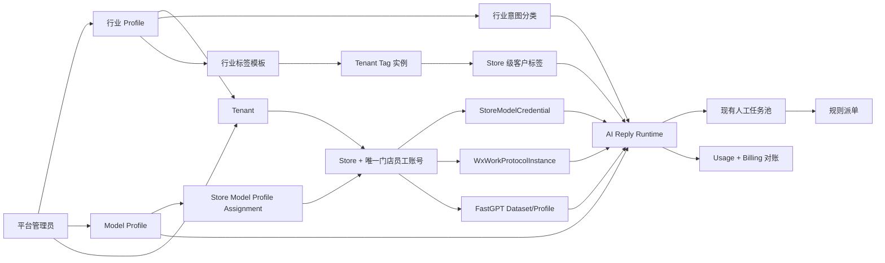

# Tenant AI 统一集成最终权威方案

> 状态：2026-07-27 产品与代码合并范围已闭合。统一项目只支持由当前代码在空 SQLite/MySQL 上创建的全新数据库；历史租户、门店、会话、真实 Key 和来源 Store ID 不再是代码合并输入，也不再提供旧库原地升级或 B14 清表路径。旧代码与隔离 `18084` 数据已在仓库外完成可校验备份，旧 AIConfig、Grant、StoreSetting、ConversationTag 和本地知识兼容代码已从当前树删除。代码合并可以依靠 fresh 双数据库、自动化测试、构建和隔离页面验收完成；正式 `8083` 发布仍需在目标主机提供自己的安全环境变量、HTTPS FastGPT、门店 NewAPI Key，并完成真实渠道验收。
>
> 唯一实施分支：`codex/tenant-ai-unified-integration`
>
> 分支基线：`origin/codex/tenant-ai-integration@1e8e95c91307d01a556c83ed43ea500e553e4563`
>
> 当前 AI 来源审计：`origin/codex/ai-billing@4db799363040a4478a5585e101d119de11a26f8e`
>
> 最终 AI 来源：已固定 `origin/codex/ai-billing@4db799363040a4478a5585e101d119de11a26f8e`；每个 Batch 开始和提交前重新 fetch，若来源前移则先审计差异
>
> 服务发布端口：`8083`
>
> 数据原则：仓库和初始数据库不预置任何真实 Tenant/Store；部署后由平台通过现有产品流程创建

本文是 Tenant、行业、模型、门店凭据、FastGPT、AI 回复运行时、客户标签、计费、权限、
页面、Migration、派单保护和发布边界的唯一权威方案。正文描述当前实现契约；第 25 节
保留实施审计，其中旧时点结论由最新编号章节覆盖。

## 1. 权威、分支与替代关系

### 1.1 唯一集成入口

1. `codex/tenant-ai-unified-integration` 是唯一继续实施和形成最终 PR 的分支。
2. 新分支以 `codex/tenant-ai-integration` 最新远端为骨架，保留其 Tenant、账号、权限、Store、企微身份、客服组织、规则派单、运营分析和人工质检。
3. `codex/ai-billing` 是行业、模型、门店凭据、Billing、FastGPT、客户标签和完整 AI 回复运行时的行为来源；实施前必须重新获取最新提交并固定 SHA。
4. `codex/tenant-ai-integration`、`codex/ai-billing` 和 `codex/customer-audit` 在新分支建立后全部视为只读来源，不再分别向 `main` 合并。
5. 原 PR #2 只保留历史审计价值，停止作为最终交付入口。最终只建立一个 `codex/tenant-ai-unified-integration -> main` PR。
6. 禁止整分支 merge、整文件选 ours/theirs 或直接 cherry-pick 混合领域提交。所有能力按本文定义的最终语义逐符号移植。

### 1.2 文档权威

本文替代以下旧结论：

- `docs/development/tenant-ai-integration-merge-handoff.md` 中关于“唯一分支为 tenant-ai-integration”“只允许 PR #2”“保留 AIConfig/TenantAIModelGrant”“不物理删除旧表”的目标结论；
- 旧的 `tenant-ai-billing-integration-plan.md`；
- 下载文件 `tenant-ai-unified-integration-design.md` 中与本文的 Tenant 行业绑定、行业标签隔离、分支基线和用户最终答复冲突的部分。

历史文档可以用于追溯已经完成的租户、派单和运营能力，不能作为最终模型、行业、标签或回复运行时依据。

实施后，AI 回复引擎的代码与 `docs/design/reply-runtime-engine.md` 必须同步更新为从 `ai-billing` 最新版本移植并完成 Tenant 适配后的真实链路。在该批代码合入前，本文只定义目标，不把尚未实现的行为写成已完成。

### 1.3 明确偏离旧开发约束

本方案包含两项由用户明确确认的偏离：

1. 不再只在 `codex/tenant-ai-integration` 开发，而是建立第三个唯一集成分支。
2. 最终版本不支持旧业务数据库原地升级。旧 `AIConfig`、`TenantAIModelGrant`、`StoreAIModelSetting`、`ConversationTag` 和本地知识表不进入当前 models、migration 或 fresh Schema；历史库只做仓库外备份归档。

其余分层、权限、Tenant 隔离、SQLite/MySQL 兼容、显式路由、DTO、前端 API 封装和测试要求继续遵守 `AGENTS.md`。

## 2. 已锁定的产品决定

| 领域 | 最终决定 |
| --- | --- |
| 租户主体 | 使用 tenant-ai-integration 的 Tenant 架构，Tenant 是唯一隔离根 |
| 门店主体 | Tenant 下直接管理 Store；一个 Store 只绑定一个系统门店员工 User |
| 企微身份 | WxWorkProtocolInstance 是 Store 的渠道身份，不是系统门店员工账号 |
| 行业 | Tenant 必须绑定一个行业 Profile；Store 和企微实例只能继承，不能覆盖 |
| 意图识别 | 行业 Profile 决定 IntentDetect Prompt、JSON Schema 和意图分类集合 |
| 模型事实源 | 使用 ModelProfileTemplate/ModelProfileSlot，删除旧 AIConfig 运行体系 |
| 模型 Profile | 当前默认一套全局 Profile；架构允许平台建立多套并直接指定给 Store |
| 模型用途 | 九个用途槽全部强制配置，不允许缺槽 fallback |
| 网关 | 只支持一个统一 NewAPI 网关，Provider/BaseURL/APIMode 由平台 Profile 决定 |
| 模型授权 | 不保留 TenantAIModelGrant、租户授权池或租户默认模型 |
| 模型指派 | Store 直接绑定一个已发布 Model Profile；没有租户或企微多层覆盖 |
| 凭据 | 每个 Tenant + Store 一条 StoreModelCredential；默认无 API Key |
| 凭据录入 | 平台管理员、公司主管可录入；管理员可按 Store 开关门店员工自助录入 |
| 凭据安全 | 密文保存、候选测试、二次确认、可选主管审批、不可变审计，永不回显明文 |
| 计费身份 | 每个 Store 的 NewAPI API Key 是独立官方额度和账单身份 |
| 计费范围 | 只做 NewAPI 查询、本地归因和对账，不做充值、扣费、套餐、发票或额度拦截 |
| FastGPT | 完整采用 ai-billing 的 Dataset/Profile/RAG 行为，补 Tenant/Store 强隔离 |
| AI 回复 | Prompt、Schema、状态机、Intent、Plan、RAG、Generate、Validate、Commit、Resume 和 Trace 以 ai-billing 最新版本为准 |
| AI 转人工 | AI 只决定是否需要人工及客户文案，任务入池和选人仍使用现有规则派单 |
| 客户标签 | 关系绑定 StoreCustomerRelation；同一自然客户在不同 Store 拥有独立标签 |
| 标签目录 | 标签按行业固定定义，并实例化到各 Tenant；租户不能自建或改变语义 |
| 标签控制 | 租户只能启停标签和设置显示别名；行业模板决定 AI、回复、场景和互斥规则 |
| 标签上限 | 每个 StoreCustomerRelation 最多 6 个有效标签 |
| 会话标签 | 删除 ConversationTag 产品与数据；复用 `conversation.tag` 权限码管理客户标签 |
| 派单 | 只保留 manual/rule，完整保留现有确定性公平派单和恢复机制 |
| Migration | AutoMigrate 创建当前 Schema；DML runner 只保留 2/15/35/68/69 五个 fresh 初始化器，并对当前 `t_migration` 指纹失败关闭 |
| 数据库 | SQLite 和 MySQL 均从空库创建同一套最终 Schema；不接收旧业务库作为启动目标 |
| 旧表 | 旧模型、会话标签和本地知识表从代码与 fresh Schema 中彻底消失，不提供兼容或清理运行链 |
| 灰度 | 新环境由平台新建测试 Tenant/Store；客户标签演化和回复标签上下文默认关闭，支持批量启停 |

## 3. 最终总体架构



一条生产消息的最终路径：

```text
企微客户消息
  -> 从 Conversation/RouteState 解析 Tenant + Store + WxWork + Customer
  -> 读取 Tenant 行业 Profile
  -> 读取 Store 已发布 Model Profile Assignment
  -> 解密 Store 当前 active Credential
  -> 使用行业 Prompt/Schema/IntentConfig 执行 IntentDetect
  -> ReplyPlan
  -> FastGPT 检索、Rerank 和 Answerability
  -> 工具、资源、人工路由决策
  -> 按行业和 Store 读取已提交客户标签短上下文
  -> Generate
  -> Validate
  -> Commit + Outbox + Usage + 运营事实
  -> 需要人工时进入现有任务池和规则派单
```

任何范围、行业、Profile、必需槽或 Credential 校验失败都不得回退到旧 AIConfig、其他 Tenant、其他 Store、平台默认密钥或未指派模型。

## 4. Tenant、Store 与账号边界

### 4.1 Tenant

- Tenant 是平台售卖客服系统的客户公司，也是所有业务数据的第一隔离键。
- Tenant 必须有一个有效 `IntentProfileID` 才能启用任何 Store 的 AI 回复。
- 行业由平台管理员在接入公司时绑定；公司主管只读查看行业名称，不能修改平台 Prompt、Schema 或分类。
- Tenant 的账号、角色、权限、客服组、客户、Store、知识库、会话、账单聚合和标签策略均按 TenantID 隔离。

### 4.2 Store 与唯一系统门店员工账号

- 一个启用 Store 必须对应且只对应一个 `store_staff` User 和一个活动 StoreStaffBinding。
- 这里的“门店员工账号”是本系统登录账号，不是企业微信员工号。
- Store 只在公司主管邀请注册或用户注册审核完成后建立绑定，不存在无系统账号的活动 Store。
- Store 与系统 User 的一对一关系由数据库唯一约束和 Service 事务共同保证。
- WxWorkProtocolInstance 只能绑定该 Store，数量和协议能力按企微文档管理，但不改变系统 Store 账号的一对一规则。

### 4.3 Store 生命周期与 API Key

- Store 停用、转移或删除不会调用 NewAPI 修改、吊销或旋转上游 API Key。
- Store 无效时本系统停止用该 Store 触发模型调用，但不擅自处理用户在另一套系统中的 Key 生命周期。
- 本地 Credential 始终加密保存；Store 恢复后是否继续使用原 Credential 由有权限操作者显式确认。
- 任何 Store 归属变化都必须重新校验 TenantID，禁止凭旧 StoreID 跨租户继续调用。

## 5. 行业、意图分类与知识链

### 5.1 复用现有行业能力

现有 `ReplyIntentProfile` 已经表达行业级 IntentDetect 配置，不新增平行 `Industry` 主表。最终产品将其正式命名为“行业 Profile”，保留代码模型名以减少无意义迁移。

`ReplyIntentProfile` 至少包含：

- `Code`：稳定 Profile 编码；
- `IndustryCode`：业务行业编码；
- `Name/Description`：平台展示信息；
- `IntentDetectPrompt`：该行业 IntentDetect 系统规则；
- `IntentJSONSchema`：该行业严格输出 Schema；
- `Revision/Status/SortNo`：发布版本和状态；
- 审计字段。

酒店行业是首个 Profile。未来零售、教育等行业必须分别提供完整 Prompt、Schema、分类、标签模板和验收数据，不能继承酒店硬编码后改名称。

### 5.2 Tenant 唯一绑定

- `Tenant.IntentProfileID` 是运行时唯一行业绑定。
- 当前模型、repository、service、接口和 fresh Schema 均不存在 Company；行业绑定只能来自 Tenant。
- `WxWorkProtocolInstance.IntentProfileID`、`KnowledgeBase.IntentProfileID` 和其他下级覆盖退出运行时并从最终 Schema 删除。
- Store、企微、知识库和会话只能继承所属 Tenant 的行业。
- Tenant 未绑定行业、Profile 被停用、Schema 无效或分类不完整时，相关 Store 不得打开 AI 回复。

### 5.3 行业意图分类

`ReplyIntentConfig` 只属于一个 `ReplyIntentProfile`，最终唯一键为：

```text
IntentProfileID + Code
```

删除其 Company、Store、WxWorkInstance 作用域和 fallback。每个行业 Profile 拥有自己的：

- 顶层意图类别；
- 子意图；
- 正反例；
- 必需上下文；
- knowledge/resource/tool/human 标志；
- PromptPack、ReplyPlanTemplate 和 ValidationRules；
- 明确优先级和启停状态。

IntentDetect 输出只能使用当前行业 Schema 和启用分类。未知或低置信输出按 ai-billing 最新 Runtime 的标准化规则处理，不得用酒店类别兜底其他行业。

### 5.4 行业与知识库

- 知识库仍按 Tenant + Store 隔离，不再单独绑定行业 ID。
- Runtime 通过 Tenant 行业决定意图分类，再在当前 Store 的 KnowledgeBase 中检索。
- 行业 Profile revision、知识 Profile revision 和 Store readiness 必须同时就绪才能打开 AI。
- 行业切换会使旧知识分类、标签和评测失效。平台只允许在 Tenant AI 全部关闭后执行行业重置：清理旧行业标签关系、实例化新行业目录、重新同步 FastGPT、重新评测后再启用。

### 5.5 行业管理权限与页面

- 平台 `super_admin` 和拥有 `aiConfig.update` 的普通 `admin` 可以创建、编辑、测试、发布行业 Profile 和分类。
- Tenant 角色只可查看当前行业名称，不可读取 Prompt、Schema、内部规则或其他行业。
- “接入公司”创建 Tenant 时行业为必填；修改行业需要危险操作确认和不可变审计。
- 平台导航保留“意图行业”和“意图分类”，但明确属于平台配置，不出现在普通租户导航。

## 6. Model Profile 与 Store 模型指派

### 6.1 唯一模型事实源

最终模型配置固定为：

```text
ModelProfileTemplate
  -> 9 个必需 ModelProfileSlot
  -> StoreModelProfileAssignment
  -> StoreModelCredential
  -> 动态 ModelCallConfig
```

旧 `AIConfig`、`TenantAIModelGrant`、租户用途默认模型、企微覆盖和 StoreAIModelSetting 不再参与任何生产调用。

### 6.2 九个必需用途槽

每个可发布 Profile 必须完整配置：

1. `reply_llm`
2. `intent_detect_llm`
3. `memory_summary_llm`
4. `customer_tag_llm`
5. `vision`
6. `asr`
7. `embedding`
8. `rerank`
9. `document_parser`

每个 Slot 固定 Provider、BaseURL、APIMode、ModelType、ModelName、Dimension、超时、重试、Token 上限和必要的 Prompt/Schema 引用。只支持一个统一 NewAPI 网关，不允许 Store 自定义 BaseURL 或 Provider。

缺少、停用、类型不符或测试失败的 Slot 会阻止 Profile 发布，不在运行时临时 fallback。

### 6.3 一套默认与多 Profile 扩展

- 首版迁移建立一套平台默认 Profile，并直接指派给全部通过 readiness 的测试 Store。
- 平台可以创建多套 Profile，用于未来不同 Tenant 或 Store 使用不同模型组合。
- 不建立租户授权池。Profile 由平台直接指派给 Store，可提供批量指派工具。
- 一个 Store 同时只有一个 active Assignment；Tenant 和企微实例没有第二层覆盖。
- Tenant 和门店员工只看到已指派的模型名称、revision 和就绪状态，不看到 Provider 密钥、BaseURL、Prompt、Schema 或其他 Profile。

### 6.4 Profile 发布

Profile 使用 draft/candidate/active revision：

```text
编辑 draft
  -> 严格校验 9 个 Slot
  -> 使用隔离测试 Credential 执行真实测试
  -> 生成影响 Store 清单
  -> 二次确认发布 candidate
  -> Store readiness 验证
  -> 激活 revision
```

旧 active revision 在新版本就绪前继续运行。平台可回滚到上一已发布 revision，但不能恢复旧 AIConfig resolver。

### 6.5 唯一 Resolver

所有 Chat、Responses、Embedding、Rerank、Vision、ASR 和 Document Parser 调用统一执行：

```text
RuntimeScope.StoreID
  -> active StoreModelProfileAssignment
  -> required usage Slot
  -> active StoreModelCredential
  -> ModelCallConfig
```

不存在 employee override、tenant default、tenant fallback、platform default 或 AIConfigID fallback。

## 7. StoreModelCredential

### 7.1 归属与默认状态

- 唯一键：`TenantID + StoreID`。
- 新 Store 默认 `unconfigured`，不自动创建或申请上游 API Key。
- 平台只是录入用户已有的 NewAPI API Key，不承担 NewAPI 账户或 Key 创建。
- 公司主管可以查看和维护本 Tenant 全部门店 Credential。
- 门店员工是否能维护自己 Store 的 Credential，由 `AllowCredentialSelfService` 开关决定。
- 平台管理员和公司主管可以按 Store 单独开关，也可以批量设置。

### 7.2 更新与审批

平台管理员或公司主管更新：

```text
重新输入当前密码
  -> 显式二次确认
  -> 写 candidate
  -> 测试 9 个 Slot
  -> 同步并测试 FastGPT Profile
  -> CAS 激活
```

门店员工自助更新：

```text
管理员已允许自助
  -> 重新输入当前密码
  -> 显式二次确认
  -> 按 Store 策略直接测试或进入公司主管审批
  -> 测试与同步通过
  -> CAS 激活
```

`RequireSupervisorApproval` 可由 Tenant 管理员开启。无论是否审批，至少必须完成密码复核和二次确认。

### 7.3 加密和不可变审计

- 使用 AES-256-GCM；master key 仅来自部署 Secret/KMS。
- AAD 包含 `tenant:<tenantID>:store:<storeID>:revision:<revision>`。
- active/candidate 使用递增 revision、fingerprint、CipherVersion 和 MasterKeyID。
- API、日志、Trace、错误、WebSocket 和前端永不返回明文、密文、nonce 或完整 fingerprint。
- 页面只显示掩码、fingerprint 后六位、revision、测试时间、同步状态和错误分类。
- 旧 `AIConfig.APIKey` 不迁移、不遮罩保留，而是随旧表物理删除。掩码显示只适用于新的 StoreModelCredential。
- `StoreModelCredentialAuditLog` append-only，记录操作者、范围、动作、revision、审批人、结果、RequestID 和时间，不保存 Key。

### 7.4 状态机和并发

```text
active(rN)
  -> candidate(rN+1, testing)
  -> candidate(syncing_fastgpt)
  -> candidate(ready)
  -> active(rN+1)
```

- candidate 失败时旧 active 保持不变。
- 同 Store 同时只允许一个 candidate。
- MySQL 使用行锁和 CAS；SQLite 使用写事务串行化并复核 revision/fingerprint。
- 有托管 Dataset 的 Store 在 FastGPT 同步失败时阻止激活并继续使用旧 active。
- 首次配置失败时保持 `unconfigured/failed`，AI 消息进入现有人工任务池。

## 8. Usage 与 Billing

### 8.1 官方账单

每个 Store 使用自己的 NewAPI API Key查询：

- `/api/status`
- `/api/usage/token/`
- `/api/log/token`

官方额度、已用、剩余、有效期、模型、人民币成本、单次请求和 request ID 以 NewAPI 返回为准。AgentDesk 不自行计算官方价格或余额。

### 8.2 本地归因

`AIUsageEvent`/`AIUsageGatewayCall` 至少记录：

- TenantID、StoreID、WxWorkInstanceID；
- ConversationID、MessageID、KnowledgeBaseID；
- RequestID、Stage、OperationType；
- ModelProfileID/Revision、UsageSlot、CredentialRevision、KeyFingerprint；
- Provider、Model、Prompt/Completion/Cached Token 数；
- GatewayRequestID、Latency、状态、错误分类和时间。

不保存 Prompt、Response、客户正文、标签证据或 API Key。一次实际 provider 请求对应一条不可变调用证据；计量失败不能重复调用模型或重复发送回复。

### 8.3 可见范围

- 门店员工：查看本 Store 额度汇总、人民币金额、模型名、单次请求和 request ID。
- 公司主管：查看本 Tenant 聚合账单和各 Store 明细。
- 平台管理员：跨 Tenant 查看和筛选。
- Tenant 普通客服和客服组长默认无 Billing 权限。
- 租户只看到模型名，不展示 Provider、BaseURL、Prompt、Schema 或 Key。

### 8.4 口径

- 官方账单与本地归因分栏展示，不相加伪装成同一账本。
- 使用 Asia/Shanghai 作为首版业务时区。
- 日期跨度、结果数量、日志保留和导出上限由服务端统一限制，并与 ai-billing 最新实现保持一致。
- 只做查询、归因、差异对账和导出，不做充值、扣费、套餐、发票或额度强制拦截。

## 9. FastGPT 最终链路

### 9.1 行为来源

完整采用实施开始时 `ai-billing` 最新版本的：

- Store Team/Dataset provision；
- 文件上传、Collection 查询和删除；
- Dataset 删除、激活和 Job 状态；
- Profile 派生、测试、同步、重试和诊断；
- Search、Embedding、Rerank 和 Answerability；
- Usage 同步、Gateway receipt 和 Billing 关联。

只把其 Company/Store 范围重写为可信 Tenant + Store 范围，不用 integration 的旧 FastGPT 行为覆盖。

### 9.2 Profile 单向派生

```text
active ModelProfile revision
  -> FastGPT Profile 派生投影
  -> 每个 Store 排队 target revision
  -> 使用该 Store active Credential 同步远端
  -> 回写 applied revision/fingerprint/status
```

FastGPT 页面不再独立编辑模型内容，只显示实际状态、测试结果、revision 和重新同步动作。

### 9.3 重建原则

- 现有 FastGPT 本地 Profile 不作为最终事实源，按新 Model Profile 和 Store Credential 重新生成。
- 每个 Store 按 ai-billing 最终流程重新 provision Team、Dataset、Collection 和 Profile；旧远端 Dataset/Collection 不作为最终运行资源，也不通过“可证明归属”直接复用。
- 新 Dataset 完成上传、索引、检索和回复验收后，旧远端资源进入明确清理清单；清理必须校验 Tenant + Store + remote ID，禁止误删其他 Store 资源。
- Runtime 切换前必须逐 Store 输出 readiness：Tenant/Store/行业/Profile/Credential/Dataset/九槽测试均通过。
- target revision 未就绪时保持旧 applied revision，不允许迟到结果覆盖新 revision。

## 10. AI 回复运行时

### 10.1 百分百行为权威

以下全部以实施前 `origin/codex/ai-billing` 最新提交为行为权威：

- reply trigger、debounce、短消息合并和并发控制；
- ConversationMemory 和 History 组装；
- 行业 IntentDetect Prompt、Schema、校验、重试和 fallback；
- IntentTasks、ReplyPlan 和多任务回复；
- KnowledgeAnswerabilityGate；
- FastGPT query、TopK、threshold、Embedding 和 Rerank；
- 工具、资源和人工路由决策；
- Generate 输入顺序和 Scope instruction；
- Validate、NEXT_MESSAGE、结构化资源和 Commit；
- Interrupt、Checkpoint、Resume 和人工超时恢复；
- Trace、RunLog、Usage 和错误分类；
- 客户标签上下文门禁和失败语义。

Tenant 分支只向这些行为注入可信范围、现有人工任务池端口、运营事实和 WebSocket 路由。不得顺手修改 Prompt、Schema、意图类别、知识 query、工具参数、调用次数或 Resume 状态机。

### 10.2 RuntimeScope

内部不可变范围至少包含：

```text
TenantID
StoreID
WxWorkInstanceID
IntentProfileID
ModelProfileID/Revision
KnowledgeBaseID
ConversationID
SessionNo
CustomerID
StoreCustomerRelationID
MessageID
RequestID
```

范围从已提交 Conversation、Message 和 RouteState 重建，不相信前端 tenantId/storeId，也不把 `context.Context` 当唯一范围存储。同步、异步、重试和 worker 都必须重新验证父链。

### 10.3 人工交接

- AI Runtime 决定是否转人工、原因和上传方案定义的客户等待文案。
- 实际任务只通过现有 `ConversationHumanDispatchService` 进入人工池。
- 选组、选小组、排班、Presence、容量、公平债务、连续性、SLA、转派和释放完全由现有规则派单负责。
- IntentDetect、Profile、Credential 或解密失败时，不伪造 AI 回复，直接进入现有人工任务池。
- 同一 RequestID 重试不得重复建任务、重复等待文案或重复 Assignment。

### 10.4 Commit 顺序

```text
Validate
  -> 生成稳定 ClientMsgID
  -> Message + Conversation cursor + EventLog 事务提交
  -> ServiceAnalyticsCapture
  -> ObserveCommittedMessage 推进演化游标
  -> 按持久投递意图幂等确保 ChannelMessageOutbox
  -> WebSocket 发布/重同步
```

外部渠道的客服/AI消息在 Message 事务内持久化内部 `OutboundChannelType`，但 Outbox
仍在事务提交后创建，不把外部发送动作并入消息事务。相同 `ClientMsgID` 命中既有消息
时只补建缺失 Outbox；后台补偿只扫描该字段非空的消息，并以
`channel_type + message_id` 唯一键幂等写入。历史消息默认空值，不做危险回填；企微员工
自行回复形成的人工自回显也保持空值，禁止反向发送。

Outbox 或 WebSocket 失败不能重新生成模型回复。Observe 只推进状态，不能在消息提交路径调用标签模型。

### 10.5 功能开关

- `CustomerTagEvolutionEnabled` 默认关闭。
- `ReplyTagContextEnabled` 默认关闭。
- 开关按 Tenant + Store 生效。
- 平台管理员和公司主管支持单个、批量选择、全部启用和全部停用。
- 首次只对 fresh 环境中新建的一家测试 Store 灰度，两个能力分开开启和回滚。

## 11. 行业标签与 Store 客户画像

### 11.1 行业模板，不是全局共享 Tag

不使用 `TenantID=0` 的活动 Tag。新增平台级 `IndustryTagDefinition`，它只作为 `ReplyIntentProfile` 的固定标签模板；真正参与 Tenant 页面、客户关系和 Runtime 的仍是现有 Tenant `Tag`。

```text
ReplyIntentProfile
  -> IndustryTagDefinition
  -> Tenant 绑定行业时实例化 Tenant Tag
  -> StoreCustomerRelation 关联 Tenant Tag
```

每个行业有完全独立的目录、互斥组、ApplicableScene、AIEnabled 和 ReplyEnabled。酒店首版使用上传方案的 4 类 31 个标签和 8 个互斥组；其他行业不得复用酒店目录。

### 11.2 Tenant 可修改与不可修改

Tenant 可以：

- 启用或停用某个行业标签；
- 设置仅用于页面展示的别名；
- 配置演化静默时间、置信阈值、每轮操作上限和功能开关；
- 批量启停门店的演化和回复上下文。

Tenant 不可以：

- 创建自定义标签或分类；
- 修改 SemanticKey、父子层级、互斥组、AIEnabled、ReplyEnabled、ApplicableScene；
- 物理删除行业标签；
- 把其他行业标签混入当前 Tenant；
- 修改平台模型使用的标准别名和语义规则。

展示别名不参与模型判断。行业模板更新由平台发布并同步到绑定 Tenant。

### 11.3 客户标签身份

权威关系为：

```text
TenantID + StoreID + StoreCustomerRelationID + TagID
```

- 同一自然 Customer 在不同 Store 可以拥有完全不同的标签。
- Tenant 客户详情按 Store 分组展示，不生成跨 Store 合并画像。
- Store 关系转移或合并时，由公司主管在明确预览后选择保留来源、保留目标或清空重建，不自动猜测。
- 每个 StoreCustomerRelation 最多 6 个有效标签；该上限不可由 Tenant 调高。
- 有权限的客服、客服组长、公司主管可以从固定目录人工添加、移除或替换客户标签；终端客户不能修改。
- 人工添加默认受保护，AI 不得删除或替换。

### 11.4 可配置静默窗口演化

完整采用 ai-billing 的链路并适配 Tenant：

```text
Message Commit
  -> ObserveCommittedMessage
  -> 静默窗口内新消息重置 deadline
  -> 到期 claim EvolutionState
  -> 更新 ConversationSessionSummary
  -> 提取 KnowledgeCandidate
  -> customer_tag_llm 输出严格 operations
  -> 校验行业目录、Store 关系、证据、互斥、人工保护和 6 标签上限
  -> 事务应用
  -> append-only ChangeLog
```

Tenant 可配置静默时间、置信阈值和每轮操作上限；静默时间默认 24 小时，其余默认值来自 ai-billing。每客最大 6 个标签是平台硬上限。

### 11.5 回复标签上下文

- 只读取已提交、当前 Store、当前行业、启用且 ReplyEnabled 的标签。
- 最多注入上传方案允许的少量相关标签；当前表达覆盖历史画像。
- 知识型回复只有 Answerability=`has_context` 才允许注入。
- 不进入 IntentDetect、ReplyPlan、检索 query、工具、资源、人工路由或 Resume。
- 不新增模型调用或计费事件。
- 任意查询或校验失败 fail open，原 Generate messages 保持不变。

## 12. 旧链路彻底删除

### 12.1 删除的生产概念

- `AIConfig` 数据库模型、CRUD、页面、resolver 和明文 APIKey；
- `TenantAIModelGrant` 和租户模型授权池；
- 租户默认模型、企微员工号模型覆盖和所有 fallback；
- `StoreAIModelSetting` 活动模型分配；
- `ConversationTag` 和运营分析 `TagIDsJSON` 会话标签；
- `KnowledgeDocument`、`KnowledgeFAQ`、`KnowledgeChunk` 本地知识实体及其 Qdrant、分块、向量索引和本地检索 fallback；
- 旧 `/conversation/add_tag`、`/conversation/remove_tag`；
- 旧 AIConfigID 在 AIAgent、RunLog、Usage 和前端 DTO 中的活动语义；
- 只服务上述概念的 repository、service、handler、builder、DTO、API caller、页面、组件、导航、文案和测试。

### 12.2 Fresh Schema 负契约

全新 SQLite/MySQL 初始化后不得创建：

```text
t_ai_config
t_tenant_ai_model_grant
t_store_ai_model_setting
t_conversation_tag
t_knowledge_document
t_knowledge_faq
t_knowledge_chunk
conversation_service_session.tag_ids_json
活动表中只属于旧 resolver 的 ai_config_id 列
```

这些对象由 Schema 回归测试锁定为“不存在”。当前应用不包含读取、迁移或删除它们的
代码，也不接受包含这些对象的历史业务库作为部署输入。

保留 `TicketTag`，因为它属于工单分类，不是会话标签或客户画像。

### 12.3 代码删除顺序

```text
前端 caller/UI
  -> route
  -> handler/DTO/builder
  -> service/repository
  -> runtime caller
  -> Models 注册
  -> 旧表迁移视图和旧 DML migration
  -> fresh Schema 负契约测试
```

删除后旧接口必须真实返回 404，旧表和列在 SQLite/MySQL fresh Schema 中均不存在。Git
历史和仓库外备份只用于审计与应急取证，不构成运行时兼容入口。

## 13. 规则派单保护边界

以下语义完全保留 tenant-ai-integration：

- manual/rule 两种模式；
- 人工任务池和 Assignment 状态机；
- 客服组、小组和排班；
- Presence、容量和实时压力；
- 本班公平债务和历史连续性；
- SLA、stale recovery、转派和释放；
- 派单、运营和质检事实。

禁止恢复 `model/intelligent/hybrid` 派单、`dispatch_decision_llm`、LLM 选人或客户标签评分。AI 生成交接摘要不等于模型派单。

## 14. 权限最终语义

### 14.1 原则

- 继续使用 Permission -> RolePermission -> UserRole。
- 权限决定操作资格，Tenant/Store 范围是不可突破的强制上限。
- 页面隐藏、角色名和前端 ActiveTenant 不能代替 Handler 与 Service 校验。
- 普通平台 `admin` 获得权限后可以管理行业和 Model Profile，不限制为 `super_admin`。

### 14.2 复用和退役

| 权限码 | 最终语义 |
| --- | --- |
| `aiConfig.view` | 查看有权范围内的行业、Model Profile、Store 模型名称、Credential 状态 |
| `aiConfig.update` | 平台编辑/发布行业与 Model Profile，或按范围更新 Store Credential/Assignment |
| `conversation.tag` | 查看和管理有权客户的 Store 级客户标签 |
| `tag.view` | 查看当前 Tenant 的行业标签目录和开关 |
| `tag.update` | 更新当前 Tenant 标签启停、显示别名和标签策略 |
| `knowledgeBase.*` | 管理当前 Tenant/Store FastGPT 知识能力 |

退役并清理角色绑定：

- `aiConfig.create/delete` 的旧 CRUD 语义；
- `tenantModelGrant.*`；
- `tenantModelAssignment.*`；
- `tag.create/delete` 的自由标签写入语义；
- 旧 ConversationTag API 元数据。

如现有角色已拥有 `conversation.tag` 或 `aiConfig.view/update`，Migration 保留 Permission ID 并更新名称/API 元数据，使其自动获得新语义；范围校验仍按角色和 Tenant/Store 执行。

### 14.3 角色默认范围

| 角色 | 行业/Profile | Store Assignment/Credential | Billing | 客户标签 |
| --- | --- | --- | --- | --- |
| 平台 super_admin/admin | 按权限管理 | 按权限管理全部 | 按权限跨 Tenant | 按权限跨 Tenant 审计 |
| tenant_admin 公司主管 | 只读行业和模型名 | 管理本 Tenant 全部 Store | 聚合和明细 | 本 Tenant 各 Store |
| cs_team_leader | 不管理 | 不管理 | 默认无 | 负责范围客户 |
| cs_user | 不管理 | 不管理 | 默认无 | 本人可访问会话客户 |
| store_staff | 只读自己 Store 模型名 | 开关允许时维护自己 Store | 自己 Store 全明细 | 自己 Store 可访问客户 |

## 15. 页面信息架构

### 15.1 平台侧

- “接入公司”：创建 Tenant、绑定行业、查看 Store 模型 readiness、批量 Profile 指派、凭据状态和账单入口。
- “意图行业”：管理行业 Profile、Prompt、Schema、revision、测试和发布。
- “意图分类”：按行业维护分类和行为规则。
- “行业标签模板”：按行业维护固定目录、互斥、场景和 AI/回复规则。
- “模型配置”：替换旧 AIConfig 页面，管理 Model Profile 和九个 Slot。
- “模型用量与账单”：跨 Tenant/Store 查询和对账。

### 15.2 Tenant 公司主管侧

- 整体继续使用现有 ActiveTenant Dashboard 壳层。
- “门店管理”中显示行业、已指派模型名称、Credential readiness、FastGPT readiness 和账单摘要。
- Store 行操作复用 Credential、账单和状态组件。
- 标签页只展示当前行业固定目录，允许启停、显示别名和策略设置，不提供新增/删除。
- 提供 Store 批量选择和“一键全部启用/停用”演化、回复标签上下文。

### 15.3 门店员工侧

- 在“门店工作台”复用同一 Credential 和 Billing 组件，只显示自己 Store。
- 若 `AllowCredentialSelfService=false`，只显示掩码状态和联系主管操作。
- 可以看到模型名称、额度、人民币金额、单次请求和 request ID，不看到 Provider、BaseURL、Prompt、Schema 或 Key。

### 15.4 会话和客户

- `/dashboard/conversations` 继续是实时回复工作台，显示当前 Store 客户标签。
- 客户详情按 Store 分组显示独立标签和 ChangeLog。
- 不再显示会话标签 picker。
- 运营分析不再允许编辑 `TagIDsJSON`，只可读取服务分类、客户标签快照和质检事实。

## 16. 最终数据模型与索引

### 16.1 新增或扩展

| 模型 | 关键字段/约束 |
| --- | --- |
| Tenant | `IntentProfileID`，绑定有效行业 Profile |
| ReplyIntentProfile | IndustryCode、Prompt、Schema、Revision、Status |
| ReplyIntentConfig | unique(IntentProfileID, Code)，无 Company/Store/WxWork scope |
| IndustryTagDefinition | unique(IntentProfileID, SemanticKey)，平台固定模板 |
| Tag | TenantID、IntentProfileID、TemplateDefinitionID、DisplayAlias、Status |
| TenantCustomerTagPolicy | TenantID unique，静默时间、阈值、每轮上限、批量开关默认值 |
| ModelProfileTemplate | 平台 Profile、draft/active revision |
| ModelProfileSlot | unique(ProfileID, UsageSlot)，九槽强校验 |
| StoreModelProfileAssignment | unique(TenantID, StoreID)，一个 active Profile |
| StoreModelCredential | unique(TenantID, StoreID)，active/candidate 密文和 revision |
| StoreCredentialPolicy | unique(TenantID, StoreID)，自助与审批开关 |
| StoreModelCredentialAuditLog | append-only，Tenant/Store/operator/revision/action/result |
| AIUsageEvent/GatewayCall | Tenant/Store/Slot/ProfileRevision/CredentialRevision |
| CustomerTagRelation | unique(TenantID, StoreCustomerRelationID, TagID) |
| CustomerTagChangeLog | append-only，Tenant/Store/Relation/Tag/证据/操作者 |
| ConversationEvolutionState | unique(TenantID, ConversationID, SessionNo) + lease |
| ConversationEvolutionRun | checkpoint/RunKey 唯一 + Tenant/Store |
| FastGPTStoreTenant/Job/SyncState | TenantID + StoreID + revision/lease/retry |

所有面向操作者和 worker 的查询都必须包含 TenantID；StoreID、主键全局唯一或 ActiveTenant 不能替代 Tenant 条件。

### 16.2 删除

- AIConfig、TenantAIModelGrant、StoreAIModelSetting、ConversationTag 活动 model；
- WxWork/Knowledge/Company 的运行时 IntentProfile 覆盖字段；
- ReplyIntentConfig 的 Company/Store/WxWork scope；
- ConversationServiceSession.TagIDsJSON；
- 旧 AIConfigID 活动字段。

## 17. API 与事件目标

### 17.1 平台行业与模型

```text
POST /api/dashboard/reply-intent-profile/get
POST /api/dashboard/reply-intent-profile/create
POST /api/dashboard/reply-intent-profile/update
POST /api/dashboard/reply-intent-profile/test
POST /api/dashboard/reply-intent-profile/publish

POST /api/dashboard/model-profile-template/get
POST /api/dashboard/model-profile-template/create
POST /api/dashboard/model-profile-template/update
POST /api/dashboard/model-profile-template/test
POST /api/dashboard/model-profile-template/publish

POST /api/dashboard/store-model-profile/assign
POST /api/dashboard/store-model-profile/batch_assign
```

最终路径在实现时必须遵循现有 Gin 平铺路由规范；本文路径是契约目标，注册前仍需与现有 routes 对照。

### 17.2 Credential 与 Billing

```text
POST /api/dashboard/store-model-credential/get
POST /api/dashboard/store-model-credential/update
POST /api/dashboard/store-model-credential/approve
POST /api/dashboard/store-model-credential/policy
POST /api/dashboard/store-model-credential/batch_policy
POST /api/dashboard/billing-query/get
POST /api/dashboard/billing-query/export
```

### 17.3 客户标签

```text
GET  /api/dashboard/conversation/customer_tag/options
ANY  /api/dashboard/conversation/customer_tag/change_log
POST /api/dashboard/conversation/customer_tag/add
POST /api/dashboard/conversation/customer_tag/remove
POST /api/dashboard/conversation/customer_tag/replace
POST /api/dashboard/customer-tag/policy/update
POST /api/dashboard/customer-tag/runtime/batch_toggle
```

### 17.4 删除接口

旧 AIConfig CRUD、Tenant model access、WxWork model assignments、Conversation add/remove tag 和 FastGPT 独立模型编辑接口全部注销并返回 404。

### 17.5 WebSocket

- `store_model_profile.changed`
- `store_model_credential.changed`
- `fastgpt_profile.changed`
- `customer_tag.changed`
- `customer_tag_runtime_policy.changed`

事件只包含刷新所需 ID、revision、status 和时间，不携带 Key、Prompt、Schema、客户正文或标签证据。

## 18. Migration 与全新数据库

### 18.1 唯一目标 Schema

唯一支持的输入是空 SQLite 或空 MySQL。`tenant-ai-integration`、`ai-billing` 及任何历史
业务数据库都不是部署升级来源，只移植代码和行为。最终不保留双 Schema、双 resolver、
兼容迁移模式或清表命令。

### 18.2 机制

- DDL 新建字段/表仍优先由最终 `models.Models` 的 AutoMigrate 完成。
- DML runner 只执行当前 fresh 初始化：`2` 权限/角色/首个管理员、`15` 天气技能、
  `35` OIDC fallback Tenant、`68` 行业意图与标签目录、`69` 未配置九槽 Profile。
- `t_migration` 是唯一迁移事实表；Preflight 对未知版本、同版本不同 remark 和失败记录
  明确阻止启动，不再维护 `MigrationDefinitionArchive` 或旧定义映射。
- 初始化器必须幂等且只能依赖当前 models；禁止读取、修复、搬运或清理旧业务表。
- 新业务对象由当前创建 Service 原子初始化，不能用 DML migration 扫描“历史 Tenant/Store”
  补数据：Tenant 创建链负责行业投影、主管、默认客服组、邀请和内部接待策略；
  `store_staff` 绑定链负责 Store、Credential/Policy 和客户标签运行策略。

### 18.3 实施阶段

1. 目标环境建立空数据库，禁止把旧业务 DSN 指向新应用。
2. AutoMigrate 创建行业、Profile、Credential、Usage、Tag、Evolution、FastGPT 和现有客服域 Schema。
3. DML runner 严格按 `2/15/35/68/69` 初始化当前权限、基础技能、OIDC fallback、
   固定行业目录和未配置九槽 Profile。
4. 平台管理员通过产品流程创建 Tenant；事务同时创建公司主管、默认综合客服组、
   有效邀请和不带模型选择语义的内部 `AIAgent` 接待策略身份。
5. 公司主管通过账号角色流程建立 Store；同一事务创建稳定 Store/Binding、
   未配置 Credential/Policy 和默认关闭的客户标签运行策略。
6. 平台指派 Profile，授权操作者录入 Store Credential；验证、审批和 FastGPT 同步全部
   成功后才切换 active revision。
7. 静态证明旧 caller、route、repository、model registration、migration 视图和构建路由为零。
8. 重跑 migration、完整性审计和 SQLite/MySQL fresh Schema 负契约。

### 18.4 历史数据边界

- 旧数据库和真实测试数据只允许保存在仓库外受限备份中，不复制进 Git、镜像或新数据库。
- 当前应用不提供旧表扫描、旧 Key 搬运、任意 DDL 或 B14 操作入口。
- 旧 `AIConfig.APIKey` 永不进入新 Credential；新 Key 只可由授权人重新提交且永不回显。
- 需要查阅历史数据时只能在隔离恢复环境使用旧版本工具只读查看，不能连接当前生产应用。

## 19. 代码集成方法

### 19.1 B0 固定来源

实施开始必须再次：

```text
git fetch origin --prune
固定 tenant-ai-unified-integration HEAD
固定 origin/codex/ai-billing 最新 SHA
记录共同祖先和双方提交列表
生成 integration-manifest.tsv
```

Manifest 每行记录 path、最终 owner、来源 SHA、目标 batch、保留符号、删除符号和验证测试。

### 19.2 领域权威

| 领域 | 代码骨架/行为来源 |
| --- | --- |
| Tenant、账号、角色、权限、Store、企微身份 | tenant-ai-integration |
| 客服组、小组、排班、Presence、规则派单 | tenant-ai-integration |
| 运营分析、人工质检、满意度 | tenant-ai-integration |
| 行业 Profile、意图分类 | ai-billing 行为 + Tenant 唯一绑定重写 |
| Model Profile、Credential、Usage、Billing | ai-billing |
| FastGPT Dataset/Profile/RAG | ai-billing |
| AI Reply Runtime 全链路 | ai-billing 最新版本 |
| 客户标签、演化、回复上下文 | ai-billing + 行业/Tenant/Store 重写 |
| Migration runner 和版本安全 | tenant-ai-integration |
| 前端壳层、ActiveTenant、权限导航 | tenant-ai-integration |

### 19.3 共享高风险文件

以下文件必须手工逐符号重建，禁止整文件接受任一来源：

```text
AGENTS.md
internal/models/models.go
internal/bootstrap/routes.go
internal/bootstrap/server.go
internal/bootstrap/migration.go
internal/pkg/constants/auth.go
internal/pkg/dto/**
internal/services/tenant_service.go
internal/services/wx_work_protocol_instance_service.go
internal/services/reply_intent_*
internal/services/store_ai_model_setting_service.go
internal/services/message_service.go
internal/services/conversation_*
internal/services/fastgpt_*
internal/ai/runtime/**
internal/services/tag_service.go
web/lib/api/admin.ts
web/lib/api/agent.ts
web/lib/navigation.tsx
web/app/dashboard/layout.tsx
web/app/dashboard/conversations/**
web/messages/zh-CN.json
web/messages/en-US.json
```

每处理一个共享文件立即执行定向 diff 和关联测试，不先批量解决全部冲突。

## 20. 分批实施顺序

| Batch | 原子目标 | 合入门禁 |
| --- | --- | --- |
| B0 | fetch、固定最新 ai-billing、manifest、双方基线 | 来源工作树不变，集成树干净 |
| B1 | Migration runner 与最终 model 契约 | SQLite/MySQL fresh AutoMigrate 和 runner 测试 |
| B2 | Tenant 行业绑定、行业 Profile/分类、行业标签模板 | 无 Company/企微行业 override，未绑定行业不能开 AI |
| B3 | Model Profile 九槽、Store Assignment、唯一 resolver 契约 | 九槽强校验，无 grant/default/fallback |
| B4 | Store Credential、安全、审批和不可变审计 | 并发 rotation、失败保活、秘密扫描 |
| B5 | Usage、NewAPI Billing Query 和页面 | Store/Tenant/platform 范围与对账测试 |
| B6 | FastGPT 重建与单向 Profile | provision/upload/search/sync/retry 全流程 |
| B7 | ai-billing 完整 Reply Runtime 移植 | Prompt/Schema/阶段/调用次数 golden |
| B8 | AI 人工交接适配现有任务池 | 规则派单全量回归、幂等转人工 |
| B9 | 行业标签实例、客户标签关系和 UI | 固定目录、Store 隔离、人工保护、6 上限 |
| B10 | Evolution worker | due/lease/retry/new-message race |
| B11 | Reply 标签上下文和批量开关 | 无新增模型调用、Generate 门禁回归 |
| B12 | 旧 API/UI/service/model 与本地知识链全链删除 | 静态搜索、旧接口 404、构建无旧页面 |
| B13 | fresh 部署 readiness 与新建测试 Tenant 灰度 | 8083、真实 NewAPI/FastGPT/回复/账单 |

原 B14 旧库 Schema Cleanup 已于 2026-07-27 退役，不再是当前 Batch。任何 Batch 最多三个
单一目的提交；模型、迁移、后端行为和前端入口不得混成一个不可审查提交。

## 21. 测试与验收

### 21.1 固定命令

```text
gofmt 所有修改 Go 文件
go test ./... -count=1
go test -race ./internal/ai/... ./internal/services/... ./internal/repositories/...
go vet ./...
pnpm --dir web typecheck
pnpm --dir web lint
逐个执行 web 内全部 *.test.mjs
pnpm --dir web build:sdk
pnpm --dir web build
git diff --check
```

### 21.2 Tenant、行业和权限

- 双 Tenant 同名 Store、客户、标签和 Profile Assignment 不串数据。
- Tenant 行业缺失/停用/切换、企微伪造 IntentProfileID 和跨 Tenant ID 均被拒绝。
- 每个行业只使用自己的 Prompt、Schema、分类和标签。
- 平台 admin、tenant_admin、组长、客服、store_staff 和无 ActiveTenant 用户逐项验证。
- 一 Store 只能绑定一个系统门店员工账号；WxWork 身份不能代替系统账号。

### 21.3 模型、Credential 和 Billing

- 九槽逐个验证缺失、类型错误、超时和成功。
- 多 Profile Store 指派和批量指派正确，无租户授权池和 fallback。
- Credential 首次配置、candidate 失败、FastGPT 失败、CAS 失败和并发更新均不泄密。
- 门店自助开关、密码复核、二次确认、主管审批和审计日志完整。
- Store/Tenant/platform Billing 可见范围、金额、模型、request ID 和导出正确。
- API、日志、Trace、错误、网络响应和构建产物无 Key、nonce 或完整 fingerprint。

### 21.4 AI Runtime 等价性

以实施前固定的 ai-billing 最新 SHA 保存确定性 golden：

- IntentDetect messages、Prompt、Schema 和调用次数；
- ReplyPlan、intentTasks、知识 query、Answerability；
- Generate messages、Validate、NEXT_MESSAGE、Commit actions；
- Interrupt、Checkpoint、Resume；
- RunLog、Trace、Usage stage 和错误分类。

允许差异只有 Tenant/Store/行业/Assignment 范围字段和现有运营事实 Hook。其他差异必须单独解释，不能称为 Tenant 适配。

### 21.5 标签

- 酒店目录严格为该行业定义的 4 类 31 标签和互斥规则；其他行业不会看到酒店标签。
- Tenant 只能启停和设置显示别名，新增/删除/语义修改接口不存在。
- 同一 Customer 在两个 Store 的标签互不影响。
- 人工保护、互斥替换、主管迁移选择、6 个上限和 append-only ChangeLog 正确。
- Observe Commit 零模型调用；只有 due 且开关开启时运行 customer_tag_llm。
- Reply 标签上下文失败不改变原 messages，不新增 UsageEvent。

### 21.6 派单、运营和前端

- manual/rule、排班、Presence、容量、公平债务、SLA 和 stale recovery 全过。
- AI 失败进入人工池且不重复任务。
- ServiceSession、ResponseSpan、Assignment、运营分析、质检和满意度保持正常。
- ActiveTenant 切换立即清理 Store Credential、Billing、标签、知识和会话缓存。
- 桌面和移动验证平台、Tenant、门店工作台、会话和客户详情，无重叠和越权入口。

### 21.7 数据库矩阵

| 输入 | SQLite | MySQL 8.x |
| --- | --- | --- |
| fresh | 最终 Schema + 重跑 | 最终 Schema + 重跑 |

验证内容：Migration archive、权限 ID、Tenant 行业、Store 一对一、九槽、Credential、行业
标签、唯一索引、旧表/列不存在和重复执行幂等。历史业务库不属于测试矩阵。

## 22. 发布、回滚与 No-Go

### 22.1 发布 No-Go

任一条件成立禁止发布：

- 未固定最新 ai-billing SHA 或 golden；
- Tenant 行业 unresolved；
- 活动 Store 缺少唯一系统账号、Profile Assignment、九槽、Credential 或 FastGPT readiness；
- 跨 Tenant/Store 测试失败；
- Runtime 与 ai-billing golden 的 Prompt、Schema、调用次数不符；
- 规则派单或运营回归失败；
- API Key 在任何输出中可见；
- SQLite/MySQL 任一最终 Schema 不一致；
- 旧 resolver/API/UI 仍可达；
- 部署目标不是空数据库，或尝试从旧表搬运数据/Key；
- 正式发布环境的 NewAPI、FastGPT 和真实消息验收未完成。

### 22.2 上线顺序

1. 归档现有环境；旧数据库只备份，不作为新应用 DSN。
2. 在目标主机准备空 MySQL、仓库外秘密和同环境 HTTPS FastGPT。
3. 用发布镜像执行 preflight、AutoMigrate、DML migration 和 fresh Schema 检查。
4. 启动新应用但保持标签演化/回复上下文关闭。
5. 通过平台页面新建测试 Tenant、Store、主管与唯一门店员工账号。
6. 发布行业和九槽 Profile，录入 Store Credential，并 provision FastGPT。
7. 验证企微、AI 回复、转人工、规则派单、Usage、账单和运营事实。
8. 扩大 ready Store 范围，再分别灰度 ReplyTagContext 和 Evolution。
9. 验收后将同一镜像和同一 fresh 数据库切换到正式 `8083`。

### 22.3 回滚边界

- 发布前：代码可回退到统一分支上一个通过版本；数据库按当前统一 Schema 保留。
- Credential：candidate 失败继续使用旧 active revision。
- FastGPT：保持旧 applied revision和重试任务。
- 标签：关闭 Evolution/ReplyTagContext，保留新客户标签关系和 ChangeLog。
- 派单：异常时切 manual，不回退为模型派单。
- 严重问题：恢复本次 fresh 统一数据库的发布前备份并整体回退统一应用；旧业务库不能作为当前应用回滚目标。

## 23. 完成判定

只有同时满足以下条件，才能声明统一集成完成：

- 最终 `main` 只通过新的统一集成 PR 接收本次能力；
- Tenant 是唯一隔离根，Tenant 唯一绑定行业；
- Store 和唯一系统门店员工账号一对一；
- 行业决定 IntentDetect Prompt、Schema、分类和固定标签目录；
- Model Profile/九槽/Store Assignment/Store Credential 是唯一模型系统；
- AIConfig、TenantAIModelGrant、StoreAIModelSetting、ConversationTag 代码和物理表均不存在；
- 本地 KnowledgeDocument/KnowledgeFAQ/KnowledgeChunk、Qdrant 和本地向量 fallback 的活动代码与物理表均不存在；
- FastGPT 和 AI Reply Runtime 与固定 ai-billing 最新基线一致；
- 客户标签按 Store 隔离、每客最多 6 个、Tenant 只能开关和设置显示别名；
- AI 失败和明确转人工只进入现有规则派单；
- Billing 按 Store 官方查询、按 Tenant 聚合、平台可跨 Tenant；
- SQLite/MySQL fresh 得到同一最终 Schema，旧表/列负契约通过；
- 新建测试 Tenant/Store 在发布环境完成真实 NewAPI、FastGPT、回复、派单、账单和标签灰度；
- 全量测试、构建、浏览器、秘密扫描和 fresh 部署证据齐全。

代码合并完成与正式发布验收分开判定：真实外部凭据和客户数据不是 PR 合并门禁，但没有
完成上述现场验收时不得声称正式 `8083` 已发布。

## 24. 实施记录要求

每个 Batch 完成后在本文末尾追加简短实施记录，至少包含：

- 日期、Batch、提交 SHA；
- ai-billing 固定来源 SHA；
- 修改文件和共享高风险文件；
- model/migration/DTO/enum/API/WebSocket/权限变化；
- SQLite/MySQL、Go、前端和浏览器验证；
- 并行来源影响、合并顺序和回滚边界；
- 未测项和外部阻塞。

不得把临时报告写入 `docs/generated/`，不得提交数据库、截图、密钥、下载原稿或本地审计产物。

## 25. 实施记录

> 本节 25.1-25.42 是按发生时间保存的审计记录，其中 B14、历史库升级、固定 pilot
> 身份和来源 Store ID 等描述只代表当时决策。它们已被 25.43 的 fresh 数据库最终决定
> 覆盖，不得再作为当前操作步骤、发布门禁或代码恢复依据。

### 25.1 2026-07-22 B0 来源固定与基线审计

- 集成分支：`codex/tenant-ai-unified-integration`，固定骨架 `1e8e95c91307d01a556c83ed43ea500e553e4563`。
- AI 行为来源：执行 `git fetch origin --prune` 后固定 `origin/codex/ai-billing@4db799363040a4478a5585e101d119de11a26f8e`；共同祖先为 `f2d2da4df7f267bf99e94c4ba1e9911f8f371373`。
- 来源提交：Tenant 骨架在共同祖先后 139 个提交，AI 来源 9 个提交；双方共同修改 116 个路径，禁止整分支 merge 或整文件选边。
- 文件归属：新增 `docs/development/integration-manifest.tsv`，逐行记录全部 116 个重叠路径的最终 owner、来源 SHA、目标 Batch、保留/重建能力、删除项、验证命令和状态。
- 共享契约：本批不修改 model、migration、DTO、enum、API、WebSocket 或权限；仅固定后续逐符号重建边界。
- 租户基线：`go test ./... -count=1` 通过；ESLint 0 error、32 warning；`tsc --noEmit --incremental false` 通过；136 个 `*.test.mjs` 全部通过；`git diff --check` 通过。
- AI 基线：`go test ./... -count=1` 和 TypeScript 通过；ESLint 基线为 11 error、48 warning，属于来源分支既存缺陷，移植对应前端时必须修复，不能带入最终分支。
- 来源保护：detached AI 审计工作树保持干净；Tenant 来源工作树的两份既存未提交文档不属于本批，未修改、未覆盖。统一集成工作树当前仅含 B0 文档与清单变更。
- 并行影响：`codex/tenant-ai-integration` 与 `codex/ai-billing` 从此仅作只读来源；后续每个 Batch 开始前重新 fetch 并核对来源是否前移，不再将任一来源分支单独合入 `main`。
- 合并顺序：先提交 B0 文档证据，再实施 B1 最终 Schema/Migration 契约；任何运行时代码不得先于 B1-B4 的行业、Profile、Assignment 和 Credential 契约启用。
- 回滚边界：B0 仅文档，可独立回滚，不影响运行代码、数据库或来源分支。

### 25.2 2026-07-22 B1 最终 Schema 与 Migration 预检契约

- 代码提交：`f024d174c9dc4b4a7da7d21c96459217059b5a0c`；AI 行为来源继续固定为 `4db799363040a4478a5585e101d119de11a26f8e`，Tenant 骨架继续固定为 `1e8e95c91307d01a556c83ed43ea500e553e4563`。
- 来源复核：提交前执行 `git fetch origin --prune`；两个来源 SHA 均未前移，统一分支与远端无分叉。远端 Migration 最高编号为 `ai-billing:067`、`tenant-ai-integration:065`，本批未注册新编号。
- Model/enum：新增行业标签模板与 Tenant 投影、九槽 Model Profile、Store Profile Assignment、Store 加密 Credential/策略/不可变审计、Store 客户标签关系/变更日志、会话静默演化状态/运行记录；扩展 Usage 和 FastGPT 的 Profile/Credential revision 归因字段。
- Migration：在 `AutoMigrate` 之前增加只读 `Preflight`，未知版本或未知 remark 会阻止启动；已知历史重号仍进入原归档流程。fresh 库无 migration 表时直接放行，预检本身不改数据。
- 生成注册：新最终模型已进入 generator；`AIConfig` 和 `ConversationTag` 已退出生成器。旧 `AIConfig/TenantAIModelGrant/StoreAIModelSetting/ConversationTag` 暂时仍在 `models.Models` 中，仅供后续 DML 迁移读取，禁止接入任何新运行链；B12 删除运行代码，B14 删除物理表。
- 共享契约影响：本批修改 `models`、enum、AutoMigrate 注册和 migration 启动顺序；没有新增 DTO、API、WebSocket、权限或前端入口。现有规则派单、运营分析和 AI Runtime 行为未改变。
- SQLite 验证：新模型 AutoMigrate、Profile/Slot/Assignment/Credential/行业模板/Tenant Tag/Store 客户标签/演化状态唯一约束、九槽完整性和无明文 Key 字段测试通过。
- MySQL 验证：使用临时 MySQL 8.4 执行 `TestUnifiedAIModelsAutoMigrateMySQL` 通过，容器已停止并删除；未向仓库写入数据库或临时报告。
- Go 验证：`go test ./... -count=1`、`go test ./internal/models ./internal/migration ./internal/bootstrap -count=1`、`go vet ./...` 和 `git diff --check` 全部通过。前端未修改，沿用 B0 的 TypeScript、136 个 `*.test.mjs` 和 ESLint 基线。
- 合并顺序：B1 必须先于 B2 行业数据、B3 Resolver、B4 Credential 行为及所有 ai-billing Runtime 移植；B1 不应单独发布为业务功能。
- 回滚边界：提交可独立回滚；已经 AutoMigrate 的新增表/列会留在数据库但当前无生产写入，不会被旧代码读取。禁止在完成 B12/B14 后单独回滚 B1。
- 待后续验证：历史生产库完整升级、DML 回填、真实 NewAPI/FastGPT、旧 Schema Cleanup 和备份恢复分别属于 B2-B14，不能计入本批完成项。

### 25.3 2026-07-22 B2 Tenant 行业绑定与权威目录

- 代码提交：行业与迁移主体为 `fec989d4bea301b1c6fe515913e928838d0d6bd8`；浏览器验收修复为 `a42f698fffd2705dd209f652fca399ba51ace77f`。AI 行为来源继续固定为 `4db799363040a4478a5585e101d119de11a26f8e`，Tenant 骨架继续固定为 `1e8e95c91307d01a556c83ed43ea500e553e4563`。
- 来源复核：两次提交前均执行 `git fetch origin --prune`；`origin/codex/ai-billing`、`origin/codex/tenant-ai-integration` 均未前移。远端最高 Migration 仍为 `ai-billing:067` 和 `tenant-ai-integration:065`，本批使用动态编号 `068`，无编号冲突。
- Tenant 契约：创建 Tenant 必须绑定一个已发布且完整的行业 Profile；`Tenant.IntentProfileID` 是唯一行业事实源。Store、Company、企微实例、知识库和会话不再拥有可写行业覆盖，历史字段只保留为后续清理的迁移输入并持续写零。
- 行业切换：只允许平台有权管理员在 Tenant 全部 AI 回复关闭后执行；请求必须携带二次确认和原因。事务内锁定 Tenant/Profile，失活旧行业标签及客户标签关系，实例化新行业目录，更新租户标签策略，并写入 append-only `TenantIndustryChangeLog`。
- 行业目录：`ReplyIntentProfile` 正式承担行业 Profile；草稿可以分步配置，发布时强校验 Prompt、JSON Schema、启用意图和行业标签定义。已绑定 Tenant 的 Profile 不允许停用、删除或改变稳定行业编码。
- 酒店基线：Migration 068 幂等建立酒店 Profile Revision 1、5 个顶层意图、4 类 31 个固定标签和 8 个互斥组；同时清理 Company、企微、知识库及旧作用域中的行业覆盖，并把历史 Tenant 显式绑定到酒店行业。
- Runtime 范围：现有 Intent matcher 只通过 `Conversation -> Tenant -> IntentProfileID` 解析 Prompt、Schema 和分类；Tenant 缺失、行业未绑定、Profile 停用或目录不完整时返回明确错误，不回退酒店、Company、Store、企微或知识库配置。完整 ai-billing Runtime 行为仍属于 B7，不能把本批称为运行时移植完成。
- 前端与权限：接入公司创建时行业必选，列表显示行业名称、稳定编码和 revision；危险切换表单显示原因和确认项。平台导航同时提供“意图行业”和“意图分类”，普通 Tenant 导航不暴露 Prompt、Schema 或分类管理。企微绑定和知识库创建表单已删除行业选择器。
- 验收修复：浏览器发现两个行业列表把 `all` 错传为状态 `0`，并发现“意图分类”仍被旧导航标记为 Tenant 页面；`a42f698` 复用通用 `allValue` 契约修复筛选，并把两个行业入口统一归入平台上下文，增加对应回归测试。
- 数据库验证：SQLite fresh 库执行全部 Migration、Migration 068 首次运行和幂等重跑通过；临时 MySQL 8.4 完成同一 Schema 与 Migration 068 场景验证，容器已停止并删除。仓库未写入数据库、截图或 generated 报告。
- Go 验证：`go test ./... -count=1`、B2 行业与 Migration 定向测试、`go vet ./...` 和 `git diff --check` 通过。
- 前端验证：`tsc --noEmit --incremental false`、139 项 `*.test.mjs`、ESLint 0 error/33 个既有 warning、SDK 构建和 `next build --webpack` 通过；标准 Turbopack 构建仅因 worktree 外部 `node_modules` 软链限制失败，不是产品代码错误。
- 浏览器验证：fresh SQLite 在临时 `8085` 登录后确认酒店 Profile 1 条、意图 5 条、Tenant 行业展示和创建必选；企微绑定与知识库创建均无行业覆盖入口，页面控制台无 error/warn。`8083` 既有 Docker 服务未停止、未改库。
- 共享契约与并行影响：本批修改 Tenant/ReplyIntent DTO、行业 service/repository、Migration、Runtime 行业解析、接入公司页面、企微与知识库表单及导航；未修改九槽模型、Credential、Usage/Billing、FastGPT 行为、AI 回复状态机或规则派单。两个来源分支保持只读且 SHA 未前移。
- 合并与回滚：B2 必须在 B3 Model Profile、B4 Credential 和 B7 Runtime 之前；`fec989d` 与 `a42f698` 应一起合入。Cleanup 前可以整体回滚 B2 应用代码，但已写入的 Profile、目录和审计表保留；禁止只回滚 Migration 068 后继续运行依赖 Tenant 行业的代码。
- 后续边界：平台行业标签模板的数据契约和酒店固定目录已完成；最终模板管理展示、Tenant 标签开关/别名和 Store 客户标签 UI 在 B9 完成。旧下级行业字段的物理删除属于 B14，不能在 B2 提前破坏历史升级输入。

### 25.4 2026-07-22 B3 九槽 Model Profile、Store 指派与唯一 resolver

- 代码提交：后端契约、Migration 与 resolver 为 `843c781bd69f70bd00b066015f4878baac19abe4`；平台方案和接入公司门店指派前端为 `682b90545e7c018b1073186675def3f41e435611`。AI 行为来源继续固定为 `4db799363040a4478a5585e101d119de11a26f8e`，Tenant 骨架继续固定为 `1e8e95c91307d01a556c83ed43ea500e553e4563`。
- 来源复核：提交前执行 `git fetch origin --prune`；两个固定来源和统一分支远端均未前移。Migration 069 在全部远端引用中无重号，继续采用动态编号机制。
- Model Profile：平台可以创建方案、从任意既有 revision 复制新 revision、编辑 draft、执行九槽结构校验并二次确认提交 candidate。candidate 之后不可修改；九个用途槽必须完整、启用、类型匹配且统一使用 NewAPI Provider，不允许缺槽 fallback。
- Store 指派：`StoreModelProfileAssignment` 明确拆分 active 与 pending revision。平台管理员和当前 Tenant 有权操作者可以按 Tenant 数据范围单个或批量指派 candidate/active revision；新指派只进入 pending，绝不会在 Credential 和 readiness 完成前覆盖旧 active revision。
- 唯一 resolver：新增 `ModelCallResolverService`，只接受当前 Tenant + Store 的 ready Assignment、active Profile、精确用途槽和 active Store Credential。任何一项缺失均显式失败，不读取旧 `AIConfig`、Tenant Grant、StoreSetting、企微覆盖、平台密钥或其他 Store 凭据。B4 只在该 resolver 的运行时边界解密凭据。
- API 与数据暴露：平台 Profile API 返回网关、槽、Prompt 和 Schema，仅平台账号且拥有 `aiConfig.view/update` 才可调用；Store 指派 API 再按 ActiveTenant 强制 Tenant 上限。Tenant 和门店侧只得到方案名、模型名、revision、pending/active 与 readiness，不得到 Provider、BaseURL、Prompt、Schema 或密钥。未修改 WebSocket 契约。
- 权限：继续复用全局权限派发制中的 `aiConfig.view` 与 `aiConfig.update`，不建立隐藏权限或用户直绑权限；平台内部方案管理额外校验平台账号，Tenant 操作强制限定当前 Tenant。旧 `aiConfig.create/delete`、`tenantModelGrant.*` 和 `tenantModelAssignment.*` 已从权限种子及平台默认角色移除。
- Migration 069：幂等建立 `standard` 九槽 Profile，但只迁移可公开的网关、模型名和模型参数，绝不迁移旧 `AIConfig.APIKey`，也不自动创建 Store Credential。结构完整时仅提交为 candidate；同时禁用并解绑上述废弃权限。回归测试证明后续 `ensurePermissions/ensureRolePermissions` 不会重新启用或重新绑定废弃权限。
- 前端：平台九槽方案和 revision 工作区统一使用 `/dashboard/model-profiles`；旧 `/dashboard/ai-configs` 不再作为页面入口。“接入公司”三点菜单中的旧模型授权改为“门店模型指派”，支持门店搜索、筛选范围全选/取消、批量指派和二次确认。租户没有平台方案内部入口，空模型槽显示“待填写模型”，桌面和移动弹窗使用稳定宽度与滚动边界。
- 数据库验证：SQLite fresh/历史 Migration 069、幂等重跑、九槽约束、候选指派不覆盖 active、无旧密钥迁移和权限耐久测试通过；临时 MySQL 8.4 完成 Migration 069 首次运行与幂等验证，临时库和账号已删除。
- 代码验证：`go test ./...`、`go vet ./...`、`git diff --check` 全部通过。沙箱内首次全量 Go 测试仅因既有 FastGPT `httptest` 无权监听随机端口失败；同一命令在允许本地监听的环境复跑通过，代码断言无失败。
- 前端验证：`tsc --noEmit --incremental false`、B3 文件聚焦 ESLint、139 项 `*.test.mjs` 和 `next build --webpack` 全部通过。
- 浏览器验证：使用临时 SQLite 和历史仿真“合成验收”测试 Tenant，在 `1440x900` 与 `390x844` 验证九槽填写、结构校验、候选发布二次确认、门店批量 pending 指派和无 Credential 不误激活；页面无控制台 error/warn。临时服务已停止，未修改正式 `8083` 数据。
- 共享契约与并行影响：本批修改 Model Profile/Assignment model、repository、service、DTO、builder、显式路由、权限种子、Migration、`web/lib/api/admin.ts`、平台模型页面和接入公司操作；未改 Credential 密文生命周期、FastGPT、Usage/Billing、AI Reply Runtime、客户标签、规则派单或运营事实。两个来源分支保持只读。
- 合并与回滚：B3 必须在 B4 Credential、B6 FastGPT 和 B7 Runtime 前合入，后端提交必须先于前端提交。Cleanup 前可整体回滚 B3 应用代码；新增 Profile/Slot/Assignment 表和 Migration 记录可以保留，但不得启用依赖新 resolver 的 Runtime。禁止仅回滚 Assignment active/pending 字段后继续运行 B4 及以后代码。
- 后续边界：当前没有任何 Store 会因 B3 单独变成 ready；Credential 候选测试、二次确认、不可变审计、active 切换以及失败时保留旧 active revision 全部属于 B4。旧 AIConfig/Grant/StoreSetting 的路由和模型仅为 B12/B14 迁移清理保留，不得重新接回新链路。

### 25.5 2026-07-22 B4 Store Credential、安全审批与不可变审计

- 代码提交：后端安全、Migration 与测试为 `f9eb16ffededfd3571ebeabe6139f0f3715a4b8c`；平台、公司主管和门店员工复用前端为 `06f2b605cac1afdd3b16ee527ec12fdc651cb088`。AI 行为来源继续固定为 `4db799363040a4478a5585e101d119de11a26f8e`，Tenant 骨架继续固定为 `1e8e95c91307d01a556c83ed43ea500e553e4563`。
- 来源复核：提交前执行 `git fetch origin --prune`；`origin/codex/tenant-ai-integration`、`origin/codex/ai-billing`、`origin/main` 和统一分支远端均未前移。Migration 070 在全部活跃远端引用中无重号。
- 密钥保存：新增 AES-256-GCM 信封，密文、nonce、指纹、算法版本和 master key ID 分开保存；API Key 只在提交请求和调用边界短暂存在，model 增加 `json:"-"` 防误序列化，任何 DTO、日志、审计和页面只返回末六位掩码。启动配置强校验单一 NewAPI BaseURL 与 32-byte 加密主密钥，不读取旧 `AIConfig.APIKey`。
- 候选生命周期：每个 Tenant + Store 只有一条 Credential 和 Policy。新 Key 先写 candidate revision，再以当前 pending/active Model Profile 的九个用途槽执行 NewAPI 验证，并同步 FastGPT；全部成功后通过 compare-and-swap 激活 Credential 与 Store Assignment。验证、同步或并发激活失败时清除失败 candidate 并继续使用旧 active revision，绝不覆盖可用配置。
- 审批与敏感操作：平台管理员、公司主管和获准的门店员工共用同一 Service。提交、批准、拒绝、策略单改和批量修改均要求当前密码、显式二次确认和 Tenant/Store 数据范围；门店自助默认关闭，可由管理员按门店启用，并可要求公司主管审批。关闭自助会强制关闭审批开关。成功和失败均写 append-only 审计，包含操作者、来源角色、revision、Profile revision、指纹末六位、结果、错误类别和时间，不保存密钥。
- API 与权限：新增 `/api/dashboard/store-model-credential/get|submit|submit-self|approve|reject|policy|batch-policy|audit` 显式路由，handler 只解析 DTO、校验权限并调用 Service。继续复用权限管理中的 `aiConfig.view/update` 和既有 Role -> Permission 派发；Tenant 与 Store 范围是权限之外不可突破的强制上限。公司主管只管理本 Tenant，门店员工只管理自己的唯一 Store，平台操作者必须显式选择目标 Tenant。
- 运行时边界：`ModelCallResolverService` 现在只解密当前 ready Store 的 active Credential，并校验 Credential revision 与 active Assignment/Profile revision 一致；媒体理解等新链路使用该 resolver。旧 AIConfig resolver、Tenant 授权池、StoreSetting 和企微级密钥没有被接回。FastGPT 同步只更新当前 Tenant + Store 的 target/applied revision 和非敏感状态。
- Store 建立：Migration 070 和新 Store/StoreStaffBinding 流程只创建 `unconfigured` Credential 与默认关闭的 Policy，不迁移旧明文 Key，不自动生成可调用凭据，也不因测试租户存在而放宽规则。
- 前端：接入公司“门店模型指派”弹窗增加门店搜索、批量自助/审批策略、密码二次确认和逐店凭据入口；用户管理中的公司主管入口、门店工作台中的唯一 Store 入口复用同一 `StoreModelCredentialDialog`。组件只显示模型名、readiness、掩码、候选状态和不可变审计，不显示 Provider、BaseURL、Prompt、Schema 或明文 Key。
- 数据库验证：SQLite 覆盖 Migration 070 fresh、历史 Store 初始化和幂等重跑；临时 MySQL 8.4 完成首次运行与幂等重跑，随后停止并删除临时容器。测试覆盖 Tenant/Store 唯一性、候选/active revision、错误保活、CAS 冲突和失败审计。
- 代码验证：`go test ./... -count=1`、`go test -race ./internal/services -run 'TestStoreModelCredential' -count=1`、`go vet ./...`、`git diff --check` 和秘密边界检查通过。
- 前端验证：`tsc --noEmit --incremental false`、143 项 `*.test.mjs`、ESLint 0 error/33 个既有 warning、SDK 构建和 `next build --webpack` 全部通过。
- 浏览器验证：临时 `8085` 使用历史仿真“合成验收”测试 Tenant 验证平台、公司主管和门店员工三种范围、密钥掩码、候选/审批状态以及桌面和移动弹窗滚动边界，控制台无 error/warn。密码策略补丁后又在 `1280x720` 复核，document 与 dialog 均无横向溢出；本次最后一次 `390x844` 重复检查因内置浏览器 viewport override 未实际改变 `innerWidth`，因此未把该次尝试计作新的移动截图证据，移动结论仍由补丁前真实检查、flex-wrap 布局、组件测试、typecheck 和生产构建共同支撑。
- 共享契约与并行影响：本批修改 Credential model/repository/service/DTO/builder、Resolver、FastGPT Store 状态、Store 创建、Auth 范围、显式路由、Migration、配置、`web/lib/api` 和三处现有页面入口；未修改 Usage/Billing 口径、完整 AI Reply Runtime、客户标签、规则派单或运营事实。两个来源分支保持只读。
- 合并与回滚：B4 必须在 B5 Billing、B6 FastGPT 完整重建和 B7 Runtime 前合入，`f9eb16f` 必须先于 `06f2b60`。Cleanup 前可回滚前端与调用入口；若回滚后端，新增 Credential/Policy/Audit 表可以保留，但禁止让 B5-B7 继续依赖已回滚的 resolver。已激活 Credential 不回显也不回迁旧 AIConfig；需要业务回退时只能显式提交新的 candidate 或恢复 cleanup 前整库备份。
- 后续边界：B5 只在 active Store Credential 身份下实现 NewAPI Usage 查询、内部归因和对账，不做充值、扣费、套餐、发票或额度拦截。B6 将继续完成 FastGPT provision/upload/search/retry 的 Tenant + Store 重建，不能在 B4 的同步适配层停止。

### 25.6 2026-07-22 B5 Usage、NewAPI Billing Query 与页面

- 代码提交：后端查询、归因、权限 Migration 与测试为 `aad04ab2babe00156020675371fa65b6dd4bc51e`；统一账单工作区、导航和前端测试为 `78393901f1b45dc9a2eccf177e013f1565c80a98`。AI 行为来源继续固定为 `4db799363040a4478a5585e101d119de11a26f8e`，Tenant 骨架继续固定为 `1e8e95c91307d01a556c83ed43ea500e553e4563`。
- 来源复核：提交前执行 `git fetch origin --prune`；`origin/codex/tenant-ai-integration`、`origin/codex/ai-billing`、`origin/main` 与统一分支远端均未前移。Migration 071 在全部活跃远端引用中无重号。
- 官方账单：每家 Store 只使用自身 active `StoreModelCredential` 和已就绪 Model Profile 的统一 NewAPI Gateway 查询 `/api/status`、`/api/usage/token/` 与 `/api/log/token`。没有可用 Credential、九槽不完整或 revision 不一致时按门店返回明确失败，不借用平台、Tenant 或其他 Store 的 Key；单店失败不使整批查询失败。
- 数据范围：同一 Service 强制 Platform、Tenant、Store 三层边界。平台管理员可跨 Tenant 筛选，公司主管只能查看本 Tenant，门店员工只能查看自己的唯一 Store；单次最多 50 家门店，日期按 `Asia/Shanghai` 且最多含首尾 366 天。权限继续使用 Role -> Permission 全局派发，新增可见的 `billing.view` 和 `billing.export`，默认只赋予 `super_admin/admin/tenant_admin/store_staff`。
- 归因与对账：`AIUsageEvent` 在写入时补齐 Store 的 Profile revision、用途槽、Credential revision 与密钥指纹；`AIUsageGatewayCall` 的幂等键包含 Gateway + Tenant + Store + Request ID。官方调用与本地证据只按 `StoreID + Request ID` 精确匹配，不做时间窗口猜测；查询可回写非敏感对账元数据，但不修改原始调用事实。
- 旧链退出：删除平台 `NewAPIUsage.AccessToken` 驱动的定时对账和 FastGPT 平台 Token 导入调用，避免无 Store 身份的账单污染。配置结构在 B12 与其他旧 AIConfig 运行链一起物理退出；B5 不提前破坏历史配置读取边界。托管 FastGPT 的 Store 级 Usage worker 继续保留，待 B6 重建。
- API 与隐私：新增 `/api/dashboard/billing-query/options|get|export` 显式路由和独立 request/response DTO，不把 Billing 契约继续塞进旧 `admin_request.go` 或 `web/lib/api/admin.ts`。响应不含 API Key、密文、指纹、Token 名、Provider、BaseURL、Prompt 或 Schema；门店员工仅保留本 Store 官方额度、人民币金额、模型名、单次请求与 Request ID，本地归因和对账明细在 Service 返回前清空。
- 页面：新增一个 `/dashboard/billing-query` 工作区，由平台、公司主管和门店员工按同一权限入口复用；Store 角色自动锁定自身门店。页面区分官方账单、本地归因和 Request ID 对账，提供公司、门店、日期、模型和 Request ID 筛选及 CSV 导出。租户与门店看不到模型基础设施字段；CSV 对所有外部名称和 Request ID 做公式注入防护。
- 数据库验证：Migration 071 在 SQLite 与临时 MySQL 8.4 使用同一权限、角色绑定和幂等断言，均通过；临时 MySQL 容器和测试库已删除。B5 不新增业务表，只启用 B1 已建立的 Usage 字段和索引。
- 代码验证：`go test ./... -count=1`、B5 聚焦 Go 测试、`go vet ./...`、`git diff --check` 和秘密扫描通过。新增 Handler 测试证明公司、门店、模型和 Request ID 不能形成 CSV 公式注入。
- 前端验证：`tsc --noEmit --incremental false`、146 项 `*.test.mjs`、B5 文件聚焦 ESLint 和 `next build --webpack` 全部通过。直接运行 `pnpm typecheck` 时，pnpm 因集成工作树 `node_modules` 指向只读外部目录而尝试安装并触发 EPERM；使用同一依赖树直接运行 TypeScript 编译器通过，不属于产品代码失败。
- 浏览器验证：使用临时 fresh SQLite 和隔离端口 `8086`，在 `1280x720` 与 `390x844` 验证平台无 ActiveTenant 进入、公司筛选、门店范围同步、官方/本地/对账三栏以及 Store 范围裁剪；移动端 `documentWidth/bodyWidth` 均为 390，无页面级横向溢出，控制台无 error/warn。临时后端、SQLite、配置和 MySQL 容器均已清理，未停止既有未知服务进程。
- 共享契约与并行影响：本批修改 Usage repository/service、GatewayCall、Credential Billing 解密边界、显式路由、权限种子、Migration、导航和多语言资源；未修改 FastGPT Dataset/Profile 行为、完整 AI Reply Runtime、客户标签、规则派单或运营事实。两个来源分支保持只读。
- 合并与回滚：`aad04ab` 必须先于 `7839390`，且 B5 必须在 B6 FastGPT 与 B7 Runtime 前合入。Cleanup 前可以先回滚前端入口，再整体回滚 B5 后端；新增权限和对账元数据可留库但不会被旧链调用。不得只恢复平台 Token 定时 worker，否则会重新产生无 Tenant/Store 归属账单。
- 后续边界：B6 必须把 FastGPT provision、文件上传、Dataset 同步、检索、失败重试和 Store readiness 全部改成 Tenant + Store 单向 Profile；不能把 B4 的凭据同步适配或 B5 的账单查询误当成 FastGPT 重建完成。

### 25.7 2026-07-23 B6 FastGPT 重建、Store 知识事实源与单向 Profile

- 代码提交：后端运行时、Migration 与测试为 `c6710dd7e63505d8eb0927122ea00fd1285edd48`；知识库和企微前端为 `47ac9ae1ab49b0cd755410827a9c854e144cfcfc`；移动端验收修复为 `882798974b0ace4dcf1847b9ac1769bf186f6602`。AI 行为来源固定为 `4db799363040a4478a5585e101d119de11a26f8e`，Tenant 骨架固定为 `1e8e95c91307d01a556c83ed43ea500e553e4563`。
- 来源复核：实施前执行 `git fetch origin --prune`；`origin/main=e67e20721574b6d3298bb0a1c4749da02ff0b949`，两个来源分支均未前移。Migration 072 已与 main、Tenant、AI 和统一分支全部编号核对，无重号。
- 唯一事实源：`Store.KnowledgeBaseID` 成为门店当前知识库唯一权威；一个 Store 同时只激活一个 Dataset。企微实例和会话路由中的 KnowledgeBaseID 仅为同事务投影，不再提供独立选择或模型配置入口。
- 托管边界：FastGPT 只读取部署环境 `BaseURL + IntegrationToken`，所有操作必须通过 `ForStore(storeID)`。已删除旧 `/api/core/dataset/*` 直连、平台 FastGPT API Key 配置和 legacy transport；请求、响应、日志、错误、WebSocket 与数据库均不暴露 Integration Token、Store Key、密文、Provider URL 或完整指纹。
- 单向 Profile：Store active Model Profile 与 active Credential 是唯一事实源；FastGPT Profile 只保存 target/applied revision 的派生状态。同步失败保留旧 applied revision，迟到任务无法覆盖新 target；RAG 在 Store、Assignment、Credential、Dataset 和 applied revision 任一不一致时失败关闭。
- Dataset/任务：provision、上传/索引轮询和 Profile 同步改为 Tenant + Store 持久任务，包含 target 快照、租约、CAS、重试和安全错误分类；普通失败平方退避，第五次进入终态，target 变化立即终态。显式激活、Collection 删除和 Dataset 删除仍在远端成功后原子提交本地权威状态。
- Usage 与检索：Usage 使用不可变 cursor-window Profile/Credential/Fingerprint 快照归因，`ProfileRevision` 统一为数值；事件先幂等落库再 CAS 推进 cursor，迟到失败不能回退新窗口。搜索 DTO 只允许 Dataset、查询和检索参数，返回 Dataset 不匹配即失败，不接受 Profile、密钥、URL 或任意请求头。
- Migration 072：幂等收口可证明唯一的历史 Store/企微/会话知识投影；冲突直接阻止启动。旧远端 Dataset 建立 Tenant + Store 清理清单，同时排队 DatasetID 为空的全新 provision，绝不把旧 remote ID 冒充新资源；旧任务与 Usage 归因只能在完整可证明时回填。
- 前端：现有知识库页升级为门店 FastGPT 工作区，支持 provision、就绪状态、文件任务、知识资源、安全检索结果和重新同步；企微页删除独立模型分配/Profile 弹窗，只保留 Store 绑定和只读托管状态。`8827989` 将移动端改为列表/详情全宽切换并限制调试侧栏宽度，桌面继续双栏。
- 共享契约：本批修改 FastGPT/Knowledge model、repository、service、DTO、enum、显式路由、Migration、配置、`web/lib/api/admin.ts`、知识库页面和企微页面；未修改 WebSocket payload、完整 AI Reply Runtime、客户标签、规则派单、运营事实或计费口径。旧模型分配后端兼容对象当前无 UI/caller，必须在 B12/B14 按原子顺序清理，禁止提前删一半或重新接回。
- 验证：`go test ./... -count=1`、`go vet ./...`、FastGPT repository/service race tests、146 项前端 Node tests、`pnpm typecheck`、ESLint 0 error/33 个既有 warning、46 页面 `pnpm build`、`docker compose config` 和 `git diff --check` 全部通过。Migration 072 已在 SQLite 与 MySQL 完成首次运行及幂等重跑。
- 浏览器验收：fresh SQLite 隔离服务在 `1280px` 与 `390x844` 检查知识库和企微员工号页面；两页无横向溢出、无控件重叠、无旧模型分配/Profile 入口。移动端知识库列表与详情可双向切换，企微页筛选、表格和分页完整显示；隔离服务和临时 tab 已关闭，既有 `8083` 未停止或改库。
- 合并与回滚：B6 依赖 B3 Profile、B4 Credential、B5 Usage，顺序必须是 `c6710dd -> 47ac9ae -> 8827989`；三者必须先于 B7。Cleanup 前可先回滚前端，再整体回滚 B6 后端；Migration 072 新增表和清理清单可留库但不得恢复 legacy transport。若已切换真实 Dataset，只能按清单恢复整库与远端资源，不能单独回写旧 remote ID。
- 外部门禁与后续：真实 FastGPT 候选环境的 Team、Dataset、上传、索引、检索、Profile、Usage 和物理删除生命周期仍需专用 Integration Token，在 B13 灰度前执行，不计为本地 B6 验证。B7 必须以固定 ai-billing SHA 百分百移植 Reply Runtime，只增加 Tenant/Store/行业、单一 resolver 和现有人工任务池适配，不得改变 B6 FastGPT 事实源。

### 25.8 2026-07-23 B7 AI Reply Runtime 完整移植

- 代码提交：`b272d9a4a886c00e06cd352eab4676d4d5085d22`。AI 行为来源固定为 `origin/codex/ai-billing@4db799363040a4478a5585e101d119de11a26f8e`，Tenant 骨架固定为 `origin/codex/tenant-ai-integration@1e8e95c91307d01a556c83ed43ea500e553e4563`。
- 来源复核：实施和提交前均执行 `git fetch origin --prune`；两个来源分支及统一分支远端没有前移。移植采用逐符号审计，没有整分支 merge、整文件覆盖或混合 cherry-pick。`reply_tag_context.go` 及其完整测试与固定 AI 来源的 Git object hash 一致。
- 行为等价：完整保留 ai-billing 的 Prompt、Schema、IntentTasks、ReplyPlan、Answerability、Generate、Validate、Commit、Interrupt、Resume、Trace、知识门禁、多回复输出和失败语义。删除统一分支曾自行增加、但固定来源不存在的 ConversationMemory 24 小时扫描线程；B7 不引入新的模型调用或改写 Prompt/Schema。
- 唯一模型调用：Reply、IntentDetect、Vision、ASR、转人工二次确认、人工通知摘要和 Runtime Debug 全部通过 `ModelCallResolverService` 解析当前 Tenant + Store 的 active Profile、精确用途槽和 active Credential。新增非持久化 `modelconfig.Config`，所有字段均禁止 JSON 序列化；Runtime 不再接收旧 `models.AIConfig` 作为生产调用事实，也不允许 Tenant、企微或平台 Key fallback。
- Usage 与秘密边界：每次调用固定记录 Tenant、Store、Profile ID/revision、Usage slot、Credential revision、key fingerprint 及 NewAPI receipt。失败只保存稳定 `model_call_failed` 分类，不保存上游错误原文；API Key、Gateway、内部模型配置不会进入 API、Trace、日志或 JSON。测试通过真实 `httptest` NewAPI 调用证明图片、语音、转人工确认和人工摘要分别归入正确用途槽，并验证 ASR 失败不落上游错误内容。
- 行业与标签上下文：IntentDetect 继续只从 `Conversation -> Tenant -> ReplyIntentProfile` 取得当前行业 Prompt、Schema 和分类。回复标签上下文按固定 AI 来源完整移植，只读取当前 Tenant + Store 已提交且启用的固定行业标签，Store 开关默认关闭；本批只补必要的只读候选查询，不提前完成 B9 标签管理 UI、B10 静默演化或 B11 批量开关。
- 调试与前端：现有 Skill Runtime 调试继续使用“接待策略”语义，但强制绑定真实 `conversationId`，从该会话解析 Store Profile/Credential；没有恢复旧 AIConfig 选择器，也没有新增模型基础设施入口。现有会话工作台、企微接待/登录、Outbox、Manual Resume、WebSocket 和浏览器定位经来源对照及回归验证保持兼容。
- 共享契约：本批修改 Runtime 内部请求类型、`usagex.Scope`、Usage 归因、模型 resolver、媒体/转人工服务和调试组件；没有新增或修改数据库 model、AutoMigrate、DML migration、HTTP DTO、公开 API、权限码或 WebSocket payload。规则派单和运营事实未改变，AI 仍只判断是否需要转人工。
- 验证：`go test ./... -count=1`、`go test -race ./internal/ai/... ./internal/services/... ./internal/repositories/... -count=1`、`go vet ./...`、`pnpm typecheck`、`pnpm lint`、46 页面 `pnpm build`、`gofmt -d`、`git diff --check` 和秘密扫描全部通过。ESLint 为 0 error、33 个既有 warning。沙箱内首次全量测试因禁止 `httptest` 监听端口失败，允许本地监听后同一命令以退出码 0 完整通过，不计为代码回归。
- 并行影响与合并顺序：本批是固定 ai-billing 行为在统一 Tenant/Store 架构上的唯一落点，两个来源分支继续只读。合并顺序必须保持 B1-B6 全部提交先于 `b272d9a`，B8-B14 再依次建立于该提交；禁止单独把本提交 cherry-pick 回来源分支形成第二套 Runtime。
- 回滚边界：B12/B14 清理旧代码和旧表前，可以整体回滚 `b272d9a`，且无 Schema 回滚；一旦 B8 或后续批次依赖新 Runtime，不允许只回滚 resolver 或恢复旧 AIConfig fallback。真实 NewAPI/FastGPT 联调、“合成验收 / 合成验收门店”完整链路和 `8083` 发布仍属于 B13 门禁。
- 后续边界：B8 只负责把 ai-billing 的 `need_human` 结果接入现有人工任务池并验证规则派单，不得引入 LLM 选人；客户标签写入、演化、页面与旧链物理删除分别留在 B9-B12/B14。

### 25.9 2026-07-23 B8 AI 人工交接与现有规则派单适配

- 代码提交：`5c11016cb42b17d49d377a076a024d314929da16`。AI 行为来源继续固定为 `origin/codex/ai-billing@4db799363040a4478a5585e101d119de11a26f8e`，Tenant 骨架继续固定为 `origin/codex/tenant-ai-integration@1e8e95c91307d01a556c83ed43ea500e553e4563`。
- 来源复核：实施前和提交前均执行 `git fetch origin --prune`；两个只读来源与统一分支远端均未前移。本批没有整分支 merge、cherry-pick 或修改来源工作树。
- 唯一人工入口：固定 AI Runtime 的 `need_human` 结果继续只调用 `ConversationHumanDispatchService`。AI 只提供转人工决定、原因和等待文案，不参与客服组、小组或客服选人；后续仍由现有 manual/rule 模式、排班、Presence、容量、公平债务、SLA、冷却和旧任务恢复决定是否及如何派发。
- 并发与幂等：为单会话人工交接增加进程内分片锁，并与 MySQL 行锁、SQLite 写事务配合。会话、路由、转人工事件、运营排队事实和 `LastManualHandoffAt` 在同一事务中提交；同一标准化 Request ID 并发重试只产生一份转人工事件和一条客户等待文案。转人工确认的 pending action 改为原子 claim/consume，确认 token 和 ClientMsgID 对同一 Request ID 保持稳定。
- 恢复任务：`AIManualResumeTaskService.Schedule` 锁定会话与路由并复用当前活动任务，不再因并发重试和不同随机 token 为同一会话建立多条等待恢复任务。Store、总部待接管和已分配路由的重复请求分别返回真实决定，不再统一误报为 team pool。
- 规则派单：新增回归证明客服离席时任务持久停留在人工池，客服恢复 `idle` 后由既有 30 秒补偿扫描派出。修复无 Store/企微归属的总部网页会话范围边界：只有 Tenant 的默认客服组可承接该无范围路由；任何带 Store 或企微归属的路由仍必须命中客服组显式范围，普通组不能借默认逻辑越权。
- 共享契约：本批只修改内部 service 和测试；没有新增或修改 model、AutoMigrate、DML migration、DTO、enum、HTTP API、权限码、WebSocket payload、前端页面、AI Prompt/Schema、模型调用、Token 或 Billing 口径。
- 验证：`go test ./... -count=1`、`go vet ./...`、人工交接/派单/路由/超时/恢复定向回归以及新增并发场景的 `go test -race` 均通过；`gofmt` 和 `git diff --check` 通过。测试库补齐 `ServiceAnalyticsPolicy`，不再以缺表日志掩盖真实派单结果。
- 并行影响与合并顺序：B8 必须位于 B7 `b272d9a` 之后，B9-B14 继续建立在 `5c11016` 之后。两个来源分支继续只读；本批不要求 rebase，也没有与来源新增同文件冲突。禁止把本提交单独回写到任一来源分支形成第二套人工交接实现。
- 回滚边界：B9 之前可整体回滚 `5c11016`，不涉及 Schema 或数据迁移；回滚会同时失去并发幂等、确认原子性、恢复任务去重和无范围总部会话派发修复。异常时可以把客服组切为 manual，但不得恢复 LLM 选人或新增平行人工任务池。
- 后续边界：B9 只建设固定行业标签的 Tenant 实例、Store 客户关系和管理 UI；B10 才启用静默演化 worker，B11 才完成回复上下文与批量灰度开关。本批没有提前写客户标签。

### 25.10 2026-07-23 B9 固定行业标签、Store 客户标签关系和 UI

- 代码提交：`478f9481e9a26564c6bb61cf4dbcdec47c971f43`。AI 行为来源继续固定为 `origin/codex/ai-billing@4db799363040a4478a5585e101d119de11a26f8e`，Tenant 骨架继续固定为 `origin/codex/tenant-ai-integration@1e8e95c91307d01a556c83ed43ea500e553e4563`。
- 来源复核：提交前执行 `git fetch origin --prune`；两个只读来源与统一分支远端均未前移。`codex/customer-audit` 主工作树存在另一批未提交改动，本批没有读取为架构依据、暂存、覆盖或回退其中任何文件。
- 固定目录：复用 B2 已发布的行业模板与 Tenant 投影；酒店行业继续是 4 类 31 个叶子标签。Tenant 只能启停叶子标签和设置显示别名，不能新建标签、修改层级/排序/稳定 `SemanticKey`/互斥组，也不能物理删除。列表只返回当前 Tenant 已绑定行业的固定目录。
- Store 客户关系：客户画像唯一落在 `StoreCustomerRelation -> CustomerTagRelation`。同一自然客户在不同 Store 的标签完全独立；人工增加、移除、替换均强制 Tenant + Store + Customer 范围，单关系最多 6 个有效标签，并在事务内锁定关系处理互斥替换和并发写入。
- 写入保护与审计：人工标签不能被 AI 反向覆盖；AI operation 只接受当前行业、当前 Tenant 已启用且允许 AI 使用的叶子标签及合法证据消息。所有 add/remove/replace/refresh 写入 append-only `CustomerTagChangeLog`，记录来源、操作者、证据消息、置信度和 evolution run，不保存模型原文。
- API、权限与实时契约：在现有 Conversation 资源下新增 `customer_tag/options|change_log|add|remove|replace` 显式路由，复用 `conversation.tag` 全局权限；Migration 073 幂等退出自由标签 create/update/delete/sort 权限并同步现有角色。新增 `customer_tag.changed` WebSocket 事件，前端只刷新对应会话的 Store 客户标签，不建立平行会话标签缓存。
- 页面：`/dashboard/tags` 原地升级为固定行业标签目录；客户详情按 Store 分组显示标签；会话工作台用 Store 客户标签选择器、历史记录和实时更新替换旧 ConversationTag picker。旧 ConversationTag 后端/API/model 暂只作为 B12/B14 清理输入存在，没有恢复到任何新运行链。
- 浏览器验证：使用隔离的历史仿真“合成验收” MySQL 测试数据，在桌面深色主题、客户多门店详情、会话信息与标签选择器以及 `390x844` 移动视口完成验收；修复主题对比度、弹窗宽高、长邮箱和移动门店行布局，页面与弹窗均无横向溢出，WebSocket 正常且控制台无当前错误。
- 验证：`go test ./... -count=1`、B9 定向 `go test -race`、`go vet ./...`、无增量 TypeScript 类型检查、全部 150 个前端 `*.test.mjs`、`pnpm lint`、`pnpm build:sdk`、`pnpm build` 和 `git diff --check` 全部通过。ESLint 为 0 error、33 个既有 warning；Migration 073 的 SQLite/MySQL 8.4 首次运行与幂等重跑通过。
- 共享契约与合并顺序：本批修改 Tag/Customer/Conversation DTO、显式路由、权限、Migration、客户标签 service/repository、WebSocket payload、`web/lib/api`、会话/客户/标签页面和中英文资源；没有修改模型调用、Prompt/Schema、Token/Billing、FastGPT、人工任务池或规则派单语义。B9 必须位于 B8 `5c11016` 之后，B10-B14 继续建立在 `478f948` 之后。
- 回滚边界：B10 之前可整体回滚 B9 应用提交；Migration 073 已同步的自由标签权限不会自动恢复，若产品回滚必须通过新的显式 DML migration 重新启用，禁止手工改库。客户标签关系与不可变日志可以保留但旧应用不会读取；不得恢复 ConversationTag picker 形成双链。
- 后续边界：B10 才实现 due/lease/retry/new-message race 的 Evolution worker；B11 才完成回复标签上下文策略及单店、批量、一键开关；B12 删除旧 ConversationTag 和旧模型运行代码，B14 在停机门禁后物理清表。本批没有启动演化 worker，也没有把默认关闭策略改为开启。

### 25.11 2026-07-23 B10 客户标签 Evolution worker

- 代码提交：`a23d62f4afd2902dc3a922d485286118902fa507`。AI 行为来源继续固定为 `origin/codex/ai-billing@4db799363040a4478a5585e101d119de11a26f8e`，Tenant 骨架继续固定为 `origin/codex/tenant-ai-integration@1e8e95c91307d01a556c83ed43ea500e553e4563`。
- 来源复核：实施前和提交前执行 `git fetch origin --prune`；两个只读来源、`origin/main` 与统一分支均未前移。本批逐符号吸收 ai-billing 的输入、Prompt、严格输出 Schema、阈值、摘要、知识候选和标签操作，不整分支 merge、cherry-pick 或修改来源工作树。
- 消息观察：所有通过统一消息提交链成功落库的消息，在运营事实采集之后调用 `ObserveCommittedMessage`。Observe 只解析已提交 Conversation -> Tenant -> Store -> StoreCustomerRelation，按 Tenant 静默策略单调推进 session 游标和 deadline；失败/撤回消息不进入，观察路径不解析模型、不调用 NewAPI，也不阻塞原消息提交。
- worker 与范围：cron 每分钟扫描最多 20 个 due state；查询和执行均要求有效 Tenant 标签策略、Store 独立 Evolution 开关及当前行业一致。worker 使用持久 lease、owner CAS、续租和稳定错误分类；普通失败第五次进入终态，Credential/九槽 blocked 以封顶退避继续等待配置恢复，新消息会重置该 session 的失败状态。
- 模型与计费：只通过 `ModelCallResolverService(customer_tag_llm)` 使用当前 Store active Profile 与 Credential。输入只包含当前 Tenant、Store、关系、增量消息、固定行业允许标签和压缩摘要；严格校验 `customer_tag_evolution.v1`、完整字段、证据消息、标签目录、长期性、操作上限及 `0.92/refresh 0.85` 与 Tenant 置信下限。每次调用独立记录 Tenant、Store、Profile revision、Credential revision、用途槽和 NewAPI receipt，不保存原始模型输出或上游错误正文。
- 原子写入：最终 checkpoint 事务重新锁定 State、Run、Conversation 和 StoreCustomerRelation，并再次核对最新已提交消息、Store 开关、行业及关系父链。只有全部仍匹配时才复用 B9 AI mutation 写标签；标签关系、append-only ChangeLog、Run 完成和 State 游标完成同事务提交，人工保护、互斥规则和每客最多 6 个标签继续生效。
- 竞态补强：相较固定 AI 来源，统一实现增加 Tenant/Store lease 范围和 checkpoint CAS。提前完成、重新排期、续租及失败落库均不能覆盖较新的 Observe；发现新消息时旧 run 进入 `superseded` 且只释放自己的 lease。Observe 的 SQLite/MySQL upsert 不依赖 `RowsAffected` 方言差异，先幂等插入再执行单调条件更新。
- 共享契约：本批复用 B1 已存在的 `ConversationEvolutionState/Run`、B2/B9 标签策略与关系、B3/B4 Resolver/Credential、B5 Usage、B6 KnowledgeCandidate 和 B9 WebSocket 事件；没有新增或修改 model、AutoMigrate、DML migration、DTO、enum、HTTP API、权限码、WebSocket payload 或前端页面。AI 仍不参与人工选人，规则派单、回复 Prompt/Schema 和 Billing 口径未改变。
- 验证：`go test ./... -count=1`、B10 定向测试、`go test -race ./internal/services ./internal/repositories -run 'ConversationEvolution|CustomerTagEvolution|CustomerTag' -count=1`、`go vet ./...` 和 `git diff --check` 通过。SQLite 覆盖观察单调性、Store 门禁、租约互斥、第五次失败终止、新消息/model-return race 和完整 resolver 调用；临时 MySQL 8.4 覆盖同一 Observe/due/claim/renew/release SQL，并完成统一 AI Schema AutoMigrate 首次及幂等重跑，容器随后删除。
- 前端与外部验证：本批没有 Web 文件、公开接口或页面状态变化，因此不重复运行 TypeScript、构建或浏览器视觉验收；B9 页面仍只显示已提交标签，Evolution 默认关闭。“合成验收 / 合成验收门店”真实 NewAPI/FastGPT、`8083` 灰度和账单对账仍属于 B13，不能用本地 `httptest` 代替。
- 合并与回滚：B10 必须位于 B9 `478f948` 之后，B11-B14 继续建立在 `a23d62f` 之后。Cleanup 前可整体回滚 B10 代码提交；既有 State/Run 表可保留且无 worker 写入，B9 人工标签继续正常。运行异常时先关闭 Store Evolution 开关，不得恢复 Company 级标签、旧 ConversationTag worker、AIConfig 或无 Tenant/Store 的后台扫描。
- 后续边界：B11 只补 Tenant 演化策略页面、Store 单个/批量/一键开关和固定来源回复标签上下文的最终门禁，不得再建第二个 worker、第二套标签状态或新增模型调用；B12 再全链删除旧 AIConfig/Grant/StoreSetting/ConversationTag 运行代码与页面。

### 25.12 2026-07-23 B11 回复标签上下文策略与 Store 批量灰度

- 代码提交：后端、Migration 与测试为 `02507f0bd1c5493beab51b666ea3de4306e6d5af`；前端工作区与页面测试为 `5f44ca46dc16ee9331d92ce744eac307930b05be`。AI 行为来源继续固定为 `origin/codex/ai-billing@4db799363040a4478a5585e101d119de11a26f8e`，Tenant 骨架继续固定为 `origin/codex/tenant-ai-integration@1e8e95c91307d01a556c83ed43ea500e553e4563`。
- 来源复核：提交前执行 `git fetch origin --prune`；统一分支远端仍为 `bdb5586d88c178a7c98dbbdfa4ef991ce4cdb66c`，AI、Tenant 和 main 三个固定来源均未前移。B11 没有 merge、cherry-pick 或修改来源工作树。
- 策略契约：在现有 `TenantCustomerTagPolicy` 上开放静默时间、最低置信度、每轮操作上限及两个新 Store 默认值；在 `StoreCustomerTagRuntimePolicy` 上提供演化和回复标签上下文两个独立开关。Store 新建、重新启用和 Migration 074 均按当前 Tenant 默认值实例化，已有 Store 不被策略保存动作隐式覆盖。
- API 与权限：新增 `/api/dashboard/customer-tag/policy`、`policy/update`、`runtime/list` 和 `runtime/batch_toggle` 显式路由，支持单 Store、所选 Store 和当前 Tenant 全部 Store。继续复用全局权限派发制的 `tag.view`、`tag.update`，Handler 和 Service 同时强制 ActiveTenant 上限；没有隐藏权限、用户直绑权限、平行页面或跨 Tenant ID 容错。
- 事务与并发：批量操作先锁定当前 Tenant 的 Store 和策略，再以 TenantID + StoreID 唯一键幂等 upsert；指定 Store 中混入外租户或已删除对象时整批拒绝。静默时间变化只重排仍有未处理消息的 Evolution state，不覆盖已完成游标；SQLite/MySQL repository SQL 使用同一 GORM 契约。
- 回复门禁：`SelectReplyTagCandidates` 在读取标签前再次校验 Tenant、Store、Tenant 行业策略、Store 运行策略和标签行业一致性；回复开关关闭、策略缺失、行业不一致或 Store 停用时返回空上下文，不回退旧 ConversationTag、不新增模型调用，也不改变 Generate messages。AI 仍只判断转人工，不能选择客服。
- 实时事件：新增 `customer_tag_runtime_policy.changed`，只发送 TenantID、受影响 StoreID、全量标记、两个开关值和时间；不发送 Prompt、Schema、客户正文、标签证据、Credential 或任何密钥。WebSocket 失败不回滚策略，也不触发模型回复重跑。
- 页面：复用 `/dashboard/tags`，在原“行业标签”旁增加“运行策略”Tab。页面包含 Tenant 默认策略、门店搜索、状态/开关筛选、分页、逐店开关、所选门店批量操作和全部门店二次确认；无 `tag.update` 时完整降级为只读，不新增导航入口或页面职责。
- 浏览器验收：隔离的历史仿真“合成验收”测试环境完成单店、两家所选门店、全部门店和二次确认操作；搜索、组合筛选和分页状态正常。桌面与 `390x844` 移动视口无页面级横向溢出、控件重叠或文本截断。验收发现 Base UI `DropdownMenuLabel` 必须位于 `DropdownMenuGroup` 内，已修复并增加静态回归测试；修复后控制台无新增错误。最终已把该仿真 Tenant 四家门店的两个开关全部恢复关闭，Tenant 策略恢复为 `24 小时 / 80% / 6`。
- 验证：`go test ./... -count=1`、`go vet ./...`、154 个前端 `*.test.mjs`、`pnpm --dir web typecheck`、ESLint 0 error/33 个既有 warning、`build:sdk`、46 页面生产构建、`git diff --check`、SQLite/MySQL Migration 074 首次和幂等重跑均通过。提交后额外通过 B11 service/repository 定向 `-race`、完整 `internal/ai/... -race`、聚焦 Go 回归、聚焦 ESLint、无增量 TypeScript 和页面测试。
- 全局竞态缺口：`go test -race ./internal/services/... -count=1 -timeout 15m` 在约 602 秒后以失败退出；输出包含大量既有 SQL/后台任务日志，但没有可确认的 `DATA RACE` 报告，且失败测试名被工具输出截断。该命令不得记为通过；B12 开始前必须按测试组切分定位并修复或明确证明为既有测试时序问题。B11 定向测试、完整 AI Runtime 和 repository 竞态均通过，因此不阻止两个 B11 原子提交，但阻止最终发布结论。
- 共享契约与合并顺序：本批修改显式路由、权限元数据、Migration 074、DTO、repository、Store 生命周期、客户标签读取门禁、WebSocket enum/payload、`web/lib/api/admin.ts`、标签页面和中英文资源；未修改 Prompt/Schema、模型 resolver、Credential、Usage/Billing、FastGPT、人工任务池或规则派单语义。B11 必须位于 B10 `a23d62f` 之后，B12-B14 继续建立在 `5f44ca4` 之后。
- 回滚边界：B12 前可先回滚前端 `5f44ca4`，再回滚后端 `02507f0`。Migration 074 已创建的 Store 策略行和权限元数据可以留库但旧应用不会读取；回滚应用前必须先关闭 Evolution 与 ReplyTagContext，禁止恢复旧 ConversationTag、第二套 worker 或 AIConfig fallback。隔离服务、临时配置、数据库和浏览器验收标签均已清理，未触碰既有 `8083` 数据服务。

### 25.13 2026-07-23 B12 旧运行链全链退出

- 代码提交：`e6d738f85cdf5e6fee36901a220854da98d4d85e`。实施前、提交前均执行 `git fetch origin --prune`；Tenant 骨架仍固定为 `origin/codex/tenant-ai-integration@1e8e95c91307d01a556c83ed43ea500e553e4563`，AI 行为来源仍固定为 `origin/codex/ai-billing@4db799363040a4478a5585e101d119de11a26f8e`，`origin/main` 仍为 `e67e20721574b6d3298bb0a1c4749da02ff0b949`，三个来源均未前移。
- 模型旧链：删除活动 `AIConfig`、`TenantAIModelGrant`、`StoreAIModelSetting`、旧 AIConfig adapter、repository/service/handler/builder/DTO/route/client/testdata 和全部 fallback；运行时瞬态配置统一命名为 `ModelConfig`，只由 Store Profile Assignment、active Credential 和唯一 Resolver 构造，不改变 B7 固定的 ai-billing Prompt、Schema、状态机或调用行为。
- 标签旧链：删除 `ConversationTag` model/repository/service/API/DTO/页面 caller 和运营事实 `TagIDsJSON` 活动语义；旧 add/remove tag 接口真实 404。客户标签继续只由 B9 的 `StoreCustomerRelation`、行业固定目录、人工保护、互斥规则和每客 6 个上限承载。
- 知识旧链：删除本地 `KnowledgeDocument/KnowledgeFAQ/KnowledgeChunk` 活动 model、CRUD、页面、分块、Qdrant、本地向量索引、rerank 和 fallback；知识页面只保留 Store 级托管 FastGPT Dataset/Profile/readiness、检索日志、反馈、知识候选和人工审核。历史 `KnowledgeRetrieveHit` 的 FAQ/Document 展示字段仅是已产生审计证据，不参与检索或回退。
- Schema 边界：上述七张旧表已退出 `models.Models` 和运行时类型，仅在 `internal/migration/legacy_ai_models.go` 与 `legacy_knowledge_models.go` 以私有 migration-only 视图读取历史升级输入。B12 不执行破坏性 DDL；B14 停机备份后物理删除 `t_ai_config`、`t_tenant_ai_model_grant`、`t_store_ai_model_setting`、`t_conversation_tag`、`t_knowledge_document`、`t_knowledge_faq`、`t_knowledge_chunk` 及经 Schema 审计确认的专属旧列。
- API、权限与页面：旧模型授权、企微模型覆盖、本地知识 CRUD 和会话标签路由全部注销；平台模型工作区迁至 `/dashboard/model-profiles`，`/dashboard/ai-configs` 不再构建。`aiConfig.view/update` 作为经确认的兼容权限码继续管理行业、Profile、Assignment 和 Credential；Migration 075 幂等禁用本地 Document/FAQ 权限并清除角色绑定。平台权限 helper 纳入 Handler 静态契约审计，不放宽平台账号、Tenant 或 Store 数据范围。
- 合法保留：`AIAgent` 仍是渠道、会话、运行日志和人工交接真实引用的内部运行身份，不恢复旧独立“智能客服”产品或模型配置；`AgentRunLog` 仍由当前 Reply Runtime 写入且只向有权平台账号开放；历史派单统计值只读保留，不恢复模型选人。
- 验证：`go test ./... -count=1`、`go vet ./...`、`go test -race ./internal/services/... -count=1 -timeout 30m`（`587.124s`）、全部 55 个前端 `*.test.mjs` 文件、无增量 TypeScript、ESLint `0 error / 33 warning`、SDK 构建、46 页面 Turbopack 生产构建、`docker compose config --quiet`、`gofmt -d` 和 `git diff --check` 全部通过。Migration 059/064/069/075 的 SQLite 场景及 Migration 075 MySQL 8.4 首次、幂等场景通过；旧 API 404、活动源码零引用、无 Qdrant/本地向量 caller 和无真实密钥新增均有静态或自动化证据。
- 共享契约：本批修改 model registration、历史 migration 读取结构、显式路由、权限元数据、DTO、回复运行时配置命名、FastGPT-only 知识契约、`web/lib/api`、导航与中英文资源；没有修改九槽语义、Credential 加密、NewAPI 计费口径、AI 转人工判定、人工任务池、规则派单、公平债务或 Tenant/Store 隔离上限。
- 合并与回滚：B12 必须位于 B11 `5f44ca4` 之后，B13-B14 继续建立在 `e6d738f` 之后。B14 前可整体回滚 B12 应用提交，但 Migration 059/075 已清空或禁用的旧秘密与权限不会自动恢复，禁止把旧链当生产 fallback；B14 后只能恢复 cleanup 前整库备份并整体回退发布，不能恢复任一旧表形成双运行链。
- 后续边界：B13 只做“合成验收 / 合成验收门店”在 `8083` 的真实 NewAPI Credential、九槽 readiness、FastGPT、完整回复、转人工规则派单、标签与账单对账；B14 才执行停机 Schema Cleanup、SQLite/MySQL 最终快照一致性、备份恢复演练和发布候选门禁。

### 25.14 2026-07-23 B13-A 发布秘密与备份边界

- 代码提交：`55b49b0`。提交前执行 `git fetch origin --prune`；首次请求发生 GitHub TLS 中断，重试成功后确认 `origin/main@e67e20721574b6d3298bb0a1c4749da02ff0b949`、`origin/codex/tenant-ai-integration@1e8e95c91307d01a556c83ed43ea500e553e4563`、`origin/codex/ai-billing@4db799363040a4478a5585e101d119de11a26f8e` 和统一分支远端均未前移。
- 旧配置退出：删除没有任何运行调用者的 `NewAPIUsageConfig`、`newAPIUsage` YAML、Compose 环境变量及对应测试。NewAPI 账单继续且只能由 B5 的 Store Credential 查询、内部归因与对账链负责，不恢复平台 AccessToken、UserID 或 FastGPT TokenName 汇总身份。
- 秘密单向注入：数据库 DSN、公司邀请码密钥、客户会话签名、资产签名、Store Credential 主密钥、FastGPT Integration Token、SMTP、OIDC、OSS 和全局企微登录秘密均改为环境变量注入；对应 Config 字段使用 `yaml:"-"` 时，仓库 YAML 即使误填也不会加载。Model Profile 与 Store API Key 事实源、加密格式和调用行为不变。
- 生产启动门禁：`AGENT_DESK_ENV=production` 时，配置在连接数据库、AutoMigrate 和启动 worker 之前验证 DSN、32 字节邀请码密钥、独立会话/资产密钥、有效 AES-256 Store Credential 主密钥及 Key ID；启用 FastGPT、邮件、OIDC、全局企微或 OSS 时同时验证其必需配置。错误只列环境变量名，不输出秘密值。
- 部署模板：`docker/agent-desk.yaml` 只保留非敏感配置；Compose 固定 `8083`，通过必填变量阻止无密钥启动；新增仅含空值的 `.env.example`，README 明确 `.env` 权限与仓库外备份要求。自动化契约测试验证模板无运行秘密、核心变量为 Compose 必填、示例秘密为空、备份目录只有安全说明。
- 敏感备份治理：从最终工作树删除 2026-06-30 的 MySQL/Qdrant/上传数据备份、真实部署快照、Codex rollout/thread 归档及两个仓库内恢复脚本；`backups/README.md` 改为仓库外加密备份规则，`.gitignore` 与 `.dockerignore` 阻止再次纳入运行备份或 `.env`。历史 `docs/development-handoff.md` 缩减为明确废弃说明。
- 历史风险：提交删除只清理当前树，不会清除 Git 历史中的二进制业务备份和旧配置。旧企微凭据、数据库口令及任何历史密钥在真实 `8083` 灰度前必须完成旋转；仓库历史净化需单独协调所有协作者和远端，不允许在本集成分支擅自 force push。
- 验证：`go test ./internal/pkg/config/... -count=1`、`go test ./... -count=1`、`go vet ./...`、带非敏感契约值的 `docker compose config --quiet`、`gofmt -d`、`git diff --check`、活动 `NewAPIUsage` 零引用和当前树秘密扫描全部通过。
- 共享与回滚：本批修改共享 Config、Compose、部署模板和文档，但没有修改 model/migration/DTO/enum/API/WebSocket、AI Prompt/Schema/Runtime、Credential 密文、Billing 口径、FastGPT 资源、人工任务池或规则派单。B13 及 B14 必须建立在 `55b49b0` 之后；回滚该提交会重新允许明文 YAML 和敏感备份进入发布物，禁止作为生产回滚方案。
- 剩余 B13：尚未把统一分支部署到 `8083`，也未完成“合成验收 / 合成验收门店”真实 NewAPI Key、九槽 Profile、FastGPT Team/Dataset、回复、转人工、规则派单、标签和人民币账单对账。因此本节不能被解释为 B13 灰度完成；这些证据完成后才可进入 B14。

### 25.15 2026-07-23 B13-B/C/D 运行现状、克隆升级与 readiness 预检

- 来源复核：实施前再次 `git fetch origin`，固定来源仍为 `origin/main@e67e20721574b6d3298bb0a1c4749da02ff0b949`、`origin/codex/tenant-ai-integration@1e8e95c91307d01a556c83ed43ea500e553e4563` 和 `origin/codex/ai-billing@4db799363040a4478a5585e101d119de11a26f8e`，统一分支远端为 `410a160a33bfa51d0b1c9c50b064dfc226dc75ae`；来源没有前移，无需重做 B1-B12 行为吸收。
- 既有运行实例：当前 `8083` 仍是旧 Docker 应用及旧 Migration 39 测试库，100 个模拟 Store 的 `tenant_id=0`，不能原地部署统一应用；当前 `8084` 是只读来源分支 `codex/tenant-ai-integration@1e8e95c9` 及历史验收库 `agentdesk_integration_20260717_fresh`。本次没有停止服务、切换端口或修改这两个数据库。
- 隔离升级演练：从 `8084` 历史验收库克隆出 `agentdesk_unified_b13_preflight_20260723`，只把既有 `integration_runtime` 账号授权到该克隆库。统一分支先执行 AutoMigrate/DML migration，再完整重复一次；Migration `69-75` 全部成功，第二次执行后 `retry_count=1`，证明定义核验和幂等重跑真实完成。
- Tenant 完整性：在克隆库执行统一分支只读审计，注册 Tenant 模型 `82` 个、必需/检查表 `97` 张、配置/检查关系 `242` 条，违规 `0`。该结果证明历史库可以进入统一 Schema 的非破坏阶段，不代表旧表已执行 B14 Cleanup。
- 历史仿真“合成验收”克隆现状：Tenant `5` 已绑定酒店行业 Profile `1`；100 个有效 Store 为 `301-400`，一店一系统门店员工账号和一企微实例的历史投影仍在。`standard` Model Profile revision `1` 已具备九个启用 Slot，但仍为 `draft`；Store Assignment 为 `0`，100 个 Store Credential 全为 `unconfigured`，FastGPT Store Team、KnowledgeBase、Usage 和客户标签关系均未建立。该克隆不是当前真实 pilot。
- 旧秘密边界：克隆库旧 `t_ai_config` 仍有 8 条历史明文 Key。它们只存在于待删除旧表，不注册运行模型、不参与 Resolver、不迁入新 Credential，也不得用于灰度；真实发布前必须旋转历史相关凭据，B14 在可恢复备份门禁后物理删除旧表。任何日志、API、文档或验收输出均不得显示旧值。
- 发布判定：克隆升级与 Tenant 审计通过，但真实 readiness 明确不通过。禁止把 Profile 草稿直接视为发布态，也禁止从旧 AIConfig 复制 Key 来补齐状态。B13 只有在全新部署秘密、真实 Store NewAPI Key、FastGPT Integration Token、九槽发布、单 Store Assignment/Credential/FastGPT readiness、AI 回复、转人工、规则派单、行业标签和人民币账单对账全部通过后，才能解除 No-Go。
- 共享与回滚：本预检只产生只读审计和隔离克隆，没有修改 model/migration/DTO/enum/API/WebSocket、权限、Prompt/Schema/Runtime、派单、计费口径或现有运行库。克隆库可直接销毁；`8083` 切换前仍须完成仓库外加密备份、校验和及真实恢复演练，B14 继续保持阻断。
- 当时下一步顺序：先构建统一分支镜像并在隔离端口连接该克隆库完成启动、登录、权限和旧 API 404 冒烟，再选择仿真 Store 联调。25.21 已用真实业务身份“合成验收 / 合成验收门店”取代该仿真试点设想；正式验收必须按新身份重新解析 Store，发布九槽 Profile、指派 Store、录入并测试 Credential、创建 FastGPT Team/Dataset，最后逐项验收回复、人工池、规则派单、标签、Usage/Billing 和回滚证据。上述真实凭据未提供前，不修改正式 `8083`。

### 25.16 2026-07-23 B13-E 统一镜像、worker 门禁与隔离冒烟

- 代码提交：`06e4324`。文档补录前再次 `git fetch origin`，固定来源仍为 `origin/main@e67e20721574b6d3298bb0a1c4749da02ff0b949`、`origin/codex/tenant-ai-integration@1e8e95c91307d01a556c83ed43ea500e553e4563` 和 `origin/codex/ai-billing@4db799363040a4478a5585e101d119de11a26f8e`，来源没有前移。
- 统一镜像与 API 冒烟：统一 Docker 镜像完成 frozen pnpm 安装、SDK、Next.js TypeScript 与当时 46 个静态页面构建及 Linux Go 二进制构建。隔离 MySQL 实例使用临时平台账号登录并获得 109 项权限；Tenant 列表、历史仿真“合成验收” Tenant `5`、100 个 Store、酒店行业标签策略和九槽 Profile 目录均正确。Store `301` Credential 返回 `hasKey=false` 且不含秘密字段，跨 Tenant Store 请求被拒绝；该 ID 不用于真实 pilot。
- 旧链不可达：隔离实例确认 AIConfig、Tenant Model Grant、Store Model Setting、ConversationTag、KnowledgeDocument 和 KnowledgeFAQ 六组退休 API 均返回 `404`；冒烟没有恢复旧模型、旧授权、旧标签或本地知识链。
- 风险发现：首次历史克隆启动暴露 `cronx.Init()` 无条件启动，会立即消费 29 条历史协议 outbox 并尝试外部企微自动化。该行为不会破坏正式库，但会污染克隆演练及外部系统，因此原克隆不再作为有效验收证据，已撤销账号授权并物理删除。
- worker 维护门禁：新增公开配置 `backgroundWorkers.enabled` 与环境变量 `AGENT_DESK_BACKGROUND_WORKERS_ENABLED`。默认值保持 `true`，不改变活动服务行为；只有历史库迁移、恢复演练、readiness 或只读隔离实例显式设为 `false`。关闭时在 AutoMigrate/DML migration 后跳过全部 `cronx` worker，并记录不含秘密的 `background workers disabled` 日志。
- 安全复验：全新 worker-safe 隔离实例持续观察超过两个派单周期和一百个 outbox 周期，没有协议 outbox、企微外呼、派单、FastGPT、Usage 或标签演化 worker 活动；根路径返回 HTTP `200`。正式 `8083` 必须保持 worker 开启，禁止把维护模式误作生产默认值。
- 验证：`go test ./internal/pkg/config/... ./internal/bootstrap/... -count=1`、`go test ./... -count=1`、`go vet ./...`、统一 Docker production build、使用非秘密占位值的 `docker compose config --quiet`、`gofmt -d` 和 `git diff --check` 全部通过。首次沙箱全量测试仅因 `httptest` IPv6 临时监听受限失败，在允许本地临时监听后同一命令通过。
- 清理与影响：两个临时应用容器、匿名卷、平台临时账号及角色关系、登录会话和日志、临时数据库账号及 token 文件均已删除；受污染克隆库已物理删除。既有 `8083`、`8084` 和来源数据库未修改。本批不改变 model、migration、DTO、enum、API、WebSocket、AI Runtime、Billing、权限、派单算法或业务状态语义。
- 发布判定：B13 仍为 No-Go。切换 `8083` 前仍须在“合成验收 / 合成验收门店”由实际持有人重新录入 NewAPI Key，使用已交付 Token 和待修复的同环境 HTTPS Base URL，发布九槽 Profile，完成 Store Assignment、active Credential、FastGPT Team/Dataset/readiness、真实客户 AI 回复、进入现有人工任务池、确定性规则派单、标签灰度、NewAPI 人民币账单归因对账以及仓库外备份恢复演练。全部证据完成前不得进入 B14 物理删表。

### 25.17 2026-07-23 B13-F 可执行三阶段 readiness 发布门禁

- 代码提交：`d308c21a885da50ea2c6f65c00bd2dcafdb14fa6`。提交前执行 `git fetch origin --prune`；首次请求因 GitHub TLS 瞬时中断失败，确认 HTTPS 正常后重试成功。固定来源仍为 `origin/main@e67e20721574b6d3298bb0a1c4749da02ff0b949`、`origin/codex/tenant-ai-integration@1e8e95c91307d01a556c83ed43ea500e553e4563` 和 `origin/codex/ai-billing@4db799363040a4478a5585e101d119de11a26f8e`，统一分支远端实施前为 `4d33e2eb4df3b45d4526d61289ae73ad1a286b29`；来源均未前移，无需 rebase 或重新吸收行为。
- 复用边界：在既有只读 `cmd/tenant_integrity_audit` 上增加发布 readiness，没有建立第二个审计命令、页面、权限或状态模型。未传任何 `--readiness-*` 参数时，原命令参数、JSON 结构、退出码和 Tenant 完整性审计行为保持不变；请求 readiness 时，完整性审计和 readiness 在同一只读事务中执行，任一违规均返回门禁失败。
- 三阶段门禁：`configuration` 校验 Tenant 启用/核验/行业 Profile、固定行业标签策略与目录、启用 Store、唯一系统门店员工账号及客服组、active Model Profile Assignment、已发布九槽 Profile、已测试并同步的 active 加密 Credential、FastGPT Team/Dataset/Profile/Credential revision 和默认关闭的两个标签开关。`pilot` 在此基础上要求显式 RFC3339 证据窗口，并逐 Store 验证当前 revision 的成功 NewAPI 调用、客户消息后的真实 AI 回复、AI 转人工事件、承接该会话的确定性规则派单以及 Request ID 精确人民币账单对账。`tag_gray` 再要求两个 Store 标签开关开启，并存在 AI 客户标签变更的追加式审计证据。
- 调用契约：使用 `--readiness-tenant-id` 或 `--readiness-tenant-code` 二选一定位 Tenant；`--readiness-store-ids` 可限制灰度 Store，留空时检查全部启用 Store；`pilot/tag_gray` 强制提供 `--readiness-evidence-start`。报告只输出 Tenant 摘要、检查状态、计数和受限 Store ID 样本，不输出 API Key、密文、nonce、完整指纹、Prompt、Schema、客户 ID、会话 ID或聊天正文。
- 双数据库验证：SQLite 配置、无真实证据阻断、完整 pilot、tag gray、未来证据窗口拒绝、样本上限和秘密输出扫描均有自动化覆盖。隔离 MySQL 8.4 首次运行发现 `usage` 别名触发保留字 1064，已改为 `usage_event` 并由 `AGENT_DESK_RELEASE_READINESS_TEST_MYSQL_DSN` 驱动的同一三阶段测试复验通过；临时容器、端口和测试库已删除，既有 `8083`、`8084` 及来源数据库未修改。
- 验证：`go test -race ./internal/services ./internal/repositories ./cmd/tenant_integrity_audit -run 'TenantReleaseReadiness|TenantIntegrityAudit|ReadOnlyDBConfig|ParseReadiness|RejectsPilotReadiness' -count=1`、`go test ./... -count=1`、`go vet ./...`、MySQL 8.4 readiness 测试、`gofmt` 和 `git diff --check` 全部通过。沙箱内第一次全量测试只因禁止 `httptest` 监听临时端口失败，在允许本机临时监听后同一命令完整通过，不计为代码回归。
- 共享契约与合并顺序：本批新增只读 repository/service/test，并扩展既有审计 CLI；没有修改 model、AutoMigrate、DML migration、DTO、enum、HTTP API、权限、WebSocket、AI Prompt/Schema/Runtime、Credential 写入、FastGPT 写入、Billing 口径、人工任务池或规则派单算法。租户来源分支只拥有既有审计 CLI 基线，ai-billing 不修改本批文件；`d308c21` 必须位于 B13-E `4d33e2e` 之后，B14 只能建立在本门禁和全部真实证据通过之后。
- 发布与回滚：本提交只增加只读诊断能力，可在 B14 前独立回滚，不产生 Schema 或业务数据回滚。当前“合成验收 / 合成验收门店”真实 Profile、Credential、FastGPT、回复、转人工、派单、标签和账单证据尚未录入，仓库外加密备份与真实恢复演练也未完成，因此门禁工具完成不等于 B13 完成；发布结论继续保持 `No-Go`，禁止切换正式 `8083` 或执行 B14 七张旧表物理删除。

### 25.18 2026-07-23 B13-G 可执行加密备份恢复验证门禁

- 代码提交：`ed5953d06f8cc47e297b1d6200ee20e3c8f3e30b`。实施前执行 `git fetch origin`，固定来源仍为 `origin/main@e67e20721574b6d3298bb0a1c4749da02ff0b949`、`origin/codex/tenant-ai-integration@1e8e95c91307d01a556c83ed43ea500e553e4563` 和 `origin/codex/ai-billing@4db799363040a4478a5585e101d119de11a26f8e`；统一分支远端为 `91098c4ca86a7b54807e83e99ebd682f7d612402`。三个来源均未前移，无需 rebase 或重新吸收行为。
- 复用边界：继续扩展既有 `cmd/tenant_integrity_audit`，没有新增平行命令、页面、权限、业务表或发布状态。只有显式提供恢复参数时才进入恢复模式；原 Tenant 完整性与 readiness 参数、JSON 和退出码保持兼容。
- 操作前置：恢复模式强制指定一个 Tenant readiness 范围、两份 `backgroundWorkers.enabled=false` 配置、仓库外绝对备份路径和预先固定的 SHA-256。全局 `AGENT_DESK_DB_DSN` 会被拒绝，MySQL 等秘密 DSN 只能通过成对的 `AGENT_DESK_RESTORE_AUDIT_SOURCE_DB_DSN` 与 `AGENT_DESK_RESTORE_AUDIT_RESTORED_DB_DSN` 注入，避免两份配置误指向同一库或把口令写进仓库。
- 备份证据：备份必须是非符号链接、非空普通文件、group/other 无权限，并位于自动识别或显式指定的 Git 仓库根之外；只接受可识别的 age、ASCII-armored OpenPGP 或 OpenSSL salted 容器头，且实际 SHA-256 必须与恢复前记录完全一致。命令不保存、解密或恢复备份，解密与恢复仍由受控运维流程在隔离数据库完成。
- 数据库证据：源库与恢复库分别在只读事务中执行，数据库类型必须一致、运行端点必须不同。每个 `t_` 应用表都对规范化 DDL、列、索引、外键/检查约束、表选项和触发器元数据形成 Schema 指纹；所有列值逐行流式哈希并用顺序无关的多重摘要形成数据指纹；`t_migration` 与 `t_migration_definition_archive` 另有独立指纹和失败计数。两库还必须分别通过完整 Tenant 一致性审计及同级 configuration/pilot/tag_gray readiness，任一失败均使顶层门禁失败。
- 输出边界：JSON 只返回备份大小/格式/校验结果、数据库类型、表/行/Migration 计数、摘要和受限的不匹配表名；DSN、数据库端点、API Key、密文、nonce、Prompt、Schema、客户字段值和聊天正文均不输出。原始敏感列仅在本机流式哈希时短暂进入内存。
- 双数据库验证：SQLite 自动化覆盖等价恢复、乱序数据、单字段变化、索引变化、同库伪装、仓库内明文备份、过宽权限、校验和错误和秘密输出扫描。端到端演练对全新统一 SQLite 进行真实 OpenSSL 加密与解密恢复，103 张应用表、677 行、70 条 Migration 的三类指纹完全一致，两库 Tenant 完整性均为 0 违规；fresh Tenant 因没有启用 Store 继续被 readiness 阻断，证明恢复通过不会绕过业务门禁。隔离 MySQL 8.4 使用两个独立临时库验证 DDL、索引、触发器元数据、数据和 Migration 指纹，同样通过；临时库和账号已删除，既有 `8083`、`8084` 与业务数据库未修改。
- 验证：恢复/readiness 定向测试、对应 race 测试、`go test ./... -count=1`、`go vet ./...`、MySQL 8.4 双库测试、`gofmt` 和 `git diff --check` 均通过。没有 Web、DTO、路由或展示改动，因此不重复前端构建和浏览器视觉验收。
- 共享与回滚：本批只新增只读 repository/service/test 并扩展 CLI；没有修改 model、AutoMigrate、DML migration、DTO、enum、HTTP API、权限、WebSocket、AI Prompt/Schema/Runtime、Credential、FastGPT、Billing、人工任务池或规则派单。`ed5953d` 必须位于 B13-F `d308c21` 之后；可在 B14 前独立回滚且不产生数据库回滚。Tenant 来源只包含旧审计 CLI 基线，ai-billing 不包含本批文件；固定 SHA 后均无新增同文件提交，因此无需 rebase，但不得把本提交回写来源分支形成第二套门禁。
- 发布判定：上述结果只证明恢复验证机制和隔离工程演练有效，不是“合成验收 / 合成验收门店”生产备份恢复证据。现场仍必须先停 `8083` 与全部 worker，在受控存储生成真实加密备份、固定校验和、恢复到独立库，并以该 pilot 的 `tag_gray` 证据窗口跑通本门禁；同时完成真实 NewAPI、FastGPT、回复、转人工、规则派单、标签和人民币账单对账。全部通过前 B13 仍为 `No-Go`，B14 七张旧表物理删除继续硬阻断。

### 25.19 2026-07-23 B13-H 真实 FastGPT 会话证据与发布游标门禁

- 代码提交：`e5ad354`。实施前再次执行 `git fetch origin`，来源仍固定为 `origin/main@e67e20721574b6d3298bb0a1c4749da02ff0b949`、`origin/codex/tenant-ai-integration@1e8e95c91307d01a556c83ed43ea500e553e4563` 和 `origin/codex/ai-billing@4db799363040a4478a5585e101d119de11a26f8e`，三个来源均未前移。本批只继续扩展统一分支既有 readiness repository/service/test，不修改或回写任一来源分支。
- 缺口与修正：B13-F 的 `pilot` 可以分别证明“存在 AI 回复”和“FastGPT 配置 ready”，但没有证明该回复链真的调用了 FastGPT。新门禁增加 `evidence.fastgpt_retrieval`：只接受证据窗口内当前 Tenant + Store 活动 KnowledgeBase、当前 Model Profile revision 和当前 Credential revision 的 `knowledge_retrieve` 不可变 Usage 事件，并要求 `provider=fastgpt`、真实请求计数、成功命中和上下文使用。
- 现场关联：Usage 必须与同一 Request ID、同一会话、同一 KnowledgeBase 的 `KnowledgeRetrieveLog` 交叉匹配；日志必须来自 IM 首次回复场景、托管 FastGPT chunk provider，且至少一个命中实际进入上下文。同一会话还必须存在检索前的客户消息和检索后的成功 AI 消息。后台 `search_test`、配置 readiness、空命中、孤立日志、旧 revision、其他会话或只有最终 AI 回复均不能通过。
- 发布游标：同一 readiness JSON 新增只读 `releaseCursor`，输出全库 `Message`、`ChannelMessageOutbox`、`ConversationAssignment` 的最大 ID 与总量，并额外输出未结 Outbox 和活动 Assignment 数量。该快照用于 22.2 停旧服务与 worker 前后复核；不输出 Tenant 列表、客户 ID、会话 ID、消息正文、Outbox payload、错误原文、DSN 或秘密。恢复模式的 source/restored readiness 各自携带同一格式快照，完整数据一致性仍由 B13-G 全表指纹负责。
- 验证：SQLite 覆盖无证据阻断、完整 pilot/tag gray、检索日志缺失、旧 Profile revision、发布游标计数和 Outbox payload 不泄露；同一三阶段契约在隔离 MySQL 8.4 通过，专用临时库和账号随后删除。`go test -race ./internal/services ./internal/repositories -run TenantReleaseReadiness -count=1`、readiness/restore 组合定向测试、`go test ./... -count=1`、`go vet ./...`、`gofmt` 和 `git diff --check` 均通过。没有 Web、HTTP API、DTO、enum、权限、Migration、AutoMigrate 或 WebSocket 变化，因此不重复前端构建和浏览器视觉验收。
- 共享与回滚：本批只增强只读发布证据，不改变 FastGPT 检索写入、AI Reply Runtime、Credential、Billing、人工任务池、规则派单、客户标签或运营事实。`e5ad354` 必须位于 B13-G `ed5953d` 之后；B14 只能建立在本门禁和全部真实证据通过之后。Cleanup 前可整体回滚本提交且没有数据回滚，但回滚会重新允许没有真实 FastGPT 检索证据的 pilot 报告，不能作为生产发布方案。
- 发布判定：工程门禁完成不代表现场证据完成。“合成验收 / 合成验收门店”仍没有统一环境 active Store Credential、已发布九槽 Profile、Store Assignment/FastGPT Team/Dataset，也没有真实回复、转人工、确定性规则派单、标签灰度、Request ID 人民币账单对账和外部加密备份恢复证据。FastGPT Integration Token 已交付，但当前 HTTP Base URL 仍被生产门禁拒绝。B13 继续为 `No-Go`，正式 `8083` 与 B14 物理清理保持硬阻断。

### 25.20 2026-07-23 B13-I 生产密钥与外部凭据交付契约

- 文档提交：`02a247e7483923d98118768fca17e3b8fc998ac8`。实施前执行 `git fetch origin`，固定来源仍为 `origin/main@e67e20721574b6d3298bb0a1c4749da02ff0b949`、`origin/codex/tenant-ai-integration@1e8e95c91307d01a556c83ed43ea500e553e4563` 和 `origin/codex/ai-billing@4db799363040a4478a5585e101d119de11a26f8e`，统一分支远端为 `cefe1c30e0a9db1b6653994b66877ac4e33248a6`。来源均未前移，本批不需要 rebase 或吸收新的行为提交。
- 唯一手册：新增 `docs/deployment/production-secrets.md`，按真实 `ValidateProduction`、AES-GCM、Store Credential 和 FastGPT gateway 代码，把交付材料分成部署现场生成秘密、FastGPT 服务方签发的 Integration Token、门店 NewAPI Key 和可选集成凭据。`.env.example`、中英文 README 只增加权威链接与边界提示，不建立第二份变量表。
- 核心边界：生产固定需要数据库 DSN、32 字节 Base64 邀请码密钥、独立客户会话/资产签名秘密、32 字节 Store Credential 主密钥及其非秘密 Key ID；FastGPT 灰度再要求 Base URL 与 Integration Token。门店 NewAPI Key 不属于 `.env`，只能由用户在 Store Credential 工作流提交；一条 Key 覆盖当前九个强制用途槽，禁止恢复平台 NewAPI Token、旧 `AIConfig.APIKey` 或九槽九 Key 的错误解释。
- 安全与恢复：手册明确禁止在聊天、Git、PR、Issue、Markdown、日志或诊断报告中传递真实值；记录主密钥丢失会使全部 Store Credential 不可解密，且当前单主密钥运行时不支持直接轮换。邀请码、客户会话、资产签名、FastGPT Token 和门店 Key 分别给出轮换影响，避免把“改环境变量”误当作完整轮换。
- 现场输入：本节当时待确认的 pilot、门店凭据自助和主管审批问题已由 25.21 冻结为“合成验收 / 合成验收门店”、`AllowCredentialSelfService=true` 和 `RequireSupervisorApproval=true`；仍不得默认 Store `301`。FastGPT Base URL/Integration Token 必须通过受控部署渠道注入，NewAPI Key 必须由 Key 所有者通过凭据页面提交，不要求用户在本任务中向 Codex 发送真实值。
- 验证：`go test ./internal/pkg/config/... -count=1` 通过；使用明确标为测试占位的独立变量执行 `docker compose config --quiet` 通过；文档和 README 无尾随空白，`git diff --check` 通过。没有创建真实 `.env`、没有读取或输出秘密，也没有停止或替换当前正式 `8083`。
- 共享契约与回滚：本批只修改 `.env.example`、中英文 README 和部署/交接文档；没有修改 model、AutoMigrate、DML migration、DTO、enum、HTTP API、权限、WebSocket、AI Prompt/Schema/Runtime、Credential 密文格式、FastGPT 调用、Billing 口径、人工任务池或规则派单。可在 B14 前整体回滚文档提交且无数据回滚，但生产发布不得回退到没有密钥保管与轮换说明的状态。
- 当时发布判定：交付契约完成不等于真实密钥或现场证据已就绪；本条记录的是 25.20 编写时状态，安全 handoff、pilot 和策略已由 25.21 以后记录取代。NewAPI 重录、九槽/Profile、回复、转人工、派单、标签、账单与恢复证据仍未完成；B13 继续为 `No-Go`，正式 `8083` 和 B14 物理删表保持阻断。

### 25.21 2026-07-23 B13-J 现场秘密交接、pilot 冻结与端点预检

- 用户批准边界：B14 七张旧表及专属列物理删除已经获得业务批准，但批准只在 B13 全部验收、正式停机、仓库外加密备份和独立恢复验证全部通过后生效。删除对象继续严格受 18.4、22.2 和 B14 固定白名单约束，不因本次批准新增表、列或扩大清理范围；上述任一前置未通过时不得执行。
- pilot 身份：灰度对象冻结为 Tenant“合成验收”下 Store“合成验收门店”。来源系统 Store ID `3` 只作为只读定位线索；统一迁移后必须用来源 Tenant + Store 业务身份和绑定关系重新解析最终 ID，不得在代码、Migration、配置、验收命令或文档操作步骤中硬编码 `3`，也不得默认使用 `301`。当前本机历史验收库没有该业务身份，不能拿同 ID 的测试门店替代。
- 凭据策略：该 Store 最终设置 `AllowCredentialSelfService=true`，但只允许唯一 Store 绑定账号且同时拥有权限的门店员工提交；`RequireSupervisorApproval=true`，灰度阶段必须由不同于提交人的公司主管审批。权限仍只决定操作资格，Tenant + Store scope、唯一绑定和不同审批人继续作为服务端硬上限。
- 来源 Credential 陈述：来源 Store `3` 被交接为 active credential revision `1`、九槽测试 `passed`、FastGPT sync `ready`，历史录入人为 `admin`。这只用于迁移后对照，不是统一环境的 active 证据；旧明文、密文、nonce 和 revision 均不迁移。最终 Store 解析后，实际 Key 持有人必须在统一凭据页面重新提交，由不同公司主管审批，并重新完成九槽、FastGPT 和 readiness 证据。
- 秘密文件接收：收到 16 项生产变量的仓库外 handoff `unified-integration-20260723`，内容 SHA-256 与预先给定的 `3e361155f473c520086bd3995732343f9540aa5a4bd044043cdab952120e2fa4` 一致。微信临时附件副本实际为 `0644`，已先收紧为 `0600`；随后在当前执行账号的仓库外安全目录建立 `0700` 父目录和 `0600` 文件副本，副本哈希保持一致。仓库只记录 handoff ID、校验和和结果，不记录绝对秘密路径、变量值、长度、密文或 Token。
- 无泄密结构检查：16 个变量名与部署契约一一匹配，无缺失、重复、额外变量、空值、占位值或秘密复用；两个 32 字节 Base64 密钥、独立会话/资产秘密、MySQL DSN、production/worker 开关和 FastGPT 开关格式均通过；`docker compose --env-file <secure-file> config --quiet` 通过。检查过程没有 `source` 文件、没有输出值，也没有把文件复制进 Git 工作树。
- HTTPS 启动门禁：预检发现 handoff 中 FastGPT Base URL 使用 HTTP，DNS 指向公网地址；因此没有携带 Integration Token 发起任何 FastGPT 请求。提交 `c7e9022` 将生产 `ValidateProduction` 从“非空 URL”收紧为“无内嵌账号的 HTTPS URL”，错误只返回 `AGENT_DESK_FASTGPT_BASE_URL`。非生产环境保持原行为；部署手册同时增加仓库外 `--env-file` 操作方式。
- 数据库阻断：handoff 中 MySQL DSN 语法、`parseTime=True`、DNS 和 TCP `3306` 可达性通过，但端点在五秒内不返回 MySQL 初始握手；只读审计在明文及仅诊断用 TLS 尝试中均收到 `unexpected EOF / driver: bad connection`，没有执行 SQL 或写入。可能原因包括端点/端口错误、代理不支持 MySQL 协议、来源 IP 白名单或上游网络策略，必须由数据库负责人核对；不得把本机其他历史库替换为该 DSN。
- 共享契约与验证：代码批只修改共享 Config 生产预检及其测试，不修改 model、AutoMigrate、DML migration、DTO、enum、HTTP API、权限、WebSocket、AI Prompt/Schema/Runtime、Credential 密文、FastGPT 请求、Billing、人工任务池或规则派单。`go test`、`go test -race` 和 `go vet` 对 config/securex 均通过；真实 handoff 现在会在连接数据库前因 FastGPT HTTP 明确失败。
- 下一门禁：FastGPT 负责人先提供同环境 HTTPS 根地址并更新安全文件/校验和；数据库负责人再恢复真实 MySQL 握手和只读访问。两项修复后重新运行唯一 Tenant audit/readiness，按“合成验收 / 合成验收门店”解析最终 Store ID，再提交、审批和测试 NewAPI Key。此前 B13 保持 `No-Go`，不得部署正式 `8083`、不得把来源 Credential 视为已迁移，也不得执行 B14。

### 25.22 2026-07-23 B14-A 固定白名单清理器与不可重放门禁

- 代码提交：`3d513dd2eb25ab83867482b0e02e79a6a46e1cd5`。实施前已执行 `git fetch origin --prune`；来源继续固定为 `origin/main@e67e20721574b6d3298bb0a1c4749da02ff0b949`、`origin/codex/tenant-ai-integration@1e8e95c91307d01a556c83ed43ea500e553e4563` 和 `origin/codex/ai-billing@4db799363040a4478a5585e101d119de11a26f8e`，均未前移。本批只在唯一统一分支实现，不回写两个来源分支。
- 唯一入口：新增独立 `cmd/schema_cleanup`，只支持 `inspect`、`prepare`、`execute` 三阶段；server、AutoMigrate 和 DML migration 均无 caller。Makefile 只提供安全的 `schema-cleanup-inspect`，破坏性阶段必须显式运行发布镜像内 `/app/schema-cleanup`。
- 固定清单：代码内私有白名单精确锁定 7 张旧表、5 个专属旧列和 4 个历史索引，不提供 table/column/index CLI 参数。额外同名列、额外索引、外键、视图或触发器一律阻断，不自动新增约束或扩大删除范围。
- 盘点输出：只返回对象名、待删表行数、待删列所在表总行数、非空引用计数、索引和非敏感阻断关系；不读取输出旧 API Key、客户正文、密文、nonce、DSN 或完整证据指纹。SQLite 以现存持久库 `mode=rw` 打开，`inspect` 不会创建空库。
- Prepare 门禁：必须使用 `backgroundWorkers.enabled=false`；production 配置必须仍为 `8083`。命令校验受限权限且位于仓库外的 B13 `tag_gray` 报告、独立恢复报告和加密备份，重新解析 Tenant“合成验收”及 Store“合成验收门店”的最终业务身份，确认报告包含最终 Store ID，再把当前全库快照与恢复源快照逐项比较并重跑实时 Tenant 完整性和 `tag_gray` readiness。来源 ID `3` 和默认 `301` 未写入代码或参数默认值。
- Execute 门禁：prepare 在全新 `0700` 外部目录生成 HMAC 绑定的 `plan.json` 和 `0600` 随机令牌；默认 30 分钟失效。execute 必须再次验证环境、停机确认、证据文件哈希、数据库快照、pilot 身份、实时 readiness 和 Schema inventory，并要求精确确认短语。DDL 前先原子写 `consumed.json` 并擦除令牌内容，重放、计划篡改、证据变化或数据库变化均在删表前拒绝。
- DDL 与失败边界：服务按 `models -> repositories -> services -> command` 边界实现；删表走 GORM Migrator，删列使用经过固定标识符校验且 SQLite/MySQL 共用的 GORM DDL。MySQL DDL 会自动提交，因此令牌消费后的任一失败都必须保持停机并恢复已验证整库备份，禁止直接重试；结果文件记录已执行步骤和清理前后短码，不记录秘密。
- 验证：历史与 fresh SQLite 首次、幂等、额外索引、额外列、外键、视图、计划篡改、证据 pilot 错配、数据库变化和令牌重放场景通过；隔离 MySQL 8.4 首次清理和无关索引保留通过。`go test ./... -count=1`、定向 `-race`、`go vet ./...`、`docker compose --env-file <secure-file> config --quiet`、发布镜像完整构建和镜像内三个二进制可执行检查均通过。
- 当时镜像曾加入 Tenant audit 与 schema cleanup，并建立对应 B14 手册；这些对象已按
  25.43 的 fresh 数据库最终决定从当前镜像、源码和文档中删除。本条只保留历史审计。
- 当前判定：本批只完成 B14 工具和隔离演练，不是 B14 生产执行证据。FastGPT HTTPS、目标 MySQL 握手、最终 Store 解析、统一环境 NewAPI Key 重录/异人审批、真实回复/转人工/派单/标签/账单以及现场加密备份独立恢复仍未完成；B13 继续 `No-Go`，当前 `8083` 未替换，生产 `prepare/execute` 均未运行。

### 25.23 2026-07-23 生产 handoff 与外部端点复核

- 决策再次冻结：B14 物理删除批准仍只在 B13 全部验收、正式停机、仓库外加密备份及独立恢复验证全部通过后生效；固定 7 表、5 列和 4 索引白名单没有扩大。pilot 继续按 Tenant“合成验收”与 Store“合成验收门店”业务身份解析，来源 Store ID `3` 只作迁移定位证据，统一库最终 ID 不硬编码 `3` 或默认 `301`。
- Store 策略再次冻结：`AllowCredentialSelfService=true` 只授权该 Store 唯一有效绑定、同时拥有操作权限的门店员工；`RequireSupervisorApproval=true`，灰度阶段审批人必须是不同于提交人的公司主管。来源 active revision `1`、九槽 `passed`、FastGPT sync `ready` 和录入人 `admin` 只作迁移对照，不能成为统一环境 active 证据。
- 安全文件复核：从当前执行账号的仓库外 `0700` handoff 目录只读复核 `production.env`；文件为 `0600`，SHA-256 仍为已冻结的 `3e361155f473c520086bd3995732343f9540aa5a4bd044043cdab952120e2fa4`。16 个变量精确匹配部署契约，无缺失、重复、额外、空值、占位值或秘密复用；生产、worker、FastGPT 开关、两个 32 字节 Base64 密钥、独立会话/资产秘密、MySQL DSN 和检索上限格式通过。`docker compose --env-file <secure-file> config --quiet` 通过；临时附件已不存在，不影响受限安全副本。
- FastGPT 边界：Base URL 与 Integration Token 均已交付，但 Base URL 协议仍为 HTTP。无鉴权 HEAD 探测确认该 HTTP 地址可达并返回成功状态，同端点 HTTPS 不可连接；因此“当前 HTTP 服务可用”不等于“满足生产安全门禁”。复核没有通过 HTTP 发送 Integration Token，也没有放宽 `ValidateProduction` 的 HTTPS 要求。FastGPT 服务负责人必须先提供同环境 HTTPS 根地址并原子更新 handoff 文件及校验和，随后才能执行真实托管接口验收。
- MySQL 边界：DSN 结构、声明的应用身份和 `parseTime=True` 仍通过；端点复测在 TCP 建连后五秒内仍未收到 MySQL 初始握手。没有发送数据库口令、执行认证或 SQL。数据库负责人必须恢复真实 MySQL 协议握手和受控只读访问，之后才能从统一目标库解析 pilot 最终 Store ID。
- NewAPI 与发布顺序：NewAPI Key 不进入环境文件、聊天、Migration 或旧 Credential 搬运。最终 Store 解析后由实际 Key 持有人在统一门店凭据页面重新提交，再由不同公司主管审批并重跑九槽、FastGPT sync、真实回复、转人工、规则派单、行业标签、Request ID 人民币账单和恢复验收。上述证据完成前 B13 保持 `No-Go`，不得切换正式 `8083`，不得运行 B14 `prepare/execute`。
- 共享影响：本轮只复核仓库外秘密元数据和外部端点，并更新合并交接文档；不修改 model、AutoMigrate、DML migration、DTO、enum、HTTP API、权限、WebSocket、AI Runtime、Credential、FastGPT 请求、Billing、人工任务池、规则派单或前端。来源分支未前移，无需 rebase；建议仍按统一分支现有 B0-B14 提交顺序审阅。

### 25.24 2026-07-23 B13-K 唯一门店账号与异人凭据审批硬门禁

- 代码提交：`88ae928527a266456e16e9eb263c041a55f7497c`。提交前再次执行 `git fetch origin --prune`；统一分支远端与本地基线均为 `e9e72f577d03ac8d5c1a078f65e9140d53ad0713`，固定来源仍为 `origin/main@e67e20721574b6d3298bb0a1c4749da02ff0b949`、`origin/codex/tenant-ai-integration@1e8e95c91307d01a556c83ed43ea500e553e4563` 和 `origin/codex/ai-billing@4db799363040a4478a5585e101d119de11a26f8e`。三个来源均未前移，无需 rebase，本批只落在唯一统一分支。
- 一对一数据库约束：`StoreStaffBinding` 增加只在启用状态占用的可空 `ActiveUserID`，并以 `uk_store_staff_active_user` 保证一个系统门店员工账号最多占用一个活动 Store；停用、删除和历史归档时必须清空。Migration `76` 先清空旧占用，再按启用优先、ID 稳定排序保留一个绑定；重复绑定仅软归档，失效或跨 Tenant 账号的绑定被停用，其企微实例同步停用。迁移不物理删除业务数据，不硬编码来源 Store ID `3` 或默认 `301`，也没有扩大 B14 固定 7 表、5 列、4 索引白名单。
- 运行时边界：新建、恢复、停用、用户角色生命周期、企微远程绑定、门店工作台和测试种子统一维护或校验占用标记。门店凭据自助提交同时要求当前 Store 唯一活动绑定、`store_staff` 角色、现有可见权限和 Tenant/Store 范围；仅持有权限但不占用该 Store 的账号不能录入。
- 异人审批：自助候选的批准和拒绝只允许同 Tenant 的 `tenant_admin` 公司主管，平台账号、普通客服或门店员工均不能代替；提交人即使临时具备主管角色也不能处理自己的申请。角色不足、自审批和密码复核失败均写入不含秘密的 append-only 失败审计，自审批使用稳定错误分类 `self_approval_forbidden`，不会改变 candidate 或旧 active revision。
- 发布门禁：configuration readiness 现在要求活动绑定的 `ActiveUserID == UserID`。pilot/tag_gray 额外要求 `AllowCredentialSelfService=true`、`RequireSupervisorApproval=true`，并从当前 active Credential revision 的不可变审计中证明先有 `store_staff` 提交，再有不同操作者、`ApproverID == OperatorID` 的 `tenant_admin` 成功审批。B14 使用的 `tag_gray` 报告因此不能由来源 revision、管理员直录或同人审批冒充。
- 完整性审计：新增 `STORE_STAFF_ACTIVE_OWNER_MISMATCH`、`STORE_STAFF_INACTIVE_OWNER_OCCUPIED` 和 `STORE_STAFF_ACCOUNT_MULTIPLE_BINDINGS`，分别识别启用绑定缺占用、非启用绑定仍占用和同账号多条未归档绑定；原门店员工角色、Tenant、Store 和客服组关系审计继续生效。
- 数据库与工程验证：Migration `76` 在 SQLite 和全新隔离 MySQL 8.4 上完成首次、幂等、软归档及可空唯一索引验证，临时 MySQL 容器已删除。`go test ./... -count=1`、`go vet ./...`、涉及 Credential/readiness/integrity/migration 的定向 race、前端 TypeScript、149 项前端测试、ESLint `0 error / 33` 个既有 warning、SDK、46 页面生产构建、仓库秘密扫描及仓库外安全文件的 `docker compose ... config --quiet` 均通过。
- 共享契约与回滚：本批修改共享 model、AutoMigrate 索引、DML migration、Credential service、readiness repository/service 和审计测试；未修改 DTO、enum 值、HTTP 路由、权限码、WebSocket、AI Prompt/Schema/Runtime、FastGPT 请求、Billing、人工任务池、规则派单或前端页面。Migration `76` 一旦在目标库执行，旧应用不会维护 `ActiveUserID`，不得只回退应用；必须继续运行本提交或在受控停机和完整备份下整体修复 Schema/数据。B14 前仍可在未执行该迁移的环境整体回退本提交。
- 当前判定：工程门禁完成不等于 B13 现场完成。FastGPT HTTPS、目标 MySQL 握手、最终 pilot Store 解析、实际 Key 持有人重录、真实九槽/FastGPT/回复/转人工/规则派单/标签/账单以及正式加密备份独立恢复证据仍未完成。B13 保持 `No-Go`，正式 `8083` 未切换，B14 `prepare/execute` 继续禁止。

### 25.25 2026-07-23 B13-L 权威运行时文档、凭据能力显示与 handoff 复核

- 来源复核：本批开始和代码提交前均执行 `git fetch origin --prune`。固定来源仍为 `origin/main@e67e20721574b6d3298bb0a1c4749da02ff0b949`、`origin/codex/tenant-ai-integration@1e8e95c91307d01a556c83ed43ea500e553e4563` 和 `origin/codex/ai-billing@4db799363040a4478a5585e101d119de11a26f8e`，统一分支基线为 `0d9aeceb2c28d58614fcdc50cc2eda1a55a1f4a3`；来源均未前移，无需 rebase。
- 运行时文档：`docs/design/reply-runtime-engine.md` 顶部新增当前统一运行时契约，明确 Tenant/Store 可信父链、唯一九槽 Resolver、行业 Intent、托管 FastGPT、固定行业标签、现有人工任务池、提交/Outbox/Usage 边界和失败关闭语义。旧 `AIConfig`、独立 Agent 模型绑定、本地知识和历史评测内容明确降级为追溯资料，不得恢复成第二运行链。
- 能力显示修复：代码提交 `813aa19` 使 `GetSelf().CanSelfService` 与真实 `SubmitSelf` 门禁一致。页面只有在当前账号占用该 Store 唯一活动绑定、持有 `store_staff` 角色、拥有 `storeWorkbench.update` 权限且 Store 自助策略启用时才显示可录入；只读账号、角色被移除或活动占用丢失时均返回不可自助，避免出现“页面说能录入、提交却被拒绝”的误导。
- 生产 handoff：本轮重新提供的消息文件副本摘要与冻结的 SHA-256 `3e361155f473c520086bd3995732343f9540aa5a4bd044043cdab952120e2fa4` 一致，包含 16 项且无空值或重复项。消息副本自身为 `0444`，只作输入；当前机器已在仓库外重新建立 `0700` 目录和 `0600` 文件副本，摘要保持一致，`docker compose --env-file <secure-file> config --quiet` 通过。仓库、提交和文档均未保存变量值、NewAPI Key 或绝对安全文件路径。
- 产品事实不变：pilot 仍按 Tenant“合成验收”与 Store“合成验收门店”解析，来源 Store ID `3` 只作定位线索；来源 active revision `1`、九槽 `passed`、FastGPT sync `ready` 和录入人 `admin` 只作对照。统一环境必须由实际 Key 持有人重新提交，再由同 Tenant 且不同于提交人的公司主管审批。
- 验证：`go test ./internal/services -run 'StoreModelCredential' -count=1`、对应定向 `-race`、`go test ./... -count=1`、`go vet ./...` 和 `git diff --check` 通过。没有前端文件变化，因此本批不重复声称新的前端构建证据。
- 共享与回滚：本批只修改 Credential service 的只读能力字段计算、对应测试和权威文档；不修改 model、AutoMigrate、DML migration、DTO 结构、enum、HTTP 路由、权限码、WebSocket、AI Prompt/Schema/调用次数、FastGPT 请求、Billing、人工任务池或规则派单。`813aa19` 可在 B14 前独立回滚且无数据回滚；回滚会重新产生能力显示与提交门禁不一致，不可作为生产方案。
- 发布判定：本批没有解除既有外部阻断。FastGPT HTTPS、目标 MySQL 协议握手、迁移后最终 Store ID、统一环境 NewAPI 重录/异人审批、真实回复/转人工/规则派单/标签/账单和正式加密备份独立恢复仍未完成。B13 继续 `No-Go`；B14 虽已批准，但在 B13 全验收、停机、加密备份和独立恢复验证前不得执行，也不得扩大固定 7 表、5 列、4 索引白名单。

### 25.26 2026-07-23 B13-M 部署拓扑、来源库与剩余秘密复核

- Compose 拓扑：使用仓库外 16 项安全文件执行只读 `docker compose config`，确认统一候选会创建独立 `mysql`、`agent-desk` 服务及独立数据卷，应用固定发布 `8083`。当前 `zhixiweibao` 旧 Compose 项目仍占用 `8083` 并运行旧应用，直接启动统一候选会端口冲突；本批没有启动、停止或替换任何服务。
- 当前旧库不是来源：只读查询正在运行的旧 MySQL，确认只有一个历史 Tenant、100 个测试 Store，Store ID 范围为 `101-200`，不存在来源 Store `3`，也没有新 Store Credential 表。现有模型验收 MySQL 的两个 AgentDesk 数据库均有最终表结构但 Store 数为零，同样不能作为“合成验收 / 合成验收门店”的来源或目标证据。
- 密钥清单闭合：16 项文件已覆盖当前启用能力所需的常驻应用变量，不需要再增加应用密钥。FastGPT Integration Token 已交付；当前缺的是同环境 HTTPS Base URL，不是第二个 Token。NewAPI 仍只需要一条 Store Key，且必须由实际持有人在统一页面提交。
- 仍需受控交付：实际包含来源 Store `3` 的数据库端点或加密备份、对应的安全访问/解密材料，以及 B13/B14 正式备份加密材料尚未在当前机器可用。这些属于运维现场秘密，不进入聊天、Git、PR、Markdown 或命令行参数。
- B14 密钥边界：`schema-cleanup prepare` 会在安全目录随机生成 HMAC 绑定的一次性操作令牌，用户不需要另行提供 HMAC Key。该自动生成能力不替代正式备份加密材料，也不解除 B13、停机和独立恢复门禁。
- 共享影响：本轮只读检查 Docker 元数据和现有数据库中的非秘密身份/计数，并更新交接文档；未写数据库，未修改 model、migration、DTO、enum、API、权限、WebSocket、AI Runtime、Credential、FastGPT、Billing、人工池、规则派单或前端。来源分支继续没有前移。
- 下一步：由数据保管人通过受控渠道提供真实来源库或加密备份位置，由 FastGPT 负责人提供同环境 HTTPS 地址；之后才能在隔离目标库迁移并按业务身份解析最终 Store ID。两项完成前 B13 继续 `No-Go`，不得切换 `8083` 或运行 B14 `prepare/execute`。

### 25.27 2026-07-23 B13-N pilot 冻结、运行时等价复核与后台路由收口

- 来源与输入：本批开始前执行 `git fetch origin --prune`；来源继续固定为 `origin/main@e67e20721574b6d3298bb0a1c4749da02ff0b949`、`origin/codex/tenant-ai-integration@1e8e95c91307d01a556c83ed43ea500e553e4563` 和 `origin/codex/ai-billing@4db799363040a4478a5585e101d119de11a26f8e`，均未前移。B14 批准边界、pilot“合成验收 / 合成验收门店”、来源 Store ID `3` 仅作定位、单店自助凭据、异人公司主管审批和统一环境重新录入 NewAPI Key 再次冻结。
- 安全 handoff：当前执行账号仓库外安全副本仍为父目录 `0700`、文件 `0600`，16 项变量无空值或重复项，SHA-256 仍为 `3e361155f473c520086bd3995732343f9540aa5a4bd044043cdab952120e2fa4`，`docker compose --env-file <secure-file> config --quiet` 通过。消息临时路径和交付主机绝对路径不作为运行契约；仓库、日志和本文均不记录变量值。FastGPT Integration Token 已具备，但当前 Base URL 仍为 HTTP，禁止携带 Token 调用。
- 回复运行时等价审计：对固定 AI 来源逐文件复核后，`intent_pipeline.go`、`generated_reply_validator.go` 和 `knowledge_guard.go` 的 Git blob 与来源完全一致；IntentDetect 的系统 Prompt、用户 Prompt、严格 JSON 解析和单次修复提示没有改写，正常响应一次调用、JSON 非法时最多增加一次修复调用。executor 的差异是旧 `AIConfig` 到唯一 Store Resolver 的载体替换、Tenant/Store 范围、FastGPT-only 知识和 Usage 归因，不改变 Normalize、Intent、Plan、Generate、Validate、Commit 或 Resume 顺序。`TestRuntimeIntentDetectGoldenCallCountAndMessageOrder` 固定上述调用次数和消息顺序。
- 后台路由收口：代码提交 `f7d58b5` 将未登记的 `/dashboard/*` 直达路由从默认放行改为默认拒绝，并物理删除无导航、无权限、无 API 和无业务职责的 Help 占位页、专用占位组件及中英文占位文案。已登记导航、通知补充路由、登录回调和现有页面职责不变；未知模块与旧 Help 路由均由统一布局重定向到当前账号首个可访问页面。
- 前端验证：全部 `*.test.mjs` 为 149/149 通过，`pnpm typecheck` 通过，ESLint 为 0 error / 33 个既有 warning，SDK 构建无差异，Next.js 生产构建通过并从 46 个静态页面收敛为 45 个。`git diff --check` 通过。
- 共享与回滚：本批 Web 改动涉及共享导航和多语言资源，但未增加权限码、页面入口或 API；未修改 model、AutoMigrate、DML migration、DTO、enum、WebSocket、Prompt、Schema、模型调用次数、Credential、FastGPT 请求、Billing、人工任务池或规则派单。`f7d58b5` 可独立回滚且无数据回滚；回滚会重新暴露未登记路由的默认放行和无职责占位页，不可作为生产方案。
- 发布判定：本轮复核没有解除外部阻断。仍需同环境 FastGPT HTTPS Base URL、真实来源库或加密备份及安全访问、迁移后业务身份解析、实际 Key 持有人页面重录、异人主管审批、真实回复/转人工/规则派单/标签/人民币账单和正式加密备份独立恢复证据。上述全部完成前 B13 保持 `No-Go`；B14 固定 7 表、5 列、4 索引白名单不得扩大，生产 `prepare/execute` 不得运行。

### 25.28 2026-07-23 B13-O 运营分析双数据库复核与评价幂等收口

- 来源与提交：开始及提交前均执行 `git fetch origin --prune`，固定来源仍为 `origin/main@e67e20721574b6d3298bb0a1c4749da02ff0b949`、`origin/codex/tenant-ai-integration@1e8e95c91307d01a556c83ed43ea500e553e4563` 和 `origin/codex/ai-billing@4db799363040a4478a5585e101d119de11a26f8e`，均未前移。代码提交 `ffd53d7` 只落在唯一统一分支，不回写来源分支。
- MySQL 严格模式：运营分析夹具直接 `Create(Conversation)` 时遗漏真实创建链必填的 `LastMessageAt/LastActiveAt`，MySQL 8.4 严格模式正确拒绝零日期。生产 `ConversationService` 始终初始化两个时间，消息全部撤回后 `last_message_at` 仍允许 `NULL`；因此没有把生产字段改为指针或放宽 SQL mode，只让直接造库夹具遵守真实创建契约。
- 评价幂等：并发满意度提交原先可能同时读到 `pending`，只有一个条件更新成功，其余请求被误报“评价链接无效或已过期”。Repository 现用 `FOR UPDATE` 锁定 token 行，Service 继续在既有事务中完成状态更新；SQLite 按项目既有模式增加 token 哈希分片进程锁。重复提交返回同一已提交事实，不新增状态、DTO、路由或权限。
- 测试底座：运营分析模型集合补入范围解析真实依赖的 `KnowledgeBase`；SQLite 内存库每次使用唯一名称并在清理阶段关闭连接，避免 `-count` 重跑复用旧唯一键。会话夹具补齐时间快照但不改变运营指标、质检仅人工回复、Tenant/Store/组/个人数据范围或报表口径。
- 双数据库证据：SQLite 并发评价连续 20 轮、MySQL 连续 10 轮通过；随后在五个独立 MySQL 8.4 数据库分别复验 capture/质检/在线状态、backfill、报表聚合、直接访问范围和评价/保存视图工作流，全部通过。临时数据库和临时测试账号均已删除。`go test ./... -count=1`、`go vet ./...` 以及 analytics/evaluation 定向 `go test -race` 通过，`gofmt` 与 `git diff --check` 通过。
- 安全 handoff：仓库外安全副本继续为父目录 `0700`、文件 `0600`，16 项变量和冻结 SHA-256 `3e361155f473c520086bd3995732343f9540aa5a4bd044043cdab952120e2fa4` 未变化；本批没有读取、输出或提交变量值。FastGPT Token 仍不得通过当前 HTTP Base URL 发送。
- 共享与回滚：生产改动只涉及 analytics repository 和 evaluation service 的并发语义；未修改 model、AutoMigrate、DML migration、DTO、enum、HTTP API、权限、WebSocket、AI Prompt/Schema/Runtime、Credential、FastGPT、Billing、人工任务池或规则派单。`ffd53d7` 无数据迁移，可在 B14 前代码回滚，但回滚会恢复评价竞态和不可信的跨数据库测试，不可作为生产方案。
- 发布判定：工程复核没有解除 B13 外部阻断。pilot 仍为“合成验收 / 合成验收门店”，来源 Store ID `3` 仅作定位，最终 ID 必须迁移后解析；NewAPI Key 仍由实际持有人在统一页面重录并由异人公司主管审批。B13 全验收、停机、加密备份和独立恢复验证前不得切换正式 `8083` 或运行 B14 `prepare/execute`，固定白名单不得扩大。

### 25.29 2026-07-23 B13-P 部署变量复核与企微 Persona 边界

- 代码提交：`56b4f81`。固定来源仍为 `origin/main@e67e207`、`origin/codex/tenant-ai-integration@1e8e95c` 和 `origin/codex/ai-billing@4db7993`，提交前复核均未前移。
- 安全 handoff：消息临时附件已经失效，仓库外受控副本仍为父目录 `0700`、文件 `0600`；文件包含恰好 16 个非空且不重复的变量，SHA-256 仍为 `3e361155f473c520086bd3995732343f9540aa5a4bd044043cdab952120e2fa4`。只检查变量名、格式、强度和状态，不输出、提交或复制变量值。
- 部署契约：邀请码密钥和 Store Credential 主密钥均满足 32 字节格式，客户会话与资产签名秘密满足强度要求，四类秘密互不相同；MySQL DSN 结构、FastGPT 开关、检索上限和正式 worker 开关均有效。唯一失败项仍是 FastGPT Base URL 使用 HTTP，生产校验必须拒绝启动，Integration Token 不得向该地址发送。Store NewAPI Key 不属于第 17 个环境变量，继续由实际持有人在统一凭据页重新提交。
- Persona 结论：上传权威方案和固定 `ai-billing@4db7993` 均明确保留企微实例 Persona。`WxWorkProtocolInstance.PersonaPrompt` 只经 `AIAgent.SystemPrompt` 进入 Generate 的 `Agent 规则`，不是行业或 Model Profile Prompt，不参与 IntentDetect、九槽 Resolver、FastGPT、标签或人工派单。
- 防回归：扩展 `TestRuntimeIntentDetectGoldenCallCountAndMessageOrder`，向 `RunInput.AIAgent.SystemPrompt` 注入仅供 Generate 使用的标记，并断言正常和 JSON 修复场景的 IntentDetect 消息均不含该标记；既有 instruction 测试继续证明 Agent 规则只在 Generate 装配时生效。
- 旧链复核：全仓排除 migration-only 视图、历史测试和固定 Cleanup 后，只发现 `internal/pkg/constants/ai_model.go` 仍声明无调用者的 `employee_override`、`tenant_default`、`tenant_authorized_fallback` 和 `platform_default`。该死文件已删除；Migration 059 测试改用最终 `enums.ModelUsageSlotReplyLLM`，不再让旧 resolver 词汇存在于可编译生产源码。
- 共享与回滚：本步修改运行时测试、历史 Migration 测试、权威设计说明、manifest 和实施记录，并删除无调用者旧常量文件；没有 model、AutoMigrate、DML migration 行为、DTO、enum、API、路由、权限、WebSocket、Prompt 内容、调用次数、Credential、Billing、FastGPT、人工任务池或规则派单变化。测试与文档可独立回滚；旧常量文件不得恢复，因为它只会重新制造第二套 resolver 语义。
- 发布判定：本步不解除 B13 外部门禁。仍需生产 HTTPS FastGPT、可访问目标 MySQL/来源备份、迁移后按 Tenant/Store 名称解析最终 Store ID、真实 Key 重录及异人主管审批、pilot 全链证据和正式加密备份独立恢复验证；全部通过前禁止正式 `8083` 切换和 B14 `prepare/execute`。

### 25.30 2026-07-23 B13-Q pilot 凭据提交者绑定门禁

- 代码提交：`13b3b6d`。该提交只收紧 B13 只读证据判定，不写生产数据，也不改变 Credential 提交或审批状态机。
- 审计发现：既有 pilot readiness 已要求唯一活动 Store 系统账号、`AllowCredentialSelfService=true`、`RequireSupervisorApproval=true`、提交日志含 `store_staff` 角色快照和异人 `tenant_admin` 审批，但提交日志没有与当前唯一活动绑定账号做 ID 等值校验。多角色非绑定账号或被人工污染的历史日志存在被误判为门店自助提交的空间。
- 门禁收紧：Store 账号只读聚合增加满足“启用、已审核、未删除、占用标记一致且已分配客服组”的 `ActiveUserID`。pilot/tag_gray 只接受该 `ActiveUserID` 对当前 active Credential revision 的提交记录，再要求后续不同操作者、同 Tenant 公司主管角色的成功审批；角色字符串本身不再足以通过。
- 回归覆盖：新增非绑定账号保留 `store_staff` 角色快照但替换提交者 ID 的反例，必须得到 `EVIDENCE_CREDENTIAL_SUPERVISOR_APPROVAL` 违规；恢复唯一绑定账号后既有异人审批证据继续通过。SQLite 普通与 `-race` 测试、临时 MySQL 8.4 隔离数据库均通过，临时数据库已清理。
- 共享与回滚：本步只修改 readiness repository 聚合结构、只读 service 判定、测试、manifest 和实施记录；没有 model、AutoMigrate、DML migration、DTO、enum、HTTP API、权限、WebSocket、Credential 写入/密文、FastGPT、Billing、AI Runtime、人工任务池或规则派单变化。该门禁可以在 B14 前独立回滚，但回滚会重新允许非绑定多角色账号证据通过，不可作为生产方案。
- 发布判定：该修复只提高 B13 证据可信度，不生成真实 pilot 证据。仍必须在迁移后解析“合成验收 / 合成验收门店”的最终 Store ID，由其唯一活动门店员工在统一页面重录真实 Key，并由不同公司主管审批；HTTPS FastGPT、真实全链灰度、正式停机、加密备份和独立恢复仍未完成，B14 `prepare/execute` 继续禁止。

### 25.31 2026-07-23 B9/B13-R 固定行业标签运行契约收口

- 代码提交：`9cf7003`。审计发现前端和方案已只允许叶子标签别名/启停，但后端仍注册 `/tag/create`、`/tag/delete`、`/tag/update_sort`，对应 Handler 和 Service 仅返回禁止，`UpdateTagRequest` 还嵌入旧名称、父级和备注字段。该状态虽不能成功修改数据，仍让已退役能力存在于真实路由和 API 契约中。
- 运行链收口：物理删除三个 Gin 路由、Handler、旧 request DTO、禁止式 Service 方法以及运行时 `tag.create/tag.delete` 权限常量；`UpdateTagRequest` 只保留 `id + displayAlias`。查看目录、叶子显示别名、叶子启停和 Tenant/Store 标签策略均保持原入口与权限。
- 历史审计保留：Migration 073 继续以 migration-private 稳定字符串识别 `tag.create/tag.delete`，幂等停用历史权限并删除角色绑定；它们不再进入 `AllPermissions` 或可编译运行时权限定义。旧数据库升级能力因此保留，但不能恢复成产品功能。
- 验证：退役接口未注册且实测返回 404；标签、路由、权限和租户隔离定向测试通过；Migration 073 在 SQLite 和独立 MySQL 8.4 上通过幂等复验。随后 `go test ./... -count=1`、`go vet ./...`、完整 AI/services/repositories `-race`、149/149 前端契约测试、`pnpm typecheck`、SDK 构建和 45 页面生产构建通过；ESLint 为 0 error / 33 个既有 warning。manifest 保持 8 列，旧链扫描、秘密增量扫描和 `git diff --check` 通过。
- 共享与回滚：本步有意删除 API、DTO 和旧权限常量，属于最终方案已经冻结的破坏性退役；没有 model、AutoMigrate Schema、DML 行为、enum、WebSocket、AI Runtime、Credential、FastGPT、Billing、人工任务池或规则派单变化，前端此前已无这些 caller。`9cf7003` 可在 B14 前代码回滚，但回滚会重新暴露废弃路由，不能作为最终发布版本。
- 发布判定：代码与安全文件复核仍不替代现场证据。FastGPT Base URL 仍为 HTTP，来源库/加密备份仍未交付，pilot 最终 Store ID 尚未迁移解析，真实 Key 重录、异人主管审批、全链灰度、正式停机、加密备份及独立恢复均未完成，因此 B13 继续 `No-Go`。B14 固定 7 表、5 列、4 索引白名单未扩大，`prepare/execute` 继续禁止。

### 25.32 2026-07-23 B7/B13-S 消息 Outbox 顺序与可靠性收口

- 代码提交：`df5516b`。实施及提交前均执行 `git fetch origin --prune`，固定来源仍为 `origin/main@e67e20721574b6d3298bb0a1c4749da02ff0b949`、`origin/codex/tenant-ai-integration@1e8e95c91307d01a556c83ed43ea500e553e4563` 和 `origin/codex/ai-billing@4db799363040a4478a5585e101d119de11a26f8e`，均未前移。
- 缺口：原消息链在 WebSocket 之后才创建 Outbox，创建失败仅记录日志；相同 `ClientMsgID` 命中既有消息时直接返回，无法补建 Outbox。AI欢迎语又走独立事务路径，没有进入 Outbox 和运营提交后处理，可能出现页面已见消息但渠道永远未发送。
- 持久意图：`Message.OutboundChannelType` 只记录“该新消息确实应发往哪个外部渠道”，由 Message 事务内根据 Tenant 范围、渠道和支持的消息类型写入；Web、客户消息、历史行和 `CreateExternalAgentMessageWithoutOutbox` 企微员工自回显均为空。AutoMigrate 只新增兼容列和索引，不新增 DML Migration，也不回填旧消息，避免上线后补发历史回复。
- 提交顺序：统一为 `Message/Conversation/EventLog transaction -> ServiceAnalyticsCapture -> ObserveCommittedMessage -> idempotent Outbox ensure -> WebSocket`。欢迎语复用同一提交后处理；相同 `ClientMsgID` 重试只确保 Outbox，不重复发布 WebSocket、运营事实、标签演化或模型调用。
- 幂等与补偿：Outbox repository 以既有 `(channel_type, message_id)` 唯一键执行 SQLite/MySQL 兼容的 `CreateIfAbsent`。每 10 秒的后台补偿只查询有持久投递意图且缺 Outbox 的客服/AI消息，逐条复核 Tenant、Conversation、Channel 和消息类型后创建；旧消息和员工自回显不会进入扫描。
- 验证：新增 SQLite/MySQL repository 契约，验证缺失查询、唯一冲突幂等和空意图排除；Service 回归覆盖正常发送、欢迎语、相同 ClientMsgID 补建、重复补偿和员工自回显排除。临时 MySQL 8.4 实跑后容器已删除；`go test ./... -count=1`、定向 `go test -race ./internal/services ./internal/repositories -run 'Message|Outbox|ConversationCreate' -count=1`、`go vet ./...`、`gofmt` 和 `git diff --check` 均通过。
- 共享与回滚：本步修改共享 Message model、repository、Message/Conversation service 和 cron，但不改变 DTO、enum、HTTP API、权限、WebSocket payload、AI Prompt/Schema、模型调用次数、Credential、FastGPT、Billing、人工任务池或规则派单。代码可在 B14 前独立回滚；AutoMigrate 已创建的空默认列可保留，不会被旧代码读取。来源分支无同 SHA 后续修改，无需 rebase。
- 发布判定：该修复只闭合消息可靠性代码缺口，不生成 pilot 现场证据。B13 仍需生产 HTTPS FastGPT、真实来源库迁移、最终 Store ID 解析、实际 Key 持有人重录、异人主管审批、完整灰度和正式加密备份独立恢复；全部通过前继续 `No-Go`，B14 固定白名单不扩大，`prepare/execute` 禁止运行。

### 25.33 2026-07-23 B3/B4/B13-T 真实九槽证据与 Profile 切换收口

- 代码提交：`6a0a462c4b836d2071969f12d80db796591b8cf5`。开始时已执行 `git fetch origin --prune`；固定来源仍为 `origin/main@e67e207`、`origin/codex/tenant-ai-integration@1e8e95c`、`origin/codex/ai-billing@4db7993`，统一分支远端基线为 `2311299`，均未前移。本批只落在唯一统一分支，没有回写、merge 或 cherry-pick 任一来源分支。
- 交付输入：部署方确认生产 `production.env` 恰有 16 项变量、权限 `0600`、SHA-256 为 `3e361155f473c520086bd3995732343f9540aa5a4bd044043cdab952120e2fa4`，且 FastGPT Base URL 与 Integration Token 已包含并可用。本次执行主机无法访问消息临时路径或 `/Users/openclaw/.../production.env`，因此只记录部署方声明，不能宣称已在本机独立验证权限、摘要、变量结构、HTTPS、Compose 或外部连通性；B13 目标主机必须重新无回显复验。本节是当前交付状态，覆盖 25.23、25.27-25.29 中关于当时本机副本和 HTTP 端点的历史观察，但不把部署方声明升级为现场验收证据。
- 不可变测试证据：新增 append-only `ModelProfileTestRun`，绑定精确的 Profile ID/revision、完整配置摘要、Tenant、Store、Credential revision、凭据来源、九槽结果、公开错误分类、操作者、Request ID 和耗时。证据不保存 API Key、密文、nonce、完整指纹、上游响应正文或客户消息；失败文案只由受控错误类别生成。
- 发布门禁：平台“真实九槽测试”只能选择数据库中完整满足 active Tenant、active Store、ready Assignment、active Profile 和 active Credential 的受控门店；后端短暂解密该门店 Key 并逐槽测试，不把 Key 返回平台操作者或浏览器。只要系统存在任一 active Credential，draft 提交 candidate 必须已有匹配当前 Profile 配置摘要的 passed 证据；修改名称、说明、revision、网关或任一槽位都会使旧证据失效。全系统尚无 active Credential 时仅允许首次启动 candidate，门店首次激活仍会强制测试并补证；已有凭据但受控测试门店断链时明确阻止发布。
- Profile 切换：已有门店切换 pending Profile 时复用当前 active Credential，Credential revision 不递增。操作要求 `aiConfig.update`、当前密码和二次确认；先真实九槽测试，再同步 FastGPT，最后以事务锁和 CAS 切换 Assignment 并写不可变审计。validator、FastGPT、Credential/Assignment/Profile 并发变化或事务失败时保留旧 Assignment 和 active Credential，并尽力恢复旧 FastGPT revision；不形成半切换状态。
- Readiness 与完整性：Tenant 完整性审计纳入新表和三条父链关系，覆盖由 `97/242` 更新为 `98/245`。B13 readiness 新增强制检查：每个目标 Store 当前 Profile 配置摘要与当前 Credential revision 必须存在 passed 证据；旧 revision、旧摘要、其他 Store 或其他 Credential 的结果均不能放行。
- API、权限和页面：复用现有 `/dashboard/model-profiles`、门店凭据组件及全局 `aiConfig.view/update` 权限，不新增隐藏权限或平行模型入口。Profile 页面增加受控测试门店选择、真实测试状态、配置摘要和发布禁用原因；门店凭据组件增加“验证并切换待选方案”。新增共享 DTO、enum、显式 `activate_pending` 路由和 `web/lib/api` 契约，但没有修改 WebSocket payload。
- 验证：`gofmt`、`git diff --check`、`go test ./... -count=1`、`go vet ./...`、聚焦 services/repositories `-race`、151 项前端 `*.test.mjs`、`pnpm typecheck`、ESLint `0 error / 33 个既有 warning` 和 45 页面生产构建通过。隔离 MySQL 8.4 顺序验证 unified AI schema、1001 条无效凭据之后仍能查到可用测试门店，以及 Profile 切换不改变 Credential revision；对应 SQLite 测试亦通过，临时容器已删除。全新 SQLite 隔离服务在 `18084` 完成平台模型页浏览器复检：桌面与 `390x844` 均无页面级横向溢出或操作按钮重叠，首次启动测试空态和发布说明正确，控制台无 warning/error；隔离服务、浏览器 tab 和 worker 均已关闭。
- 共享、合并与回滚：本批修改 model/AutoMigrate 注册、repository、service、handler、builder、request/response DTO、enum、显式路由、`web/lib/api` 和两个既有页面组件；不修改 DML migration、模型调用 Prompt/Schema、Billing 口径、AI 回复状态机、FastGPT 身份协议、客户标签、人工任务池、规则派单或 WebSocket。合并顺序必须位于 `2311299` 之后；代码可在 B14 前整体回滚，新建证据表可留存但旧应用不读取。不得只回滚 readiness 而保留无门禁发布，也不得恢复旧 AIConfig 或第二套模型测试链。
- 发布判定：pilot 继续冻结为“合成验收 / 合成验收门店”。来源 Store ID `3` 只用于来源迁移定位，最终 Store ID 必须在目标 Tenant 数据迁移后按业务身份重新解析，禁止硬编码 `3` 或默认 `301`。`AllowCredentialSelfService=true` 只允许该 Store 唯一活动绑定且具备权限的门店员工录入；`RequireSupervisorApproval=true` 必须由同 Tenant、不同于提交人的公司主管审批。NewAPI Key 仍由实际持有人在统一页面重录，不通过聊天、环境变量或 migration 交付。
- B14 边界：业务已批准物理删除，但执行仍严格依赖 B13 全部验收、正式停机、仓库外加密备份及独立恢复验证。白名单保持固定 `7 表、5 列、4 索引`，本批新增证据表不进入删除范围，任何条件未满足时均不得运行 `prepare/execute`。因此当前生产结论仍为 `No-Go`，正式端口继续保留 `8083` 且尚未切换。

### 25.34 2026-07-24 B9 最终决定 37：Store 客户标签关系协调收口

- 分支基线：开始及提交前均执行 `git fetch origin --prune`；固定来源仍为 `origin/main@e67e207`、`origin/codex/tenant-ai-integration@1e8e95c`、`origin/codex/ai-billing@4db7993`，统一分支远端基线为 `b2c9c12`，均未前移。本批只修改唯一 `codex/tenant-ai-unified-integration`，无需 rebase，也未回写任何来源分支。
- 目标与复用边界：完成最终决定第 37 条“Store 关系转移或合并时由公司主管明确选择保留来源、保留目标或清空重建”。能力直接嵌入既有 `/dashboard/customers` 客户详情，复用 `StoreCustomerRelation`、固定行业 `Tag`、`CustomerTagRelation`、`CustomerTagChangeLog`、六标签上限、人工保护和既有标签变更 WebSocket；没有新增平行客户页、自由标签模型、ConversationTag 或第二套标签运行时。
- 三种确定语义：`preserve_source` 将目标有效标签精确同步为来源集合并全部转为人工保护；`preserve_target` 不改目标标签但仍记录主管决策；`clear_rebuild` 清空目标有效标签并解除人工保护，使后续既有 Evolution 流程可重新建立。来源与目标必须是同 Tenant、同客户、不同 active Store 的有效关系，来源标签还必须属于当前 Tenant 行业固定目录；跨 Tenant、跨客户、停用 Store、损坏来源集合和超过六标签上限均在事务内拒绝。
- 数据与并发：新增 append-only `StoreCustomerTagDecision`，保存 Tenant、客户、来源/目标 Store 与关系 ID、策略、来源/执行前/执行后标签 ID 快照、操作者和时间，不提供 update/delete CRUD。协调在 service 事务中按确定顺序锁定两条 Store 关系和标签行；SQLite 使用既有进程内 Store 分片锁补足并发语义，MySQL 使用行锁。标签变更、逐项 change log、决策主记录和最终集合校验原子提交，失败不留下半协调状态。
- 分层、API 与权限：新增共享 enum、request/response DTO、纯 builder、repository 和显式 `POST /api/dashboard/customer/reconcile_store_relation_tags`；Handler 只解析请求、复用权限管理中已有的 `conversation.tag`（“管理门店客户标签”）并调用 service。平台账号必须先选择 active Tenant；Tenant 账号同时具备该权限且角色为 `tenant_admin` 公司主管才可执行，权限资格不能突破 Tenant 数据范围。没有新增隐藏权限，现有普通客服和门店员工只能查看其原有数据范围，不能确认协调方案。
- 页面与防误操作：客户详情中的“处理标签关系”打开独立双门店选择弹窗，来源和目标选项显示当前有效标签数量，正文并排预览两侧标签，策略使用单选项；任一 Store 或策略变化都会清除确认勾选，未重新核对前提交按钮保持禁用。“清空重建”显示明确风险警示，提交成功后关闭内层弹窗、刷新原客户详情并显示结果通知。
- 验证证据：SQLite 覆盖三种策略、主管/平台权限、Tenant/客户/Store 严格范围、损坏来源拒绝、清空后 AI 可重建和并发上限；相同契约在隔离 MySQL 8.4 上验证，AutoMigrate 也同时覆盖 SQLite/MySQL。完整性审计由 `98 表 / 245 关系` 更新为 `99 表 / 251 关系`。`go test ./... -count=1`、`go vet ./...`、聚焦 `-race`、152 项前端契约测试、`pnpm typecheck`、ESLint `0 error / 33 个既有 warning`、SDK 与 45 页面生产构建、`make enums`、`make generator` 和 `git diff --check` 均通过。
- 浏览器证据：隔离 SQLite 服务在 `18084` 使用 Tenant 公司主管完成真实交互。选择来源 Store 的 2 个标签并以“保留来源”同步到另一 Store 后，页面刷新为相同 2 标签；数据库得到一条 `preserve_source` 决策以及 `remove/add/reconcile_preserve_source` 变更日志。策略变化和目标 Store 变化均会重置确认；“清空重建”风险提示可见。桌面及 `390x844` 视口无横向溢出、遮挡或不可达操作，浏览器控制台无错误；隔离服务和临时数据均已关闭并清理。
- 生成器修复：实现期间发现 generator 将新模型误写为不存在的 `StoreCustomerRelationTagDecision`；已改为真实 `StoreCustomerTagDecision`，并删除 generator 产生但不应提交的无关 CRUD 文件。新决策模型已进入统一 Schema 和 Tenant 完整性测试矩阵，禁止恢复错误类型名或为 append-only 证据生成可写 CRUD。
- 共享、合并与回滚：本批修改 model/AutoMigrate 注册、repository、service、handler、builder、request/response DTO、enum、显式路由、`web/lib/api`、客户详情 UI、多语言和完整性审计；没有 DML migration、权限种子、WebSocket payload、AI Prompt/Schema、模型调用、Credential、FastGPT、Billing、人工任务池或规则派单语义变化。必须整体合入唯一 `codex/tenant-ai-unified-integration` 分支；代码可在 B14 前整体回滚，新建 append-only 表可留存但旧应用不读取。不得只回滚决策证据而保留可变更 API，也不得回写 `customer-audit` 或来源分支形成第二套事实。
- 生产边界复核：部署方再次确认 16 项 `production.env`、权限 `0600`、SHA-256 `3e361155f473c520086bd3995732343f9540aa5a4bd044043cdab952120e2fa4`，以及可用 FastGPT Base URL/Integration Token；本执行主机当前仍无法访问消息临时附件或 `/Users/openclaw/.../production.env`，因此不能把该声明写成独立复验通过。pilot 仍为“合成验收 / 合成验收门店”，来源 Store ID `3` 只能迁移后重新解析；真实 NewAPI Key 仍由持有人在页面重录并接受异人公司主管审批。B13 全部验收、停机、加密备份和独立恢复验证前继续 `No-Go`；B14 已获业务批准但固定 `7 表、5 列、4 索引` 白名单不得扩大，本批新表绝不进入删除范围。

### 25.35 2026-07-24 B13 生产环境独立验证延期

- 用户决定：当前主机无法访问的 `production.env` 独立验证先延期，不再把安全文件可达性作为本次代码合并前置条件。本节只记录门禁时点变化，没有读取、复制、修改或提交任何真实秘密。
- 合并影响：统一分支可以继续本地验证、代码评审和合并；源码、Schema、Migration、运行时、权限、页面和测试结果不依赖把生产变量写入仓库。PR 继续保持 Draft / `No-Go`，不得把“可合并”解释为“可发布”。
- 延期边界：目标部署主机仍必须无回显验证受限普通文件、`0600`、恰好 16 项非空且不重复变量、冻结 SHA-256、Compose 解析、FastGPT HTTPS/鉴权和目标 MySQL 连通性。部署方声明只作交接线索，不升级为 readiness 证据。
- 后续顺序：完成安全文件现场复验后，才继续来源库迁移、按“合成验收 / 合成验收门店”重新解析最终 Store ID、实际 Key 持有人页面重录、异人公司主管审批、九槽/FastGPT/回复/转人工/规则派单/标签/账单灰度、正式停机、加密备份及独立恢复。
- B14 约束：业务批准仍有效，但只有 B13 全部验收后才能执行；固定 `7 表、5 列、4 索引` 白名单不得扩大，`StoreCustomerTagDecision` 等统一新表不进入删除范围。延期期间禁止正式 `prepare/execute`。
- 共享与回滚：本条只更新权威方案、生产秘密手册、manifest 和 PR 交接，不修改 model、AutoMigrate、DML migration、DTO、enum、API、路由、权限、WebSocket、AI Runtime、Credential、Billing、FastGPT、客户标签、人工任务池或规则派单。文档可以回滚，但不能借回滚删除生产门禁。

### 25.36 2026-07-24 B13-U 统一 PR 合并 CI

- 触发原因：Draft PR #3 在 GitHub 可判定无冲突，但仓库没有任何状态检查；`MERGEABLE` 只能证明 Git 合并图成立，不能证明第 21 节固定测试、前端构建、manifest 和交付物边界仍成立。
- 实现：新增唯一 `.github/workflows/unified-integration-ci.yml`，只在面向 `main` 的 PR 和人工 `workflow_dispatch` 运行。`repository-contract` 校验完整 PR diff、manifest 固定 8 列/路径唯一、无受控环境文件/数据库/密钥文件和无新增 `docs/generated` 报告；Go job 执行全量测试与 vet；race 按 AI、services、repositories 三组并行；Web job 逐个执行 55 个 `*.test.mjs`，再执行 typecheck、lint、SDK 和生产构建。
- 环境与确定性：Go 版本读取 `go.mod`，Node 固定 24，pnpm 固定本地已验证的 `11.9.0` 并使用 frozen lockfile；checkout/setup-go/setup-node 使用官方 Node 24 的 `v7`，pnpm setup 使用 Node 24 的 `v6`，不保留已退役的 Node 20 Action。Go 测试仅创建最小未跟踪 SPA embed fixture，真实前端产物由独立 Web job 构建；不把构建目录提交到 Git。
- 本地预检：`actionlint v1.7.7`、PR/人工触发两种 diff 基线、manifest 8 列与路径唯一、敏感产物规则、55 个前端契约文件、typecheck、SDK 和 45 页面生产构建均通过；ESLint 为 `0 error / 33 个既有 warning`。本批提交前一轮 AI/services/repositories 全量 race 已通过。
- GitHub 基线：PR run `30059303642` 的 Repository contract、Go test/vet、Web contracts/build 和 AI/services/repositories 三组 race 全部通过。该轮唯一 annotation 是旧 `checkout@v4` 的 Node 20 运行器退役提示，因此后续提交统一升级到已核对为 Node 24 的官方 Action major；升级后的当前 Head 仍必须重新通过同一组检查。
- 秘密与现场边界：CI 权限只有 `contents: read`，不注入仓库或环境 secrets，不访问生产 NewAPI、FastGPT、MySQL、来源备份或 `8083`，不运行 Tenant 现场 readiness、迁移、部署或 B14。外部集成测试继续按既有环境变量显式 opt-in，CI 通过绝不解除 Draft / `No-Go`。
- 共享与回滚：本批只新增 workflow 并更新权威方案与 manifest；没有 model、AutoMigrate、DML migration、DTO、enum、API、路由、权限、WebSocket、AI Runtime、Credential、Billing、FastGPT、标签、人工任务池或规则派单变化。CI 可独立回滚，不影响应用运行与数据库，但回滚后 PR 将重新失去自动合并质量门禁。

### 25.37 2026-07-24 B13-V 企微实例管理接口与隔离测试身份复检

- 来源与环境：任务开始及提交前执行 `git fetch origin --prune`；固定来源仍为 `origin/main@e67e207`、`origin/codex/tenant-ai-integration@1e8e95c`、`origin/codex/ai-billing@4db7993`，统一分支基线为 `f4ab314`，均未前移。复检只使用 `18084`、临时 SQLite 和一次性本地配置；没有访问、修改或替换正式 `8083`，没有运行 B13 生产迁移或 B14 `prepare/execute`。
- 测试身份：通过现有接入公司和用户管理正式链路创建独立“企微联调测试”Tenant、一个测试 Store、一个公司主管账号和一个门店员工账号。门店员工只持有 `store_staff`，唯一活动 `StoreStaffBinding` 的 `UserID/ActiveUserID` 均指向该账号；登录后固定为测试 Tenant、不能切换公司，并保留首次登录改密要求。临时密码、邀请码密钥和登录 Token 均未进入聊天、Git、日志或本文，测试数据库中的自增 ID 也不得作为迁移或生产身份。
- 管理接口证据：平台实例池使用既有聚合智能后台配置成功登录并缓存 Token，重新同步返回 2 个真实实例；两者均为“已登录、未绑定”，空闲可扫码数为 0，本地绑定数为 0。同步 API 返回 200、页面提示同步完成、服务端无错误，证明“后台登录 -> 实例列表同步 -> 本地只读镜像”管理链路已连通。
- 协议边界：上述证据不证明企微员工号消息协议、回调、`conversation_id`、入站消息、Outbox 或真实回复已经打通。用户管理已正确展示测试门店员工的“绑定企微员工号”入口及现场扫码/远程链接流程，但本轮没有强行改绑两台已登录真实实例，没有创建假实例、协议渠道、二维码、回调或收发消息。下一步必须先由协议平台提供未登录、未绑定、未过期的空闲实例，或由实例所有者明确批准受控改绑，再按 `wework.apifox.cn` 文档执行真实消息验收。
- 页面缺陷修复：真实操作发现“添加用户”右侧抽屉在 `1280x720` 下把标题、`h-full` 表单和 footer 叠加，创建/取消按钮落到视口外；无条件 `min-w-2xl` 还会在移动端横向溢出。现实现将 Drawer 本体设为裁剪容器，表单与内容区采用 `min-h-0 flex-1`，内容独立纵向滚动，footer 固定收缩；`672px` 最小宽度只在 `md` 及以上生效。
- 浏览器与工程验证：桌面 `1280x720` 下 Drawer 为 `672x720`、内容区 `537/769` 可滚动、创建按钮底边 `664`、取消按钮底边 `704`，页面无横向溢出；移动 `390x844` 下 Drawer 宽 `292.5`、内容区 `641/681` 可滚动、两个操作按钮底边分别为 `788/828`，同样无横向溢出或遮挡。55 个前端契约文件、`pnpm --dir web typecheck`、`pnpm --dir web lint`（0 error、33 个既有 warning）和 45 页面生产构建通过。
- 共享与回滚：本批只修改用户创建抽屉、对应前端契约测试、权威方案和 manifest；没有 model、AutoMigrate、DML migration、DTO、enum、API、路由、权限码、WebSocket、AI Runtime、Credential、Billing、FastGPT、标签、人工任务池、规则派单或企微协议字段变化。`tenant-ai-integration` 历史上修改过同两个前端文件，但来源 SHA 未前移，统一分支当前改动基于已吸收版本，无需 rebase；建议作为独立 UI 修复提交，回滚不需要数据回滚。
- 发布判定：测试账号创建和实例列表同步只增加开发验收证据，不解除 B13 `No-Go`。FastGPT HTTPS、目标 MySQL、pilot 最终 Store、统一环境 NewAPI 重录/异人审批、真实企微消息收发、回复/转人工/规则派单/标签/账单以及正式备份独立恢复仍需现场完成；B14 固定 `7 表、5 列、4 索引` 白名单保持不变。

### 25.38 2026-07-24 B13-W 真实企微消息证据门禁

- 触发原因：原 pilot readiness 的 NewAPI、FastGPT、AI 回复、转人工、规则派单、账单和标签证据只按 Store/Conversation 聚合。网页模拟会话能够产生相似本地事实，因而不能单独证明业务从真实 `wxwork_protocol` 客户消息进入并经真实企微 Outbox 投递。
- 配置门禁：每个待验 Store 必须且只能有一个当前启用、未被替换的 `WxWorkProtocolInstance`。该实例必须绑定当前唯一 `StoreStaffBinding`、与绑定客服组一致、使用启用的 `wxwork_protocol` Channel，并处于 `health_status=online`；任一条件不满足均由 `store.wxwork_protocol` 阻止 configuration readiness。
- 入站证据：新增 `evidence.wxwork_protocol_inbound`。成功 `MessageSyncLog` 必须来自 `wxwork_protocol -> agentdesk`，关联同 Tenant/Conversation/Message 的客户消息、有效入站 `WxWorkKFMessageRef` 和当前 Store 的企微实例；仅有网页消息、手工同步日志、跨 Tenant/Store 数据或缺少消息引用均不能通过。
- 出站证据：新增 `evidence.wxwork_protocol_outbound`。AI 消息必须同时存在 `ChannelMessageOutbox(channel_type=wxwork_protocol, send_status=sent, sent_at)` 与有效出站 `WxWorkKFMessageRef(direction=out, send_status=sent, open_kf_id=wx_protocol:*)`，且同一会话在证据窗口内已有真实企微客户入站。仅把本地消息标为 sent 不构成现场投递证据。
- 关联证据收紧：NewAPI Usage、FastGPT 检索、AI 回复、AI 转人工、规则派单、NewAPI 账单对账和 AI 客户标签均必须绑定当前 Store 的有效企微实例，并能追溯到证据窗口内先发生的真实企微客户入站。FastGPT 仍额外要求当前 Store Dataset、检索日志和真实企微 AI 出站；没有改变任何模型、检索、计费、标签或派单运行行为。
- 运行链修复：正常“门店知识库已配置”企微入站原先只写 `WxWorkKFMessageRef`，只有“知识库未配置”分支会写成功 `MessageSyncLog`。现统一为先成功创建消息引用，再写成功同步日志；引用失败时不会伪造成功日志。新增回归覆盖有效知识库正常分支，验证日志、消息引用、Conversation、Message、Store、KnowledgeBase 和企微实例为同一事实链。
- 协议依据：本批重新核对 `https://wework.apifox.cn/llms.txt`、新消息回调、文本发送、实例状态及会话说明。仍使用 `notify_type=11010`、`/msg/send_text` 和协议 `conversation_id`，私聊 `S:`、群聊 `R:`；没有新增、猜测或改写任何协议请求字段、接口路径及旧企微 Hook/客服号能力。
- 测试证据：SQLite 聚焦测试、Tenant 审计命令、repository 测试、`go test ./...`、`go vet ./...` 及 AI/services/repositories 三组完整 `-race` 均通过；独立临时 MySQL 8.4 使用同一 `TestTenantReleaseReadinessMySQL` 契约通过后已销毁。第一次全仓测试曾出现 services 共享全局 DB/异步测试串扰，随后的 services 单包诊断、全仓复跑和耗时约 11 分钟的完整 services race 均通过，没有发现本批稳定复现的回归。前端 55 个契约文件、typecheck、SDK 和 45 页面生产构建通过；lint 为 `0 error / 33 个既有 warning`。回归明确覆盖完整真实证据可通过、禁用实例阻断、缺入站引用阻断，以及删除同步日志、Outbox/消息引用后网页模拟数据不能满足各项 pilot 证据。
- 代码提交：真实企微 readiness 与正常入站同步日志修复为 `a2b13d1`。提交基于 `fac4687`，固定来源 `origin/main@e67e207`、`origin/codex/tenant-ai-integration@1e8e95c`、`origin/codex/ai-billing@4db7993` 在实施前后均未前移。
- 共享、合并与回滚：本批修改 readiness repository/service/test 与企微接收 service/test，并更新本方案和 manifest；没有 model、AutoMigrate、DML migration、DTO、enum、API、路由、权限码、WebSocket、AI Prompt/Schema、Credential、Billing 口径、FastGPT 行为、标签算法、人工任务池或规则派单算法变化。必须随统一分支整体合入，不回写来源分支；应用代码可在 B14 前整体回滚且不需要数据回滚，但回滚会重新允许模拟会话冒充现场证据。
- 现场边界：本批自动化只证明门禁能识别正确数据库事实，不是 B13 现场验收。现有两台真实实例仍已登录且未绑定，空闲可扫码实例为 0；没有强改真实实例、创建假实例或伪造回调。用户允许自行创建系统测试账号，但既有隔离 Tenant 的公司主管和唯一门店员工账号已足够验证权限，额外账号不能替代真实企微实例、NewAPI/FastGPT、账单和出站证据。正式 pilot、`8083`、加密备份、独立恢复与 B14 继续保持 `No-Go`。

### 25.39 2026-07-24 B13-X 测试身份绑定预检与 PR 门禁闭合

- 测试身份复用：用户明确允许自行创建测试账号。隔离 `18084` 环境已存在“企微联调测试”Tenant、公司主管、唯一门店员工及其唯一活动 `StoreStaffBinding`；平台管理员切换到该 Tenant 后，正式“绑定企微员工号”入口能准确列出该门店员工和门店。继续创建重复账号既不能增加协议能力，也会违背“一 Store 一活动门店员工账号”的最终身份边界，因此本轮复用既有测试身份，没有制造第二个门店账号。
- 真实页面预检：使用上述账号进入绑定弹窗并触发“生成登录二维码”前置校验，系统明确返回“暂无可用企微协议渠道”。隔离数据库当前没有该 Tenant 的启用 `wxwork_protocol` Channel，也没有任何本地 `WxWorkProtocolInstance`；失败发生在 GUID 认领和协议请求之前，没有创建占位实例、假 GUID、二维码、回调或消息事实。
- 实例池事实：聚合智能后台管理接口仍已登录并缓存 Token，实例同步保持 2 台真实设备；两台均已有非空企微登录身份、显示已登录且未被本地绑定，空闲可扫码实例为 0。现有认领规则只接受未登录、未绑定、未过期实例，系统测试账号不能把已登录实例变成可扫码实例。
- 下一步输入：真实联调必须先在目标 Tenant 通过现有接入设置创建并启用真实 `wxwork_protocol` Channel，由持有人在页面安全录入协议 `appKey/appSecret` 及经核对的协议地址；同时由协议平台初始化一台未登录、未绑定、未过期实例。若只能使用现有已登录实例，必须先由实例所有者明确指定 GUID 并批准其退出登录后受控重绑，不能由开发过程猜选或强改。敏感值不得通过聊天、Git、日志或本文交付。
- GitHub 门禁：`fc198e2` 对应 PR #3 run `30084093942` 的 Repository contract、Go test/vet、AI race、services race、repositories race 和 Web contracts/build 六项均通过；其中 services race 在 GitHub runner 用时约 22 分钟，属于正常完成而非超时。PR 仍为 Draft 且 Git 判定可合并，但外部协议渠道、空闲真实实例、生产秘密复验、pilot 全链、备份恢复与 B14 未完成，因此发布状态仍是 `No-Go`。
- 共享与回滚：本节只记录现场只读检查和失败前置校验，不修改 model、AutoMigrate、DML migration、DTO、enum、API、路由、权限、WebSocket、AI Runtime、Credential、Billing、FastGPT、标签、人工任务池、规则派单或企微协议字段。删除本节只会丢失交接证据，不能改变任何运行行为或解除生产门禁。

### 25.40 2026-07-25 B13-Y 隔离环境真实企微人工闭环

- 环境与身份：本轮继续使用独立 `18084` 服务和临时 SQLite，不访问或替换正式 `8083`。通过现有扫码流程将真实企微员工号“其风”绑定到测试 Tenant“企微联调测试”和 Store“企微接口联调测试门店”。本次数据库中的 Instance `1`、Tenant `2`、Store `2`、Conversation `1`、客服 User `5` 等自增 ID 只用于本地证据定位，不进入代码、Migration、生产映射或默认值。
- 协议依据：重新核对 `https://wework.apifox.cn/llms.txt` 及实例状态文档 `doc-6333435.md`。回调 `11011` 只表示账号在其他设备登录，文档没有声明当前协议实例已经退出，因此继续保持 `health_status=online` 并记录告警；只有明确退出回调 `11004` 或 `/user/get_profile` 返回文档所示离线结果才作为离线证据。消息继续使用协议 `conversation_id`，外部联系人会话为 `S:` 前缀，没有恢复旧 Hook、企业微信客服号或其他协议字段。
- 扫码与资料修复：再次点击生成二维码时优先续用当前门店员工尚未完成的 `login_qrcode` 草稿，避免重复认领设备。`/user/get_profile` 现在读取真实返回中的 `data.persons[0].vid/info`，并使用 `json.Decoder.UseNumber()` 保留大整数 VID 精度。实例池不再按历史 UIN 猜测设备可回收；非空闲设备必须经资料接口明确确认离线后才能重新进入扫码认领。
- 入站与人工池修复：真实客户文本“你好”经 `wxwork_protocol` 回调进入 Conversation `1`、Message `1` 和有效入站 MessageRef。门店尚无知识库时，旧逻辑只修改 RouteState，Conversation 主状态仍不在派单池；现统一调用既有 `ConversationHumanDispatchService` 原子写会话状态、路由、事件和排队事实，再调度现有规则派单，不新增平行任务池或企微专属派单逻辑。
- 人工服务闭环：通过正式管理接口把该会话人工派给测试客服 `wxwork_test_agent_0725`，生成 manual Assignment `1`；客服通过现有会话回复接口发送“企微联调回复成功 0725（系统测试）”，形成 Message `2`、`wxwork_protocol` Outbox `sent` 和出站 MessageRef `sent`，协议返回消息号。浏览器同一会话显示客户原文、人工回复、渠道“已发送”和当前测试公司范围。
- 恢复闭环：人工空闲超时后，既有恢复服务释放 Assignment 并把路由恢复为 `AI_SERVING`，恢复通知形成 Message `3`、第二条 Outbox `sent` 和出站 MessageRef `sent`。该证据只证明恢复状态机和企微协议出站可运行，不代表 NewAPI 模型生成、FastGPT 检索、模型 usage、标签或账单已经验收。
- 运营事实一致性：SQLite 真实回调、派单和回复的异步事件曾并发触发 `SQLITE_BUSY`。`ServiceAnalyticsCaptureService` 只对 SQLite 锁错误增加最多 5 次、20ms 起步的有限指数退避；MySQL 和其他错误立即返回。Assignment 捕获晚于人工回复时会基于已存在的 `FirstHumanReplyAt` 补算首响，最终 ServiceSession 与 ResponseSpan 均为 `runtime/exact`，ResponseSpan 正确关联 Assignment `1`、客服 User `5` 和人工回复 Message `2`。
- 文件与共享契约：代码只修改 `conversation_human_dispatch_service.go`、`service_analytics_capture_service.go`、`wx_work_protocol_device_pool_service.go`、`wx_work_protocol_instance_service.go`、`wxwork_protocol_service.go` 及对应测试。没有 model、AutoMigrate、DML migration、DTO、enum、HTTP 路由、权限码、WebSocket payload、AI Prompt/Schema/Runtime、Credential、Billing、FastGPT、标签算法或规则派单算法变化。
- 自动验证：企微资料解析、`11011`、设备离线回收、二维码草稿复用、无知识库入人工池、SQLite 锁重试和乱序事实补算定向测试通过；`go test ./... -count=1` 与 `go vet ./...` 全量通过。真实页面复核确认实例仍为 online，同一测试 Tenant 下的消息与状态可见。
- 并行分支与合并：开始前已 `git fetch origin --prune`。`origin/codex/customer-audit@c706815` 是统一分支祖先；固定 `origin/codex/ai-billing@4db7993` 未前移。本轮与 AI 来源历史同名的文件为 `conversation_human_dispatch_service.go`、`wx_work_protocol_instance_service.go`、`wxwork_protocol_service.go` 及其测试，但统一分支已吸收来源语义；本轮必须按符号保留上述扫码、状态、资料、人工池与协议证据修复，禁止从来源分支整文件覆盖或重新 cherry-pick。旧 `tenant-ai-integration-merge-handoff.md` 继续冻结，本节与 `integration-manifest.tsv` 是当前合并交接增量。
- 回滚与发布边界：应用改动在 B14 前可整批回滚且不需要数据库回滚；回滚会重新产生扫码重复认领、`11011` 假离线、真实 VID 精度丢失、无知识库会话不入池和 SQLite 运营事实丢写风险。当前真实闭环属于隔离测试租户，不能替代“合成验收 / 合成验收门店”的最终 Store 解析、NewAPI Key 异人审批、九槽、FastGPT、AI 回复、行业标签、Request ID 人民币账单、目标 MySQL、加密备份和独立恢复。B13 继续 `No-Go`，B14 `prepare/execute` 继续禁止。

### 25.41 2026-07-26 B13-Z AI/NewAPI/FastGPT 测试环境交接复核

- 来源与分支：本批开始前执行 `git fetch origin --prune`；统一分支仍为 `ad3192e`，固定 `origin/codex/ai-billing@4db7993`、`origin/codex/tenant-ai-integration@1e8e95c` 和 `origin/main@e67e207` 均未前移。AI/计费来源没有新提交需要吸收，不允许因本次配置交接整分支 merge、重新 cherry-pick 或覆盖统一分支中的 Tenant、规则派单和企微修复。
- 安全处理：交付方在会话中明文提供了测试 NewAPI Key、FastGPT Legacy Key、Integration Token、Store Credential 主密钥和测试 MySQL 密码。统一仓库、PR、本文、本地配置和命令均未复制这些值；仓库文件扫描没有发现本批明文。所有会话中出现的凭据按已暴露测试凭据处理，只可在受控测试环境轮换后使用，禁止进入生产、Migration、日志、截图或验收报告。Legacy FastGPT Key 不属于最终运行契约，不迁移也不保存。
- 独立无密钥复核时点：在本节记录时，当前主机仅以无鉴权请求确认 NewAPI 和 FastGPT 的 HTTP 根地址均返回成功，HTTPS 端点均在 TLS 握手阶段失败；当时没有通过公网 HTTP 发送任何 Bearer Key 或 Integration Token。随后用户明确授权在隔离测试环境使用已交付测试凭据完成真实联调，后续事实以 25.42 为准；该授权不改变生产必须 HTTPS 和轮换已暴露测试凭据的门禁。
- NewAPI 测试事实：交付方报告文本 Chat、视觉 Chat、文档解析 Chat、Embedding 和 Rerank 均成功，四个文本用途槽共用同一模型与 `chat_completions` 模式；ASR 的 `audio_transcriptions` 返回 `model_not_found`，模型目录也没有目标 ASR 模型。该结果说明五类 API mode 可联调，但尚未形成统一环境绑定 Profile 摘要、最终 Store 和 Credential revision 的 append-only 九槽通过证据；ASR 恢复前九槽发布门禁必须失败。
- 计费事实：交付方使用门店测试 Key 成功读取 NewAPI 状态、Token 额度和 Token 日志，报告币种为 CNY，且日志包含 Request ID、模型、输入/输出 Token、quota 和耗时。最终架构本来就由每个 Store 的 active Credential 直接查询官方接口；旧的全局 NewAPI Usage Access Token 和后台同步开关不属于统一运行链，保持为空/关闭不是缺口，也不得为此恢复平台共享 Token。
- FastGPT 测试事实：交付方报告 Integration Token 鉴权、门店 Dataset/Profile/知识集合查询及混合召回、Embedding、Rerank 均成功，并提供一个含 758 条内容的既有测试知识集合和可命中的停车场问题。最终统一链只接受 Integration Token，不使用 Legacy Key；正式验收仍须在同环境 HTTPS 上由最终 Tenant/Store provision Team、Dataset 和 Profile，并产生与当前 Profile/Credential revision 匹配的真实检索与 AI 回复证据。
- 配置与数据库缺口：测试 `.env` 被声明为 `0600` 并提供了摘要，但当前没有 `production.env`；Store Credential 主密钥版本号未配置，而生产 `ValidateProduction` 强制要求非空 `AGENT_DESK_STORE_MODEL_CREDENTIAL_MASTER_KEY_ID`。测试 MySQL 仅在另一 Compose 内部网络开放，当前主机没有对应容器、宿主端口、来源备份或受控网络入口，因而不能据此迁移并解析“合成验收 / 合成验收门店”的最终 Store ID。
- 发布判定：本次交接闭合了“测试端点、候选模型名、API mode、计费响应和 FastGPT 测试知识是否存在”的信息缺口，但没有解除生产门禁。必须先轮换全部已暴露测试凭据、恢复 ASR 渠道、配置有效 HTTPS、在目标主机生成完整受限 `production.env` 和非秘密主密钥版本号、提供真实来源库/加密备份，再按业务身份解析最终 Store，由唯一绑定门店员工重新提交一条新 Store Key并由不同公司主管审批。之后才能生成九槽 TestRun、FastGPT sync、真实 AI 回复/转人工/规则派单/标签/人民币账单和备份恢复证据。
- 共享、验证与回滚：本批只更新唯一权威合并文档和 PR 交接；没有修改 model、AutoMigrate、DML migration、DTO、enum、HTTP API、路由、权限、WebSocket、AI Prompt/Schema/Runtime、Credential 密文、FastGPT 请求、Billing 口径、人工任务池、规则派单或前端。删除本节只会丢失测试 handoff 和安全边界，不改变运行行为；B13 继续 `No-Go`，B14 `prepare/execute` 继续禁止。

### 25.42 2026-07-26 B13-AA FastGPT 托管联调、九槽失败关闭与凭据生命周期收口

- 来源与环境：本批开始、提交前均执行 `git fetch origin --prune`。固定来源继续为 `origin/main@e67e207`、`origin/codex/tenant-ai-integration@1e8e95c` 和 `origin/codex/ai-billing@4db7993`，均未前移，不需要重新 merge、cherry-pick 或 rebase。所有现场动作只发生在隔离 `18084`、临时 SQLite 和测试 Tenant“企微联调测试”/Store“企微接口联调测试门店”；正式 `8083`、生产库和 pilot“合成验收 / 合成验收门店”均未触碰。隔离库中的 Tenant/Store/User/Profile/Revision 自增 ID 只作本次证据定位，不进入代码、Migration 或生产映射。
- 测试身份：继续复用该 Store 已存在的唯一活动门店员工账号、同 Tenant 公司主管和平台管理员，没有创建第二个门店员工账号。Store 自助策略已设置为 `AllowCredentialSelfService=true`、`RequireSupervisorApproval=true`，符合“唯一绑定门店员工提交、不同公司主管审批”的最终身份和数据范围契约。
- FastGPT 托管生命周期：用户明确授权在当前 HTTP 测试环境使用已交付 Integration Token 后，本机真实完成 Store Team ensure、临时 Dataset 创建、文件上传与索引、混合召回以及临时 Dataset 清理；鉴权和 Store 范围接口均可工作，没有使用或保存 Legacy FastGPT Key。该结果取代 25.41 中“尚未传输 Token”的时点事实，但只证明测试 HTTP 链路和托管生命周期可用，不能替代生产 HTTPS、凭据轮换或最终 Store revision 证据。
- 知识边界：远端既有 `seed-faq` 集合仍未绑定到当前测试 Store。最终契约只在九槽 Credential fully active 后为 Store 正式 provision Dataset/Profile；本次没有绕过该门禁、复制旧远端 Dataset 或把临时检索结果伪装成门店正式知识绑定。ASR 修复并激活 Credential 后，必须通过正式同步重新生成当前 Store 的受管资源和检索证据。
- Profile 与 Credential：平台标准 Profile revision `1` 已配置完整九个用途槽并发布为 `candidate`，当前 Store 仅形成 pending Assignment。唯一门店员工在门店凭据页提交测试 NewAPI Key，不同公司主管完成批准；真实 validator 随后执行，文本、视觉、文档、Embedding 和 Rerank 可继续，但 ASR 槽因上游没有目标模型渠道而失败。系统保持 Credential `unconfigured/revision 0`、candidate `failed`、Assignment `blocked`，没有错误激活 Profile、Credential、FastGPT 或 AI Reply。
- 失败候选秘密清理：现场失败暴露出 candidate revision 已失败后仍保留候选密文、nonce、完整指纹和主密钥版本元数据的问题。提交 `85693f54a4d70cd29422ce54da0ef6a8f334eeeb` 使 validator/FastGPT 失败及公司主管拒绝均在同一事务清空全部候选秘密材料，同时保留 candidate revision、失败分类、审批状态、旧 active revision 和仅末六位指纹的 append-only 审计。隔离库 candidate revision `2` 复核上述五类候选秘密字段长度均为 `0`；失败证据仍存在，不能通过清密文抹除审计。
- 密码生命周期：现场管理员重置密码后，账号的 `must_change_password` 原本没有重新置为 `true`；用户自行修改密码后该标记又没有清除，导致敏感操作可能长期被 `VerifyCurrentPassword` 拒绝。同一提交现明确区分“管理员重置”和“本人改密”：前者强制首次改密，后者清除标记；回归测试证明临时密码不能执行 Credential 等敏感操作，用户完成本人改密后才恢复。
- 跨数据库测试底座：提交 `ff37e890a9f373a26ee733aad7ba73ce0fe97b07` 为质检不可变夹具补齐生产创建链必填的会话时间，并让 SQLite busy 专用用例只在 SQLite 执行；它不改变会话模型、统计口径或重试实现。候选秘密清理新增 SQLite/MySQL 8.4 等价回归，覆盖拒绝清理、验证失败清理、旧 active 保活和不可变审计。
- 验证：`go test ./... -count=1`、`go vet ./...`、相关 service 定向 `-race`、`git diff --check` 全部通过；临时 MySQL 8.4 中分别以独立数据库复验统一 Schema、9 个 DML migration、5 组 repository 契约、运营分析/质检、readiness、Profile 切换及候选秘密清理，全部通过，临时容器和数据库均已删除。Web 153 项契约测试、`pnpm typecheck`、SDK 与 45 页面生产构建通过；lint 为 `0 error / 33` 个既有 warning。
- 共享、合并与回滚：生产代码只修改 `user_service.go` 和 `store_model_credential_service.go` 的既有状态更新；没有 model、AutoMigrate、DML migration、DTO、enum、HTTP API、路由、权限码、WebSocket、AI Prompt/Schema/调用次数、FastGPT 请求格式、Billing 口径、人工任务池、规则派单或前端行为变化。两个代码提交可在 B14 前独立回滚且不需要数据回滚，但回滚会恢复初始密码状态死锁或失败候选密文滞留风险，不可作为生产方案。
- 发布判定：用户允许本轮暂不处理 ASR，不等于取消九槽强制发布门禁。当前测试 Store 没有 active Credential，`seed-faq` 没有正式 Store 绑定，AI Reply、行业标签和人民币账单也未形成该 revision 的真实证据。B13 继续 `No-Go`；正式 HTTPS、ASR、目标 MySQL、最终 pilot Store、实际持有人重录新 Key、异人审批、完整运行证据、加密备份和独立恢复全部通过前，不切换 `8083`，不运行 B14 `prepare/execute`，也不扩大固定 7 表、5 列、4 索引白名单。

### 25.43 2026-07-27 Fresh 统一数据库与废弃链最终收口

> 本节只记录删除前备份和产品决策。数据库初始化契约与最终验证以 25.44、25.45 为准。

- 最终决定：真实 Tenant、Store、会话、来源 ID 和外部 Key 不再作为代码合并输入。当前
  项目只支持由本版本在空 SQLite/MySQL 上创建的统一数据库；旧库不再原地升级，也不提供
  Schema Cleanup。
- 备份：删除前建立 Git tag
  `backup/tenant-ai-unified-pre-cleanup-20260727-090407`，并在仓库外目录
  `/Users/qifeng/Documents/agentdesk-backups/tenant-ai-unified-pre-cleanup-20260727-090407`
  保存完整 `repository.bundle`、隔离 `18084` SQLite 和 `MANIFEST.md`。bundle SHA-256
  为 `d6754656bccc1aec37a2d4383515b2b2e77baaaa7049aac9a95bb397f276ba72`，
  SQLite SHA-256 为
  `a08a9811bf52fb7f06e65fc0f7cd0aec8ffa7bce250702ae0d4871f7d3e7a16f`；
  bundle verify 与 SQLite integrity check 均通过。正式 `8083` 未触碰。
- 删除：移除 `cmd/schema_cleanup`、旧清理 repository/service/测试、镜像和 Makefile
  入口；移除只服务旧 AIConfig/Grant/StoreSetting/ConversationTag、本地
  Document/FAQ/Chunk 搬运的 migration 与 migration-only models；删除 B14 操作手册。
- 发布边界：代码、文档和 PR 可在无真实业务数据与外部 Key 的情况下完成验证和合并。
  正式部署必须使用空数据库，由平台重新创建 Tenant/Store/账号，并在目标主机安全配置
  HTTPS FastGPT 和 Store NewAPI Credential；旧数据库只允许隔离只读恢复。
- 保留边界：`legacy-default` 仍是当前 OIDC 自动建号和通用账号权限链使用的身份兼容
  Tenant，不是本次备份中的真实 Tenant/Store，也不依赖已退役 AI/知识表。本次没有把
  它误判为旧 AI 数据后删除；若后续改为邀请或可信 Tenant 映射后再退出该身份，必须按
  独立认证迁移审计登录、账号和角色数据范围。

### 25.44 2026-07-27 Fresh-only 最终初始化契约

- **唯一数据库入口**：当前应用只接受空 SQLite 或空 MySQL。AutoMigrate 直接创建
  `models.Models` 当前 Schema；不存在旧库升级、旧表扫描、历史回填、兼容读取或
  Schema cleanup 模式。
- **唯一 DML 集合**：runner 注册版本严格锁定为 `[2, 15, 35, 68, 69, 70, 71]`。分别初始化
  当前权限/角色/首个管理员、天气技能、OIDC fallback Tenant、权威行业意图与标签目录、
  未配置九槽 Model Profile、到店联动权限、企微真实实例接入与补漏权限及内置角色默认
  关系。任何其他版本都不属于当前应用。
- **当前创建链**：新 Tenant 通过 `TenantService.CreateTenant` 原子创建行业投影、首个
  公司主管、默认综合客服组、邀请和内部接待策略；新门店只在账号获得
  `store_staff` 角色时通过 `StoreStaffBindingService` 原子建立 Store、Binding、
  Credential/Policy 和客户标签运行策略。初始化器不扫描既有 Tenant 或 Store。
- **Preflight**：只校验当前 `t_migration` 中的版本与 remark 是否和上述七个初始化器
  一致；未知版本、同版本不同定义或失败记录直接阻止启动。代码和 Schema 中均不存在
  `MigrationDefinitionArchive`。
- **废弃边界**：Company、AIConfig、TenantAIModelGrant、StoreAIModelSetting、
  ConversationTag、本地 Document/FAQ/Chunk、FastGPT 远端退役清单及其 migration-only
  类型均已退出模型注册、repository、service、接口、页面和 migration。Git 历史及仓库外
  备份是唯一追溯入口。
- **运营数据**：运营分析和人工回复质检只采集本版本上线后产生的 runtime 事实；
  `FactOrigin` 只允许 `runtime` 或明确人工 `repair`，不存在自动 backfill。历史测试
  Tenant、Store、会话和外部知识集合不进入 fresh 数据库。
- **备份**：清理前 tag、Git bundle 与隔离 SQLite 已按 25.43 记录在仓库外，校验摘要
  不变；备份只允许配套旧源码隔离只读恢复，不能连接当前应用。
- **合并与部署**：PR 可以在不使用真实 Tenant、Store、NewAPI Key、FastGPT 资源或企微
  会话的情况下完成代码验证。正式 `8083` 部署必须使用空数据库和目标环境自己的受限
  秘密，通过产品流程重新创建业务对象并完成外部渠道验收。

本节覆盖正文和 25.1-25.43 中所有关于定义归档、旧库升级、B14、旧方案中同号
Migration 70 以及 Migration 72/76/77、固定 pilot、历史仿真数据及旧表保留的相反描述。

### 25.45 2026-07-27 最终收敛与交付验证

- **后端**：`go test ./... -count=1 -timeout 30m`、`go vet ./...` 通过；
  `internal/ai/...`、`internal/services`、`internal/repositories` 的 `-race` 通过，
  其中完整 service race 为 `486.684s`。
- **前端**：全部 `*.test.mjs` 共 158 项通过，`pnpm typecheck`、SDK 构建、Next.js
  生产构建通过；ESLint 为 `0 error / 33 warning`，warning 均为既有规则提示。
- **双数据库**：全新 SQLite 和临时 MySQL 8.4 均完成首次启动与二次启动；成功
  Migration 在本次历史验收时为 `[2, 15, 35, 68, 69]`。退役表计数为 0，MySQL 遗留
  `company_id` 列计数为 0；临时 MySQL 容器已删除。后续新增 Arrival permission
  Migration `70` 的 SQLite 证据和 MySQL 延期边界见 25.47，本条不作为 `70` 的
  MySQL 验收证据。
- **页面**：隔离 `18084` 只使用 fresh SQLite、内建平台账号及当前初始化数据。接入公司、
  九槽模型方案、行业标签模板均正常加载；1280 宽无页面级横向溢出，控制台无错误，未创建
  真实 Tenant、Store、会话、企微实例、NewAPI Credential 或 FastGPT 资源。
- **安全收口**：删除前备份 tag、bundle、SQLite 校验保持有效；当前工作树没有真实
  `.env`/`production.env`，没有把已交付 Key、Token、手机号或测试服务地址加入变更。
  企微回调默认值改为空配置，欢迎语和页面示例改为通用合成内容。
- **发布边界**：本 PR 达到代码合并门禁，但不声称正式外部集成已经上线。生产部署继续
  使用 `8083`、空数据库及目标环境独立秘密，并在部署后完成真实企微、NewAPI、FastGPT
  与账单对账验收。

### 25.46 2026-07-27 丽斯未来南七店 FastGPT 真实知识绑定

- **环境与身份**：本轮继续使用隔离 `18084`、fresh SQLite 和现有统一分支，不触碰正式
  `8083`。通过现有产品流程建立 Tenant“丽斯未来酒店”、公司主管、唯一门店员工及
  Store“丽斯未来酒店合肥南七店”；本地自增 ID 仅用于该隔离实例，不进入代码、
  Migration 或生产默认值。
- **服务器核验**：使用用户单独交付的服务器访问凭据完成只读核验，确认 FastGPT
  `externalStoreId=1` 已映射到独立 Store Team，且其受管 Dataset“合肥南七店”只属于
  该 Team。Dataset 含 1 个可检索集合和 20,089 条已索引内容，来源文件为
  `04-（丽斯南七店）.xlsx`。服务器密码、Integration Token、NewAPI Key 和其他秘密均未
  写入仓库、本文、日志或截图。
- **本地认领**：远端 Store Team 和 Dataset 已由此前受控迁移创建，本轮没有重复创建
  Team、Dataset 或复制第二份知识数据。隔离库只补齐 `FastGPTStoreTenant`、
  `KnowledgeBase` 和 `Store.KnowledgeBaseID` 投影；Connection 固定为
  `agentdesk_integration`，企微实例和既有会话路由若存在则同步使用 Store 当前知识库。
- **备份与回滚**：写入前使用 SQLite 在线备份生成
  `/tmp/agentdesk-fresh-qa.before-nanqi-bind-20260727160840.db`，SHA-256 为
  `12c51a64d0b34ed4602d1deada9ee63c47a70926887fe6dd4de2be6ee8ef007c`。
  回滚只需停止隔离服务并恢复该备份；该临时备份不属于生产备份，也不提交 Git。
- **真实检索证据**：通过当前项目知识库页面读取到 1 个文件、20,089 条索引内容，并以
  “停车场入口在哪里？”完成 Store 范围检索。页面返回 12 条命中，包含“酒店停车场入口
  位于昭潭路”“地下车库提供充电桩”等南七店专属答案；FastGPT Team 状态为 `active`，
  Dataset 归属校验、Embedding 和 Rerank 链路均通过。
- **凭据与 ASR 边界**：平台标准九槽 Profile revision 1、Store pending Assignment、
  `AllowCredentialSelfService=true` 和 `RequireSupervisorApproval=true` 均保留。唯一门店
  员工提交的候选 NewAPI Credential 仍等待异人公司主管审批；上游模型目录仍缺少 ASR
  模型，因此本轮只认领并验证知识 Dataset，不伪造九槽 TestRun、active Credential、
  applied Profile 或 AI Reply 就绪。页面明确显示 `pending` 和
  `model_credential_pending_asr_deferred`。
- **账号安全**：为执行后续异人审批，平台管理员通过现有“重置密码”流程重置尚未登录的
  测试公司主管账号，账号随后完成强制本人改密。明文密码未进入仓库或本文，重置和改密均
  保留既有会话撤销及审计语义。
- **代码与合并影响**：本轮没有修改 model、repository、service、handler、DTO、enum、
  HTTP 路由、权限、WebSocket、AI Runtime、Credential、Billing、FastGPT 协议或前端
  代码；唯一 Git 变化是本节交接记录。代码合并不依赖该本地测试数据，fresh
  SQLite/MySQL 初始化契约保持不变。正式发布仍须在目标环境重新创建业务对象、使用
  HTTPS FastGPT、由实际 Key 持有人录入凭据并完成九槽、AI 回复、企微和账单验收。

### 25.47 2026-07-27 到店联动链接引擎 V2

- **权威输入**：只采用用户提供的最新 `(1)` 三份 Arrival 方案；输入 SHA-256、冻结契约、
  身份边界、数据模型和部署条件统一记录于
  `docs/design/arrival-link-engine.md`，旧版同名方案不再参与实现判断。
- **现有能力复用**：继续使用统一 Tenant/Store、唯一门店员工、WxWorkProtocolInstance、
  Customer、Conversation、Message、Outbox、权限和完整性审计。不创建第二套客户、会话、
  门店、员工实例、登录或消息发送系统，不修改 AI、NewAPI、FastGPT 和 Billing。
- **新增领域**：增加小程序身份、Suite credential、Corp 授权、门店到店连接、一次性邀请、
  授权 attempt、扫码事件、短期 session、联系码、门店客户绑定、回调事件和 Arrival 审计。
  DDL 进入现有 AutoMigrate，全部 Tenant 关联进入完整性审计。
- **冻结接口**：实现 `POST /api/miniprogram/arrival/bootstrap` 和严格只读
  `GET /api/miniprogram/arrival/status`；请求固定 `arrival_scan_input.v1`，响应固定
  `arrival_scan_result.v2`。公开二维码、服务商接入、企微双回调和管理后台路由均显式注册。
- **绑定边界**：动态 contactState 只能完成 Stage A 的
  `CorpID + 成员 UserID + external_userid` 官方关系确认。公开员工号协议尚未证明
  `external_userid ↔ user_id/vid`，因此 Stage B bridge 默认关闭；Stage A 成功固定
  `legacy_unmapped + not_bound`，禁止昵称、头像、手机号、时间邻近或 UnionID 假设。
- **二维码**：调用官方 `add_contact_way(type=1, scene=2)`，限制 HTTPS 来源、防 SSRF，
  解码真实 payload、生成透明艺术码并反向逐字验码；只有一致时发布。公开资源使用签名
  token，授权撤销后立即不可读；清理任务区分官方删除与本地材料清除，不伪造成功。
- **幂等与投递**：同一 `scanEventId` 只允许原 schema、scene、loginCode 指纹重试；
  数据库条件抢占避免多进程重复投递，异常中断落明确失败。发送只复用现有员工号 service
  和已验证真实 `S:` 会话；status 不登录、不建事件、不建码、不映射、不补发。
- **页面与权限**：新增 `/dashboard/arrival-connections` 管理连接、邀请、验证、禁用和
  审计，新增 `/wecom/provider/settings` 供受邀请的门店企微管理员完成官方授权与成员选择。
  `arrivalConnection.view/manage/invite` 和 `arrivalAudit.view` 均进入现有权限管理；
  DML migration `70` 只幂等同步这四项及内置角色默认关系，确保已有数据库升级后入口可见，
  不覆盖自定义角色和其他权限关系。
- **配置与安全**：Arrival 默认关闭；正式启用必须具备 `weibao.omnireva.com` 有效 HTTPS、
  小程序 AppSecret、Suite secret、回调材料和三套独立安全密钥。秘密只能由环境注入，
  生产预检拒绝 HTTP、IP、localhost、弱密钥和缺失配置。
- **验证边界**：Arrival service、回调、二维码和导航测试已经建立；合并前必须重跑整库
  Go 测试、vet、前端 typecheck/lint/build 和敏感字段扫描。MySQL 实机矩阵按用户决定延期，
  保留 `TEST_MYSQL_DSN` 入口并明确不能声称双数据库已经验收。
- **上线阻塞**：真实企业微信服务商注册/审核、回调域名、小程序合法域名、跨 Corp 授权
  撤销验收以及确定性的 Stage B 协议桥仍需外部条件。桥未验收前只能上线首次联系二维码
  和关系待同步状态，不能宣称再次扫码发卡闭环完成。
- **回滚**：先关闭 `AGENT_DESK_ARRIVAL_ENABLED` 停止运行链，再回退 Arrival 独立提交；
  新表数据清理必须另行审批，不能混入普通代码回滚。

### 25.48 2026-07-28 企微员工号真实协议接入

- **协议事实源**：实现只依据 `wework.apifox.cn` 的员工号协议文档：
  `doc-7013959.md` 接收回调、`api-276643986.md` 设置通知地址和
  `api-276644145.md` 消息补漏。发送继续使用 `conversation_id`，单聊固定 `S:`、群聊固定
  `R:`；没有把企业微信服务商回调、微信客服、个人微信或旧协议字段混入员工号运行链。
- **现有能力复用**：继续使用既有实例池、`WxWorkProtocolInstance`、Tenant、Store、
  唯一门店员工绑定、Channel、Customer、Conversation、Message、MessageMapping、
  SyncLog、Outbox 和 WebSocket。不创建第二套实例、客户、会话、消息或登录体系。
- **真实实例接入**：平台管理员只能接管实例池中已登录、未过期且尚未绑定的真实实例。
  服务端通过认证后台读取 Provider 应用材料，再调用真实 `user/get_profile` 验证 GUID；
  成功后创建或复用 Tenant 范围的 `wxwork_protocol` Channel，并绑定既有唯一门店员工。
  重试同一目标保持幂等，跨 Tenant、已被其他门店接管或状态不可用均明确拒绝。
- **独立回调**：接入时通过真实 `client/set_notify_url` 给该 GUID 设置
  `https://<public-host>/api/third/wxp?t=<token>`。短路径只缩短 `notify_url` 字符串，不改变
  文档规定的 `guid + notify_url` 请求体、回调 JSON 或实例身份；原
  `/api/third/wxwork-protocol/callback?token=...` 继续由同一 Handler 兼容。每个 Channel
  使用 32 字节随机值生成的 43 字符回调 token，服务端常量时间比较；Channel 查询接口不返回
  `appKey`、`appSecret` 或回调 token，更新非秘密字段时保留已有秘密。
- **回调 HTTP 契约**：仅接受 POST。请求体错误返回 `400`，回调 token 缺失或错误返回
  `401`，未知或停用实例返回 `404`，业务失败返回 `500`，真实处理成功才返回
  `200 success`。未知回调不再创建 `tenant_id=0` 的临时实例。失败日志只记录 method、
  stage、requestId、notifyType 和 HTTP status，不记录凭据、身份值、完整密文或正文。
- **消息一致性**：回调 `data.seq` 按字符串保存检查点，发现可证明的前向缺口才记录缺口
  范围。后台“补漏”只在缺口存在时调用已废弃且受频控的 `sync/sync_msg`，请求固定真实
  `guid`、非零 `sync_key` 和有界 `limit`，不允许常态轮询或无缺口重放。
- **双向消息**：客户首条入站和员工在企微原生客户端先发出的消息都能建立或复用
  Tenant/Store 范围 Conversation、映射和 Message；员工自发消息标记为渠道已发送，不再
  进入 Outbox 形成回声发送。AgentDesk 主动回复继续复用既有 Outbox 和协议发送路径。
- **权限和页面**：在现有 `/dashboard/wxwork-device-pool` 增加“接入门店”“重试接入”
  和“补漏”，没有新增平行管理页。平台权限新增 `wxworkDevicePool.adopt` 和
  `wxworkDevicePool.repair`；DML migration `71` 只幂等同步这两项及内置角色关系，不覆盖
  自定义角色。
- **验证**：回调 `400/401/404/500/200`、禁止 tenant-zero、在线接入、HTTPS 通知、
  幂等/跨 Tenant、秘密不回显、员工先发、无回声、序号缺口和有界补漏均有自动化测试。
  合并前整库 Go test、vet、前端 159 项行为测试、typecheck 和生产 build 已通过。
- **部署门禁**：发布前必须备份 MySQL 与当前 release；反向代理不得把回调 query token
  写入 access log。发布后必须在目标环境重新同步实例池并接管真实在线 GUID，随后以真实
  单聊完成“客户入站、AgentDesk 出站、企微原生员工出站、重复回调幂等、非法回调非
  2xx”验收。未观察到真实双向消息前只能称代码就绪，不能称生产已接通。
- **边界**：群消息目前明确跳过。只有先完成群客户身份、群 Conversation 归属和 Store
  数据范围设计后才能启用，禁止直接把 `R:` 事件塞入单聊客户模型。

### 25.49 2026-07-28 企微员工号短回调生产部署

- **文档复核**：部署前重新读取 `https://wework.apifox.cn/llms.txt`、
  `api-276643986.md`、`doc-7013959.md`、`api-276644145.md` 和
  `api-276644016.md`。当前实现继续严格使用 `client/set_notify_url` 的 `guid +
  notify_url`、回调的 `guid + notify_type + data.seq`、仅缺口场景下非零
  `sync_key` 的有界 `sync_msg`，以及发送消息的 `conversation_id`；没有增加文档外协议字段。
- **真实根因**：首次接入时 `/user/get_profile`、Tenant/Store/门店员工绑定及业务实例创建
  均已成功，失败发生在 Provider 保存 `notify_url` 时，真实上游返回 MySQL
  `Error 1406 (22001): Data too long for column 'callback_url'`。原完整路径为 112
  字节；这不是实例到期、已被其他应用占用、登录冲突或 AgentDesk 回调解码失败。
- **修复**：保留原 32 字节随机回调 token，不降低熵；新增复用同一 Handler 的
  `/api/third/wxp?t=...`，Handler 依次读取短参数 `t`、兼容参数 `token` 和既有 Header。
  生产最终 URL 为 87 字节，旧完整路径继续兼容。Nginx 对新旧两个精确回调 location 均
  `access_log off`，避免 query token 进入访问日志。
- **备份与发布**：切换前备份位于
  `/opt/agentdesk/backups/20260728-181618-wxwork-short-callback`，包含当前 release 和
  MySQL dump；dump 已独立恢复验证为 114 张表、7 条 Migration 后删除临时库。回滚镜像为
  `mlogclub/agent-desk:rollback-20260728-181618-wxwork-short-callback`。当前 release 为
  `/opt/agentdesk/releases/20260728-181618-wxwork-short-callback/app`，运行镜像配置 ID
  为 `sha256:87cbf365ddd29db859fe02e9a615e0a7dea894c9159afdd781da288a90f53eed`。
- **真实接入结果**：生产应用和 MySQL 均为 healthy，应用重启数为 0；真实
  `/user/get_profile` 通过，真实 `client/set_notify_url` 返回成功。实例池记录 `2` 保持
  绑定业务实例 `1` 并从 `callback_error` 恢复为 `bound`；业务实例仍属于 Tenant `2`、
  Store `1` 且为 `online`。再次同步实例池返回 2 条记录、1 条已绑定，未登出、抢占或重建
  真实实例。
- **验证**：最新短路径变更后 `go test ./...`、`go vet ./...` 和 `git diff --check`
  全部通过；公开短路径和兼容路径的非法 POST 均返回 `400`，结构化日志只记录 method、
  stage、requestId、notifyType 和状态码。生产页面
  `https://weibao.omnireva.com/dashboard/conversations/` 返回 `200`。
- **未完成证据**：设置真实通知地址后尚未收到一条新的客户私聊，因此当前可称“真实实例、
  资料接口和通知地址已接通”，不能称“消息端到端已经验收”。完成口径仍是同一真实
  `S:` 会话观察到客户入站、AgentDesk 回复到达企微、企微原生员工回复回流、重复回调不
  重复入库；无 `data.seq` 缺口时不得为了制造证据调用已废弃的 `sync_msg`。
- **并行分支与回滚**：本次短路径只改第三方路由、同一回调 Handler、通知 URL 构造及测试，
  不改 model、Migration、DTO、enum、WebSocket、AI、FastGPT、NewAPI、Billing、派单或
  Arrival。任务开始时 `git fetch origin` 因 GitHub 连接超时未成功，未覆盖本地工作树；
  后续 push 前必须重新 fetch 并核对同文件修改。

### 25.50 2026-07-29 企业微信授权类型请求契约修复

- **根因与契约**：`set_session_info.session_info.auth_type` 原实现为 `[]int{0}`，实际请求
  因而是 JSON 数组。本次用强类型请求 DTO 收敛为整数，配置值只允许 `0` 或 `1`，不再以
  `map[string]any` 隐式决定请求结构。
- **环境边界**：新增 `AGENT_DESK_WECOM_AUTH_TYPE`。测试环境默认 `1`；本节记录的初始
  版本曾在生产启用 Arrival 时固定要求 `0`，导致企业微信“安装测试”阶段无法使用。该限制
  已由 25.51 修正为按应用阶段显式选择合法整数 `1/0`。Compose 只透传该变量，不新增
  数据库配置、第二套授权状态或页面设置。
- **state 安全**：所有授权 state 在获取 suite token 前必须满足
  `^[A-Za-z0-9]{1,128}$`。系统生成 state 改为 32 字节 CSPRNG 后 hex 编码的 64 位字符串，
  不再使用可能产生 `-` 或 `_` 的 Base64URL 表达；URL 使用已经验证的原始值，不静默修剪。
- **自动化测试**：请求体测试分别截获测试授权 `1` 和正式授权 `0`，使用
  `json.Decoder.UseNumber` 证明 `auth_type` 是 JSON number，并锁定顶层和
  `session_info` 字段集合。非法 state、非法授权类型和随机 state 生成契约均有回归测试。
  `go test ./... -count=1`、`go vet ./...`、`git diff --check` 通过。
- **部署**：当前 release 为
  `/opt/agentdesk/releases/20260729-144925-wecom-auth-type/app`，运行镜像配置 ID 为
  `sha256:04df2ede2dfe3548142c6fe1c035adbe62a96ec0cfee5111c3eaa6808811839c`。
  切换前备份恢复验证为 114 张表、7 条 Migration；回滚镜像为
  `mlogclub/agent-desk:rollback-20260729-144925-wecom-auth-type`。
- **线上证据**：应用和 MySQL 均 healthy、重启数均为 0；生产 env 和容器内授权类型唯一
  为 `0`；当前 release、上传源码归档和镜像文件系统均不存在旧
  `"auth_type": []int{0}`；HTTPS 与公网 `8083` 登录页均为 HTTP 200。
- **影响与边界**：不改 model、Migration、repository、handler、DTO、enum、HTTP 路由、
  WebSocket、权限、前端、员工号协议、AI、FastGPT、NewAPI、Billing 或派单。并行分支只需
  在合并 Arrival service/config/Compose 同文件时保留本契约。当前不把代码和部署通过描述
  成企业微信正式安装授权已完成，真实安装仍需单独发起并观察官方结果。

### 25.51 2026-07-29 企业微信安装测试授权阶段修复与真实跳转验收

- **阶段语义**：`AGENT_DESK_WECOM_AUTH_TYPE` 是企业微信第三方应用阶段配置，不是运行
  环境类型。安装测试固定为整数 `1`，正式发布后固定为整数 `0`；生产预检接受这两个合法
  阶段值并拒绝其他值。当前线上仍处于“安装测试”，因此仓库外
  `/opt/agentdesk/shared/production.env` 和容器内实际值均为 `1`。正式发布后必须改回
  `0` 并强制重建容器。
- **请求与 URL 契约**：`set_session_info` 继续使用强类型 DTO，请求体只有
  `pre_auth_code` 与单字段 `session_info`，`auth_type=1/0` 均为 JSON number。授权
  `state` 必须满足 `^[A-Za-z0-9]{1,128}$`，生成值为 64 位十六进制。授权地址固定为
  `https://open.work.weixin.qq.com/3rdapp/install`；`redirect_uri` 只编码一次，解码后
  精确等于
  `https://weibao.omnireva.com/api/wecom/provider/authorization/callback`。
- **自动化证据**：配置测试覆盖安装测试 `1`、正式 `0` 与非法值；请求契约测试使用
  `json.Decoder.UseNumber` 锁定 JSON number 和字段集合；URL 测试锁定 host、path、
  单次编码回调和安全 state。`go test ./internal/pkg/config ./internal/services
  -run 'WeComProvider|WeComAuthType|RandomWeCom' -count=1`、`go test ./... -count=1`、
  `go vet ./...` 和 `git diff --check` 均通过。
- **发布与恢复**：release 为
  `/opt/agentdesk/releases/20260729-161037-wecom-install-test/app`，镜像配置 ID 为
  `sha256:59c9a205a8ea55cb63c4bf0acb1f27fe7878cabccc4a05c5bae48fc81dfd6a94`。
  备份 `/opt/agentdesk/backups/20260729-161037-wecom-install-test` 已独立恢复验证
  114 张表、7 条 Migration；回滚镜像为
  `mlogclub/agent-desk:rollback-20260729-161037-wecom-install-test`。
- **线上运行证据**：应用容器于 `2026-07-29 16:16:49`（Asia/Shanghai）启动，
  `healthy` 且重启数为 `0`；强制重建后 `2026-07-29 16:24:54` 收到新的
  `suite_ticket`，状态 `processed`。两个服务商回调和授权完成回调仍可达，非法探测未
  返回假成功。
- **真实新邀请**：在丽斯未来 Tenant 的合肥南七 Store 从“到店联动”创建了全新一次性
  邀请，未复用旧邀请、预授权码或 state。新邀请真实跳转到
  `open.work.weixin.qq.com/3rdapp/install`，页面标题为“企业微信”，没有停留在
  AgentDesk 的 `redirect_uri` 不一致错误页。企业管理员最终确认必须由用户本人操作；
  在授权完成回调、Corp 授权记录和连接校验完成前，不宣称安装授权已完成。
- **凭证轮换**：此前截图暴露的 SuiteSecret、回调 Token 与 EncodingAESKey 必须在本次
  管理员确认安装后，于同一维护窗口原子轮换企业微信后台和仓库外生产环境；强制重建后
  复验两类回调、新 `suite_ticket` 和全新邀请，再废止旧值。当前运行时没有双凭据并行，
  因此任何一侧失败都必须双侧回滚，禁止把新值写入聊天、截图、日志、Git 或数据库。
- **并行分支与影响**：`origin/codex/ai-billing` 同时修改
  `internal/pkg/config/config.go`、`internal/pkg/config/config_test.go` 和
  `docker-compose.yml`。合并时必须保留本节 `0/1` 阶段语义、默认安装测试值与强制重建
  规则，不得恢复“生产固定 0”的旧预检。本次没有 model、AutoMigrate、DML Migration、
  DTO、enum、HTTP/WebSocket、权限、微信小程序、AI 回复引擎、企微员工号协议、Billing、
  FastGPT、派单或后台页面行为变化。

### 25.52 2026-07-29 到店联动成员跨命名空间绑定修复

- **根因**：`CompleteConnection` 和后续 `verifyConnection` 把官方
  `externalcontact/get_follow_user_list` 返回的成员 UserID 与员工号登录资料中的
  `WxWorkProtocolInstance.EmployeeUserID` 当成同一命名空间并强制字符串相等；
  `ProviderOptions` 还曾按该相等关系自动套用姓名。员工号协议只保证其自身资料语义，
  没有保证这些字段与企业微信官方客户联系成员 UserID 相同。
- **修复语义**：管理员分别选择官方成员和当前门店员工实例，点击完成即构成
  `operator_confirmed_cross_namespace` 人工确认映射。`StoreArrivalConnection` 独立保存
  官方成员密文、nonce、指纹及员工实例 ID，不覆盖或回填 `EmployeeUserID`，也不以姓名
  自动匹配。该配置不证明客户 `external_userid ↔ protocol user_id/vid`，Stage B bridge
  继续保持原确定性门禁。
- **安全与事务**：仍校验 active authorization、未过期且属于当前 attempt 的选择令牌、
  成员仍在实时 `follow_user` 列表、实例 Tenant/Store/可用状态和连接记录。连接激活、
  邀请停用、attempt 停用及安全审计仍在同一事务；审计只增加非敏感 `mappingMode`，不写
  原始成员 ID、EmployeeUserID、guid、`conversation_id`、永久授权码或 token。
- **页面语义**：成员列表不再通过跨命名空间 ID 推断员工姓名，绑定标题改为“请确认客户
  联系成员与门店员工实例属于同一位员工”，明确这是管理员确认，不宣传为系统自动识别。
- **自动化验证**：覆盖 ID 不同和相同均成功、成员已失效、跨 Tenant、跨 Store、实例停用
  或删除、伪造/过期/其他 attempt 选择令牌、两侧标识独立持久化、连接 active、邀请与
  attempt 同事务停用、`EmployeeUserID` 不变、审计与响应不泄密，以及审计失败时全事务
  回滚。`go test ./internal/services -count=1`、`go test ./... -count=1`、
  `go vet ./...`、`pnpm typecheck` 和 `git diff --check` 均通过。
- **生产发布与真实绑定**：最终 release 为
  `/opt/agentdesk/releases/20260729-195400-arrival-cross-namespace-binding-resume/app`，
  镜像配置 ID 为
  `sha256:7dc951d1e6a27523124783618f321742ebaf60ececdc2850a6f05e41df96d035`。
  容器于 `2026-07-29 19:57:53`（Asia/Shanghai）启动，当前 healthy、重启数为 0；
  `2026-07-29 20:05:01` 新 `suite_ticket` 处理成功。生产审计显示恢复流程实际重复创建
  并完成了两条复用现有 active 授权的替代邀请，与只创建一次的操作预期不一致；两条均已
  使用并停用，对应 attempt 均完成并停用，当前有效邀请为 0，且未重新发起安装授权。
  “合肥南七”连接已由 `pending_binding` 变为 `active`，授权主体仍为 active；官方成员
  加密材料与员工实例 ID 独立存在，`EmployeeUserID` 绑定前后哈希一致，最新审计仅记录
  `mappingMode=operator_confirmed_cross_namespace`。最近校验时间为
  `2026-07-29 21:04:12`；绑定后日志复检未发现 panic/fatal、原始身份标识或凭据字段。
- **共享与回滚**：生产逻辑只修改 Arrival connection service，页面只修改双语文案，并
  新增同包 service 测试；没有 model、AutoMigrate、DML Migration、repository、DTO、
  enum、HTTP/WebSocket、权限、小程序契约、AI、FastGPT、NewAPI、Billing、派单或员工号
  协议字段变化。应随统一分支整体合入；代码回滚不需要数据回滚，但会恢复错误的跨命名
  空间相等限制。

### 25.53 2026-07-29 企业微信“联系我”失败诊断与恢复

- **实施基线与文档**：从统一提交
  `ff1d3735a609ca83e09cf6c3f84d6a939643b84e` 建立独立修复工作树；重新核对企业微信官方
  “联系我管理”、服务商获取企业凭证、联系我小程序插件、企业授权信息和全局错误码文档。
  请求继续固定为 `externalcontact/add_contact_way` 的 `type=1`、`scene=2`、单成员
  `user` 和不超过 30 字节的不透明 `state`，不混入插件按钮参数。
- **根因**：原 provider 将 HTTP 200 下的非零 `errcode` 压缩成只含数字的通用错误，
  `provisionContactWay` 又把所有上游失败写成 `contact_way_api_failed`；授权主体、调用阶段、
  官方 `errmsg` 和是否可重试均不可追踪。失败行会被同一 `scanEventId` 永久复用，corp
  token 刷新使用全局锁且没有“只清除本授权主体旧版本”的条件，无法安全恢复当前失败。
- **实现**：新增安全 provider error，统一保存 `stage/httpStatus/errcode/脱敏 errmsg`；
  corp token 改为按 authorization 隔离加锁，数据库刷新前重新读取主体，并在 `40014` 或
  `42001` 时仅条件清除本次实际使用的旧 token 密文，随后最多重试一次。联系码通过数据库
  条件更新 claim，最多三次尝试；网络、429/5xx、系统繁忙和频控可有限重试，权限、授权、
  永久码、成员及参数错误不循环。官方 config 已保存时只重试二维码下载/验码，不重复创建。
- **数据与契约**：`ArrivalContactWay` 由 `AutoMigrate` 向后兼容增加失败阶段、HTTP 状态、
  官方错误码、脱敏错误、可重试标记、尝试次数、内部 request ID、最近尝试和下次重试时间。
  没有 DML migration、新环境变量、权限、路由、WebSocket、前端或小程序 DTO/枚举变化；
  `arrival_scan_result.v2` 继续只返回真实可用二维码或 `available=false/mode=none`。
- **恢复**：现有 5 分钟 Arrival maintenance 在清理前原子接管可重试失败；历史
  `contact_way_api_failed + attempt_count=0` 只允许接管一次，用于取得真实官方错误。
  `GET /status` 仍严格只读，不触发 claim、token、二维码或消息调用。
- **安全日志**：失败日志只含内部 request、Store、authorization、contact way 记录 ID、
  阶段、HTTP 状态、错误码和脱敏消息。URL、凭据字段、成员/客户/Corp/Suite 标识、长不透明
  值、官方 hint 编号、来源 IP 和控制字符在写库与日志前统一删除；小程序响应不返回任何
  诊断字段。`48002` 固定映射为 `contact_way_permission_denied`，官方错误码仍单独保留。
- **自动化验证**：专项测试覆盖 HTTP 200 业务错误、真实 provider fake 的 corp token
  失败落库、授权主体 token 隔离、失效 token 单次刷新、权限/授权/成员失败、真实
  config/QR 保存、历史失败恢复、同事件重试、并发只创建一次、二维码重试不重复建官方
  config、status 只读、SSRF 及日志/响应脱敏。SQLite AutoMigrate 锁定新增列；MySQL 测试
  继续由 `TEST_MYSQL_DSN` 门禁执行。
- **自动化结果**：`go test ./internal/services -count=1`、
  `go test ./internal/bootstrap/... -count=1`、`go test ./... -count=1`、`go vet ./...`
  和 `git diff --check` 全部通过。SQLite AutoMigrate 已自动验证；本机没有
  `TEST_MYSQL_DSN`，MySQL 兼容性由生产 AutoMigrate 和真实表结构复检补充验证。
- **生产部署**：部署前备份位于
  `/opt/agentdesk/backups/contact-way-20260729-231049`，整库 dump 已在独立临时库恢复，
  源库与恢复库均为 114 张表、7 条 Migration。最终源码 release 为
  `/opt/agentdesk/releases/20260729-235842-contact-way-final/app`；最终镜像为
  `sha256:c1be7f35b2ef0cba7117f5ca153f74468636d726ee329fe0f980de6db4c05b7e`，
  后端二进制 SHA-256 为
  `8ad05b9b2d8a049e1c1a2835bfdd5dabe2397887cb79e6955c6729c83c7d39a5`。
  容器于 `2026-07-29 23:52:41 CST` 启动，状态 healthy、重启次数 0，公网登录页 200，
  未签名指令回调按契约返回 400；`2026-07-29 23:55:22 CST` 的新 `suite_ticket`
  已正常落库。
- **真实结果**：维护任务真实接管 4 条历史失败，授权、成员上下文、suite/corp token 和
  HTTP 请求均通过；`add_contact_way` 对 4 条请求均返回 HTTP 200、
  `errcode=48002`、清洗后 `errmsg=api forbidden`，属于永久权限错误。数据库现统一保存
  `contact_way_permission_denied`，尝试次数为 2、不可重试、待重试数 0，且没有任何
  `config_id`，因此没有重复创建官方配置。代码诊断与恢复链已修复，但企业微信二维码尚未
  成功；必须先在企业微信后台为第三方应用开放客户联系“配置联系我”能力，必要时按官方
  要求重新授权，再以真实 `errcode=0` 完成最终扫码验收。
- **并行与回滚**：本次不吸收或覆盖 `ai-billing`、`customer-audit`、旧
  `tenant-ai-integration` 的同名历史文件，不改 AI、计费、派单、员工号协议或小程序。
  最终脱敏补丁可回滚到
  `mlogclub/agent-desk:rollback-contact-way-redaction-20260729-234933`，整项功能可回滚到
  `mlogclub/agent-desk:rollback-contact-way-20260729-231049`；回滚保留 AutoMigrate 新列，
  不执行破坏性 DDL。永久错误必须修正企业微信权限，不能通过放宽校验或伪造成功绕过。

### 25.54 2026-07-31 企微员工号异地登录环境与二维码链路修复

本节唯一协议依据为 `https://wework.apifox.cn/llms.txt`、其链接的
`/client/restore_client`、`/login/get_login_qrcode`、
`/login/check_login_qrcode`、`/login/verify_login_qrcode` 页面，以及聚合智能登录流程
文档。云端 AgentDesk 不运行供应商浏览器插件，扫码人必须先在自己的设备启动“聚合聊天
本地代理”，再把代理地址交给 AgentDesk。

冻结运行顺序：

1. 选择一个真实、未过期、未绑定且未登录的 GUID；认领阶段不调用二维码接口。
2. AgentDesk 校验代理只允许 `http://`、`socks4://` 或 `socks5://`。
3. 调用 `/client/restore_client`，请求体严格包含 `guid`、`proxy`、空 `bridge`、
   布尔 `sync_history_msg=true`、`force_online=false`、`auto_start=true`。
4. 恢复成功后才调用 `/login/get_login_qrcode`；仅对真实 `1014` 做有界等待。
5. 扫码状态 `10` 继续使用现有确认码接口，成功后再同步员工资料。

`1014` 的语义是登录运行环境尚未建立，不是 GUID 过期或设备永久不可用。设备池因此不再
用“能否立即取得二维码”作为认领条件，也不得因 `1014` 写入永久不可用状态。`9003`
仍代表实例过期并继续阻止登录。

现场绑定、已有实例重新登录和公开远程绑定页共用同一准备能力。代理可在服务端安全复用，
但完整地址不返回浏览器；响应只给出 `proxyConfigured`。登录二维码响应不再包含供应商
原文、内部 key 或完整代理。普通实例编辑不再覆盖登录代理，代理只由登录准备或独立
`set_proxy` 动作维护。

供应商 API 应用的环境级全局事件回调为：

```text
http://112.124.109.106:2332/api/third/wxwork-protocol/callback
```

该地址是供应商控制台配置，不是扫码端代理，也不替代 AgentDesk 每实例带鉴权 token 的
`set_notify_url` 地址；三者不得互相回填。代码不硬编码该环境地址。当前已确认端点可达，
真实登录和消息事件回传仍以部署后的供应商事件为最终验收证据。

本次不新增 model、migration、身份、权限或页面入口，不修改 AI、小程序、企业微信第三方
应用授权和 GUID 语义。回滚只需切换部署前应用镜像；数据库字段无需回滚。

## 26. 用户最终 1-48 项决定追溯

本节按 2026-07-22 用户逐项答复保留产品解释，并由 25.44 的 2026-07-27 fresh 数据库决定
覆盖其中旧库升级、B14 和固定 pilot 身份。它不是新的设计分支；如旧记录与当前正文冲突，
以当前正文和 25.44、25.45 为准。

| 编号 | 最终解释 | 权威落点 |
| --- | --- | --- |
| 1 | 建立第三个且唯一的统一集成分支，不在两个来源分支继续平行开发 | 1.1、19、20 |
| 2 | Tenant 新架构是最终产品骨架和隔离根 | 1.1、4、19.2 |
| 3 | 每批实施前 fetch 并吸收、审计 `ai-billing` 最新提交，再固定来源 SHA | 1.1、19.1、24 |
| 4 | 行业能力完整并入统一分支，不保留平行行业实现 | 5、19.2、B2 |
| 5 | Tenant 必须绑定唯一行业 Profile，意图识别由该行业决定 | 4.1、5.2、5.3 |
| 6 | 平台允许维护多套 Model Profile，但 Store 同时只有一个 active Assignment | 6.3 |
| 7 | 九个模型用途槽全部强制配置，缺槽不得发布或 fallback | 6.2、6.4 |
| 8 | 模型由平台直接指派到 Store，不建立 Tenant 或企微第二层覆盖 | 6.3、6.5 |
| 9 | 全系统只支持一个统一 NewAPI 网关 | 6.2、7、8 |
| 10 | 所有模型用途统一走唯一 Resolver，失败必须显式关闭该 AI 路径 | 6.5、10.2 |
| 11 | Tenant 和门店员工只看到模型名、revision 与就绪状态 | 6.3、8.3、15 |
| 12 | 平台只录入已有 Key、不代用户创建；新 Store 默认无 Key；门店员工能否自助录入由管理员单店或批量开关 | 7.1、15.2、15.3 |
| 13 | 一个 Store 只绑定一个本系统门店员工账号；该账号不是企微员工号 | 4.2 |
| 14 | 门店自助凭据可以配置为直接测试或进入公司主管审批 | 7.2 |
| 15 | 凭据变更至少要求密码复核、二次确认和不可变审计，可叠加公司主管审批 | 7.2、7.3 |
| 16 | 活动 Store 必须来自已完成注册/审核的系统账号绑定，不产生无账号的活动门店 | 4.2 |
| 17 | Store 停用、转移或删除不负责上游 NewAPI Key 的停用、旋转或删除 | 4.3 |
| 18 | 门店员工可看本 Store 额度汇总、人民币金额、模型名、单次请求和 Request ID | 8.3、15.3 |
| 19 | 公司主管可看全 Tenant 聚合和各 Store 明细；平台管理员可跨 Tenant 查看 | 8.3 |
| 20 | Billing 只做 NewAPI 查询、本地归因、对账和导出，不做充值、扣费、套餐、发票或额度拦截 | 8.4 |
| 21 | Usage、Trace 与 Billing 必须记录 Tenant、Store、Profile revision 和 Credential revision 归因 | 8.2 |
| 22 | 删除租户模型授权池；凭据、模型就绪和账单按 Store 直接配置与展示 | 6.1、6.3、12 |
| 23 | 平台、公司主管和门店员工复用同一 Credential/Billing 能力，由权限和数据范围裁剪 | 7、8.3、14.3、15 |
| 24 | 普通平台 `admin` 获得权限后也能管理行业和 Model Profile | 5.5、14.1 |
| 25 | 新能力继续进入现有权限管理和 Role -> Permission 派发，不设隐藏权限 | 14 |
| 26 | 权限决定操作资格，Tenant/Store 数据范围始终是不可突破的强制上限 | 14.1、21.2 |
| 27 | FastGPT 按上传方案和新 Store 模型事实源重新创建，不把旧本地 Profile 当事实源 | 9.1、9.3、B6 |
| 28 | 新 Profile/Credential 同步失败时阻止切换并继续使用旧 active revision | 6.4、7.4、9.3 |
| 29 | AI 回复运行时以实施前 `ai-billing` 最新版本为百分百行为权威 | 10.1、19.2、B7 |
| 30 | 客户标签演化和回复标签上下文支持单店、批量及一键启停，并默认关闭 | 10.5、15.2 |
| 31 | AI 只判断是否转人工；任务进入现有人工任务池并继续使用规则派单 | 10.3、13、B8 |
| 32 | 客户标签演化、Prompt、Schema、状态机、失败语义和回复注入沿用上传方案 | 10、11 |
| 33 | 标签按行业绑定，每个行业拥有独立固定目录，不能跨行业复用 | 5、11.1 |
| 34 | Tenant 只可停用标签和设置显示别名，不能修改稳定 SemanticKey 或物理删除 | 11.2 |
| 35 | Tenant 不得自建标签、分类、互斥和模型语义规则 | 11.2 |
| 36 | 客户标签按 StoreCustomerRelation 独立；Tenant 客户详情必须按 Store 分组展示 | 11.3、15.4 |
| 37 | Store 关系转移或合并时由公司主管明确选择保留来源、保留目标或清空重建 | 11.3 |
| 38 | 标签只能来自固定行业目录；终端客户不能修改；Tenant 仅管理允许的开关、别名和策略 | 11.2、11.3 |
| 39 | 旧模型、授权、StoreSetting 和 ConversationTag 代码/API/UI 全部删除，不留双运行链 | 12.1、12.3、B12 |
| 40 | Tenant 可配置演化策略，单个 Store 客户关系最多 6 个有效标签 | 11.3、11.4 |
| 41 | 保留 AutoMigrate 和 DML runner；按最终 fresh 决定取消定义归档，DML 固定为七个当前初始化器 | 18.2、25.44、25.48 |
| 42 | 最终只有一套应用和一套 Schema；只验证 SQLite/MySQL fresh 初始化与幂等 | 18.1、21.7、25.44 |
| 43 | 生产预检发现未知 Migration、范围断链或不可证明回填时阻止启动并先修复 | 18.2、18.3、22.1 |
| 44 | 旧 `AIConfig.APIKey` 和旧 Resolver 直接退出，不迁入或回退影响新配置 | 12、18.3、18.4 |
| 45 | 新 Credential 永不回显明文，仅显示掩码；日志、Trace、API 和导出均不得泄密 | 7.3、18.4、21.3 |
| 46 | 旧 AIConfig、Grant、StoreSetting、ConversationTag 表及专属列不进入 fresh Schema；旧库只归档 | 12.2、18.4、25.44 |
| 47 | 历史仿真或 pilot 名称只作追溯；fresh 环境不预置真实 Tenant/Store | 文档头、22.2、25.44 |
| 48 | 最终服务端口继续使用 `8083` | 文档头、22.2、B13 |
