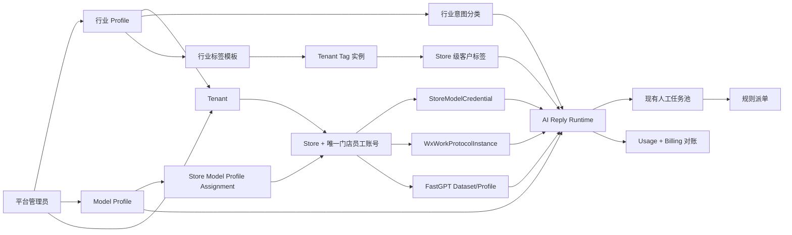

# Tenant AI 统一集成最终权威方案

> 状态：2026-07-23 产品决策已闭合，B0-B12 已完成，B13 发布秘密门禁、历史 MySQL 克隆升级、统一镜像隔离 MySQL API 冒烟、后台 worker 维护门禁、可执行三阶段 readiness 门禁、真实 FastGPT 会话检索证据门禁、发布游标快照和仓库外加密备份恢复验证门禁已完成；B14 固定白名单清理器、一次性操作门禁和 SQLite/MySQL 8.4 隔离演练已完成，但生产清理未执行。当前结论仍为发布 No-Go。16 项生产变量 handoff 已接收并通过权限、哈希、格式和无泄密检查，但 FastGPT 仍为公网 HTTP、目标 MySQL 不返回协议握手，最终 pilot Store 尚未解析且 NewAPI Key 尚未在统一环境重新提交；丽斯未来真实灰度和备份恢复证据均未完成，禁止切换正式 `8083` 或执行 B14 物理清理。
>
> 唯一实施分支：`codex/tenant-ai-unified-integration`
>
> 分支基线：`origin/codex/tenant-ai-integration@1e8e95c91307d01a556c83ed43ea500e553e4563`
>
> 当前 AI 来源审计：`origin/codex/ai-billing@4db799363040a4478a5585e101d119de11a26f8e`
>
> 最终 AI 来源：已固定 `origin/codex/ai-billing@4db799363040a4478a5585e101d119de11a26f8e`；每个 Batch 开始和提交前重新 fetch，若来源前移则先审计差异
>
> 服务发布端口：`8083`
>
> 首个真实灰度租户：丽斯未来

本文是 Tenant、行业、模型、门店凭据、FastGPT、AI 回复运行时、客户标签、计费、权限、页面、Migration、派单保护和发布回滚的唯一目标方案。本文描述的是最终目标，不表示代码已经实现。

## 1. 权威、分支与替代关系

### 1.1 唯一集成入口

1. `codex/tenant-ai-unified-integration` 是唯一继续实施和形成最终 PR 的分支。
2. 新分支以 `codex/tenant-ai-integration` 最新远端为骨架，保留其 Tenant、账号、权限、Store、企微身份、客服组织、规则派单、运营分析和人工质检。
3. `codex/ai-billing` 是行业、模型、门店凭据、Billing、FastGPT、客户标签和完整 AI 回复运行时的行为来源；实施前必须重新获取最新提交并固定 SHA。
4. `codex/tenant-ai-integration`、`codex/ai-billing` 和 `codex/customer-audit` 在新分支建立后全部视为只读来源，不再分别向 `main` 合并。
5. 原 PR #2 只保留历史审计价值，停止作为最终交付入口。最终只建立一个 `codex/tenant-ai-unified-integration -> main` PR。
6. 禁止整分支 merge、整文件选 ours/theirs 或直接 cherry-pick 混合领域提交。所有能力按本文定义的最终语义逐符号移植。

### 1.2 文档权威

本文替代以下旧结论：

- `docs/development/tenant-ai-integration-merge-handoff.md` 中关于“唯一分支为 tenant-ai-integration”“只允许 PR #2”“保留 AIConfig/TenantAIModelGrant”“不物理删除旧表”的目标结论；
- 旧的 `tenant-ai-billing-integration-plan.md`；
- 下载文件 `tenant-ai-unified-integration-design.md` 中与本文的 Tenant 行业绑定、行业标签隔离、分支基线和用户最终答复冲突的部分。

历史文档可以用于追溯已经完成的租户、派单和运营能力，不能作为最终模型、行业、标签或回复运行时依据。

实施后，AI 回复引擎的代码与 `docs/design/reply-runtime-engine.md` 必须同步更新为从 `ai-billing` 最新版本移植并完成 Tenant 适配后的真实链路。在该批代码合入前，本文只定义目标，不把尚未实现的行为写成已完成。

### 1.3 明确偏离旧开发约束

本方案包含两项由用户明确确认的偏离：

1. 不再只在 `codex/tenant-ai-integration` 开发，而是建立第三个唯一集成分支。
2. 最终版本物理删除旧 `AIConfig`、`TenantAIModelGrant`、`StoreAIModelSetting`、`ConversationTag` 表和废弃字段。该操作不放入普通启动 AutoMigrate，而在停机维护、备份和预检后由独立破坏性 Schema Cleanup 执行。

其余分层、权限、Tenant 隔离、SQLite/MySQL 兼容、显式路由、DTO、前端 API 封装和测试要求继续遵守 `AGENTS.md`。

## 2. 已锁定的产品决定

| 领域 | 最终决定 |
| --- | --- |
| 租户主体 | 使用 tenant-ai-integration 的 Tenant 架构，Tenant 是唯一隔离根 |
| 门店主体 | Tenant 下直接管理 Store；一个 Store 只绑定一个系统门店员工 User |
| 企微身份 | WxWorkProtocolInstance 是 Store 的渠道身份，不是系统门店员工账号 |
| 行业 | Tenant 必须绑定一个行业 Profile；Store 和企微实例只能继承，不能覆盖 |
| 意图识别 | 行业 Profile 决定 IntentDetect Prompt、JSON Schema 和意图分类集合 |
| 模型事实源 | 使用 ModelProfileTemplate/ModelProfileSlot，删除旧 AIConfig 运行体系 |
| 模型 Profile | 当前默认一套全局 Profile；架构允许平台建立多套并直接指定给 Store |
| 模型用途 | 九个用途槽全部强制配置，不允许缺槽 fallback |
| 网关 | 只支持一个统一 NewAPI 网关，Provider/BaseURL/APIMode 由平台 Profile 决定 |
| 模型授权 | 不保留 TenantAIModelGrant、租户授权池或租户默认模型 |
| 模型指派 | Store 直接绑定一个已发布 Model Profile；没有租户或企微多层覆盖 |
| 凭据 | 每个 Tenant + Store 一条 StoreModelCredential；默认无 API Key |
| 凭据录入 | 平台管理员、公司主管可录入；管理员可按 Store 开关门店员工自助录入 |
| 凭据安全 | 密文保存、候选测试、二次确认、可选主管审批、不可变审计，永不回显明文 |
| 计费身份 | 每个 Store 的 NewAPI API Key 是独立官方额度和账单身份 |
| 计费范围 | 只做 NewAPI 查询、本地归因和对账，不做充值、扣费、套餐、发票或额度拦截 |
| FastGPT | 完整采用 ai-billing 的 Dataset/Profile/RAG 行为，补 Tenant/Store 强隔离 |
| AI 回复 | Prompt、Schema、状态机、Intent、Plan、RAG、Generate、Validate、Commit、Resume 和 Trace 以 ai-billing 最新版本为准 |
| AI 转人工 | AI 只决定是否需要人工及客户文案，任务入池和选人仍使用现有规则派单 |
| 客户标签 | 关系绑定 StoreCustomerRelation；同一自然客户在不同 Store 拥有独立标签 |
| 标签目录 | 标签按行业固定定义，并实例化到各 Tenant；租户不能自建或改变语义 |
| 标签控制 | 租户只能启停标签和设置显示别名；行业模板决定 AI、回复、场景和互斥规则 |
| 标签上限 | 每个 StoreCustomerRelation 最多 6 个有效标签 |
| 会话标签 | 删除 ConversationTag 产品与数据；复用 `conversation.tag` 权限码管理客户标签 |
| 派单 | 只保留 manual/rule，完整保留现有确定性公平派单和恢复机制 |
| Migration | 保留 integration 的 AutoMigrate、DML runner、历史归档、动态编号和失败门禁 |
| 数据库 | 验证 SQLite 和 MySQL；fresh 与当前 integration 数据库最终得到同一套 Schema |
| 旧表 | 旧模型和会话标签表退出代码后物理删除，不保留双运行链或回滚入口 |
| 灰度 | 丽斯未来先验收；客户标签演化和回复标签上下文默认关闭，支持批量启停 |

## 3. 最终总体架构



一条生产消息的最终路径：

```text
企微客户消息
  -> 从 Conversation/RouteState 解析 Tenant + Store + WxWork + Customer
  -> 读取 Tenant 行业 Profile
  -> 读取 Store 已发布 Model Profile Assignment
  -> 解密 Store 当前 active Credential
  -> 使用行业 Prompt/Schema/IntentConfig 执行 IntentDetect
  -> ReplyPlan
  -> FastGPT 检索、Rerank 和 Answerability
  -> 工具、资源、人工路由决策
  -> 按行业和 Store 读取已提交客户标签短上下文
  -> Generate
  -> Validate
  -> Commit + Outbox + Usage + 运营事实
  -> 需要人工时进入现有任务池和规则派单
```

任何范围、行业、Profile、必需槽或 Credential 校验失败都不得回退到旧 AIConfig、其他 Tenant、其他 Store、平台默认密钥或未指派模型。

## 4. Tenant、Store 与账号边界

### 4.1 Tenant

- Tenant 是平台售卖客服系统的客户公司，也是所有业务数据的第一隔离键。
- Tenant 必须有一个有效 `IntentProfileID` 才能启用任何 Store 的 AI 回复。
- 行业由平台管理员在接入公司时绑定；公司主管只读查看行业名称，不能修改平台 Prompt、Schema 或分类。
- Tenant 的账号、角色、权限、客服组、客户、Store、知识库、会话、账单聚合和标签策略均按 TenantID 隔离。

### 4.2 Store 与唯一系统门店员工账号

- 一个启用 Store 必须对应且只对应一个 `store_staff` User 和一个活动 StoreStaffBinding。
- 这里的“门店员工账号”是本系统登录账号，不是企业微信员工号。
- Store 只在公司主管邀请注册或用户注册审核完成后建立绑定，不存在无系统账号的活动 Store。
- Store 与系统 User 的一对一关系由数据库唯一约束和 Service 事务共同保证。
- WxWorkProtocolInstance 只能绑定该 Store，数量和协议能力按企微文档管理，但不改变系统 Store 账号的一对一规则。

### 4.3 Store 生命周期与 API Key

- Store 停用、转移或删除不会调用 NewAPI 修改、吊销或旋转上游 API Key。
- Store 无效时本系统停止用该 Store 触发模型调用，但不擅自处理用户在另一套系统中的 Key 生命周期。
- 本地 Credential 始终加密保存；Store 恢复后是否继续使用原 Credential 由有权限操作者显式确认。
- 任何 Store 归属变化都必须重新校验 TenantID，禁止凭旧 StoreID 跨租户继续调用。

## 5. 行业、意图分类与知识链

### 5.1 复用现有行业能力

现有 `ReplyIntentProfile` 已经表达行业级 IntentDetect 配置，不新增平行 `Industry` 主表。最终产品将其正式命名为“行业 Profile”，保留代码模型名以减少无意义迁移。

`ReplyIntentProfile` 至少包含：

- `Code`：稳定 Profile 编码；
- `IndustryCode`：业务行业编码；
- `Name/Description`：平台展示信息；
- `IntentDetectPrompt`：该行业 IntentDetect 系统规则；
- `IntentJSONSchema`：该行业严格输出 Schema；
- `Revision/Status/SortNo`：发布版本和状态；
- 审计字段。

酒店行业是首个 Profile。未来零售、教育等行业必须分别提供完整 Prompt、Schema、分类、标签模板和验收数据，不能继承酒店硬编码后改名称。

### 5.2 Tenant 唯一绑定

- `Tenant.IntentProfileID` 是运行时唯一行业绑定。
- 删除 Company 行业绑定语义；Company 继续只承担既有历史迁移边界，不参与行业解析。
- `WxWorkProtocolInstance.IntentProfileID`、`KnowledgeBase.IntentProfileID` 和其他下级覆盖退出运行时并从最终 Schema 删除。
- Store、企微、知识库和会话只能继承所属 Tenant 的行业。
- Tenant 未绑定行业、Profile 被停用、Schema 无效或分类不完整时，相关 Store 不得打开 AI 回复。

### 5.3 行业意图分类

`ReplyIntentConfig` 只属于一个 `ReplyIntentProfile`，最终唯一键为：

```text
IntentProfileID + Code
```

删除其 Company、Store、WxWorkInstance 作用域和 fallback。每个行业 Profile 拥有自己的：

- 顶层意图类别；
- 子意图；
- 正反例；
- 必需上下文；
- knowledge/resource/tool/human 标志；
- PromptPack、ReplyPlanTemplate 和 ValidationRules；
- 明确优先级和启停状态。

IntentDetect 输出只能使用当前行业 Schema 和启用分类。未知或低置信输出按 ai-billing 最新 Runtime 的标准化规则处理，不得用酒店类别兜底其他行业。

### 5.4 行业与知识库

- 知识库仍按 Tenant + Store 隔离，不再单独绑定行业 ID。
- Runtime 通过 Tenant 行业决定意图分类，再在当前 Store 的 KnowledgeBase 中检索。
- 行业 Profile revision、知识 Profile revision 和 Store readiness 必须同时就绪才能打开 AI。
- 行业切换会使旧知识分类、标签和评测失效。平台只允许在 Tenant AI 全部关闭后执行行业重置：清理旧行业标签关系、实例化新行业目录、重新同步 FastGPT、重新评测后再启用。

### 5.5 行业管理权限与页面

- 平台 `super_admin` 和拥有 `aiConfig.update` 的普通 `admin` 可以创建、编辑、测试、发布行业 Profile 和分类。
- Tenant 角色只可查看当前行业名称，不可读取 Prompt、Schema、内部规则或其他行业。
- “接入公司”创建 Tenant 时行业为必填；修改行业需要危险操作确认和不可变审计。
- 平台导航保留“意图行业”和“意图分类”，但明确属于平台配置，不出现在普通租户导航。

## 6. Model Profile 与 Store 模型指派

### 6.1 唯一模型事实源

最终模型配置固定为：

```text
ModelProfileTemplate
  -> 9 个必需 ModelProfileSlot
  -> StoreModelProfileAssignment
  -> StoreModelCredential
  -> 动态 ModelCallConfig
```

旧 `AIConfig`、`TenantAIModelGrant`、租户用途默认模型、企微覆盖和 StoreAIModelSetting 不再参与任何生产调用。

### 6.2 九个必需用途槽

每个可发布 Profile 必须完整配置：

1. `reply_llm`
2. `intent_detect_llm`
3. `memory_summary_llm`
4. `customer_tag_llm`
5. `vision`
6. `asr`
7. `embedding`
8. `rerank`
9. `document_parser`

每个 Slot 固定 Provider、BaseURL、APIMode、ModelType、ModelName、Dimension、超时、重试、Token 上限和必要的 Prompt/Schema 引用。只支持一个统一 NewAPI 网关，不允许 Store 自定义 BaseURL 或 Provider。

缺少、停用、类型不符或测试失败的 Slot 会阻止 Profile 发布，不在运行时临时 fallback。

### 6.3 一套默认与多 Profile 扩展

- 首版迁移建立一套平台默认 Profile，并直接指派给全部通过 readiness 的测试 Store。
- 平台可以创建多套 Profile，用于未来不同 Tenant 或 Store 使用不同模型组合。
- 不建立租户授权池。Profile 由平台直接指派给 Store，可提供批量指派工具。
- 一个 Store 同时只有一个 active Assignment；Tenant 和企微实例没有第二层覆盖。
- Tenant 和门店员工只看到已指派的模型名称、revision 和就绪状态，不看到 Provider 密钥、BaseURL、Prompt、Schema 或其他 Profile。

### 6.4 Profile 发布

Profile 使用 draft/candidate/active revision：

```text
编辑 draft
  -> 严格校验 9 个 Slot
  -> 使用隔离测试 Credential 执行真实测试
  -> 生成影响 Store 清单
  -> 二次确认发布 candidate
  -> Store readiness 验证
  -> 激活 revision
```

旧 active revision 在新版本就绪前继续运行。平台可回滚到上一已发布 revision，但不能恢复旧 AIConfig resolver。

### 6.5 唯一 Resolver

所有 Chat、Responses、Embedding、Rerank、Vision、ASR 和 Document Parser 调用统一执行：

```text
RuntimeScope.StoreID
  -> active StoreModelProfileAssignment
  -> required usage Slot
  -> active StoreModelCredential
  -> ModelCallConfig
```

不存在 employee override、tenant default、tenant fallback、platform default 或 AIConfigID fallback。

## 7. StoreModelCredential

### 7.1 归属与默认状态

- 唯一键：`TenantID + StoreID`。
- 新 Store 默认 `unconfigured`，不自动创建或申请上游 API Key。
- 平台只是录入用户已有的 NewAPI API Key，不承担 NewAPI 账户或 Key 创建。
- 公司主管可以查看和维护本 Tenant 全部门店 Credential。
- 门店员工是否能维护自己 Store 的 Credential，由 `AllowCredentialSelfService` 开关决定。
- 平台管理员和公司主管可以按 Store 单独开关，也可以批量设置。

### 7.2 更新与审批

平台管理员或公司主管更新：

```text
重新输入当前密码
  -> 显式二次确认
  -> 写 candidate
  -> 测试 9 个 Slot
  -> 同步并测试 FastGPT Profile
  -> CAS 激活
```

门店员工自助更新：

```text
管理员已允许自助
  -> 重新输入当前密码
  -> 显式二次确认
  -> 按 Store 策略直接测试或进入公司主管审批
  -> 测试与同步通过
  -> CAS 激活
```

`RequireSupervisorApproval` 可由 Tenant 管理员开启。无论是否审批，至少必须完成密码复核和二次确认。

### 7.3 加密和不可变审计

- 使用 AES-256-GCM；master key 仅来自部署 Secret/KMS。
- AAD 包含 `tenant:<tenantID>:store:<storeID>:revision:<revision>`。
- active/candidate 使用递增 revision、fingerprint、CipherVersion 和 MasterKeyID。
- API、日志、Trace、错误、WebSocket 和前端永不返回明文、密文、nonce 或完整 fingerprint。
- 页面只显示掩码、fingerprint 后六位、revision、测试时间、同步状态和错误分类。
- 旧 `AIConfig.APIKey` 不迁移、不遮罩保留，而是随旧表物理删除。掩码显示只适用于新的 StoreModelCredential。
- `StoreModelCredentialAuditLog` append-only，记录操作者、范围、动作、revision、审批人、结果、RequestID 和时间，不保存 Key。

### 7.4 状态机和并发

```text
active(rN)
  -> candidate(rN+1, testing)
  -> candidate(syncing_fastgpt)
  -> candidate(ready)
  -> active(rN+1)
```

- candidate 失败时旧 active 保持不变。
- 同 Store 同时只允许一个 candidate。
- MySQL 使用行锁和 CAS；SQLite 使用写事务串行化并复核 revision/fingerprint。
- 有托管 Dataset 的 Store 在 FastGPT 同步失败时阻止激活并继续使用旧 active。
- 首次配置失败时保持 `unconfigured/failed`，AI 消息进入现有人工任务池。

## 8. Usage 与 Billing

### 8.1 官方账单

每个 Store 使用自己的 NewAPI API Key查询：

- `/api/status`
- `/api/usage/token/`
- `/api/log/token`

官方额度、已用、剩余、有效期、模型、人民币成本、单次请求和 request ID 以 NewAPI 返回为准。AgentDesk 不自行计算官方价格或余额。

### 8.2 本地归因

`AIUsageEvent`/`AIUsageGatewayCall` 至少记录：

- TenantID、StoreID、WxWorkInstanceID；
- ConversationID、MessageID、KnowledgeBaseID；
- RequestID、Stage、OperationType；
- ModelProfileID/Revision、UsageSlot、CredentialRevision、KeyFingerprint；
- Provider、Model、Prompt/Completion/Cached Token 数；
- GatewayRequestID、Latency、状态、错误分类和时间。

不保存 Prompt、Response、客户正文、标签证据或 API Key。一次实际 provider 请求对应一条不可变调用证据；计量失败不能重复调用模型或重复发送回复。

### 8.3 可见范围

- 门店员工：查看本 Store 额度汇总、人民币金额、模型名、单次请求和 request ID。
- 公司主管：查看本 Tenant 聚合账单和各 Store 明细。
- 平台管理员：跨 Tenant 查看和筛选。
- Tenant 普通客服和客服组长默认无 Billing 权限。
- 租户只看到模型名，不展示 Provider、BaseURL、Prompt、Schema 或 Key。

### 8.4 口径

- 官方账单与本地归因分栏展示，不相加伪装成同一账本。
- 使用 Asia/Shanghai 作为首版业务时区。
- 日期跨度、结果数量、日志保留和导出上限由服务端统一限制，并与 ai-billing 最新实现保持一致。
- 只做查询、归因、差异对账和导出，不做充值、扣费、套餐、发票或额度强制拦截。

## 9. FastGPT 最终链路

### 9.1 行为来源

完整采用实施开始时 `ai-billing` 最新版本的：

- Store Team/Dataset provision；
- 文件上传、Collection 查询和删除；
- Dataset 删除、激活和 Job 状态；
- Profile 派生、测试、同步、重试和诊断；
- Search、Embedding、Rerank 和 Answerability；
- Usage 同步、Gateway receipt 和 Billing 关联。

只把其 Company/Store 范围重写为可信 Tenant + Store 范围，不用 integration 的旧 FastGPT 行为覆盖。

### 9.2 Profile 单向派生

```text
active ModelProfile revision
  -> FastGPT Profile 派生投影
  -> 每个 Store 排队 target revision
  -> 使用该 Store active Credential 同步远端
  -> 回写 applied revision/fingerprint/status
```

FastGPT 页面不再独立编辑模型内容，只显示实际状态、测试结果、revision 和重新同步动作。

### 9.3 重建原则

- 现有 FastGPT 本地 Profile 不作为最终事实源，按新 Model Profile 和 Store Credential 重新生成。
- 每个 Store 按 ai-billing 最终流程重新 provision Team、Dataset、Collection 和 Profile；旧远端 Dataset/Collection 不作为最终运行资源，也不通过“可证明归属”直接复用。
- 新 Dataset 完成上传、索引、检索和回复验收后，旧远端资源进入明确清理清单；清理必须校验 Tenant + Store + remote ID，禁止误删其他 Store 资源。
- Runtime 切换前必须逐 Store 输出 readiness：Tenant/Store/行业/Profile/Credential/Dataset/九槽测试均通过。
- target revision 未就绪时保持旧 applied revision，不允许迟到结果覆盖新 revision。

## 10. AI 回复运行时

### 10.1 百分百行为权威

以下全部以实施前 `origin/codex/ai-billing` 最新提交为行为权威：

- reply trigger、debounce、短消息合并和并发控制；
- ConversationMemory 和 History 组装；
- 行业 IntentDetect Prompt、Schema、校验、重试和 fallback；
- IntentTasks、ReplyPlan 和多任务回复；
- KnowledgeAnswerabilityGate；
- FastGPT query、TopK、threshold、Embedding 和 Rerank；
- 工具、资源和人工路由决策；
- Generate 输入顺序和 Scope instruction；
- Validate、NEXT_MESSAGE、结构化资源和 Commit；
- Interrupt、Checkpoint、Resume 和人工超时恢复；
- Trace、RunLog、Usage 和错误分类；
- 客户标签上下文门禁和失败语义。

Tenant 分支只向这些行为注入可信范围、现有人工任务池端口、运营事实和 WebSocket 路由。不得顺手修改 Prompt、Schema、意图类别、知识 query、工具参数、调用次数或 Resume 状态机。

### 10.2 RuntimeScope

内部不可变范围至少包含：

```text
TenantID
StoreID
WxWorkInstanceID
IntentProfileID
ModelProfileID/Revision
KnowledgeBaseID
ConversationID
SessionNo
CustomerID
StoreCustomerRelationID
MessageID
RequestID
```

范围从已提交 Conversation、Message 和 RouteState 重建，不相信前端 tenantId/storeId，也不把 `context.Context` 当唯一范围存储。同步、异步、重试和 worker 都必须重新验证父链。

### 10.3 人工交接

- AI Runtime 决定是否转人工、原因和上传方案定义的客户等待文案。
- 实际任务只通过现有 `ConversationHumanDispatchService` 进入人工池。
- 选组、选小组、排班、Presence、容量、公平债务、连续性、SLA、转派和释放完全由现有规则派单负责。
- IntentDetect、Profile、Credential 或解密失败时，不伪造 AI 回复，直接进入现有人工任务池。
- 同一 RequestID 重试不得重复建任务、重复等待文案或重复 Assignment。

### 10.4 Commit 顺序

```text
Validate
  -> 生成稳定 ClientMsgID
  -> Message + Conversation cursor + EventLog 事务提交
  -> ServiceAnalyticsCapture
  -> ObserveCommittedMessage 推进演化游标
  -> ChannelMessageOutbox
  -> WebSocket 发布/重同步
```

Outbox 或 WebSocket 失败不能重新生成模型回复。Observe 只推进状态，不能在消息提交路径调用标签模型。

### 10.5 功能开关

- `CustomerTagEvolutionEnabled` 默认关闭。
- `ReplyTagContextEnabled` 默认关闭。
- 开关按 Tenant + Store 生效。
- 平台管理员和公司主管支持单个、批量选择、全部启用和全部停用。
- 首次只对丽斯未来选定 Store 灰度，两个能力分开开启和回滚。

## 11. 行业标签与 Store 客户画像

### 11.1 行业模板，不是全局共享 Tag

不使用 `TenantID=0` 的活动 Tag。新增平台级 `IndustryTagDefinition`，它只作为 `ReplyIntentProfile` 的固定标签模板；真正参与 Tenant 页面、客户关系和 Runtime 的仍是现有 Tenant `Tag`。

```text
ReplyIntentProfile
  -> IndustryTagDefinition
  -> Tenant 绑定行业时实例化 Tenant Tag
  -> StoreCustomerRelation 关联 Tenant Tag
```

每个行业有完全独立的目录、互斥组、ApplicableScene、AIEnabled 和 ReplyEnabled。酒店首版使用上传方案的 4 类 31 个标签和 8 个互斥组；其他行业不得复用酒店目录。

### 11.2 Tenant 可修改与不可修改

Tenant 可以：

- 启用或停用某个行业标签；
- 设置仅用于页面展示的别名；
- 配置演化静默时间、置信阈值、每轮操作上限和功能开关；
- 批量启停门店的演化和回复上下文。

Tenant 不可以：

- 创建自定义标签或分类；
- 修改 SemanticKey、父子层级、互斥组、AIEnabled、ReplyEnabled、ApplicableScene；
- 物理删除行业标签；
- 把其他行业标签混入当前 Tenant；
- 修改平台模型使用的标准别名和语义规则。

展示别名不参与模型判断。行业模板更新由平台发布并同步到绑定 Tenant。

### 11.3 客户标签身份

权威关系为：

```text
TenantID + StoreID + StoreCustomerRelationID + TagID
```

- 同一自然 Customer 在不同 Store 可以拥有完全不同的标签。
- Tenant 客户详情按 Store 分组展示，不生成跨 Store 合并画像。
- Store 关系转移或合并时，由公司主管在明确预览后选择保留来源、保留目标或清空重建，不自动猜测。
- 每个 StoreCustomerRelation 最多 6 个有效标签；该上限不可由 Tenant 调高。
- 有权限的客服、客服组长、公司主管可以从固定目录人工添加、移除或替换客户标签；终端客户不能修改。
- 人工添加默认受保护，AI 不得删除或替换。

### 11.4 可配置静默窗口演化

完整采用 ai-billing 的链路并适配 Tenant：

```text
Message Commit
  -> ObserveCommittedMessage
  -> 静默窗口内新消息重置 deadline
  -> 到期 claim EvolutionState
  -> 更新 ConversationSessionSummary
  -> 提取 KnowledgeCandidate
  -> customer_tag_llm 输出严格 operations
  -> 校验行业目录、Store 关系、证据、互斥、人工保护和 6 标签上限
  -> 事务应用
  -> append-only ChangeLog
```

Tenant 可配置静默时间、置信阈值和每轮操作上限；静默时间默认 24 小时，其余默认值来自 ai-billing。每客最大 6 个标签是平台硬上限。

### 11.5 回复标签上下文

- 只读取已提交、当前 Store、当前行业、启用且 ReplyEnabled 的标签。
- 最多注入上传方案允许的少量相关标签；当前表达覆盖历史画像。
- 知识型回复只有 Answerability=`has_context` 才允许注入。
- 不进入 IntentDetect、ReplyPlan、检索 query、工具、资源、人工路由或 Resume。
- 不新增模型调用或计费事件。
- 任意查询或校验失败 fail open，原 Generate messages 保持不变。

## 12. 旧链路彻底删除

### 12.1 删除的生产概念

- `AIConfig` 数据库模型、CRUD、页面、resolver 和明文 APIKey；
- `TenantAIModelGrant` 和租户模型授权池；
- 租户默认模型、企微员工号模型覆盖和所有 fallback；
- `StoreAIModelSetting` 活动模型分配；
- `ConversationTag` 和运营分析 `TagIDsJSON` 会话标签；
- `KnowledgeDocument`、`KnowledgeFAQ`、`KnowledgeChunk` 本地知识实体及其 Qdrant、分块、向量索引和本地检索 fallback；
- 旧 `/conversation/add_tag`、`/conversation/remove_tag`；
- 旧 AIConfigID 在 AIAgent、RunLog、Usage 和前端 DTO 中的活动语义；
- 只服务上述概念的 repository、service、handler、builder、DTO、API caller、页面、组件、导航、文案和测试。

### 12.2 物理 Schema Cleanup

最终生产 Schema 删除：

```text
t_ai_config
t_tenant_ai_model_grant
t_store_ai_model_setting
t_conversation_tag
t_knowledge_document
t_knowledge_faq
t_knowledge_chunk
conversation_service_session.tag_ids_json
活动表中只属于旧 resolver 的 ai_config_id 列
```

实际表名和列名以实现时 GORM `TableName`/Schema 审计为准，禁止凭文档猜测执行 DROP。

保留 `TicketTag`，因为它属于工单分类，不是会话标签或客户画像。

### 12.3 删除顺序

```text
前端 caller/UI
  -> route
  -> handler/DTO/builder
  -> service/repository
  -> runtime caller
  -> Models 注册
  -> 只读预检与备份
  -> 独立 Schema Cleanup
```

删除后旧接口必须真实返回 404，旧表和列在 SQLite/MySQL 最终 Schema 中均不存在。Git 历史和已经执行的 MigrationDefinitionArchive 只作为审计事实，不构成运行时残留。

## 13. 规则派单保护边界

以下语义完全保留 tenant-ai-integration：

- manual/rule 两种模式；
- 人工任务池和 Assignment 状态机；
- 客服组、小组和排班；
- Presence、容量和实时压力；
- 本班公平债务和历史连续性；
- SLA、stale recovery、转派和释放；
- 派单、运营和质检事实。

禁止恢复 `model/intelligent/hybrid` 派单、`dispatch_decision_llm`、LLM 选人或客户标签评分。AI 生成交接摘要不等于模型派单。

## 14. 权限最终语义

### 14.1 原则

- 继续使用 Permission -> RolePermission -> UserRole。
- 权限决定操作资格，Tenant/Store 范围是不可突破的强制上限。
- 页面隐藏、角色名和前端 ActiveTenant 不能代替 Handler 与 Service 校验。
- 普通平台 `admin` 获得权限后可以管理行业和 Model Profile，不限制为 `super_admin`。

### 14.2 复用和退役

| 权限码 | 最终语义 |
| --- | --- |
| `aiConfig.view` | 查看有权范围内的行业、Model Profile、Store 模型名称、Credential 状态 |
| `aiConfig.update` | 平台编辑/发布行业与 Model Profile，或按范围更新 Store Credential/Assignment |
| `conversation.tag` | 查看和管理有权客户的 Store 级客户标签 |
| `tag.view` | 查看当前 Tenant 的行业标签目录和开关 |
| `tag.update` | 更新当前 Tenant 标签启停、显示别名和标签策略 |
| `knowledgeBase.*` | 管理当前 Tenant/Store FastGPT 知识能力 |

退役并清理角色绑定：

- `aiConfig.create/delete` 的旧 CRUD 语义；
- `tenantModelGrant.*`；
- `tenantModelAssignment.*`；
- 旧 ConversationTag API 元数据。

如现有角色已拥有 `conversation.tag` 或 `aiConfig.view/update`，Migration 保留 Permission ID 并更新名称/API 元数据，使其自动获得新语义；范围校验仍按角色和 Tenant/Store 执行。

### 14.3 角色默认范围

| 角色 | 行业/Profile | Store Assignment/Credential | Billing | 客户标签 |
| --- | --- | --- | --- | --- |
| 平台 super_admin/admin | 按权限管理 | 按权限管理全部 | 按权限跨 Tenant | 按权限跨 Tenant 审计 |
| tenant_admin 公司主管 | 只读行业和模型名 | 管理本 Tenant 全部 Store | 聚合和明细 | 本 Tenant 各 Store |
| cs_team_leader | 不管理 | 不管理 | 默认无 | 负责范围客户 |
| cs_user | 不管理 | 不管理 | 默认无 | 本人可访问会话客户 |
| store_staff | 只读自己 Store 模型名 | 开关允许时维护自己 Store | 自己 Store 全明细 | 自己 Store 可访问客户 |

## 15. 页面信息架构

### 15.1 平台侧

- “接入公司”：创建 Tenant、绑定行业、查看 Store 模型 readiness、批量 Profile 指派、凭据状态和账单入口。
- “意图行业”：管理行业 Profile、Prompt、Schema、revision、测试和发布。
- “意图分类”：按行业维护分类和行为规则。
- “行业标签模板”：按行业维护固定目录、互斥、场景和 AI/回复规则。
- “模型配置”：替换旧 AIConfig 页面，管理 Model Profile 和九个 Slot。
- “模型用量与账单”：跨 Tenant/Store 查询和对账。

### 15.2 Tenant 公司主管侧

- 整体继续使用现有 ActiveTenant Dashboard 壳层。
- “门店管理”中显示行业、已指派模型名称、Credential readiness、FastGPT readiness 和账单摘要。
- Store 行操作复用 Credential、账单和状态组件。
- 标签页只展示当前行业固定目录，允许启停、显示别名和策略设置，不提供新增/删除。
- 提供 Store 批量选择和“一键全部启用/停用”演化、回复标签上下文。

### 15.3 门店员工侧

- 在“门店工作台”复用同一 Credential 和 Billing 组件，只显示自己 Store。
- 若 `AllowCredentialSelfService=false`，只显示掩码状态和联系主管操作。
- 可以看到模型名称、额度、人民币金额、单次请求和 request ID，不看到 Provider、BaseURL、Prompt、Schema 或 Key。

### 15.4 会话和客户

- `/dashboard/conversations` 继续是实时回复工作台，显示当前 Store 客户标签。
- 客户详情按 Store 分组显示独立标签和 ChangeLog。
- 不再显示会话标签 picker。
- 运营分析不再允许编辑 `TagIDsJSON`，只可读取服务分类、客户标签快照和质检事实。

## 16. 最终数据模型与索引

### 16.1 新增或扩展

| 模型 | 关键字段/约束 |
| --- | --- |
| Tenant | `IntentProfileID`，绑定有效行业 Profile |
| ReplyIntentProfile | IndustryCode、Prompt、Schema、Revision、Status |
| ReplyIntentConfig | unique(IntentProfileID, Code)，无 Company/Store/WxWork scope |
| IndustryTagDefinition | unique(IntentProfileID, SemanticKey)，平台固定模板 |
| Tag | TenantID、IntentProfileID、TemplateDefinitionID、DisplayAlias、Status |
| TenantCustomerTagPolicy | TenantID unique，静默时间、阈值、每轮上限、批量开关默认值 |
| ModelProfileTemplate | 平台 Profile、draft/active revision |
| ModelProfileSlot | unique(ProfileID, UsageSlot)，九槽强校验 |
| StoreModelProfileAssignment | unique(TenantID, StoreID)，一个 active Profile |
| StoreModelCredential | unique(TenantID, StoreID)，active/candidate 密文和 revision |
| StoreCredentialPolicy | unique(TenantID, StoreID)，自助与审批开关 |
| StoreModelCredentialAuditLog | append-only，Tenant/Store/operator/revision/action/result |
| AIUsageEvent/GatewayCall | Tenant/Store/Slot/ProfileRevision/CredentialRevision |
| CustomerTagRelation | unique(TenantID, StoreCustomerRelationID, TagID) |
| CustomerTagChangeLog | append-only，Tenant/Store/Relation/Tag/证据/操作者 |
| ConversationEvolutionState | unique(TenantID, ConversationID, SessionNo) + lease |
| ConversationEvolutionRun | checkpoint/RunKey 唯一 + Tenant/Store |
| FastGPTStoreTenant/Job/SyncState | TenantID + StoreID + revision/lease/retry |

所有面向操作者和 worker 的查询都必须包含 TenantID；StoreID、主键全局唯一或 ActiveTenant 不能替代 Tenant 条件。

### 16.2 删除

- AIConfig、TenantAIModelGrant、StoreAIModelSetting、ConversationTag 活动 model；
- WxWork/Knowledge/Company 的运行时 IntentProfile 覆盖字段；
- ReplyIntentConfig 的 Company/Store/WxWork scope；
- ConversationServiceSession.TagIDsJSON；
- 旧 AIConfigID 活动字段。

## 17. API 与事件目标

### 17.1 平台行业与模型

```text
POST /api/dashboard/reply-intent-profile/get
POST /api/dashboard/reply-intent-profile/create
POST /api/dashboard/reply-intent-profile/update
POST /api/dashboard/reply-intent-profile/test
POST /api/dashboard/reply-intent-profile/publish

POST /api/dashboard/model-profile-template/get
POST /api/dashboard/model-profile-template/create
POST /api/dashboard/model-profile-template/update
POST /api/dashboard/model-profile-template/test
POST /api/dashboard/model-profile-template/publish

POST /api/dashboard/store-model-profile/assign
POST /api/dashboard/store-model-profile/batch_assign
```

最终路径在实现时必须遵循现有 Gin 平铺路由规范；本文路径是契约目标，注册前仍需与现有 routes 对照。

### 17.2 Credential 与 Billing

```text
POST /api/dashboard/store-model-credential/get
POST /api/dashboard/store-model-credential/update
POST /api/dashboard/store-model-credential/approve
POST /api/dashboard/store-model-credential/policy
POST /api/dashboard/store-model-credential/batch_policy
POST /api/dashboard/billing-query/get
POST /api/dashboard/billing-query/export
```

### 17.3 客户标签

```text
GET  /api/dashboard/conversation/customer_tag/options
ANY  /api/dashboard/conversation/customer_tag/change_log
POST /api/dashboard/conversation/customer_tag/add
POST /api/dashboard/conversation/customer_tag/remove
POST /api/dashboard/conversation/customer_tag/replace
POST /api/dashboard/customer-tag/policy/update
POST /api/dashboard/customer-tag/runtime/batch_toggle
```

### 17.4 删除接口

旧 AIConfig CRUD、Tenant model access、WxWork model assignments、Conversation add/remove tag 和 FastGPT 独立模型编辑接口全部注销并返回 404。

### 17.5 WebSocket

- `store_model_profile.changed`
- `store_model_credential.changed`
- `fastgpt_profile.changed`
- `customer_tag.changed`
- `customer_tag_runtime_policy.changed`

事件只包含刷新所需 ID、revision、status 和时间，不携带 Key、Prompt、Schema、客户正文或标签证据。

## 18. Migration 与物理清理

### 18.1 唯一目标 Schema

只支持两类输入并收口为同一最终 Schema：

1. fresh SQLite/MySQL；
2. 当前 `tenant-ai-integration` 历史 SQLite/MySQL。

`ai-billing` 数据库不是生产升级来源，只移植代码和行为。最终不保留双 Schema、双 resolver 或兼容运行模式。

### 18.2 机制

- DDL 新建字段/表仍优先由最终 `models.Models` 的 AutoMigrate 完成。
- DML 回填、权限同步、行业/标签实例化和历史定义归档使用 integration runner。
- Migration 编号在每个提交前 fetch 后动态选择，不预先锁死 68-75。
- 保留 definition mismatch 检测、MigrationDefinitionArchive、失败阻止启动和幂等重跑测试。
- 已执行历史 Migration 不改版本号、不伪造 remark、不删除审计记录。

### 18.3 实施阶段

1. 预检：未知 migration remark、Tenant/Store 断链、一 Store 多账号、重复唯一键、旧表存在性和 Key 字段计数。
2. 扩展：AutoMigrate 新行业、Profile、Credential、Usage、Tag、Evolution 和 FastGPT 字段/表。
3. 行业：给现有 Tenant 显式绑定酒店行业或输出 unresolved；没有可证明绑定时阻止启动。
4. 模型：建立默认 Profile 九槽、Store Assignment；不迁移旧 AIConfig APIKey。
5. 凭据：新 StoreModelCredential 默认 unconfigured，由用户重新配置。
6. FastGPT：按新 Profile 生成 target revision 并输出 readiness。
7. 标签与知识：按 Tenant 行业实例化固定目录；删除所有旧 ConversationTag/TagIDsJSON 数据，不迁移；本地 Document/FAQ/Chunk 只作为历史升级输入，不迁入 FastGPT。
8. Runtime：切换唯一 resolver、完整 AI Runtime 和新 API/UI。
9. 静态证明：旧 caller、route、repository、model registration 和构建路由为零。
10. 停机备份后执行独立 Schema Cleanup，物理删除旧表/列。
11. 重跑 preflight、完整性审计和 SQLite/MySQL Schema 快照对比。

### 18.4 破坏性清理门禁

由于用户明确要求不保留旧表，本步骤是对常规 AutoMigrate-only 规则的受控例外：

- 只能由独立管理命令调用 GORM Migrator/数据库兼容 DDL；
- 不能在普通 server 启动中自动执行；
- 必须先停 `8083`、停止 worker、完成加密备份并验证可恢复；
- 必须打印待删表/列、行数和非敏感引用计数，不打印 APIKey；
- 必须要求显式环境确认和一次性操作令牌；
- SQLite/MySQL 分别测试，禁止拼接未审计的方言 SQL；
- 删除完成后回滚只能恢复整库备份，不能恢复旧应用继续生产。

旧 AIConfig.APIKey 不进入日志、导出或新 Credential。它随旧表删除；新 Credential 永远只返回掩码。

## 19. 代码集成方法

### 19.1 B0 固定来源

实施开始必须再次：

```text
git fetch origin --prune
固定 tenant-ai-unified-integration HEAD
固定 origin/codex/ai-billing 最新 SHA
记录共同祖先和双方提交列表
生成 integration-manifest.tsv
```

Manifest 每行记录 path、最终 owner、来源 SHA、目标 batch、保留符号、删除符号和验证测试。

### 19.2 领域权威

| 领域 | 代码骨架/行为来源 |
| --- | --- |
| Tenant、账号、角色、权限、Store、企微身份 | tenant-ai-integration |
| 客服组、小组、排班、Presence、规则派单 | tenant-ai-integration |
| 运营分析、人工质检、满意度 | tenant-ai-integration |
| 行业 Profile、意图分类 | ai-billing 行为 + Tenant 唯一绑定重写 |
| Model Profile、Credential、Usage、Billing | ai-billing |
| FastGPT Dataset/Profile/RAG | ai-billing |
| AI Reply Runtime 全链路 | ai-billing 最新版本 |
| 客户标签、演化、回复上下文 | ai-billing + 行业/Tenant/Store 重写 |
| Migration runner 和版本安全 | tenant-ai-integration |
| 前端壳层、ActiveTenant、权限导航 | tenant-ai-integration |

### 19.3 共享高风险文件

以下文件必须手工逐符号重建，禁止整文件接受任一来源：

```text
AGENTS.md
internal/models/models.go
internal/bootstrap/routes.go
internal/bootstrap/server.go
internal/bootstrap/migration.go
internal/pkg/constants/auth.go
internal/pkg/dto/**
internal/services/tenant_service.go
internal/services/wx_work_protocol_instance_service.go
internal/services/reply_intent_*
internal/services/store_ai_model_setting_service.go
internal/services/message_service.go
internal/services/conversation_*
internal/services/fastgpt_*
internal/ai/runtime/**
internal/services/tag_service.go
web/lib/api/admin.ts
web/lib/api/agent.ts
web/lib/navigation.tsx
web/app/dashboard/layout.tsx
web/app/dashboard/conversations/**
web/messages/zh-CN.json
web/messages/en-US.json
```

每处理一个共享文件立即执行定向 diff 和关联测试，不先批量解决全部冲突。

## 20. 分批实施顺序

| Batch | 原子目标 | 合入门禁 |
| --- | --- | --- |
| B0 | fetch、固定最新 ai-billing、manifest、双方基线 | 来源工作树不变，集成树干净 |
| B1 | Migration runner 与最终 model 契约 | SQLite/MySQL AutoMigrate 和历史 runner 测试 |
| B2 | Tenant 行业绑定、行业 Profile/分类、行业标签模板 | 无 Company/企微行业 override，未绑定行业不能开 AI |
| B3 | Model Profile 九槽、Store Assignment、唯一 resolver 契约 | 九槽强校验，无 grant/default/fallback |
| B4 | Store Credential、安全、审批和不可变审计 | 并发 rotation、失败保活、秘密扫描 |
| B5 | Usage、NewAPI Billing Query 和页面 | Store/Tenant/platform 范围与对账测试 |
| B6 | FastGPT 重建与单向 Profile | provision/upload/search/sync/retry 全流程 |
| B7 | ai-billing 完整 Reply Runtime 移植 | Prompt/Schema/阶段/调用次数 golden |
| B8 | AI 人工交接适配现有任务池 | 规则派单全量回归、幂等转人工 |
| B9 | 行业标签实例、客户标签关系和 UI | 固定目录、Store 隔离、人工保护、6 上限 |
| B10 | Evolution worker | due/lease/retry/new-message race |
| B11 | Reply 标签上下文和批量开关 | 无新增模型调用、Generate 门禁回归 |
| B12 | 旧 API/UI/service/model 与本地知识链全链删除 | 静态搜索、旧接口 404、构建无旧页面 |
| B13 | 丽斯未来真实 readiness 与灰度 | 8083、真实 NewAPI/FastGPT/回复/账单 |
| B14 | 停机 Schema Cleanup 与发布候选 | 备份恢复、SQLite/MySQL 最终 Schema 一致 |

任何 Batch 最多三个单一目的提交；模型、迁移、后端行为、前端入口和破坏性删除不得混成一个不可审查提交。

## 21. 测试与验收

### 21.1 固定命令

```text
gofmt 所有修改 Go 文件
go test ./... -count=1
go test -race ./internal/ai/... ./internal/services/... ./internal/repositories/...
go vet ./...
pnpm --dir web typecheck
pnpm --dir web lint
逐个执行 web 内全部 *.test.mjs
pnpm --dir web build:sdk
pnpm --dir web build
git diff --check
```

### 21.2 Tenant、行业和权限

- 双 Tenant 同名 Store、客户、标签和 Profile Assignment 不串数据。
- Tenant 行业缺失/停用/切换、企微伪造 IntentProfileID 和跨 Tenant ID 均被拒绝。
- 每个行业只使用自己的 Prompt、Schema、分类和标签。
- 平台 admin、tenant_admin、组长、客服、store_staff 和无 ActiveTenant 用户逐项验证。
- 一 Store 只能绑定一个系统门店员工账号；WxWork 身份不能代替系统账号。

### 21.3 模型、Credential 和 Billing

- 九槽逐个验证缺失、类型错误、超时和成功。
- 多 Profile Store 指派和批量指派正确，无租户授权池和 fallback。
- Credential 首次配置、candidate 失败、FastGPT 失败、CAS 失败和并发更新均不泄密。
- 门店自助开关、密码复核、二次确认、主管审批和审计日志完整。
- Store/Tenant/platform Billing 可见范围、金额、模型、request ID 和导出正确。
- API、日志、Trace、错误、网络响应和构建产物无 Key、nonce 或完整 fingerprint。

### 21.4 AI Runtime 等价性

以实施前固定的 ai-billing 最新 SHA 保存确定性 golden：

- IntentDetect messages、Prompt、Schema 和调用次数；
- ReplyPlan、intentTasks、知识 query、Answerability；
- Generate messages、Validate、NEXT_MESSAGE、Commit actions；
- Interrupt、Checkpoint、Resume；
- RunLog、Trace、Usage stage 和错误分类。

允许差异只有 Tenant/Store/行业/Assignment 范围字段和现有运营事实 Hook。其他差异必须单独解释，不能称为 Tenant 适配。

### 21.5 标签

- 酒店目录严格为该行业定义的 4 类 31 标签和互斥规则；其他行业不会看到酒店标签。
- Tenant 只能启停和设置显示别名，新增/删除/语义修改接口不存在。
- 同一 Customer 在两个 Store 的标签互不影响。
- 人工保护、互斥替换、主管迁移选择、6 个上限和 append-only ChangeLog 正确。
- Observe Commit 零模型调用；只有 due 且开关开启时运行 customer_tag_llm。
- Reply 标签上下文失败不改变原 messages，不新增 UsageEvent。

### 21.6 派单、运营和前端

- manual/rule、排班、Presence、容量、公平债务、SLA 和 stale recovery 全过。
- AI 失败进入人工池且不重复任务。
- ServiceSession、ResponseSpan、Assignment、运营分析、质检和满意度保持正常。
- ActiveTenant 切换立即清理 Store Credential、Billing、标签、知识和会话缓存。
- 桌面和移动验证平台、Tenant、门店工作台、会话和客户详情，无重叠和越权入口。

### 21.7 数据库矩阵

| 输入 | SQLite | MySQL 8.x |
| --- | --- | --- |
| fresh | 最终 Schema + 重跑 | 最终 Schema + 重跑 |
| tenant-ai-integration 历史库 | 升级 + cleanup + 重跑 | 升级 + cleanup + 重跑 |

每格验证：Migration archive、权限 ID、Tenant 行业、Store 一对一、九槽、Credential、行业标签、唯一索引、旧表/列不存在和重复执行幂等。

## 22. 发布、回滚与 No-Go

### 22.1 发布 No-Go

任一条件成立禁止发布：

- 未固定最新 ai-billing SHA 或 golden；
- Tenant 行业 unresolved；
- 活动 Store 缺少唯一系统账号、Profile Assignment、九槽、Credential 或 FastGPT readiness；
- 跨 Tenant/Store 测试失败；
- Runtime 与 ai-billing golden 的 Prompt、Schema、调用次数不符；
- 规则派单或运营回归失败；
- API Key 在任何输出中可见；
- SQLite/MySQL 任一最终 Schema 不一致；
- 旧 resolver/API/UI 仍可达；
- Schema Cleanup 备份未实际恢复验证；
- 真实 NewAPI、FastGPT 和丽斯未来消息验收未完成。

### 22.2 上线顺序

1. 在生产脱敏副本演练完整升级、cleanup 和备份恢复。
2. 停止旧 `8083` 和全部 worker，记录 Message/Outbox/Assignment 游标。
3. 完成数据库和远端 FastGPT 状态备份。
4. 执行 preflight、AutoMigrate、DML migration 和 readiness。
5. 启动新应用但保持标签演化/回复上下文关闭。
6. 丽斯未来单 Store 验证行业、九槽、Credential、FastGPT、回复、转人工、派单、Usage、账单和运营事实。
7. 扩大 ready Store 范围。
8. 先批量灰度 ReplyTagContext，再独立灰度 Evolution。
9. 验证稳定并确认无需旧版本回退后，停机执行 Schema Cleanup。
10. 用同一发布镜像重启 `8083`，完成最终全链验收。

### 22.3 回滚边界

- Cleanup 前：可回退新 UI/Runtime/Profile Assignment 应用提交，数据库新增表保留；不能恢复模型派单。
- Credential：candidate 失败继续使用旧 active revision。
- FastGPT：保持旧 applied revision和重试任务。
- 标签：关闭 Evolution/ReplyTagContext，保留新客户标签关系和 ChangeLog。
- 派单：异常时切 manual，不回退为模型派单。
- Cleanup 后：旧表已物理删除，禁止启动依赖旧 AIConfig/Grant/Setting/ConversationTag 的应用。严重问题只能恢复 cleanup 前整库备份并回退整个发布，不允许新旧应用并行。

## 23. 完成判定

只有同时满足以下条件，才能声明统一集成完成：

- 最终 `main` 只通过新的统一集成 PR 接收本次能力；
- Tenant 是唯一隔离根，Tenant 唯一绑定行业；
- Store 和唯一系统门店员工账号一对一；
- 行业决定 IntentDetect Prompt、Schema、分类和固定标签目录；
- Model Profile/九槽/Store Assignment/Store Credential 是唯一模型系统；
- AIConfig、TenantAIModelGrant、StoreAIModelSetting、ConversationTag 代码和物理表均不存在；
- 本地 KnowledgeDocument/KnowledgeFAQ/KnowledgeChunk、Qdrant 和本地向量 fallback 的活动代码与物理表均不存在；
- FastGPT 和 AI Reply Runtime 与固定 ai-billing 最新基线一致；
- 客户标签按 Store 隔离、每客最多 6 个、Tenant 只能开关和设置显示别名；
- AI 失败和明确转人工只进入现有规则派单；
- Billing 按 Store 官方查询、按 Tenant 聚合、平台可跨 Tenant；
- SQLite/MySQL fresh 和历史升级得到同一最终 Schema；
- 丽斯未来在 `8083` 完成真实 NewAPI、FastGPT、回复、派单、账单和标签灰度；
- 全量测试、构建、浏览器、秘密扫描、备份恢复和 Schema Cleanup 证据齐全。

在以上条件完成前，文档和 PR 只能写“正在集成”或“待验收”，不得写“已合并完成”。

## 24. 实施记录要求

每个 Batch 完成后在本文末尾追加简短实施记录，至少包含：

- 日期、Batch、提交 SHA；
- ai-billing 固定来源 SHA；
- 修改文件和共享高风险文件；
- model/migration/DTO/enum/API/WebSocket/权限变化；
- SQLite/MySQL、Go、前端和浏览器验证；
- 并行来源影响、合并顺序和回滚边界；
- 未测项和外部阻塞。

不得把临时报告写入 `docs/generated/`，不得提交数据库、截图、密钥、下载原稿或本地审计产物。

## 25. 实施记录

### 25.1 2026-07-22 B0 来源固定与基线审计

- 集成分支：`codex/tenant-ai-unified-integration`，固定骨架 `1e8e95c91307d01a556c83ed43ea500e553e4563`。
- AI 行为来源：执行 `git fetch origin --prune` 后固定 `origin/codex/ai-billing@4db799363040a4478a5585e101d119de11a26f8e`；共同祖先为 `f2d2da4df7f267bf99e94c4ba1e9911f8f371373`。
- 来源提交：Tenant 骨架在共同祖先后 139 个提交，AI 来源 9 个提交；双方共同修改 116 个路径，禁止整分支 merge 或整文件选边。
- 文件归属：新增 `docs/development/integration-manifest.tsv`，逐行记录全部 116 个重叠路径的最终 owner、来源 SHA、目标 Batch、保留/重建能力、删除项、验证命令和状态。
- 共享契约：本批不修改 model、migration、DTO、enum、API、WebSocket 或权限；仅固定后续逐符号重建边界。
- 租户基线：`go test ./... -count=1` 通过；ESLint 0 error、32 warning；`tsc --noEmit --incremental false` 通过；136 个 `*.test.mjs` 全部通过；`git diff --check` 通过。
- AI 基线：`go test ./... -count=1` 和 TypeScript 通过；ESLint 基线为 11 error、48 warning，属于来源分支既存缺陷，移植对应前端时必须修复，不能带入最终分支。
- 来源保护：detached AI 审计工作树保持干净；Tenant 来源工作树的两份既存未提交文档不属于本批，未修改、未覆盖。统一集成工作树当前仅含 B0 文档与清单变更。
- 并行影响：`codex/tenant-ai-integration` 与 `codex/ai-billing` 从此仅作只读来源；后续每个 Batch 开始前重新 fetch 并核对来源是否前移，不再将任一来源分支单独合入 `main`。
- 合并顺序：先提交 B0 文档证据，再实施 B1 最终 Schema/Migration 契约；任何运行时代码不得先于 B1-B4 的行业、Profile、Assignment 和 Credential 契约启用。
- 回滚边界：B0 仅文档，可独立回滚，不影响运行代码、数据库或来源分支。

### 25.2 2026-07-22 B1 最终 Schema 与 Migration 预检契约

- 代码提交：`f024d174c9dc4b4a7da7d21c96459217059b5a0c`；AI 行为来源继续固定为 `4db799363040a4478a5585e101d119de11a26f8e`，Tenant 骨架继续固定为 `1e8e95c91307d01a556c83ed43ea500e553e4563`。
- 来源复核：提交前执行 `git fetch origin --prune`；两个来源 SHA 均未前移，统一分支与远端无分叉。远端 Migration 最高编号为 `ai-billing:067`、`tenant-ai-integration:065`，本批未注册新编号。
- Model/enum：新增行业标签模板与 Tenant 投影、九槽 Model Profile、Store Profile Assignment、Store 加密 Credential/策略/不可变审计、Store 客户标签关系/变更日志、会话静默演化状态/运行记录；扩展 Usage 和 FastGPT 的 Profile/Credential revision 归因字段。
- Migration：在 `AutoMigrate` 之前增加只读 `Preflight`，未知版本或未知 remark 会阻止启动；已知历史重号仍进入原归档流程。fresh 库无 migration 表时直接放行，预检本身不改数据。
- 生成注册：新最终模型已进入 generator；`AIConfig` 和 `ConversationTag` 已退出生成器。旧 `AIConfig/TenantAIModelGrant/StoreAIModelSetting/ConversationTag` 暂时仍在 `models.Models` 中，仅供后续 DML 迁移读取，禁止接入任何新运行链；B12 删除运行代码，B14 删除物理表。
- 共享契约影响：本批修改 `models`、enum、AutoMigrate 注册和 migration 启动顺序；没有新增 DTO、API、WebSocket、权限或前端入口。现有规则派单、运营分析和 AI Runtime 行为未改变。
- SQLite 验证：新模型 AutoMigrate、Profile/Slot/Assignment/Credential/行业模板/Tenant Tag/Store 客户标签/演化状态唯一约束、九槽完整性和无明文 Key 字段测试通过。
- MySQL 验证：使用临时 MySQL 8.4 执行 `TestUnifiedAIModelsAutoMigrateMySQL` 通过，容器已停止并删除；未向仓库写入数据库或临时报告。
- Go 验证：`go test ./... -count=1`、`go test ./internal/models ./internal/migration ./internal/bootstrap -count=1`、`go vet ./...` 和 `git diff --check` 全部通过。前端未修改，沿用 B0 的 TypeScript、136 个 `*.test.mjs` 和 ESLint 基线。
- 合并顺序：B1 必须先于 B2 行业数据、B3 Resolver、B4 Credential 行为及所有 ai-billing Runtime 移植；B1 不应单独发布为业务功能。
- 回滚边界：提交可独立回滚；已经 AutoMigrate 的新增表/列会留在数据库但当前无生产写入，不会被旧代码读取。禁止在完成 B12/B14 后单独回滚 B1。
- 待后续验证：历史生产库完整升级、DML 回填、真实 NewAPI/FastGPT、旧 Schema Cleanup 和备份恢复分别属于 B2-B14，不能计入本批完成项。

### 25.3 2026-07-22 B2 Tenant 行业绑定与权威目录

- 代码提交：行业与迁移主体为 `fec989d4bea301b1c6fe515913e928838d0d6bd8`；浏览器验收修复为 `a42f698fffd2705dd209f652fca399ba51ace77f`。AI 行为来源继续固定为 `4db799363040a4478a5585e101d119de11a26f8e`，Tenant 骨架继续固定为 `1e8e95c91307d01a556c83ed43ea500e553e4563`。
- 来源复核：两次提交前均执行 `git fetch origin --prune`；`origin/codex/ai-billing`、`origin/codex/tenant-ai-integration` 均未前移。远端最高 Migration 仍为 `ai-billing:067` 和 `tenant-ai-integration:065`，本批使用动态编号 `068`，无编号冲突。
- Tenant 契约：创建 Tenant 必须绑定一个已发布且完整的行业 Profile；`Tenant.IntentProfileID` 是唯一行业事实源。Store、Company、企微实例、知识库和会话不再拥有可写行业覆盖，历史字段只保留为后续清理的迁移输入并持续写零。
- 行业切换：只允许平台有权管理员在 Tenant 全部 AI 回复关闭后执行；请求必须携带二次确认和原因。事务内锁定 Tenant/Profile，失活旧行业标签及客户标签关系，实例化新行业目录，更新租户标签策略，并写入 append-only `TenantIndustryChangeLog`。
- 行业目录：`ReplyIntentProfile` 正式承担行业 Profile；草稿可以分步配置，发布时强校验 Prompt、JSON Schema、启用意图和行业标签定义。已绑定 Tenant 的 Profile 不允许停用、删除或改变稳定行业编码。
- 酒店基线：Migration 068 幂等建立酒店 Profile Revision 1、5 个顶层意图、4 类 31 个固定标签和 8 个互斥组；同时清理 Company、企微、知识库及旧作用域中的行业覆盖，并把历史 Tenant 显式绑定到酒店行业。
- Runtime 范围：现有 Intent matcher 只通过 `Conversation -> Tenant -> IntentProfileID` 解析 Prompt、Schema 和分类；Tenant 缺失、行业未绑定、Profile 停用或目录不完整时返回明确错误，不回退酒店、Company、Store、企微或知识库配置。完整 ai-billing Runtime 行为仍属于 B7，不能把本批称为运行时移植完成。
- 前端与权限：接入公司创建时行业必选，列表显示行业名称、稳定编码和 revision；危险切换表单显示原因和确认项。平台导航同时提供“意图行业”和“意图分类”，普通 Tenant 导航不暴露 Prompt、Schema 或分类管理。企微绑定和知识库创建表单已删除行业选择器。
- 验收修复：浏览器发现两个行业列表把 `all` 错传为状态 `0`，并发现“意图分类”仍被旧导航标记为 Tenant 页面；`a42f698` 复用通用 `allValue` 契约修复筛选，并把两个行业入口统一归入平台上下文，增加对应回归测试。
- 数据库验证：SQLite fresh 库执行全部 Migration、Migration 068 首次运行和幂等重跑通过；临时 MySQL 8.4 完成同一 Schema 与 Migration 068 场景验证，容器已停止并删除。仓库未写入数据库、截图或 generated 报告。
- Go 验证：`go test ./... -count=1`、B2 行业与 Migration 定向测试、`go vet ./...` 和 `git diff --check` 通过。
- 前端验证：`tsc --noEmit --incremental false`、139 项 `*.test.mjs`、ESLint 0 error/33 个既有 warning、SDK 构建和 `next build --webpack` 通过；标准 Turbopack 构建仅因 worktree 外部 `node_modules` 软链限制失败，不是产品代码错误。
- 浏览器验证：fresh SQLite 在临时 `8085` 登录后确认酒店 Profile 1 条、意图 5 条、Tenant 行业展示和创建必选；企微绑定与知识库创建均无行业覆盖入口，页面控制台无 error/warn。`8083` 既有 Docker 服务未停止、未改库。
- 共享契约与并行影响：本批修改 Tenant/ReplyIntent DTO、行业 service/repository、Migration、Runtime 行业解析、接入公司页面、企微与知识库表单及导航；未修改九槽模型、Credential、Usage/Billing、FastGPT 行为、AI 回复状态机或规则派单。两个来源分支保持只读且 SHA 未前移。
- 合并与回滚：B2 必须在 B3 Model Profile、B4 Credential 和 B7 Runtime 之前；`fec989d` 与 `a42f698` 应一起合入。Cleanup 前可以整体回滚 B2 应用代码，但已写入的 Profile、目录和审计表保留；禁止只回滚 Migration 068 后继续运行依赖 Tenant 行业的代码。
- 后续边界：平台行业标签模板的数据契约和酒店固定目录已完成；最终模板管理展示、Tenant 标签开关/别名和 Store 客户标签 UI 在 B9 完成。旧下级行业字段的物理删除属于 B14，不能在 B2 提前破坏历史升级输入。

### 25.4 2026-07-22 B3 九槽 Model Profile、Store 指派与唯一 resolver

- 代码提交：后端契约、Migration 与 resolver 为 `843c781bd69f70bd00b066015f4878baac19abe4`；平台方案和接入公司门店指派前端为 `682b90545e7c018b1073186675def3f41e435611`。AI 行为来源继续固定为 `4db799363040a4478a5585e101d119de11a26f8e`，Tenant 骨架继续固定为 `1e8e95c91307d01a556c83ed43ea500e553e4563`。
- 来源复核：提交前执行 `git fetch origin --prune`；两个固定来源和统一分支远端均未前移。Migration 069 在全部远端引用中无重号，继续采用动态编号机制。
- Model Profile：平台可以创建方案、从任意既有 revision 复制新 revision、编辑 draft、执行九槽结构校验并二次确认提交 candidate。candidate 之后不可修改；九个用途槽必须完整、启用、类型匹配且统一使用 NewAPI Provider，不允许缺槽 fallback。
- Store 指派：`StoreModelProfileAssignment` 明确拆分 active 与 pending revision。平台管理员和当前 Tenant 有权操作者可以按 Tenant 数据范围单个或批量指派 candidate/active revision；新指派只进入 pending，绝不会在 Credential 和 readiness 完成前覆盖旧 active revision。
- 唯一 resolver：新增 `ModelCallResolverService`，只接受当前 Tenant + Store 的 ready Assignment、active Profile、精确用途槽和 active Store Credential。任何一项缺失均显式失败，不读取旧 `AIConfig`、Tenant Grant、StoreSetting、企微覆盖、平台密钥或其他 Store 凭据。B4 只在该 resolver 的运行时边界解密凭据。
- API 与数据暴露：平台 Profile API 返回网关、槽、Prompt 和 Schema，仅平台账号且拥有 `aiConfig.view/update` 才可调用；Store 指派 API 再按 ActiveTenant 强制 Tenant 上限。Tenant 和门店侧只得到方案名、模型名、revision、pending/active 与 readiness，不得到 Provider、BaseURL、Prompt、Schema 或密钥。未修改 WebSocket 契约。
- 权限：继续复用全局权限派发制中的 `aiConfig.view` 与 `aiConfig.update`，不建立隐藏权限或用户直绑权限；平台内部方案管理额外校验平台账号，Tenant 操作强制限定当前 Tenant。旧 `aiConfig.create/delete`、`tenantModelGrant.*` 和 `tenantModelAssignment.*` 已从权限种子及平台默认角色移除。
- Migration 069：幂等建立 `standard` 九槽 Profile，但只迁移可公开的网关、模型名和模型参数，绝不迁移旧 `AIConfig.APIKey`，也不自动创建 Store Credential。结构完整时仅提交为 candidate；同时禁用并解绑上述废弃权限。回归测试证明后续 `ensurePermissions/ensureRolePermissions` 不会重新启用或重新绑定废弃权限。
- 前端：平台九槽方案和 revision 工作区统一使用 `/dashboard/model-profiles`；旧 `/dashboard/ai-configs` 不再作为页面入口。“接入公司”三点菜单中的旧模型授权改为“门店模型指派”，支持门店搜索、筛选范围全选/取消、批量指派和二次确认。租户没有平台方案内部入口，空模型槽显示“待填写模型”，桌面和移动弹窗使用稳定宽度与滚动边界。
- 数据库验证：SQLite fresh/历史 Migration 069、幂等重跑、九槽约束、候选指派不覆盖 active、无旧密钥迁移和权限耐久测试通过；临时 MySQL 8.4 完成 Migration 069 首次运行与幂等验证，临时库和账号已删除。
- 代码验证：`go test ./...`、`go vet ./...`、`git diff --check` 全部通过。沙箱内首次全量 Go 测试仅因既有 FastGPT `httptest` 无权监听随机端口失败；同一命令在允许本地监听的环境复跑通过，代码断言无失败。
- 前端验证：`tsc --noEmit --incremental false`、B3 文件聚焦 ESLint、139 项 `*.test.mjs` 和 `next build --webpack` 全部通过。
- 浏览器验证：使用临时 SQLite 和丽斯未来测试 Tenant，在 `1440x900` 与 `390x844` 验证九槽填写、结构校验、候选发布二次确认、门店批量 pending 指派和无 Credential 不误激活；页面无控制台 error/warn。临时服务已停止，未修改正式 `8083` 数据。
- 共享契约与并行影响：本批修改 Model Profile/Assignment model、repository、service、DTO、builder、显式路由、权限种子、Migration、`web/lib/api/admin.ts`、平台模型页面和接入公司操作；未改 Credential 密文生命周期、FastGPT、Usage/Billing、AI Reply Runtime、客户标签、规则派单或运营事实。两个来源分支保持只读。
- 合并与回滚：B3 必须在 B4 Credential、B6 FastGPT 和 B7 Runtime 前合入，后端提交必须先于前端提交。Cleanup 前可整体回滚 B3 应用代码；新增 Profile/Slot/Assignment 表和 Migration 记录可以保留，但不得启用依赖新 resolver 的 Runtime。禁止仅回滚 Assignment active/pending 字段后继续运行 B4 及以后代码。
- 后续边界：当前没有任何 Store 会因 B3 单独变成 ready；Credential 候选测试、二次确认、不可变审计、active 切换以及失败时保留旧 active revision 全部属于 B4。旧 AIConfig/Grant/StoreSetting 的路由和模型仅为 B12/B14 迁移清理保留，不得重新接回新链路。

### 25.5 2026-07-22 B4 Store Credential、安全审批与不可变审计

- 代码提交：后端安全、Migration 与测试为 `f9eb16ffededfd3571ebeabe6139f0f3715a4b8c`；平台、公司主管和门店员工复用前端为 `06f2b605cac1afdd3b16ee527ec12fdc651cb088`。AI 行为来源继续固定为 `4db799363040a4478a5585e101d119de11a26f8e`，Tenant 骨架继续固定为 `1e8e95c91307d01a556c83ed43ea500e553e4563`。
- 来源复核：提交前执行 `git fetch origin --prune`；`origin/codex/tenant-ai-integration`、`origin/codex/ai-billing`、`origin/main` 和统一分支远端均未前移。Migration 070 在全部活跃远端引用中无重号。
- 密钥保存：新增 AES-256-GCM 信封，密文、nonce、指纹、算法版本和 master key ID 分开保存；API Key 只在提交请求和调用边界短暂存在，model 增加 `json:"-"` 防误序列化，任何 DTO、日志、审计和页面只返回末六位掩码。启动配置强校验单一 NewAPI BaseURL 与 32-byte 加密主密钥，不读取旧 `AIConfig.APIKey`。
- 候选生命周期：每个 Tenant + Store 只有一条 Credential 和 Policy。新 Key 先写 candidate revision，再以当前 pending/active Model Profile 的九个用途槽执行 NewAPI 验证，并同步 FastGPT；全部成功后通过 compare-and-swap 激活 Credential 与 Store Assignment。验证、同步或并发激活失败时清除失败 candidate 并继续使用旧 active revision，绝不覆盖可用配置。
- 审批与敏感操作：平台管理员、公司主管和获准的门店员工共用同一 Service。提交、批准、拒绝、策略单改和批量修改均要求当前密码、显式二次确认和 Tenant/Store 数据范围；门店自助默认关闭，可由管理员按门店启用，并可要求公司主管审批。关闭自助会强制关闭审批开关。成功和失败均写 append-only 审计，包含操作者、来源角色、revision、Profile revision、指纹末六位、结果、错误类别和时间，不保存密钥。
- API 与权限：新增 `/api/dashboard/store-model-credential/get|submit|submit-self|approve|reject|policy|batch-policy|audit` 显式路由，handler 只解析 DTO、校验权限并调用 Service。继续复用权限管理中的 `aiConfig.view/update` 和既有 Role -> Permission 派发；Tenant 与 Store 范围是权限之外不可突破的强制上限。公司主管只管理本 Tenant，门店员工只管理自己的唯一 Store，平台操作者必须显式选择目标 Tenant。
- 运行时边界：`ModelCallResolverService` 现在只解密当前 ready Store 的 active Credential，并校验 Credential revision 与 active Assignment/Profile revision 一致；媒体理解等新链路使用该 resolver。旧 AIConfig resolver、Tenant 授权池、StoreSetting 和企微级密钥没有被接回。FastGPT 同步只更新当前 Tenant + Store 的 target/applied revision 和非敏感状态。
- Store 建立：Migration 070 和新 Store/StoreStaffBinding 流程只创建 `unconfigured` Credential 与默认关闭的 Policy，不迁移旧明文 Key，不自动生成可调用凭据，也不因测试租户存在而放宽规则。
- 前端：接入公司“门店模型指派”弹窗增加门店搜索、批量自助/审批策略、密码二次确认和逐店凭据入口；用户管理中的公司主管入口、门店工作台中的唯一 Store 入口复用同一 `StoreModelCredentialDialog`。组件只显示模型名、readiness、掩码、候选状态和不可变审计，不显示 Provider、BaseURL、Prompt、Schema 或明文 Key。
- 数据库验证：SQLite 覆盖 Migration 070 fresh、历史 Store 初始化和幂等重跑；临时 MySQL 8.4 完成首次运行与幂等重跑，随后停止并删除临时容器。测试覆盖 Tenant/Store 唯一性、候选/active revision、错误保活、CAS 冲突和失败审计。
- 代码验证：`go test ./... -count=1`、`go test -race ./internal/services -run 'TestStoreModelCredential' -count=1`、`go vet ./...`、`git diff --check` 和秘密边界检查通过。
- 前端验证：`tsc --noEmit --incremental false`、143 项 `*.test.mjs`、ESLint 0 error/33 个既有 warning、SDK 构建和 `next build --webpack` 全部通过。
- 浏览器验证：临时 `8085` 使用丽斯未来测试 Tenant 验证平台、公司主管和门店员工三种范围、密钥掩码、候选/审批状态以及桌面和移动弹窗滚动边界，控制台无 error/warn。密码策略补丁后又在 `1280x720` 复核，document 与 dialog 均无横向溢出；本次最后一次 `390x844` 重复检查因内置浏览器 viewport override 未实际改变 `innerWidth`，因此未把该次尝试计作新的移动截图证据，移动结论仍由补丁前真实检查、flex-wrap 布局、组件测试、typecheck 和生产构建共同支撑。
- 共享契约与并行影响：本批修改 Credential model/repository/service/DTO/builder、Resolver、FastGPT Store 状态、Store 创建、Auth 范围、显式路由、Migration、配置、`web/lib/api` 和三处现有页面入口；未修改 Usage/Billing 口径、完整 AI Reply Runtime、客户标签、规则派单或运营事实。两个来源分支保持只读。
- 合并与回滚：B4 必须在 B5 Billing、B6 FastGPT 完整重建和 B7 Runtime 前合入，`f9eb16f` 必须先于 `06f2b60`。Cleanup 前可回滚前端与调用入口；若回滚后端，新增 Credential/Policy/Audit 表可以保留，但禁止让 B5-B7 继续依赖已回滚的 resolver。已激活 Credential 不回显也不回迁旧 AIConfig；需要业务回退时只能显式提交新的 candidate 或恢复 cleanup 前整库备份。
- 后续边界：B5 只在 active Store Credential 身份下实现 NewAPI Usage 查询、内部归因和对账，不做充值、扣费、套餐、发票或额度拦截。B6 将继续完成 FastGPT provision/upload/search/retry 的 Tenant + Store 重建，不能在 B4 的同步适配层停止。

### 25.6 2026-07-22 B5 Usage、NewAPI Billing Query 与页面

- 代码提交：后端查询、归因、权限 Migration 与测试为 `aad04ab2babe00156020675371fa65b6dd4bc51e`；统一账单工作区、导航和前端测试为 `78393901f1b45dc9a2eccf177e013f1565c80a98`。AI 行为来源继续固定为 `4db799363040a4478a5585e101d119de11a26f8e`，Tenant 骨架继续固定为 `1e8e95c91307d01a556c83ed43ea500e553e4563`。
- 来源复核：提交前执行 `git fetch origin --prune`；`origin/codex/tenant-ai-integration`、`origin/codex/ai-billing`、`origin/main` 与统一分支远端均未前移。Migration 071 在全部活跃远端引用中无重号。
- 官方账单：每家 Store 只使用自身 active `StoreModelCredential` 和已就绪 Model Profile 的统一 NewAPI Gateway 查询 `/api/status`、`/api/usage/token/` 与 `/api/log/token`。没有可用 Credential、九槽不完整或 revision 不一致时按门店返回明确失败，不借用平台、Tenant 或其他 Store 的 Key；单店失败不使整批查询失败。
- 数据范围：同一 Service 强制 Platform、Tenant、Store 三层边界。平台管理员可跨 Tenant 筛选，公司主管只能查看本 Tenant，门店员工只能查看自己的唯一 Store；单次最多 50 家门店，日期按 `Asia/Shanghai` 且最多含首尾 366 天。权限继续使用 Role -> Permission 全局派发，新增可见的 `billing.view` 和 `billing.export`，默认只赋予 `super_admin/admin/tenant_admin/store_staff`。
- 归因与对账：`AIUsageEvent` 在写入时补齐 Store 的 Profile revision、用途槽、Credential revision 与密钥指纹；`AIUsageGatewayCall` 的幂等键包含 Gateway + Tenant + Store + Request ID。官方调用与本地证据只按 `StoreID + Request ID` 精确匹配，不做时间窗口猜测；查询可回写非敏感对账元数据，但不修改原始调用事实。
- 旧链退出：删除平台 `NewAPIUsage.AccessToken` 驱动的定时对账和 FastGPT 平台 Token 导入调用，避免无 Store 身份的账单污染。配置结构在 B12 与其他旧 AIConfig 运行链一起物理退出；B5 不提前破坏历史配置读取边界。托管 FastGPT 的 Store 级 Usage worker 继续保留，待 B6 重建。
- API 与隐私：新增 `/api/dashboard/billing-query/options|get|export` 显式路由和独立 request/response DTO，不把 Billing 契约继续塞进旧 `admin_request.go` 或 `web/lib/api/admin.ts`。响应不含 API Key、密文、指纹、Token 名、Provider、BaseURL、Prompt 或 Schema；门店员工仅保留本 Store 官方额度、人民币金额、模型名、单次请求与 Request ID，本地归因和对账明细在 Service 返回前清空。
- 页面：新增一个 `/dashboard/billing-query` 工作区，由平台、公司主管和门店员工按同一权限入口复用；Store 角色自动锁定自身门店。页面区分官方账单、本地归因和 Request ID 对账，提供公司、门店、日期、模型和 Request ID 筛选及 CSV 导出。租户与门店看不到模型基础设施字段；CSV 对所有外部名称和 Request ID 做公式注入防护。
- 数据库验证：Migration 071 在 SQLite 与临时 MySQL 8.4 使用同一权限、角色绑定和幂等断言，均通过；临时 MySQL 容器和测试库已删除。B5 不新增业务表，只启用 B1 已建立的 Usage 字段和索引。
- 代码验证：`go test ./... -count=1`、B5 聚焦 Go 测试、`go vet ./...`、`git diff --check` 和秘密扫描通过。新增 Handler 测试证明公司、门店、模型和 Request ID 不能形成 CSV 公式注入。
- 前端验证：`tsc --noEmit --incremental false`、146 项 `*.test.mjs`、B5 文件聚焦 ESLint 和 `next build --webpack` 全部通过。直接运行 `pnpm typecheck` 时，pnpm 因集成工作树 `node_modules` 指向只读外部目录而尝试安装并触发 EPERM；使用同一依赖树直接运行 TypeScript 编译器通过，不属于产品代码失败。
- 浏览器验证：使用临时 fresh SQLite 和隔离端口 `8086`，在 `1280x720` 与 `390x844` 验证平台无 ActiveTenant 进入、公司筛选、门店范围同步、官方/本地/对账三栏以及 Store 范围裁剪；移动端 `documentWidth/bodyWidth` 均为 390，无页面级横向溢出，控制台无 error/warn。临时后端、SQLite、配置和 MySQL 容器均已清理，未停止既有未知服务进程。
- 共享契约与并行影响：本批修改 Usage repository/service、GatewayCall、Credential Billing 解密边界、显式路由、权限种子、Migration、导航和多语言资源；未修改 FastGPT Dataset/Profile 行为、完整 AI Reply Runtime、客户标签、规则派单或运营事实。两个来源分支保持只读。
- 合并与回滚：`aad04ab` 必须先于 `7839390`，且 B5 必须在 B6 FastGPT 与 B7 Runtime 前合入。Cleanup 前可以先回滚前端入口，再整体回滚 B5 后端；新增权限和对账元数据可留库但不会被旧链调用。不得只恢复平台 Token 定时 worker，否则会重新产生无 Tenant/Store 归属账单。
- 后续边界：B6 必须把 FastGPT provision、文件上传、Dataset 同步、检索、失败重试和 Store readiness 全部改成 Tenant + Store 单向 Profile；不能把 B4 的凭据同步适配或 B5 的账单查询误当成 FastGPT 重建完成。

### 25.7 2026-07-23 B6 FastGPT 重建、Store 知识事实源与单向 Profile

- 代码提交：后端运行时、Migration 与测试为 `c6710dd7e63505d8eb0927122ea00fd1285edd48`；知识库和企微前端为 `47ac9ae1ab49b0cd755410827a9c854e144cfcfc`；移动端验收修复为 `882798974b0ace4dcf1847b9ac1769bf186f6602`。AI 行为来源固定为 `4db799363040a4478a5585e101d119de11a26f8e`，Tenant 骨架固定为 `1e8e95c91307d01a556c83ed43ea500e553e4563`。
- 来源复核：实施前执行 `git fetch origin --prune`；`origin/main=e67e20721574b6d3298bb0a1c4749da02ff0b949`，两个来源分支均未前移。Migration 072 已与 main、Tenant、AI 和统一分支全部编号核对，无重号。
- 唯一事实源：`Store.KnowledgeBaseID` 成为门店当前知识库唯一权威；一个 Store 同时只激活一个 Dataset。企微实例和会话路由中的 KnowledgeBaseID 仅为同事务投影，不再提供独立选择或模型配置入口。
- 托管边界：FastGPT 只读取部署环境 `BaseURL + IntegrationToken`，所有操作必须通过 `ForStore(storeID)`。已删除旧 `/api/core/dataset/*` 直连、平台 FastGPT API Key 配置和 legacy transport；请求、响应、日志、错误、WebSocket 与数据库均不暴露 Integration Token、Store Key、密文、Provider URL 或完整指纹。
- 单向 Profile：Store active Model Profile 与 active Credential 是唯一事实源；FastGPT Profile 只保存 target/applied revision 的派生状态。同步失败保留旧 applied revision，迟到任务无法覆盖新 target；RAG 在 Store、Assignment、Credential、Dataset 和 applied revision 任一不一致时失败关闭。
- Dataset/任务：provision、上传/索引轮询和 Profile 同步改为 Tenant + Store 持久任务，包含 target 快照、租约、CAS、重试和安全错误分类；普通失败平方退避，第五次进入终态，target 变化立即终态。显式激活、Collection 删除和 Dataset 删除仍在远端成功后原子提交本地权威状态。
- Usage 与检索：Usage 使用不可变 cursor-window Profile/Credential/Fingerprint 快照归因，`ProfileRevision` 统一为数值；事件先幂等落库再 CAS 推进 cursor，迟到失败不能回退新窗口。搜索 DTO 只允许 Dataset、查询和检索参数，返回 Dataset 不匹配即失败，不接受 Profile、密钥、URL 或任意请求头。
- Migration 072：幂等收口可证明唯一的历史 Store/企微/会话知识投影；冲突直接阻止启动。旧远端 Dataset 建立 Tenant + Store 清理清单，同时排队 DatasetID 为空的全新 provision，绝不把旧 remote ID 冒充新资源；旧任务与 Usage 归因只能在完整可证明时回填。
- 前端：现有知识库页升级为门店 FastGPT 工作区，支持 provision、就绪状态、文件任务、知识资源、安全检索结果和重新同步；企微页删除独立模型分配/Profile 弹窗，只保留 Store 绑定和只读托管状态。`8827989` 将移动端改为列表/详情全宽切换并限制调试侧栏宽度，桌面继续双栏。
- 共享契约：本批修改 FastGPT/Knowledge model、repository、service、DTO、enum、显式路由、Migration、配置、`web/lib/api/admin.ts`、知识库页面和企微页面；未修改 WebSocket payload、完整 AI Reply Runtime、客户标签、规则派单、运营事实或计费口径。旧模型分配后端兼容对象当前无 UI/caller，必须在 B12/B14 按原子顺序清理，禁止提前删一半或重新接回。
- 验证：`go test ./... -count=1`、`go vet ./...`、FastGPT repository/service race tests、146 项前端 Node tests、`pnpm typecheck`、ESLint 0 error/33 个既有 warning、46 页面 `pnpm build`、`docker compose config` 和 `git diff --check` 全部通过。Migration 072 已在 SQLite 与 MySQL 完成首次运行及幂等重跑。
- 浏览器验收：fresh SQLite 隔离服务在 `1280px` 与 `390x844` 检查知识库和企微员工号页面；两页无横向溢出、无控件重叠、无旧模型分配/Profile 入口。移动端知识库列表与详情可双向切换，企微页筛选、表格和分页完整显示；隔离服务和临时 tab 已关闭，既有 `8083` 未停止或改库。
- 合并与回滚：B6 依赖 B3 Profile、B4 Credential、B5 Usage，顺序必须是 `c6710dd -> 47ac9ae -> 8827989`；三者必须先于 B7。Cleanup 前可先回滚前端，再整体回滚 B6 后端；Migration 072 新增表和清理清单可留库但不得恢复 legacy transport。若已切换真实 Dataset，只能按清单恢复整库与远端资源，不能单独回写旧 remote ID。
- 外部门禁与后续：真实 FastGPT 候选环境的 Team、Dataset、上传、索引、检索、Profile、Usage 和物理删除生命周期仍需专用 Integration Token，在 B13 灰度前执行，不计为本地 B6 验证。B7 必须以固定 ai-billing SHA 百分百移植 Reply Runtime，只增加 Tenant/Store/行业、单一 resolver 和现有人工任务池适配，不得改变 B6 FastGPT 事实源。

### 25.8 2026-07-23 B7 AI Reply Runtime 完整移植

- 代码提交：`b272d9a4a886c00e06cd352eab4676d4d5085d22`。AI 行为来源固定为 `origin/codex/ai-billing@4db799363040a4478a5585e101d119de11a26f8e`，Tenant 骨架固定为 `origin/codex/tenant-ai-integration@1e8e95c91307d01a556c83ed43ea500e553e4563`。
- 来源复核：实施和提交前均执行 `git fetch origin --prune`；两个来源分支及统一分支远端没有前移。移植采用逐符号审计，没有整分支 merge、整文件覆盖或混合 cherry-pick。`reply_tag_context.go` 及其完整测试与固定 AI 来源的 Git object hash 一致。
- 行为等价：完整保留 ai-billing 的 Prompt、Schema、IntentTasks、ReplyPlan、Answerability、Generate、Validate、Commit、Interrupt、Resume、Trace、知识门禁、多回复输出和失败语义。删除统一分支曾自行增加、但固定来源不存在的 ConversationMemory 24 小时扫描线程；B7 不引入新的模型调用或改写 Prompt/Schema。
- 唯一模型调用：Reply、IntentDetect、Vision、ASR、转人工二次确认、人工通知摘要和 Runtime Debug 全部通过 `ModelCallResolverService` 解析当前 Tenant + Store 的 active Profile、精确用途槽和 active Credential。新增非持久化 `modelconfig.Config`，所有字段均禁止 JSON 序列化；Runtime 不再接收旧 `models.AIConfig` 作为生产调用事实，也不允许 Tenant、企微或平台 Key fallback。
- Usage 与秘密边界：每次调用固定记录 Tenant、Store、Profile ID/revision、Usage slot、Credential revision、key fingerprint 及 NewAPI receipt。失败只保存稳定 `model_call_failed` 分类，不保存上游错误原文；API Key、Gateway、内部模型配置不会进入 API、Trace、日志或 JSON。测试通过真实 `httptest` NewAPI 调用证明图片、语音、转人工确认和人工摘要分别归入正确用途槽，并验证 ASR 失败不落上游错误内容。
- 行业与标签上下文：IntentDetect 继续只从 `Conversation -> Tenant -> ReplyIntentProfile` 取得当前行业 Prompt、Schema 和分类。回复标签上下文按固定 AI 来源完整移植，只读取当前 Tenant + Store 已提交且启用的固定行业标签，Store 开关默认关闭；本批只补必要的只读候选查询，不提前完成 B9 标签管理 UI、B10 静默演化或 B11 批量开关。
- 调试与前端：现有 Skill Runtime 调试继续使用“接待策略”语义，但强制绑定真实 `conversationId`，从该会话解析 Store Profile/Credential；没有恢复旧 AIConfig 选择器，也没有新增模型基础设施入口。现有会话工作台、企微接待/登录、Outbox、Manual Resume、WebSocket 和浏览器定位经来源对照及回归验证保持兼容。
- 共享契约：本批修改 Runtime 内部请求类型、`usagex.Scope`、Usage 归因、模型 resolver、媒体/转人工服务和调试组件；没有新增或修改数据库 model、AutoMigrate、DML migration、HTTP DTO、公开 API、权限码或 WebSocket payload。规则派单和运营事实未改变，AI 仍只判断是否需要转人工。
- 验证：`go test ./... -count=1`、`go test -race ./internal/ai/... ./internal/services/... ./internal/repositories/... -count=1`、`go vet ./...`、`pnpm typecheck`、`pnpm lint`、46 页面 `pnpm build`、`gofmt -d`、`git diff --check` 和秘密扫描全部通过。ESLint 为 0 error、33 个既有 warning。沙箱内首次全量测试因禁止 `httptest` 监听端口失败，允许本地监听后同一命令以退出码 0 完整通过，不计为代码回归。
- 并行影响与合并顺序：本批是固定 ai-billing 行为在统一 Tenant/Store 架构上的唯一落点，两个来源分支继续只读。合并顺序必须保持 B1-B6 全部提交先于 `b272d9a`，B8-B14 再依次建立于该提交；禁止单独把本提交 cherry-pick 回来源分支形成第二套 Runtime。
- 回滚边界：B12/B14 清理旧代码和旧表前，可以整体回滚 `b272d9a`，且无 Schema 回滚；一旦 B8 或后续批次依赖新 Runtime，不允许只回滚 resolver 或恢复旧 AIConfig fallback。真实 NewAPI/FastGPT 联调、丽斯未来完整链路和 `8083` 发布仍属于 B13 门禁。
- 后续边界：B8 只负责把 ai-billing 的 `need_human` 结果接入现有人工任务池并验证规则派单，不得引入 LLM 选人；客户标签写入、演化、页面与旧链物理删除分别留在 B9-B12/B14。

### 25.9 2026-07-23 B8 AI 人工交接与现有规则派单适配

- 代码提交：`5c11016cb42b17d49d377a076a024d314929da16`。AI 行为来源继续固定为 `origin/codex/ai-billing@4db799363040a4478a5585e101d119de11a26f8e`，Tenant 骨架继续固定为 `origin/codex/tenant-ai-integration@1e8e95c91307d01a556c83ed43ea500e553e4563`。
- 来源复核：实施前和提交前均执行 `git fetch origin --prune`；两个只读来源与统一分支远端均未前移。本批没有整分支 merge、cherry-pick 或修改来源工作树。
- 唯一人工入口：固定 AI Runtime 的 `need_human` 结果继续只调用 `ConversationHumanDispatchService`。AI 只提供转人工决定、原因和等待文案，不参与客服组、小组或客服选人；后续仍由现有 manual/rule 模式、排班、Presence、容量、公平债务、SLA、冷却和旧任务恢复决定是否及如何派发。
- 并发与幂等：为单会话人工交接增加进程内分片锁，并与 MySQL 行锁、SQLite 写事务配合。会话、路由、转人工事件、运营排队事实和 `LastManualHandoffAt` 在同一事务中提交；同一标准化 Request ID 并发重试只产生一份转人工事件和一条客户等待文案。转人工确认的 pending action 改为原子 claim/consume，确认 token 和 ClientMsgID 对同一 Request ID 保持稳定。
- 恢复任务：`AIManualResumeTaskService.Schedule` 锁定会话与路由并复用当前活动任务，不再因并发重试和不同随机 token 为同一会话建立多条等待恢复任务。Store、总部待接管和已分配路由的重复请求分别返回真实决定，不再统一误报为 team pool。
- 规则派单：新增回归证明客服离席时任务持久停留在人工池，客服恢复 `idle` 后由既有 30 秒补偿扫描派出。修复无 Store/企微归属的总部网页会话范围边界：只有 Tenant 的默认客服组可承接该无范围路由；任何带 Store 或企微归属的路由仍必须命中客服组显式范围，普通组不能借默认逻辑越权。
- 共享契约：本批只修改内部 service 和测试；没有新增或修改 model、AutoMigrate、DML migration、DTO、enum、HTTP API、权限码、WebSocket payload、前端页面、AI Prompt/Schema、模型调用、Token 或 Billing 口径。
- 验证：`go test ./... -count=1`、`go vet ./...`、人工交接/派单/路由/超时/恢复定向回归以及新增并发场景的 `go test -race` 均通过；`gofmt` 和 `git diff --check` 通过。测试库补齐 `ServiceAnalyticsPolicy`，不再以缺表日志掩盖真实派单结果。
- 并行影响与合并顺序：B8 必须位于 B7 `b272d9a` 之后，B9-B14 继续建立在 `5c11016` 之后。两个来源分支继续只读；本批不要求 rebase，也没有与来源新增同文件冲突。禁止把本提交单独回写到任一来源分支形成第二套人工交接实现。
- 回滚边界：B9 之前可整体回滚 `5c11016`，不涉及 Schema 或数据迁移；回滚会同时失去并发幂等、确认原子性、恢复任务去重和无范围总部会话派发修复。异常时可以把客服组切为 manual，但不得恢复 LLM 选人或新增平行人工任务池。
- 后续边界：B9 只建设固定行业标签的 Tenant 实例、Store 客户关系和管理 UI；B10 才启用静默演化 worker，B11 才完成回复上下文与批量灰度开关。本批没有提前写客户标签。

### 25.10 2026-07-23 B9 固定行业标签、Store 客户标签关系和 UI

- 代码提交：`478f9481e9a26564c6bb61cf4dbcdec47c971f43`。AI 行为来源继续固定为 `origin/codex/ai-billing@4db799363040a4478a5585e101d119de11a26f8e`，Tenant 骨架继续固定为 `origin/codex/tenant-ai-integration@1e8e95c91307d01a556c83ed43ea500e553e4563`。
- 来源复核：提交前执行 `git fetch origin --prune`；两个只读来源与统一分支远端均未前移。`codex/customer-audit` 主工作树存在另一批未提交改动，本批没有读取为架构依据、暂存、覆盖或回退其中任何文件。
- 固定目录：复用 B2 已发布的行业模板与 Tenant 投影；酒店行业继续是 4 类 31 个叶子标签。Tenant 只能启停叶子标签和设置显示别名，不能新建标签、修改层级/排序/稳定 `SemanticKey`/互斥组，也不能物理删除。列表只返回当前 Tenant 已绑定行业的固定目录。
- Store 客户关系：客户画像唯一落在 `StoreCustomerRelation -> CustomerTagRelation`。同一自然客户在不同 Store 的标签完全独立；人工增加、移除、替换均强制 Tenant + Store + Customer 范围，单关系最多 6 个有效标签，并在事务内锁定关系处理互斥替换和并发写入。
- 写入保护与审计：人工标签不能被 AI 反向覆盖；AI operation 只接受当前行业、当前 Tenant 已启用且允许 AI 使用的叶子标签及合法证据消息。所有 add/remove/replace/refresh 写入 append-only `CustomerTagChangeLog`，记录来源、操作者、证据消息、置信度和 evolution run，不保存模型原文。
- API、权限与实时契约：在现有 Conversation 资源下新增 `customer_tag/options|change_log|add|remove|replace` 显式路由，复用 `conversation.tag` 全局权限；Migration 073 幂等退出自由标签 create/update/delete/sort 权限并同步现有角色。新增 `customer_tag.changed` WebSocket 事件，前端只刷新对应会话的 Store 客户标签，不建立平行会话标签缓存。
- 页面：`/dashboard/tags` 原地升级为固定行业标签目录；客户详情按 Store 分组显示标签；会话工作台用 Store 客户标签选择器、历史记录和实时更新替换旧 ConversationTag picker。旧 ConversationTag 后端/API/model 暂只作为 B12/B14 清理输入存在，没有恢复到任何新运行链。
- 浏览器验证：使用隔离的丽斯未来 MySQL 测试数据，在桌面深色主题、客户多门店详情、会话信息与标签选择器以及 `390x844` 移动视口完成验收；修复主题对比度、弹窗宽高、长邮箱和移动门店行布局，页面与弹窗均无横向溢出，WebSocket 正常且控制台无当前错误。
- 验证：`go test ./... -count=1`、B9 定向 `go test -race`、`go vet ./...`、无增量 TypeScript 类型检查、全部 150 个前端 `*.test.mjs`、`pnpm lint`、`pnpm build:sdk`、`pnpm build` 和 `git diff --check` 全部通过。ESLint 为 0 error、33 个既有 warning；Migration 073 的 SQLite/MySQL 8.4 首次运行与幂等重跑通过。
- 共享契约与合并顺序：本批修改 Tag/Customer/Conversation DTO、显式路由、权限、Migration、客户标签 service/repository、WebSocket payload、`web/lib/api`、会话/客户/标签页面和中英文资源；没有修改模型调用、Prompt/Schema、Token/Billing、FastGPT、人工任务池或规则派单语义。B9 必须位于 B8 `5c11016` 之后，B10-B14 继续建立在 `478f948` 之后。
- 回滚边界：B10 之前可整体回滚 B9 应用提交；Migration 073 已同步的自由标签权限不会自动恢复，若产品回滚必须通过新的显式 DML migration 重新启用，禁止手工改库。客户标签关系与不可变日志可以保留但旧应用不会读取；不得恢复 ConversationTag picker 形成双链。
- 后续边界：B10 才实现 due/lease/retry/new-message race 的 Evolution worker；B11 才完成回复标签上下文策略及单店、批量、一键开关；B12 删除旧 ConversationTag 和旧模型运行代码，B14 在停机门禁后物理清表。本批没有启动演化 worker，也没有把默认关闭策略改为开启。

### 25.11 2026-07-23 B10 客户标签 Evolution worker

- 代码提交：`a23d62f4afd2902dc3a922d485286118902fa507`。AI 行为来源继续固定为 `origin/codex/ai-billing@4db799363040a4478a5585e101d119de11a26f8e`，Tenant 骨架继续固定为 `origin/codex/tenant-ai-integration@1e8e95c91307d01a556c83ed43ea500e553e4563`。
- 来源复核：实施前和提交前执行 `git fetch origin --prune`；两个只读来源、`origin/main` 与统一分支均未前移。本批逐符号吸收 ai-billing 的输入、Prompt、严格输出 Schema、阈值、摘要、知识候选和标签操作，不整分支 merge、cherry-pick 或修改来源工作树。
- 消息观察：所有通过统一消息提交链成功落库的消息，在运营事实采集之后调用 `ObserveCommittedMessage`。Observe 只解析已提交 Conversation -> Tenant -> Store -> StoreCustomerRelation，按 Tenant 静默策略单调推进 session 游标和 deadline；失败/撤回消息不进入，观察路径不解析模型、不调用 NewAPI，也不阻塞原消息提交。
- worker 与范围：cron 每分钟扫描最多 20 个 due state；查询和执行均要求有效 Tenant 标签策略、Store 独立 Evolution 开关及当前行业一致。worker 使用持久 lease、owner CAS、续租和稳定错误分类；普通失败第五次进入终态，Credential/九槽 blocked 以封顶退避继续等待配置恢复，新消息会重置该 session 的失败状态。
- 模型与计费：只通过 `ModelCallResolverService(customer_tag_llm)` 使用当前 Store active Profile 与 Credential。输入只包含当前 Tenant、Store、关系、增量消息、固定行业允许标签和压缩摘要；严格校验 `customer_tag_evolution.v1`、完整字段、证据消息、标签目录、长期性、操作上限及 `0.92/refresh 0.85` 与 Tenant 置信下限。每次调用独立记录 Tenant、Store、Profile revision、Credential revision、用途槽和 NewAPI receipt，不保存原始模型输出或上游错误正文。
- 原子写入：最终 checkpoint 事务重新锁定 State、Run、Conversation 和 StoreCustomerRelation，并再次核对最新已提交消息、Store 开关、行业及关系父链。只有全部仍匹配时才复用 B9 AI mutation 写标签；标签关系、append-only ChangeLog、Run 完成和 State 游标完成同事务提交，人工保护、互斥规则和每客最多 6 个标签继续生效。
- 竞态补强：相较固定 AI 来源，统一实现增加 Tenant/Store lease 范围和 checkpoint CAS。提前完成、重新排期、续租及失败落库均不能覆盖较新的 Observe；发现新消息时旧 run 进入 `superseded` 且只释放自己的 lease。Observe 的 SQLite/MySQL upsert 不依赖 `RowsAffected` 方言差异，先幂等插入再执行单调条件更新。
- 共享契约：本批复用 B1 已存在的 `ConversationEvolutionState/Run`、B2/B9 标签策略与关系、B3/B4 Resolver/Credential、B5 Usage、B6 KnowledgeCandidate 和 B9 WebSocket 事件；没有新增或修改 model、AutoMigrate、DML migration、DTO、enum、HTTP API、权限码、WebSocket payload 或前端页面。AI 仍不参与人工选人，规则派单、回复 Prompt/Schema 和 Billing 口径未改变。
- 验证：`go test ./... -count=1`、B10 定向测试、`go test -race ./internal/services ./internal/repositories -run 'ConversationEvolution|CustomerTagEvolution|CustomerTag' -count=1`、`go vet ./...` 和 `git diff --check` 通过。SQLite 覆盖观察单调性、Store 门禁、租约互斥、第五次失败终止、新消息/model-return race 和完整 resolver 调用；临时 MySQL 8.4 覆盖同一 Observe/due/claim/renew/release SQL，并完成统一 AI Schema AutoMigrate 首次及幂等重跑，容器随后删除。
- 前端与外部验证：本批没有 Web 文件、公开接口或页面状态变化，因此不重复运行 TypeScript、构建或浏览器视觉验收；B9 页面仍只显示已提交标签，Evolution 默认关闭。真实丽斯未来 NewAPI/FastGPT、`8083` 灰度和账单对账仍属于 B13，不能用本地 `httptest` 代替。
- 合并与回滚：B10 必须位于 B9 `478f948` 之后，B11-B14 继续建立在 `a23d62f` 之后。Cleanup 前可整体回滚 B10 代码提交；既有 State/Run 表可保留且无 worker 写入，B9 人工标签继续正常。运行异常时先关闭 Store Evolution 开关，不得恢复 Company 级标签、旧 ConversationTag worker、AIConfig 或无 Tenant/Store 的后台扫描。
- 后续边界：B11 只补 Tenant 演化策略页面、Store 单个/批量/一键开关和固定来源回复标签上下文的最终门禁，不得再建第二个 worker、第二套标签状态或新增模型调用；B12 再全链删除旧 AIConfig/Grant/StoreSetting/ConversationTag 运行代码与页面。

### 25.12 2026-07-23 B11 回复标签上下文策略与 Store 批量灰度

- 代码提交：后端、Migration 与测试为 `02507f0bd1c5493beab51b666ea3de4306e6d5af`；前端工作区与页面测试为 `5f44ca46dc16ee9331d92ce744eac307930b05be`。AI 行为来源继续固定为 `origin/codex/ai-billing@4db799363040a4478a5585e101d119de11a26f8e`，Tenant 骨架继续固定为 `origin/codex/tenant-ai-integration@1e8e95c91307d01a556c83ed43ea500e553e4563`。
- 来源复核：提交前执行 `git fetch origin --prune`；统一分支远端仍为 `bdb5586d88c178a7c98dbbdfa4ef991ce4cdb66c`，AI、Tenant 和 main 三个固定来源均未前移。B11 没有 merge、cherry-pick 或修改来源工作树。
- 策略契约：在现有 `TenantCustomerTagPolicy` 上开放静默时间、最低置信度、每轮操作上限及两个新 Store 默认值；在 `StoreCustomerTagRuntimePolicy` 上提供演化和回复标签上下文两个独立开关。Store 新建、重新启用和 Migration 074 均按当前 Tenant 默认值实例化，已有 Store 不被策略保存动作隐式覆盖。
- API 与权限：新增 `/api/dashboard/customer-tag/policy`、`policy/update`、`runtime/list` 和 `runtime/batch_toggle` 显式路由，支持单 Store、所选 Store 和当前 Tenant 全部 Store。继续复用全局权限派发制的 `tag.view`、`tag.update`，Handler 和 Service 同时强制 ActiveTenant 上限；没有隐藏权限、用户直绑权限、平行页面或跨 Tenant ID 容错。
- 事务与并发：批量操作先锁定当前 Tenant 的 Store 和策略，再以 TenantID + StoreID 唯一键幂等 upsert；指定 Store 中混入外租户或已删除对象时整批拒绝。静默时间变化只重排仍有未处理消息的 Evolution state，不覆盖已完成游标；SQLite/MySQL repository SQL 使用同一 GORM 契约。
- 回复门禁：`SelectReplyTagCandidates` 在读取标签前再次校验 Tenant、Store、Tenant 行业策略、Store 运行策略和标签行业一致性；回复开关关闭、策略缺失、行业不一致或 Store 停用时返回空上下文，不回退旧 ConversationTag、不新增模型调用，也不改变 Generate messages。AI 仍只判断转人工，不能选择客服。
- 实时事件：新增 `customer_tag_runtime_policy.changed`，只发送 TenantID、受影响 StoreID、全量标记、两个开关值和时间；不发送 Prompt、Schema、客户正文、标签证据、Credential 或任何密钥。WebSocket 失败不回滚策略，也不触发模型回复重跑。
- 页面：复用 `/dashboard/tags`，在原“行业标签”旁增加“运行策略”Tab。页面包含 Tenant 默认策略、门店搜索、状态/开关筛选、分页、逐店开关、所选门店批量操作和全部门店二次确认；无 `tag.update` 时完整降级为只读，不新增导航入口或页面职责。
- 浏览器验收：隔离的丽斯未来测试环境完成单店、两家所选门店、全部门店和二次确认操作；搜索、组合筛选和分页状态正常。桌面与 `390x844` 移动视口无页面级横向溢出、控件重叠或文本截断。验收发现 Base UI `DropdownMenuLabel` 必须位于 `DropdownMenuGroup` 内，已修复并增加静态回归测试；修复后控制台无新增错误。最终已把丽斯未来四家门店两个开关全部恢复关闭，Tenant 策略恢复为 `24 小时 / 80% / 6`。
- 验证：`go test ./... -count=1`、`go vet ./...`、154 个前端 `*.test.mjs`、`pnpm --dir web typecheck`、ESLint 0 error/33 个既有 warning、`build:sdk`、46 页面生产构建、`git diff --check`、SQLite/MySQL Migration 074 首次和幂等重跑均通过。提交后额外通过 B11 service/repository 定向 `-race`、完整 `internal/ai/... -race`、聚焦 Go 回归、聚焦 ESLint、无增量 TypeScript 和页面测试。
- 全局竞态缺口：`go test -race ./internal/services/... -count=1 -timeout 15m` 在约 602 秒后以失败退出；输出包含大量既有 SQL/后台任务日志，但没有可确认的 `DATA RACE` 报告，且失败测试名被工具输出截断。该命令不得记为通过；B12 开始前必须按测试组切分定位并修复或明确证明为既有测试时序问题。B11 定向测试、完整 AI Runtime 和 repository 竞态均通过，因此不阻止两个 B11 原子提交，但阻止最终发布结论。
- 共享契约与合并顺序：本批修改显式路由、权限元数据、Migration 074、DTO、repository、Store 生命周期、客户标签读取门禁、WebSocket enum/payload、`web/lib/api/admin.ts`、标签页面和中英文资源；未修改 Prompt/Schema、模型 resolver、Credential、Usage/Billing、FastGPT、人工任务池或规则派单语义。B11 必须位于 B10 `a23d62f` 之后，B12-B14 继续建立在 `5f44ca4` 之后。
- 回滚边界：B12 前可先回滚前端 `5f44ca4`，再回滚后端 `02507f0`。Migration 074 已创建的 Store 策略行和权限元数据可以留库但旧应用不会读取；回滚应用前必须先关闭 Evolution 与 ReplyTagContext，禁止恢复旧 ConversationTag、第二套 worker 或 AIConfig fallback。隔离服务、临时配置、数据库和浏览器验收标签均已清理，未触碰既有 `8083` 数据服务。

### 25.13 2026-07-23 B12 旧运行链全链退出

- 代码提交：`e6d738f85cdf5e6fee36901a220854da98d4d85e`。实施前、提交前均执行 `git fetch origin --prune`；Tenant 骨架仍固定为 `origin/codex/tenant-ai-integration@1e8e95c91307d01a556c83ed43ea500e553e4563`，AI 行为来源仍固定为 `origin/codex/ai-billing@4db799363040a4478a5585e101d119de11a26f8e`，`origin/main` 仍为 `e67e20721574b6d3298bb0a1c4749da02ff0b949`，三个来源均未前移。
- 模型旧链：删除活动 `AIConfig`、`TenantAIModelGrant`、`StoreAIModelSetting`、旧 AIConfig adapter、repository/service/handler/builder/DTO/route/client/testdata 和全部 fallback；运行时瞬态配置统一命名为 `ModelConfig`，只由 Store Profile Assignment、active Credential 和唯一 Resolver 构造，不改变 B7 固定的 ai-billing Prompt、Schema、状态机或调用行为。
- 标签旧链：删除 `ConversationTag` model/repository/service/API/DTO/页面 caller 和运营事实 `TagIDsJSON` 活动语义；旧 add/remove tag 接口真实 404。客户标签继续只由 B9 的 `StoreCustomerRelation`、行业固定目录、人工保护、互斥规则和每客 6 个上限承载。
- 知识旧链：删除本地 `KnowledgeDocument/KnowledgeFAQ/KnowledgeChunk` 活动 model、CRUD、页面、分块、Qdrant、本地向量索引、rerank 和 fallback；知识页面只保留 Store 级托管 FastGPT Dataset/Profile/readiness、检索日志、反馈、知识候选和人工审核。历史 `KnowledgeRetrieveHit` 的 FAQ/Document 展示字段仅是已产生审计证据，不参与检索或回退。
- Schema 边界：上述七张旧表已退出 `models.Models` 和运行时类型，仅在 `internal/migration/legacy_ai_models.go` 与 `legacy_knowledge_models.go` 以私有 migration-only 视图读取历史升级输入。B12 不执行破坏性 DDL；B14 停机备份后物理删除 `t_ai_config`、`t_tenant_ai_model_grant`、`t_store_ai_model_setting`、`t_conversation_tag`、`t_knowledge_document`、`t_knowledge_faq`、`t_knowledge_chunk` 及经 Schema 审计确认的专属旧列。
- API、权限与页面：旧模型授权、企微模型覆盖、本地知识 CRUD 和会话标签路由全部注销；平台模型工作区迁至 `/dashboard/model-profiles`，`/dashboard/ai-configs` 不再构建。`aiConfig.view/update` 作为经确认的兼容权限码继续管理行业、Profile、Assignment 和 Credential；Migration 075 幂等禁用本地 Document/FAQ 权限并清除角色绑定。平台权限 helper 纳入 Handler 静态契约审计，不放宽平台账号、Tenant 或 Store 数据范围。
- 合法保留：`AIAgent` 仍是渠道、会话、运行日志和人工交接真实引用的内部运行身份，不恢复旧独立“智能客服”产品或模型配置；`AgentRunLog` 仍由当前 Reply Runtime 写入且只向有权平台账号开放；历史派单统计值只读保留，不恢复模型选人。
- 验证：`go test ./... -count=1`、`go vet ./...`、`go test -race ./internal/services/... -count=1 -timeout 30m`（`587.124s`）、全部 55 个前端 `*.test.mjs` 文件、无增量 TypeScript、ESLint `0 error / 33 warning`、SDK 构建、46 页面 Turbopack 生产构建、`docker compose config --quiet`、`gofmt -d` 和 `git diff --check` 全部通过。Migration 059/064/069/075 的 SQLite 场景及 Migration 075 MySQL 8.4 首次、幂等场景通过；旧 API 404、活动源码零引用、无 Qdrant/本地向量 caller 和无真实密钥新增均有静态或自动化证据。
- 共享契约：本批修改 model registration、历史 migration 读取结构、显式路由、权限元数据、DTO、回复运行时配置命名、FastGPT-only 知识契约、`web/lib/api`、导航与中英文资源；没有修改九槽语义、Credential 加密、NewAPI 计费口径、AI 转人工判定、人工任务池、规则派单、公平债务或 Tenant/Store 隔离上限。
- 合并与回滚：B12 必须位于 B11 `5f44ca4` 之后，B13-B14 继续建立在 `e6d738f` 之后。B14 前可整体回滚 B12 应用提交，但 Migration 059/075 已清空或禁用的旧秘密与权限不会自动恢复，禁止把旧链当生产 fallback；B14 后只能恢复 cleanup 前整库备份并整体回退发布，不能恢复任一旧表形成双运行链。
- 后续边界：B13 只做丽斯未来在 `8083` 的真实 NewAPI Credential、九槽 readiness、FastGPT、完整回复、转人工规则派单、标签与账单对账；B14 才执行停机 Schema Cleanup、SQLite/MySQL 最终快照一致性、备份恢复演练和发布候选门禁。

### 25.14 2026-07-23 B13-A 发布秘密与备份边界

- 代码提交：`55b49b0`。提交前执行 `git fetch origin --prune`；首次请求发生 GitHub TLS 中断，重试成功后确认 `origin/main@e67e20721574b6d3298bb0a1c4749da02ff0b949`、`origin/codex/tenant-ai-integration@1e8e95c91307d01a556c83ed43ea500e553e4563`、`origin/codex/ai-billing@4db799363040a4478a5585e101d119de11a26f8e` 和统一分支远端均未前移。
- 旧配置退出：删除没有任何运行调用者的 `NewAPIUsageConfig`、`newAPIUsage` YAML、Compose 环境变量及对应测试。NewAPI 账单继续且只能由 B5 的 Store Credential 查询、内部归因与对账链负责，不恢复平台 AccessToken、UserID 或 FastGPT TokenName 汇总身份。
- 秘密单向注入：数据库 DSN、公司邀请码密钥、客户会话签名、资产签名、Store Credential 主密钥、FastGPT Integration Token、SMTP、OIDC、OSS 和全局企微登录秘密均改为环境变量注入；对应 Config 字段使用 `yaml:"-"` 时，仓库 YAML 即使误填也不会加载。Model Profile 与 Store API Key 事实源、加密格式和调用行为不变。
- 生产启动门禁：`AGENT_DESK_ENV=production` 时，配置在连接数据库、AutoMigrate 和启动 worker 之前验证 DSN、32 字节邀请码密钥、独立会话/资产密钥、有效 AES-256 Store Credential 主密钥及 Key ID；启用 FastGPT、邮件、OIDC、全局企微或 OSS 时同时验证其必需配置。错误只列环境变量名，不输出秘密值。
- 部署模板：`docker/agent-desk.yaml` 只保留非敏感配置；Compose 固定 `8083`，通过必填变量阻止无密钥启动；新增仅含空值的 `.env.example`，README 明确 `.env` 权限与仓库外备份要求。自动化契约测试验证模板无运行秘密、核心变量为 Compose 必填、示例秘密为空、备份目录只有安全说明。
- 敏感备份治理：从最终工作树删除 2026-06-30 的 MySQL/Qdrant/上传数据备份、真实部署快照、Codex rollout/thread 归档及两个仓库内恢复脚本；`backups/README.md` 改为仓库外加密备份规则，`.gitignore` 与 `.dockerignore` 阻止再次纳入运行备份或 `.env`。历史 `docs/development-handoff.md` 缩减为明确废弃说明。
- 历史风险：提交删除只清理当前树，不会清除 Git 历史中的二进制业务备份和旧配置。旧企微凭据、数据库口令及任何历史密钥在真实 `8083` 灰度前必须完成旋转；仓库历史净化需单独协调所有协作者和远端，不允许在本集成分支擅自 force push。
- 验证：`go test ./internal/pkg/config/... -count=1`、`go test ./... -count=1`、`go vet ./...`、带非敏感契约值的 `docker compose config --quiet`、`gofmt -d`、`git diff --check`、活动 `NewAPIUsage` 零引用和当前树秘密扫描全部通过。
- 共享与回滚：本批修改共享 Config、Compose、部署模板和文档，但没有修改 model/migration/DTO/enum/API/WebSocket、AI Prompt/Schema/Runtime、Credential 密文、Billing 口径、FastGPT 资源、人工任务池或规则派单。B13 及 B14 必须建立在 `55b49b0` 之后；回滚该提交会重新允许明文 YAML 和敏感备份进入发布物，禁止作为生产回滚方案。
- 剩余 B13：尚未把统一分支部署到 `8083`，也未完成丽斯未来真实 NewAPI Key、九槽 Profile、FastGPT Team/Dataset、回复、转人工、规则派单、标签和人民币账单对账。因此本节不能被解释为 B13 灰度完成；这些证据完成后才可进入 B14。

### 25.15 2026-07-23 B13-B/C/D 运行现状、克隆升级与 readiness 预检

- 来源复核：实施前再次 `git fetch origin`，固定来源仍为 `origin/main@e67e20721574b6d3298bb0a1c4749da02ff0b949`、`origin/codex/tenant-ai-integration@1e8e95c91307d01a556c83ed43ea500e553e4563` 和 `origin/codex/ai-billing@4db799363040a4478a5585e101d119de11a26f8e`，统一分支远端为 `410a160a33bfa51d0b1c9c50b064dfc226dc75ae`；来源没有前移，无需重做 B1-B12 行为吸收。
- 既有运行实例：当前 `8083` 仍是旧 Docker 应用及旧 Migration 39 测试库，100 个模拟 Store 的 `tenant_id=0`，不能原地部署统一应用；当前 `8084` 是只读来源分支 `codex/tenant-ai-integration@1e8e95c9` 及历史验收库 `agentdesk_integration_20260717_fresh`。本次没有停止服务、切换端口或修改这两个数据库。
- 隔离升级演练：从 `8084` 历史验收库克隆出 `agentdesk_unified_b13_preflight_20260723`，只把既有 `integration_runtime` 账号授权到该克隆库。统一分支先执行 AutoMigrate/DML migration，再完整重复一次；Migration `69-75` 全部成功，第二次执行后 `retry_count=1`，证明定义核验和幂等重跑真实完成。
- Tenant 完整性：在克隆库执行统一分支只读审计，注册 Tenant 模型 `82` 个、必需/检查表 `97` 张、配置/检查关系 `242` 条，违规 `0`。该结果证明历史库可以进入统一 Schema 的非破坏阶段，不代表旧表已执行 B14 Cleanup。
- 丽斯未来现状：Tenant `5` 已绑定酒店行业 Profile `1`；100 个有效 Store 为 `301-400`，一店一系统门店员工账号和一企微实例的历史投影仍在。`standard` Model Profile revision `1` 已具备九个启用 Slot，但仍为 `draft`；Store Assignment 为 `0`，100 个 Store Credential 全为 `unconfigured`，FastGPT Store Team、KnowledgeBase、Usage 和客户标签关系均未建立。
- 旧秘密边界：克隆库旧 `t_ai_config` 仍有 8 条历史明文 Key。它们只存在于待删除旧表，不注册运行模型、不参与 Resolver、不迁入新 Credential，也不得用于灰度；真实发布前必须旋转历史相关凭据，B14 在可恢复备份门禁后物理删除旧表。任何日志、API、文档或验收输出均不得显示旧值。
- 发布判定：克隆升级与 Tenant 审计通过，但真实 readiness 明确不通过。禁止把 Profile 草稿直接视为发布态，也禁止从旧 AIConfig 复制 Key 来补齐状态。B13 只有在全新部署秘密、真实 Store NewAPI Key、FastGPT Integration Token、九槽发布、单 Store Assignment/Credential/FastGPT readiness、AI 回复、转人工、规则派单、行业标签和人民币账单对账全部通过后，才能解除 No-Go。
- 共享与回滚：本预检只产生只读审计和隔离克隆，没有修改 model/migration/DTO/enum/API/WebSocket、权限、Prompt/Schema/Runtime、派单、计费口径或现有运行库。克隆库可直接销毁；`8083` 切换前仍须完成仓库外加密备份、校验和及真实恢复演练，B14 继续保持阻断。
- 下一步顺序：先构建统一分支镜像并在隔离端口连接该克隆库完成启动、登录、权限和旧 API 404 冒烟；再由受控环境注入全新秘密并选择一个丽斯未来 pilot Store，发布九槽 Profile、指派 Store、录入并测试 Credential、创建 FastGPT Team/Dataset，最后逐项验收回复、人工池、规则派单、标签、Usage/Billing 和回滚证据。上述真实凭据未提供前，不修改正式 `8083`。

### 25.16 2026-07-23 B13-E 统一镜像、worker 门禁与隔离冒烟

- 代码提交：`06e4324`。文档补录前再次 `git fetch origin`，固定来源仍为 `origin/main@e67e20721574b6d3298bb0a1c4749da02ff0b949`、`origin/codex/tenant-ai-integration@1e8e95c91307d01a556c83ed43ea500e553e4563` 和 `origin/codex/ai-billing@4db799363040a4478a5585e101d119de11a26f8e`，来源没有前移。
- 统一镜像与 API 冒烟：统一 Docker 镜像完成 frozen pnpm 安装、SDK、Next.js TypeScript 与 46 个静态页面构建及 Linux Go 二进制构建。隔离 MySQL 实例使用临时平台账号登录并获得 109 项权限；Tenant 列表、丽斯未来 Tenant `5`、100 个 Store、酒店行业标签策略和九槽 Profile 目录均正确。Store `301` Credential 返回 `hasKey=false` 且不含秘密字段，跨 Tenant Store 请求被拒绝。
- 旧链不可达：隔离实例确认 AIConfig、Tenant Model Grant、Store Model Setting、ConversationTag、KnowledgeDocument 和 KnowledgeFAQ 六组退休 API 均返回 `404`；冒烟没有恢复旧模型、旧授权、旧标签或本地知识链。
- 风险发现：首次历史克隆启动暴露 `cronx.Init()` 无条件启动，会立即消费 29 条历史协议 outbox 并尝试外部企微自动化。该行为不会破坏正式库，但会污染克隆演练及外部系统，因此原克隆不再作为有效验收证据，已撤销账号授权并物理删除。
- worker 维护门禁：新增公开配置 `backgroundWorkers.enabled` 与环境变量 `AGENT_DESK_BACKGROUND_WORKERS_ENABLED`。默认值保持 `true`，不改变活动服务行为；只有历史库迁移、恢复演练、readiness 或只读隔离实例显式设为 `false`。关闭时在 AutoMigrate/DML migration 后跳过全部 `cronx` worker，并记录不含秘密的 `background workers disabled` 日志。
- 安全复验：全新 worker-safe 隔离实例持续观察超过两个派单周期和一百个 outbox 周期，没有协议 outbox、企微外呼、派单、FastGPT、Usage 或标签演化 worker 活动；根路径返回 HTTP `200`。正式 `8083` 必须保持 worker 开启，禁止把维护模式误作生产默认值。
- 验证：`go test ./internal/pkg/config/... ./internal/bootstrap/... -count=1`、`go test ./... -count=1`、`go vet ./...`、统一 Docker production build、使用非秘密占位值的 `docker compose config --quiet`、`gofmt -d` 和 `git diff --check` 全部通过。首次沙箱全量测试仅因 `httptest` IPv6 临时监听受限失败，在允许本地临时监听后同一命令通过。
- 清理与影响：两个临时应用容器、匿名卷、平台临时账号及角色关系、登录会话和日志、临时数据库账号及 token 文件均已删除；受污染克隆库已物理删除。既有 `8083`、`8084` 和来源数据库未修改。本批不改变 model、migration、DTO、enum、API、WebSocket、AI Runtime、Billing、权限、派单算法或业务状态语义。
- 发布判定：B13 仍为 No-Go。切换 `8083` 前仍须注入全新真实部署秘密，取得一个丽斯未来 pilot Store NewAPI Key 与 FastGPT Integration Token，发布九槽 Profile，完成 Store Assignment、active Credential、FastGPT Team/Dataset/readiness、真实客户 AI 回复、进入现有人工任务池、确定性规则派单、标签灰度、NewAPI 人民币账单归因对账以及仓库外备份恢复演练。全部证据完成前不得进入 B14 物理删表。

### 25.17 2026-07-23 B13-F 可执行三阶段 readiness 发布门禁

- 代码提交：`d308c21a885da50ea2c6f65c00bd2dcafdb14fa6`。提交前执行 `git fetch origin --prune`；首次请求因 GitHub TLS 瞬时中断失败，确认 HTTPS 正常后重试成功。固定来源仍为 `origin/main@e67e20721574b6d3298bb0a1c4749da02ff0b949`、`origin/codex/tenant-ai-integration@1e8e95c91307d01a556c83ed43ea500e553e4563` 和 `origin/codex/ai-billing@4db799363040a4478a5585e101d119de11a26f8e`，统一分支远端实施前为 `4d33e2eb4df3b45d4526d61289ae73ad1a286b29`；来源均未前移，无需 rebase 或重新吸收行为。
- 复用边界：在既有只读 `cmd/tenant_integrity_audit` 上增加发布 readiness，没有建立第二个审计命令、页面、权限或状态模型。未传任何 `--readiness-*` 参数时，原命令参数、JSON 结构、退出码和 Tenant 完整性审计行为保持不变；请求 readiness 时，完整性审计和 readiness 在同一只读事务中执行，任一违规均返回门禁失败。
- 三阶段门禁：`configuration` 校验 Tenant 启用/核验/行业 Profile、固定行业标签策略与目录、启用 Store、唯一系统门店员工账号及客服组、active Model Profile Assignment、已发布九槽 Profile、已测试并同步的 active 加密 Credential、FastGPT Team/Dataset/Profile/Credential revision 和默认关闭的两个标签开关。`pilot` 在此基础上要求显式 RFC3339 证据窗口，并逐 Store 验证当前 revision 的成功 NewAPI 调用、客户消息后的真实 AI 回复、AI 转人工事件、承接该会话的确定性规则派单以及 Request ID 精确人民币账单对账。`tag_gray` 再要求两个 Store 标签开关开启，并存在 AI 客户标签变更的追加式审计证据。
- 调用契约：使用 `--readiness-tenant-id` 或 `--readiness-tenant-code` 二选一定位 Tenant；`--readiness-store-ids` 可限制灰度 Store，留空时检查全部启用 Store；`pilot/tag_gray` 强制提供 `--readiness-evidence-start`。报告只输出 Tenant 摘要、检查状态、计数和受限 Store ID 样本，不输出 API Key、密文、nonce、完整指纹、Prompt、Schema、客户 ID、会话 ID或聊天正文。
- 双数据库验证：SQLite 配置、无真实证据阻断、完整 pilot、tag gray、未来证据窗口拒绝、样本上限和秘密输出扫描均有自动化覆盖。隔离 MySQL 8.4 首次运行发现 `usage` 别名触发保留字 1064，已改为 `usage_event` 并由 `AGENT_DESK_RELEASE_READINESS_TEST_MYSQL_DSN` 驱动的同一三阶段测试复验通过；临时容器、端口和测试库已删除，既有 `8083`、`8084` 及来源数据库未修改。
- 验证：`go test -race ./internal/services ./internal/repositories ./cmd/tenant_integrity_audit -run 'TenantReleaseReadiness|TenantIntegrityAudit|ReadOnlyDBConfig|ParseReadiness|RejectsPilotReadiness' -count=1`、`go test ./... -count=1`、`go vet ./...`、MySQL 8.4 readiness 测试、`gofmt` 和 `git diff --check` 全部通过。沙箱内第一次全量测试只因禁止 `httptest` 监听临时端口失败，在允许本机临时监听后同一命令完整通过，不计为代码回归。
- 共享契约与合并顺序：本批新增只读 repository/service/test，并扩展既有审计 CLI；没有修改 model、AutoMigrate、DML migration、DTO、enum、HTTP API、权限、WebSocket、AI Prompt/Schema/Runtime、Credential 写入、FastGPT 写入、Billing 口径、人工任务池或规则派单算法。租户来源分支只拥有既有审计 CLI 基线，ai-billing 不修改本批文件；`d308c21` 必须位于 B13-E `4d33e2e` 之后，B14 只能建立在本门禁和全部真实证据通过之后。
- 发布与回滚：本提交只增加只读诊断能力，可在 B14 前独立回滚，不产生 Schema 或业务数据回滚。当前丽斯未来真实 Profile、Credential、FastGPT、回复、转人工、派单、标签和账单证据尚未录入，仓库外加密备份与真实恢复演练也未完成，因此门禁工具完成不等于 B13 完成；发布结论继续保持 `No-Go`，禁止切换正式 `8083` 或执行 B14 七张旧表物理删除。

### 25.18 2026-07-23 B13-G 可执行加密备份恢复验证门禁

- 代码提交：`ed5953d06f8cc47e297b1d6200ee20e3c8f3e30b`。实施前执行 `git fetch origin`，固定来源仍为 `origin/main@e67e20721574b6d3298bb0a1c4749da02ff0b949`、`origin/codex/tenant-ai-integration@1e8e95c91307d01a556c83ed43ea500e553e4563` 和 `origin/codex/ai-billing@4db799363040a4478a5585e101d119de11a26f8e`；统一分支远端为 `91098c4ca86a7b54807e83e99ebd682f7d612402`。三个来源均未前移，无需 rebase 或重新吸收行为。
- 复用边界：继续扩展既有 `cmd/tenant_integrity_audit`，没有新增平行命令、页面、权限、业务表或发布状态。只有显式提供恢复参数时才进入恢复模式；原 Tenant 完整性与 readiness 参数、JSON 和退出码保持兼容。
- 操作前置：恢复模式强制指定一个 Tenant readiness 范围、两份 `backgroundWorkers.enabled=false` 配置、仓库外绝对备份路径和预先固定的 SHA-256。全局 `AGENT_DESK_DB_DSN` 会被拒绝，MySQL 等秘密 DSN 只能通过成对的 `AGENT_DESK_RESTORE_AUDIT_SOURCE_DB_DSN` 与 `AGENT_DESK_RESTORE_AUDIT_RESTORED_DB_DSN` 注入，避免两份配置误指向同一库或把口令写进仓库。
- 备份证据：备份必须是非符号链接、非空普通文件、group/other 无权限，并位于自动识别或显式指定的 Git 仓库根之外；只接受可识别的 age、ASCII-armored OpenPGP 或 OpenSSL salted 容器头，且实际 SHA-256 必须与恢复前记录完全一致。命令不保存、解密或恢复备份，解密与恢复仍由受控运维流程在隔离数据库完成。
- 数据库证据：源库与恢复库分别在只读事务中执行，数据库类型必须一致、运行端点必须不同。每个 `t_` 应用表都对规范化 DDL、列、索引、外键/检查约束、表选项和触发器元数据形成 Schema 指纹；所有列值逐行流式哈希并用顺序无关的多重摘要形成数据指纹；`t_migration` 与 `t_migration_definition_archive` 另有独立指纹和失败计数。两库还必须分别通过完整 Tenant 一致性审计及同级 configuration/pilot/tag_gray readiness，任一失败均使顶层门禁失败。
- 输出边界：JSON 只返回备份大小/格式/校验结果、数据库类型、表/行/Migration 计数、摘要和受限的不匹配表名；DSN、数据库端点、API Key、密文、nonce、Prompt、Schema、客户字段值和聊天正文均不输出。原始敏感列仅在本机流式哈希时短暂进入内存。
- 双数据库验证：SQLite 自动化覆盖等价恢复、乱序数据、单字段变化、索引变化、同库伪装、仓库内明文备份、过宽权限、校验和错误和秘密输出扫描。端到端演练对全新统一 SQLite 进行真实 OpenSSL 加密与解密恢复，103 张应用表、677 行、70 条 Migration 的三类指纹完全一致，两库 Tenant 完整性均为 0 违规；fresh Tenant 因没有启用 Store 继续被 readiness 阻断，证明恢复通过不会绕过业务门禁。隔离 MySQL 8.4 使用两个独立临时库验证 DDL、索引、触发器元数据、数据和 Migration 指纹，同样通过；临时库和账号已删除，既有 `8083`、`8084` 与业务数据库未修改。
- 验证：恢复/readiness 定向测试、对应 race 测试、`go test ./... -count=1`、`go vet ./...`、MySQL 8.4 双库测试、`gofmt` 和 `git diff --check` 均通过。没有 Web、DTO、路由或展示改动，因此不重复前端构建和浏览器视觉验收。
- 共享与回滚：本批只新增只读 repository/service/test 并扩展 CLI；没有修改 model、AutoMigrate、DML migration、DTO、enum、HTTP API、权限、WebSocket、AI Prompt/Schema/Runtime、Credential、FastGPT、Billing、人工任务池或规则派单。`ed5953d` 必须位于 B13-F `d308c21` 之后；可在 B14 前独立回滚且不产生数据库回滚。Tenant 来源只包含旧审计 CLI 基线，ai-billing 不包含本批文件；固定 SHA 后均无新增同文件提交，因此无需 rebase，但不得把本提交回写来源分支形成第二套门禁。
- 发布判定：上述结果只证明恢复验证机制和隔离工程演练有效，不是丽斯未来生产备份恢复证据。现场仍必须先停 `8083` 与全部 worker，在受控存储生成真实加密备份、固定校验和、恢复到独立库，并以丽斯未来 `tag_gray` 证据窗口跑通本门禁；同时完成真实 NewAPI、FastGPT、回复、转人工、规则派单、标签和人民币账单对账。全部通过前 B13 仍为 `No-Go`，B14 七张旧表物理删除继续硬阻断。

### 25.19 2026-07-23 B13-H 真实 FastGPT 会话证据与发布游标门禁

- 代码提交：`e5ad354`。实施前再次执行 `git fetch origin`，来源仍固定为 `origin/main@e67e20721574b6d3298bb0a1c4749da02ff0b949`、`origin/codex/tenant-ai-integration@1e8e95c91307d01a556c83ed43ea500e553e4563` 和 `origin/codex/ai-billing@4db799363040a4478a5585e101d119de11a26f8e`，三个来源均未前移。本批只继续扩展统一分支既有 readiness repository/service/test，不修改或回写任一来源分支。
- 缺口与修正：B13-F 的 `pilot` 可以分别证明“存在 AI 回复”和“FastGPT 配置 ready”，但没有证明该回复链真的调用了 FastGPT。新门禁增加 `evidence.fastgpt_retrieval`：只接受证据窗口内当前 Tenant + Store 活动 KnowledgeBase、当前 Model Profile revision 和当前 Credential revision 的 `knowledge_retrieve` 不可变 Usage 事件，并要求 `provider=fastgpt`、真实请求计数、成功命中和上下文使用。
- 现场关联：Usage 必须与同一 Request ID、同一会话、同一 KnowledgeBase 的 `KnowledgeRetrieveLog` 交叉匹配；日志必须来自 IM 首次回复场景、托管 FastGPT chunk provider，且至少一个命中实际进入上下文。同一会话还必须存在检索前的客户消息和检索后的成功 AI 消息。后台 `search_test`、配置 readiness、空命中、孤立日志、旧 revision、其他会话或只有最终 AI 回复均不能通过。
- 发布游标：同一 readiness JSON 新增只读 `releaseCursor`，输出全库 `Message`、`ChannelMessageOutbox`、`ConversationAssignment` 的最大 ID 与总量，并额外输出未结 Outbox 和活动 Assignment 数量。该快照用于 22.2 停旧服务与 worker 前后复核；不输出 Tenant 列表、客户 ID、会话 ID、消息正文、Outbox payload、错误原文、DSN 或秘密。恢复模式的 source/restored readiness 各自携带同一格式快照，完整数据一致性仍由 B13-G 全表指纹负责。
- 验证：SQLite 覆盖无证据阻断、完整 pilot/tag gray、检索日志缺失、旧 Profile revision、发布游标计数和 Outbox payload 不泄露；同一三阶段契约在隔离 MySQL 8.4 通过，专用临时库和账号随后删除。`go test -race ./internal/services ./internal/repositories -run TenantReleaseReadiness -count=1`、readiness/restore 组合定向测试、`go test ./... -count=1`、`go vet ./...`、`gofmt` 和 `git diff --check` 均通过。没有 Web、HTTP API、DTO、enum、权限、Migration、AutoMigrate 或 WebSocket 变化，因此不重复前端构建和浏览器视觉验收。
- 共享与回滚：本批只增强只读发布证据，不改变 FastGPT 检索写入、AI Reply Runtime、Credential、Billing、人工任务池、规则派单、客户标签或运营事实。`e5ad354` 必须位于 B13-G `ed5953d` 之后；B14 只能建立在本门禁和全部真实证据通过之后。Cleanup 前可整体回滚本提交且没有数据回滚，但回滚会重新允许没有真实 FastGPT 检索证据的 pilot 报告，不能作为生产发布方案。
- 发布判定：工程门禁完成不代表现场证据完成。丽斯未来仍没有可用的真实 Store NewAPI Key、FastGPT Integration Token、已发布九槽 Profile、Store Assignment/active Credential/FastGPT Team/Dataset，也没有真实回复、转人工、确定性规则派单、标签灰度、Request ID 人民币账单对账和外部加密备份恢复证据。B13 继续为 `No-Go`，正式 `8083` 与 B14 物理清理保持硬阻断。

### 25.20 2026-07-23 B13-I 生产密钥与外部凭据交付契约

- 文档提交：`02a247e7483923d98118768fca17e3b8fc998ac8`。实施前执行 `git fetch origin`，固定来源仍为 `origin/main@e67e20721574b6d3298bb0a1c4749da02ff0b949`、`origin/codex/tenant-ai-integration@1e8e95c91307d01a556c83ed43ea500e553e4563` 和 `origin/codex/ai-billing@4db799363040a4478a5585e101d119de11a26f8e`，统一分支远端为 `cefe1c30e0a9db1b6653994b66877ac4e33248a6`。来源均未前移，本批不需要 rebase 或吸收新的行为提交。
- 唯一手册：新增 `docs/deployment/production-secrets.md`，按真实 `ValidateProduction`、AES-GCM、Store Credential 和 FastGPT gateway 代码，把交付材料分成部署现场生成秘密、FastGPT 服务方签发的 Integration Token、门店 NewAPI Key 和可选集成凭据。`.env.example`、中英文 README 只增加权威链接与边界提示，不建立第二份变量表。
- 核心边界：生产固定需要数据库 DSN、32 字节 Base64 邀请码密钥、独立客户会话/资产签名秘密、32 字节 Store Credential 主密钥及其非秘密 Key ID；FastGPT 灰度再要求 Base URL 与 Integration Token。门店 NewAPI Key 不属于 `.env`，只能由用户在 Store Credential 工作流提交；一条 Key 覆盖当前九个强制用途槽，禁止恢复平台 NewAPI Token、旧 `AIConfig.APIKey` 或九槽九 Key 的错误解释。
- 安全与恢复：手册明确禁止在聊天、Git、PR、Issue、Markdown、日志或诊断报告中传递真实值；记录主密钥丢失会使全部 Store Credential 不可解密，且当前单主密钥运行时不支持直接轮换。邀请码、客户会话、资产签名、FastGPT Token 和门店 Key 分别给出轮换影响，避免把“改环境变量”误当作完整轮换。
- 现场输入：下一步只需要用户确认丽斯未来 pilot Store 名称或 ID、是否允许门店凭据自助及是否需要主管审批；不得默认 Store `301`。FastGPT Base URL/Integration Token 必须通过受控部署渠道注入，NewAPI Key 必须由 Key 所有者通过凭据页面提交，不要求用户在本任务中向 Codex 发送真实值。
- 验证：`go test ./internal/pkg/config/... -count=1` 通过；使用明确标为测试占位的独立变量执行 `docker compose config --quiet` 通过；文档和 README 无尾随空白，`git diff --check` 通过。没有创建真实 `.env`、没有读取或输出秘密，也没有停止或替换当前正式 `8083`。
- 共享契约与回滚：本批只修改 `.env.example`、中英文 README 和部署/交接文档；没有修改 model、AutoMigrate、DML migration、DTO、enum、HTTP API、权限、WebSocket、AI Prompt/Schema/Runtime、Credential 密文格式、FastGPT 调用、Billing 口径、人工任务池或规则派单。可在 B14 前整体回滚文档提交且无数据回滚，但生产发布不得回退到没有密钥保管与轮换说明的状态。
- 发布判定：交付契约完成不等于真实密钥或现场证据已就绪。当前仍未安全注入全新部署秘密和 FastGPT Integration Token，也未确定 pilot Store、提交其 NewAPI Key、发布/指派九槽 Profile 或完成回复、转人工、派单、标签、账单与恢复证据；B13 继续为 `No-Go`，正式 `8083` 和 B14 物理删表保持阻断。

### 25.21 2026-07-23 B13-J 现场秘密交接、pilot 冻结与端点预检

- 用户批准边界：B14 七张旧表及专属列物理删除已经获得业务批准，但批准只在 B13 全部验收、正式停机、仓库外加密备份和独立恢复验证全部通过后生效。删除对象继续严格受 18.4、22.2 和 B14 固定白名单约束，不因本次批准新增表、列或扩大清理范围；上述任一前置未通过时不得执行。
- pilot 身份：灰度对象冻结为 Tenant“丽斯文旅”下 Store“高铁南站店”。来源系统 Store ID `3` 只作为只读定位线索；统一迁移后必须用来源 Tenant + Store 业务身份和绑定关系重新解析最终 ID，不得在代码、Migration、配置、验收命令或文档操作步骤中硬编码 `3`，也不得默认使用 `301`。当前本机历史验收库没有该业务身份，不能拿同 ID 的测试门店替代。
- 凭据策略：该 Store 最终设置 `AllowCredentialSelfService=true`，但只允许唯一 Store 绑定账号且同时拥有权限的门店员工提交；`RequireSupervisorApproval=true`，灰度阶段必须由不同于提交人的公司主管审批。权限仍只决定操作资格，Tenant + Store scope、唯一绑定和不同审批人继续作为服务端硬上限。
- 来源 Credential 陈述：来源 Store `3` 被交接为 active credential revision `1`、九槽测试 `passed`、FastGPT sync `ready`，历史录入人为 `admin`。这只用于迁移后对照，不是统一环境的 active 证据；旧明文、密文、nonce 和 revision 均不迁移。最终 Store 解析后，实际 Key 持有人必须在统一凭据页面重新提交，由不同公司主管审批，并重新完成九槽、FastGPT 和 readiness 证据。
- 秘密文件接收：收到 16 项生产变量的仓库外 handoff `unified-integration-20260723`，内容 SHA-256 与预先给定的 `3e361155f473c520086bd3995732343f9540aa5a4bd044043cdab952120e2fa4` 一致。微信临时附件副本实际为 `0644`，已先收紧为 `0600`；随后在当前执行账号的仓库外安全目录建立 `0700` 父目录和 `0600` 文件副本，副本哈希保持一致。仓库只记录 handoff ID、校验和和结果，不记录绝对秘密路径、变量值、长度、密文或 Token。
- 无泄密结构检查：16 个变量名与部署契约一一匹配，无缺失、重复、额外变量、空值、占位值或秘密复用；两个 32 字节 Base64 密钥、独立会话/资产秘密、MySQL DSN、production/worker 开关和 FastGPT 开关格式均通过；`docker compose --env-file <secure-file> config --quiet` 通过。检查过程没有 `source` 文件、没有输出值，也没有把文件复制进 Git 工作树。
- HTTPS 启动门禁：预检发现 handoff 中 FastGPT Base URL 使用 HTTP，DNS 指向公网地址；因此没有携带 Integration Token 发起任何 FastGPT 请求。提交 `c7e9022` 将生产 `ValidateProduction` 从“非空 URL”收紧为“无内嵌账号的 HTTPS URL”，错误只返回 `AGENT_DESK_FASTGPT_BASE_URL`。非生产环境保持原行为；部署手册同时增加仓库外 `--env-file` 操作方式。
- 数据库阻断：handoff 中 MySQL DSN 语法、`parseTime=True`、DNS 和 TCP `3306` 可达性通过，但端点在五秒内不返回 MySQL 初始握手；只读审计在明文及仅诊断用 TLS 尝试中均收到 `unexpected EOF / driver: bad connection`，没有执行 SQL 或写入。可能原因包括端点/端口错误、代理不支持 MySQL 协议、来源 IP 白名单或上游网络策略，必须由数据库负责人核对；不得把本机其他历史库替换为该 DSN。
- 共享契约与验证：代码批只修改共享 Config 生产预检及其测试，不修改 model、AutoMigrate、DML migration、DTO、enum、HTTP API、权限、WebSocket、AI Prompt/Schema/Runtime、Credential 密文、FastGPT 请求、Billing、人工任务池或规则派单。`go test`、`go test -race` 和 `go vet` 对 config/securex 均通过；真实 handoff 现在会在连接数据库前因 FastGPT HTTP 明确失败。
- 下一门禁：FastGPT 负责人先提供同环境 HTTPS 根地址并更新安全文件/校验和；数据库负责人再恢复真实 MySQL 握手和只读访问。两项修复后重新运行唯一 Tenant audit/readiness，按“丽斯文旅 / 高铁南站店”解析最终 Store ID，再提交、审批和测试 NewAPI Key。此前 B13 保持 `No-Go`，不得部署正式 `8083`、不得把来源 Credential 视为已迁移，也不得执行 B14。

### 25.22 2026-07-23 B14-A 固定白名单清理器与不可重放门禁

- 代码提交：`3d513dd2eb25ab83867482b0e02e79a6a46e1cd5`。实施前已执行 `git fetch origin --prune`；来源继续固定为 `origin/main@e67e20721574b6d3298bb0a1c4749da02ff0b949`、`origin/codex/tenant-ai-integration@1e8e95c91307d01a556c83ed43ea500e553e4563` 和 `origin/codex/ai-billing@4db799363040a4478a5585e101d119de11a26f8e`，均未前移。本批只在唯一统一分支实现，不回写两个来源分支。
- 唯一入口：新增独立 `cmd/schema_cleanup`，只支持 `inspect`、`prepare`、`execute` 三阶段；server、AutoMigrate 和 DML migration 均无 caller。Makefile 只提供安全的 `schema-cleanup-inspect`，破坏性阶段必须显式运行发布镜像内 `/app/schema-cleanup`。
- 固定清单：代码内私有白名单精确锁定 7 张旧表、5 个专属旧列和 4 个历史索引，不提供 table/column/index CLI 参数。额外同名列、额外索引、外键、视图或触发器一律阻断，不自动新增约束或扩大删除范围。
- 盘点输出：只返回对象名、待删表行数、待删列所在表总行数、非空引用计数、索引和非敏感阻断关系；不读取输出旧 API Key、客户正文、密文、nonce、DSN 或完整证据指纹。SQLite 以现存持久库 `mode=rw` 打开，`inspect` 不会创建空库。
- Prepare 门禁：必须使用 `backgroundWorkers.enabled=false`；production 配置必须仍为 `8083`。命令校验受限权限且位于仓库外的 B13 `tag_gray` 报告、独立恢复报告和加密备份，重新解析 Tenant“丽斯文旅”及 Store“高铁南站店”的最终业务身份，确认报告包含最终 Store ID，再把当前全库快照与恢复源快照逐项比较并重跑实时 Tenant 完整性和 `tag_gray` readiness。来源 ID `3` 和默认 `301` 未写入代码或参数默认值。
- Execute 门禁：prepare 在全新 `0700` 外部目录生成 HMAC 绑定的 `plan.json` 和 `0600` 随机令牌；默认 30 分钟失效。execute 必须再次验证环境、停机确认、证据文件哈希、数据库快照、pilot 身份、实时 readiness 和 Schema inventory，并要求精确确认短语。DDL 前先原子写 `consumed.json` 并擦除令牌内容，重放、计划篡改、证据变化或数据库变化均在删表前拒绝。
- DDL 与失败边界：服务按 `models -> repositories -> services -> command` 边界实现；删表走 GORM Migrator，删列使用经过固定标识符校验且 SQLite/MySQL 共用的 GORM DDL。MySQL DDL 会自动提交，因此令牌消费后的任一失败都必须保持停机并恢复已验证整库备份，禁止直接重试；结果文件记录已执行步骤和清理前后短码，不记录秘密。
- 验证：历史与 fresh SQLite 首次、幂等、额外索引、额外列、外键、视图、计划篡改、证据 pilot 错配、数据库变化和令牌重放场景通过；隔离 MySQL 8.4 首次清理和无关索引保留通过。`go test ./... -count=1`、定向 `-race`、`go vet ./...`、`docker compose --env-file <secure-file> config --quiet`、发布镜像完整构建和镜像内三个二进制可执行检查均通过。
- 镜像与文档：发布镜像新增 `/app/tenant-integrity-audit` 和 `/app/schema-cleanup`，确保报告和清理来自同一源码状态；新增 `docs/deployment/b14-schema-cleanup.md` 作为唯一运行手册，并从生产秘密手册链接。没有改 model、AutoMigrate、DML migration、HTTP API、权限、WebSocket、AI Prompt/Schema/Runtime、Credential、FastGPT、Billing、人工任务池、规则派单或前端页面。
- 当前判定：本批只完成 B14 工具和隔离演练，不是 B14 生产执行证据。FastGPT HTTPS、目标 MySQL 握手、最终 Store 解析、统一环境 NewAPI Key 重录/异人审批、真实回复/转人工/派单/标签/账单以及现场加密备份独立恢复仍未完成；B13 继续 `No-Go`，当前 `8083` 未替换，生产 `prepare/execute` 均未运行。

### 25.23 2026-07-23 生产 handoff 与外部端点复核

- 决策再次冻结：B14 物理删除批准仍只在 B13 全部验收、正式停机、仓库外加密备份及独立恢复验证全部通过后生效；固定 7 表、5 列和 4 索引白名单没有扩大。pilot 继续按 Tenant“丽斯文旅”与 Store“高铁南站店”业务身份解析，来源 Store ID `3` 只作迁移定位证据，统一库最终 ID 不硬编码 `3` 或默认 `301`。
- Store 策略再次冻结：`AllowCredentialSelfService=true` 只授权该 Store 唯一有效绑定、同时拥有操作权限的门店员工；`RequireSupervisorApproval=true`，灰度阶段审批人必须是不同于提交人的公司主管。来源 active revision `1`、九槽 `passed`、FastGPT sync `ready` 和录入人 `admin` 只作迁移对照，不能成为统一环境 active 证据。
- 安全文件复核：从当前执行账号的仓库外 `0700` handoff 目录只读复核 `production.env`；文件为 `0600`，SHA-256 仍为已冻结的 `3e361155f473c520086bd3995732343f9540aa5a4bd044043cdab952120e2fa4`。16 个变量精确匹配部署契约，无缺失、重复、额外、空值、占位值或秘密复用；生产、worker、FastGPT 开关、两个 32 字节 Base64 密钥、独立会话/资产秘密、MySQL DSN 和检索上限格式通过。`docker compose --env-file <secure-file> config --quiet` 通过；临时附件已不存在，不影响受限安全副本。
- FastGPT 边界：Base URL 与 Integration Token 均已交付，但 Base URL 协议仍为 HTTP。无鉴权 HEAD 探测确认该 HTTP 地址可达并返回成功状态，同端点 HTTPS 不可连接；因此“当前 HTTP 服务可用”不等于“满足生产安全门禁”。复核没有通过 HTTP 发送 Integration Token，也没有放宽 `ValidateProduction` 的 HTTPS 要求。FastGPT 服务负责人必须先提供同环境 HTTPS 根地址并原子更新 handoff 文件及校验和，随后才能执行真实托管接口验收。
- MySQL 边界：DSN 结构、声明的应用身份和 `parseTime=True` 仍通过；端点复测在 TCP 建连后五秒内仍未收到 MySQL 初始握手。没有发送数据库口令、执行认证或 SQL。数据库负责人必须恢复真实 MySQL 协议握手和受控只读访问，之后才能从统一目标库解析 pilot 最终 Store ID。
- NewAPI 与发布顺序：NewAPI Key 不进入环境文件、聊天、Migration 或旧 Credential 搬运。最终 Store 解析后由实际 Key 持有人在统一门店凭据页面重新提交，再由不同公司主管审批并重跑九槽、FastGPT sync、真实回复、转人工、规则派单、行业标签、Request ID 人民币账单和恢复验收。上述证据完成前 B13 保持 `No-Go`，不得切换正式 `8083`，不得运行 B14 `prepare/execute`。
- 共享影响：本轮只复核仓库外秘密元数据和外部端点，并更新合并交接文档；不修改 model、AutoMigrate、DML migration、DTO、enum、HTTP API、权限、WebSocket、AI Runtime、Credential、FastGPT 请求、Billing、人工任务池、规则派单或前端。来源分支未前移，无需 rebase；建议仍按统一分支现有 B0-B14 提交顺序审阅。

## 26. 用户最终 1-48 项决定追溯

本节按 2026-07-22 用户最后一次逐项答复编号冻结产品解释。它不是新的设计分支；如后续实现、旧文档或来源代码与本表冲突，以本表及前述对应章节为准。产品问题已经闭合，尚未闭合的只有 B13-B14 实施和验收证据。

| 编号 | 最终解释 | 权威落点 |
| --- | --- | --- |
| 1 | 建立第三个且唯一的统一集成分支，不在两个来源分支继续平行开发 | 1.1、19、20 |
| 2 | Tenant 新架构是最终产品骨架和隔离根 | 1.1、4、19.2 |
| 3 | 每批实施前 fetch 并吸收、审计 `ai-billing` 最新提交，再固定来源 SHA | 1.1、19.1、24 |
| 4 | 行业能力完整并入统一分支，不保留平行行业实现 | 5、19.2、B2 |
| 5 | Tenant 必须绑定唯一行业 Profile，意图识别由该行业决定 | 4.1、5.2、5.3 |
| 6 | 平台允许维护多套 Model Profile，但 Store 同时只有一个 active Assignment | 6.3 |
| 7 | 九个模型用途槽全部强制配置，缺槽不得发布或 fallback | 6.2、6.4 |
| 8 | 模型由平台直接指派到 Store，不建立 Tenant 或企微第二层覆盖 | 6.3、6.5 |
| 9 | 全系统只支持一个统一 NewAPI 网关 | 6.2、7、8 |
| 10 | 所有模型用途统一走唯一 Resolver，失败必须显式关闭该 AI 路径 | 6.5、10.2 |
| 11 | Tenant 和门店员工只看到模型名、revision 与就绪状态 | 6.3、8.3、15 |
| 12 | 平台只录入已有 Key、不代用户创建；新 Store 默认无 Key；门店员工能否自助录入由管理员单店或批量开关 | 7.1、15.2、15.3 |
| 13 | 一个 Store 只绑定一个本系统门店员工账号；该账号不是企微员工号 | 4.2 |
| 14 | 门店自助凭据可以配置为直接测试或进入公司主管审批 | 7.2 |
| 15 | 凭据变更至少要求密码复核、二次确认和不可变审计，可叠加公司主管审批 | 7.2、7.3 |
| 16 | 活动 Store 必须来自已完成注册/审核的系统账号绑定，不产生无账号的活动门店 | 4.2 |
| 17 | Store 停用、转移或删除不负责上游 NewAPI Key 的停用、旋转或删除 | 4.3 |
| 18 | 门店员工可看本 Store 额度汇总、人民币金额、模型名、单次请求和 Request ID | 8.3、15.3 |
| 19 | 公司主管可看全 Tenant 聚合和各 Store 明细；平台管理员可跨 Tenant 查看 | 8.3 |
| 20 | Billing 只做 NewAPI 查询、本地归因、对账和导出，不做充值、扣费、套餐、发票或额度拦截 | 8.4 |
| 21 | Usage、Trace 与 Billing 必须记录 Tenant、Store、Profile revision 和 Credential revision 归因 | 8.2 |
| 22 | 删除租户模型授权池；凭据、模型就绪和账单按 Store 直接配置与展示 | 6.1、6.3、12 |
| 23 | 平台、公司主管和门店员工复用同一 Credential/Billing 能力，由权限和数据范围裁剪 | 7、8.3、14.3、15 |
| 24 | 普通平台 `admin` 获得权限后也能管理行业和 Model Profile | 5.5、14.1 |
| 25 | 新能力继续进入现有权限管理和 Role -> Permission 派发，不设隐藏权限 | 14 |
| 26 | 权限决定操作资格，Tenant/Store 数据范围始终是不可突破的强制上限 | 14.1、21.2 |
| 27 | FastGPT 按上传方案和新 Store 模型事实源重新创建，不把旧本地 Profile 当事实源 | 9.1、9.3、B6 |
| 28 | 新 Profile/Credential 同步失败时阻止切换并继续使用旧 active revision | 6.4、7.4、9.3 |
| 29 | AI 回复运行时以实施前 `ai-billing` 最新版本为百分百行为权威 | 10.1、19.2、B7 |
| 30 | 客户标签演化和回复标签上下文支持单店、批量及一键启停，并默认关闭 | 10.5、15.2 |
| 31 | AI 只判断是否转人工；任务进入现有人工任务池并继续使用规则派单 | 10.3、13、B8 |
| 32 | 客户标签演化、Prompt、Schema、状态机、失败语义和回复注入沿用上传方案 | 10、11 |
| 33 | 标签按行业绑定，每个行业拥有独立固定目录，不能跨行业复用 | 5、11.1 |
| 34 | Tenant 只可停用标签和设置显示别名，不能修改稳定 SemanticKey 或物理删除 | 11.2 |
| 35 | Tenant 不得自建标签、分类、互斥和模型语义规则 | 11.2 |
| 36 | 客户标签按 StoreCustomerRelation 独立；Tenant 客户详情必须按 Store 分组展示 | 11.3、15.4 |
| 37 | Store 关系转移或合并时由公司主管明确选择保留来源、保留目标或清空重建 | 11.3 |
| 38 | 标签只能来自固定行业目录；终端客户不能修改；Tenant 仅管理允许的开关、别名和策略 | 11.2、11.3 |
| 39 | 旧模型、授权、StoreSetting 和 ConversationTag 代码/API/UI 全部删除，不留双运行链 | 12.1、12.3、B12 |
| 40 | Tenant 可配置演化策略，单个 Store 客户关系最多 6 个有效标签 | 11.3、11.4 |
| 41 | 保留 AutoMigrate、DML runner、历史归档和动态编号，但按最终架构重写迁移内容 | 18.2、B1-B14 |
| 42 | 最终只有一套应用和一套 Schema；fresh/历史均需通过 SQLite 与 MySQL 验证 | 18.1、21.7 |
| 43 | 生产预检发现未知 Migration、范围断链或不可证明回填时阻止启动并先修复 | 18.2、18.3、22.1 |
| 44 | 旧 `AIConfig.APIKey` 和旧 Resolver 直接退出，不迁入或回退影响新配置 | 12、18.3、18.4 |
| 45 | 新 Credential 永不回显明文，仅显示掩码；日志、Trace、API 和导出均不得泄密 | 7.3、18.4、21.3 |
| 46 | 旧 AIConfig、Grant、StoreSetting、ConversationTag 表及专属列在停机门禁后物理删除 | 12.2、18.4、B14 |
| 47 | 首个真实灰度租户继续使用“丽斯未来” | 2、22.2、B13 |
| 48 | 最终服务端口继续使用 `8083` | 文档头、22.2、B13 |
